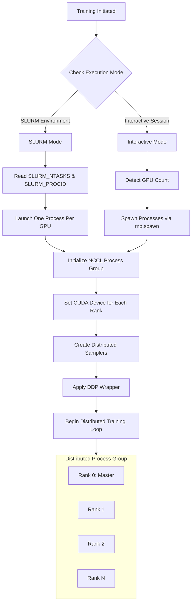

---
slug:25-multi-gpu-training-configuration
blog_type:normal
---


本页面详细介绍了 RoseTTAFold2 的分布式训练架构，该架构能够实现高效的多 GPU 和多节点训练，适用于大规模蛋白质结构预测。该系统利用 PyTorch 的分布式数据并行（DDP）框架，并针对异构硬件配置下的内存效率和计算性能进行了优化。

## 分布式训练架构

训练基础设施支持两种主要的执行模式：**SLURM 集群环境**和**交互式单节点会话**。该架构会自动检测执行环境并相应地配置分布式进程组 [train_multi_deep.py#L393-L412](network/train_multi_deep.py#L393-L412)。



在 SLURM 模式下，系统期望由调度器管理每个 GPU 运行一个进程，并读取环境变量 `SLURM_NTASKS` 和 `SLURM_PROCID` 来确定全局大小和秩。在交互模式下，脚本通过 `torch.cuda.device_count()` 自动检测可用的 GPU，并使用 Python 的多处理模块生成进程 [train_multi_deep.py#L393-L412](network/train_multi_deep.py#L393-L412)。

## 核心训练组件

### Trainer 类架构

`Trainer` 类编排整个训练生命周期，包含以下关键初始化参数 [train_multi_deep.py#L104-L150](network/train_multi_deep.py#L104-L150)：

| 参数 | 类型 | 默认值 | 描述 |
|-----------|------|---------|-------------|
| `model_name` | str | 'BFF' | 检查点文件的标识符 |
| `n_epoch` | int | 100 | 总训练轮数 |
| `lr` | float | 1.0e-4 | 初始学习率 |
| `l2_coeff` | float | 1.0e-2 | L2 正则化系数 |
| `port` | int | 用户自定义 | DDP 通信端口 |
| `interactive` | bool | False | 启用交互式执行模式 |
| `batch_size` | int | 1 | 每个 GPU 的批次大小 |
| `accum_step` | int | 1 | 梯度累积步数 |
| `maxcycle` | int | 4 | 最大循环迭代次数 |

训练器集成了几个关键组件以实现稳定的多 GPU 训练，包括用于模型权重的指数移动平均（EMA）和多组件损失函数 [train_multi_deep.py#L60-L102](network/train_multi_deep.py#L60-L102)。

### 分布式数据加载

训练流水线采用**分布式采样器**，以确保每个 GPU 在训练和验证期间处理唯一的数据样本。验证数据集的大小会自动调整为可被全局大小整除，以保持平衡的工作负载分布 [train_multi_deep.py#L434-L450](network/train_multi_deep.py#L434-L450)。

```python
# 验证集大小调整以实现平衡分布
self.n_valid_pdb = (self.n_valid_pdb // world_size) * world_size
self.n_valid_homo = (self.n_valid_homo // world_size) * world_size
self.n_valid_compl = (self.n_valid_compl // world_size) * world_size
self.n_valid_neg = (self.n_valid_neg // world_size) * world_size
```

`DistributedWeightedSampler` 处理跨多个数据源（PDB 结构、蛋白质复合物和同源序列）的复杂采样策略，并具有可配置的混合比例 [train_multi_deep.py#L452-L456](network/train_multi_deep.py#L452-L456)。

## 多 GPU 配置参数

### 训练超参数

关键的分布式训练参数通过 `arguments.py` 中的参数解析器配置 [arguments.py#L15-L55](network/arguments.py#L15-L55)：

| 参数 | 标志 | 类型 | 默认值 | 分布式影响 |
|-----------|------|------|---------|-------------------|
| Batch Size | `-batch_size` | int | 1 | 乘以全局大小得到有效批次 |
| Learning Rate | `-lr` | float | 1.0e-3 | 随梯度累积进行缩放 |
| Port | `-port` | int | 12319 | 每个并发训练作业必须唯一 |
| Accumulation | `-accum` | int | 1 | 模拟更大的批次大小 |
| Max Recycling | `-maxcycle` | int | 4 | 影响每次迭代的计算成本 |

### 性能优化常量

训练流水线定义了几个影响多 GPU 性能的常量 [train_multi_deep.py#L28-L44](network/train_multi_deep.py#L28-L44)：

```python
USE_AMP = True                    # 启用自动混合精度
N_PRINT_TRAIN = 4                 # 记录频率（批次）
N_EXAMPLE_PER_EPOCH = 4*3200     # 每轮结构数（必须能被 GPU 整除）

LOAD_PARAM = {
    'shuffle': False,
    'num_workers': 4,
    'pin_memory': True
}
```

<CgxTip>**关键配置**：`N_EXAMPLE_PER_EPOCH`（12,800 个结构）必须能被 GPU 数量整除，以确保各秩之间的训练负载均衡。不匹配的值会导致工作负载分布不均和吞吐量次优。</CgxTip>

## 模型并行化策略

### DDP 包装器配置

RoseTTAFoldModule 使用 NCCL 后端包装了 DistributedDataParallel，以实现高效的 GPU 通信 [train_multi_deep.py#L473-L476](network/train_multi_deep.py#L473-L476)：

```python
model = EMA(RoseTTAFoldModule(**self.model_param).to(gpu), 0.99)
ddp_model = DDP(model, device_ids=[gpu], find_unused_parameters=False)
```

`find_unused_parameters=False` 设置通过跳过未使用参数的梯度同步来优化性能，前提是假设所有模型参数都参与前向传播。EMA 包装器维护模型权重的指数移动平均值（decay=0.99）以实现更稳定的推理。

### 梯度同步优化

在**循环机制**（多迭代细化）期间，使用 `no_sync()` 上下文管理器对中间迭代有选择地禁用梯度同步 [train_multi_deep.py#L773-L783](network/train_multi_deep.py#L773-L783)：

```python
N_cycle = np.random.randint(1, self.maxcycle+1)
output_i = (None, None, None, xyz_prev, None, mask_recycle)

for i_cycle in range(N_cycle):
    with ExitStack() as stack:
        if i_cycle < N_cycle - 1:
            stack.enter_context(torch.no_grad())
            stack.enter_context(ddp_model.no_sync())
            stack.enter_context(torch.cuda.amp.autocast(enabled=USE_AMP, dtype=torch.bfloat16))
            # 中间循环步骤：无梯度同步
        else:
            stack.enter_context(torch.cuda.amp.autocast(enabled=USE_AMP, dtype=torch.bfloat16))
            # 最后一次迭代：计算梯度
```

这种优化显著减少了循环过程中的通信开销，该过程通常每个样本涉及 2-4 次前向传播。

## 自动混合精度训练

### AMP 配置

训练流水线利用 **bfloat16** 精度来提高计算吞吐量，同时将精度损失降至最低 [train_multi_deep.py#L28](network/train_multi_deep.py#L28)。AMP 缩放器处理梯度缩放以防止反向传播期间的下溢：

```python
scaler = torch.cuda.amp.GradScaler(enabled=USE_AMP)

# 训练循环期间
with torch.cuda.amp.autocast(enabled=USE_AMP, dtype=torch.bfloat16):
    output_i = ddp_model(**input_i)

# 梯度缩放和优化器步进
scaler.scale(loss).backward()
scaler.unscale_(optimizer)
torch.nn.utils.clip_grad_norm_(ddp_model.parameters(), 0.2)
scaler.step(optimizer)
scaler.update()
```

调度器包含在梯度缩放触发（NaN 检测）时跳过学习率更新的逻辑 [train_multi_deep.py#L797-L801](network/train_multi_deep.py#L797-L801)。

<CgxTip>**内存优化**：梯度累积结合 AMP 减少了内存需求，允许每个 GPU 使用更大的有效批次大小或更长的蛋白质序列。通过训练日志监控 `torch.cuda.max_memory_allocated()` 以识别内存瓶颈。</CgxTip>

## 学习率调度

训练系统采用**带预热的阶梯式衰减调度**，专为分布式训练优化 [scheduler.py#L156-L181](network/scheduler.py#L156-L181)：

```python
scheduler = get_stepwise_decay_schedule_with_warmup(
    optimizer, 
    num_warmup_steps=1000,      # 预热阶段
    num_steps_decay=15000,       # 衰减间隔
    decay_rate=0.95              # 衰减因子
)
```

| 阶段 | 步数 | 学习率行为 |
|-------|-------|----------------------|
| Warmup | 0-1000 | 从 0 线性增加到初始 LR |
| Decay | 1000+ | 每 15,000 步乘以 0.95 |

预热阶段对于分布式训练的稳定性至关重要，它允许模型适应由于并行处理带来的有效批次大小的增加。

## 执行模式和启动脚本

### 交互式模式启动

对于没有作业调度器的单节点多 GPU 训练，请使用交互式标志：

```bash
python network/train_multi_deep.py \
  -model_name BFF \
  -batch_size 1 \
  -lr 1.0e-4 \
  -num_epochs 100 \
  -port 12319 \
  -interactive \
  -accum 1 \
  -maxcycle 4
```

系统通过 `torch.cuda.device_count()` 自动检测可用的 GPU，并为每个 GPU 生成一个进程 [train_multi_deep.py#L408-L411](network/train_multi_deep.py#L408-L411)。

### SLURM 集群启动

对于 HPC 集群上的生产训练，请使用每个 GPU 一个秩的 SLURM 作业脚本：

```bash
#!/bin/bash
#SBATCH --job-name=rosettafold2_training
#SBATCH --nodes=4
#SBATCH --ntasks-per-node=8
#SBATCH --gres=gpu:8
#SBATCH --time=72:00:00

srun python network/train_multi_deep.py \
  -model_name BFF_cluster \
  -batch_size 1 \
  -lr 1.0e-4 \
  -num_epochs 200 \
  -port 12319
```

该脚本从环境中读取 `SLURM_NTASKS` 和 `SLURM_PROCID` 来配置秩和全局大小 [train_multi_deep.py#L402-L406](network/train_multi_deep.py#L402-L406)。

### SE3-Transformer 多 GPU 参考

SE3Transformer 组件包含一个参考多 GPU 启动脚本，演示了标准的 PyTorch 分布式模式 [train_multi_gpu.sh](SE3Transformer/scripts/train_multi_gpu.sh)：

```bash
python -m torch.distributed.run \
  --nnodes=1 \
  --nproc_per_node=gpu \
  --max_restarts 0 \
  --module se3_transformer.runtime.training \
  --amp true \
  --batch_size 240 \
  --epochs 130 \
  --lr 0.01 \
  --weight_decay 0.1
```

## 监控和诊断

### 训练指标聚合

训练器使用 PyTorch 分布式集合操作在记录之前聚合所有 GPU 的指标 [train_multi_deep.py#L859-L869](network/train_multi_deep.py#L859-L869)：

```python
dist.all_reduce(train_tot, op=dist.ReduceOp.SUM)
dist.all_reduce(train_loss, op=dist.ReduceOp.SUM)
dist.all_reduce(train_acc, op=dist.ReduceOp.SUM)

# 按全局大小归一化以获得每 GPU 平均值
train_tot /= float(counter * world_size)
train_loss /= float(counter * world_size)
```

只有秩 0 写入检查点文件和日志，以防止多个进程之间的 I/O 争用 [train_multi_deep.py#L871-L907](network/train_multi_deep.py#L871-L907)。

### 内存和性能跟踪

训练日志包括最大 GPU 内存分配和吞吐量指标 [train_multi_deep.py#L834-L848](network/train_multi_deep.py#L834-L848)：

```
Local: [0001/0200] Batch: [01024/12800] Time:         1234.5 | total_loss:   1.2345 | 0.1234 0.2345 0.3456 | 0.7890 0.8901 0.9012 | Max mem 45.6789
```

监控这些指标以识别：
- 内存瓶颈：增加 `accum` 或减小批次大小
- 通信开销：检查 NCCL 带宽和互连
- 负载不平衡：验证数据集能否被全局大小整除

## 检查点和恢复

### 状态保存策略

检查点包括 **EMA 影子模型**和最终模型状态，以便灵活恢复 [train_multi_deep.py#L876-L907](network/train_multi_deep.py#L876-L907)：

```python
torch.save({
    'epoch': epoch,
    'model_state_dict': ddp_model.module.shadow.state_dict(),  # EMA 权重
    'final_state_dict': ddp_model.module.model.state_dict(),   # 训练权重
    'optimizer_state_dict': optimizer.state_dict(),
    'scheduler_state_dict': scheduler.state_dict(),
    'scaler_state_dict': scaler.state_dict(),  # AMP 缩放器状态
    'best_loss': best_valid_loss,
    'train_loss': train_loss,
    'train_acc': train_acc,
    'valid_loss': valid_loss,
    'valid_acc': valid_acc
}, checkpoint_path)
```

缩放器状态对于 AMP 恢复至关重要，因为它包含动态损失缩放因子。

## 后续步骤

要完全了解训练工作流，请参阅[使用分布式数据并行的训练流水线](19-training-pipeline-with-distributed-data-parallel)。有关硬件级别的优化策略，请咨询[内存优化策略](23-memory-optimization-strategies)。要了解正在并行化的模型架构，请查看[三轨道设计：MSA、Pair 和 3D 结构轨道](6-three-track-design-msa-pair-and-3d-structure-tracks)。