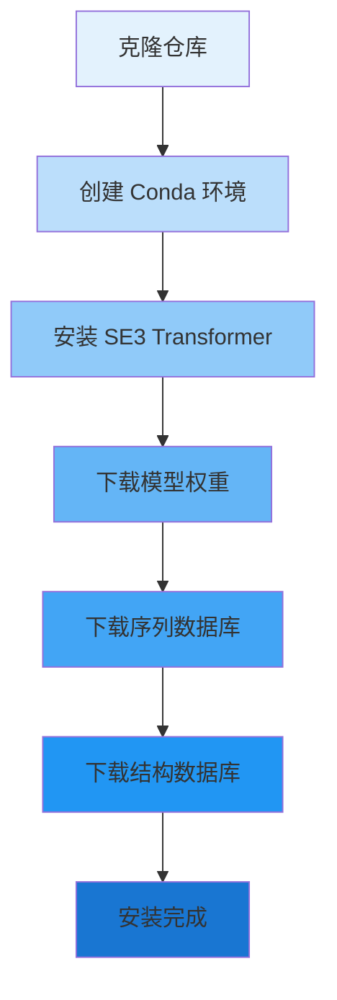
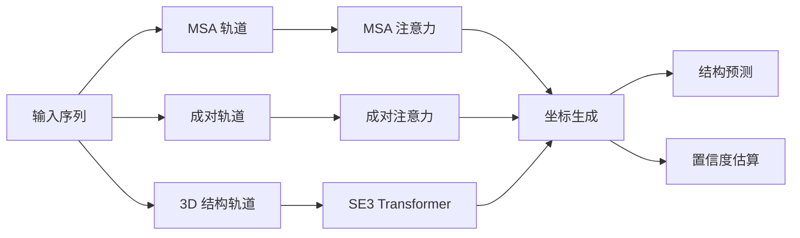

---
slug:3-environment-setup
blog_type:normal
---


本页面提供了设置 RoseTTAFold2 环境的综合指南，包括系统要求、软件依赖项和安装程序。正确的环境配置对于使用整合了 MSA、成对表示和 3D 结构信息的三轨架构来运行准确的蛋白质结构预测至关重要。

## 系统要求

由于 RoseTTAFold2 的深度学习架构和大规模数据库处理需求，它对计算资源要求较高。系统规格反映了运行 SE(3)-等变 Transformer 网络和处理大量多序列比对的复杂性。

| 资源类别 | 最低要求 | 推荐配置 |
|------------------|---------------------|---------------------------|
| GPU | 支持 CUDA 的 NVIDIA GPU | 显存 16GB+ 的 GPU（推荐 A100/V100） |
| CUDA 版本 | 11.7 或 12.1 | 12.1 并支持 cuDNN |
| 系统内存 | 64GB | 大型蛋白质需 128GB+ |
| CPU 核心 | 8 核 | 并行 MSA 处理需 16+ 核 |
| 磁盘空间 | 500GB+ | 完整数据库和模型需 2TB+ |
| 操作系统 | Linux | Ubuntu 20.04/22.04 LTS |

<CgxTip>对于数据库密集型操作，内存要求尤为关键。在生成 MSA 期间，HHblits 和 HHsearch 进程可能会消耗大量 RAM（在 [`run_RF2.sh`](run_RF2.sh#L16) 中指定为 64GB）。如果物理内存有限，请确保有足够的交换空间。</CgxTip>

## 安装工作流

安装过程遵循顺序架构：环境创建 → 依赖项安装 → 模型权重下载 → 数据库配置。这种分层方法确保所有组件在尝试预测之前正确集成。



## 获取仓库

首先从 GitHub 克隆 RoseTTAFold2 仓库。这提供了预测和训练工作流所需的所有源代码、配置文件和实用程序脚本。

来源：[README.md](README.md#L9-L12)

```bash
git clone https://github.com/uw-ipd/RoseTTAFold2.git
cd RoseTTAFold2
```

仓库结构包括关键组件：
- **网络模块**：位于 `network/` 目录，包含模型架构
- **SE3Transformer**：子模块，用于等变转换
- **输入准备**：用于 MSA 生成和模板处理的脚本
- **示例序列**：用于测试安装


## Conda 环境配置

主要环境配置使用 [`RF2-linux.yml`](RF2-linux.yml#L1-L20)，它指定了 Python 3.10 和必要的机器学习框架。该 YAML 文件协调来自多个频道的依赖项以确保兼容性。

来源：[RF2-linux.yml](RF2-linux.yml#L1-L20)

### 核心依赖项

```bash
conda env create -f RF2-linux.yml
conda activate RF2
```

环境包含以下关键组件：

| 软件包 | 版本 | 用途 |
|---------|---------|---------|
| Python | 3.10 | 核心运行时环境 |
| PyTorch | 2.2 | 深度学习框架 |
| PyTorch CUDA | 12.1 | GPU 加速支持 |
| DGL | 2.0.0.cu121 | 用于 SE(3) 操作的深度图库 |
| PyG (PyTorch Geometric) | 最新版 | 图神经网络操作 |
| HHsuite | 最新版 | 同源性搜索和 MSA 生成 |
| Pandas | 最新版 | 数据处理 |

存在一个替代配置文件 [`network/RF2na-linux.yml`](network/RF2na-linux.yml#L1-L24) 用于核酸预测，其 CUDA 版本略有不同（11.7），并包含额外的生物信息学工具，包括 MAFFT、BLAST、HMMER、Infernal 和 CD-HIT。

来源：[network/RF2na-linux.yml](network/RF2na-linux.yml#L1-L24)

## SE(3)-Transformer 安装

SE(3)-Transformer 是实现旋转等变神经网络以进行 3D 坐标处理的关键组件。RoseTTAFold2 需要仓库子模块中包含的 NVIDIA 专用版本。

来源：[SE3Transformer/setup.py](SE3Transformer/setup.py#L1-L12), [SE3Transformer/requirements.txt](SE3Transformer/requirements.txt#L1-L5)

```bash
cd SE3Transformer
pip install --no-cache-dir -r requirements.txt
python setup.py install
cd ..
```

关键依赖项包括：

| 软件包 | 版本 | 作用 |
|---------|---------|------|
| e3nn | 0.3.3 | 欧几里得神经网络 |
| wandb | 0.12.0 | 实验跟踪 |
| pynvml | 11.0.0 | NVIDIA GPU 监控 |
| dllogger | git | NVIDIA 的日志记录工具 |

<CgxTip>在 pip 安装期间使用 `--no-cache-dir` 标志可以防止与缓存的软件包发生潜在冲突。必须使用此仓库中的版本而不是公共 PyPI 版本来安装 SE(3)-Transformer，以确保与 RoseTTAFold2 的架构兼容。</CgxTip>

## 模型权重安装

预训练权重对于推理至关重要。当前推荐的模型权重文件大约 1.5GB，包含所有网络模块（包括三轨架构）的训练参数。

来源：[README.md](README.md#L22-L25)

```bash
cd network
wget https://files.ipd.uw.edu/dimaio/RF2_jan24.tgz
tar xvfz RF2_jan24.tgz
cd ..
```

提取的权重目录结构通过 [`network/predict.py`](network/predict.py#L34-L50) 与预测管道集成，后者指定了默认模型路径 `weights/RF2_jan24.pt`。权重包括以下参数：
- MSA 轨道嵌入和注意力机制
- 成对表示网络
- SE(3) 结构模块
- 辅助预测器（距离、角度、LDDT、PAE）

<CgxTip>模型权重位置可通过预测脚本中的命令行参数配置，但默认路径假定在 `network/` 目录中提取。在运行预测之前，请确保提取的文件符合预期的结构。</CgxTip>

## 数据库配置

全面的蛋白质结构预测需要三个主要数据库：用于 MSA 生成的序列数据库、用于同源建模的结构模板，以及用于特征计算的辅助数据库。

来源：[README.md](README.md#L27-L39)

### 序列数据库

**UniRef30 数据库 (46GB)** 提供 30% 一致性阈值下的聚类蛋白质序列，用于 MSA 生成：

```bash
mkdir -p UniRef30_2020_06
wget http://wwwuser.gwdg.de/~compbiol/uniclust/2020_06/UniRef30_2020_06_hhsuite.tar.gz
tar xfz UniRef30_2020_06_hhsuite.tar.gz -C ./UniRef30_2020_06
```

**BFD 数据库 (272GB)** 包含用于深度 MSA 的元聚类序列：

```bash
mkdir -p bfd
wget https://bfd.mmseqs.com/bfd_metaclust_clu_complete_id30_c90_final_seq.sorted_opt.tar.gz
tar xfz bfd_metaclust_clu_complete_id30_c90_final_seq.sorted_opt.tar.gz -C ./bfd
```

### 结构模板数据库

PDB100 数据库包含实验确定的蛋白质结构，用于基于模板的建模：

```bash
wget https://files.ipd.uw.edu/pub/RoseTTAFold/pdb100_2021Mar03.tar.gz
tar xfz pdb100_2021Mar03.tar.gz
```

该数据库包括结构文件（PDB 格式）和索引序列数据库（`.ffdata` 和 `.ffindex` 文件），HHsearch 使用它们进行同源性检测。脚本 [`run_RF2.sh`](run_RF2.sh#L14-L15) 将此数据库引用为指向 `pdb100_2021Mar03/pdb100_2021Mar03` 的 `HHDB` 变量。

| 数据库 | 大小 | 用途 | 处理工具 |
|----------|------|---------|-----------------|
| UniRef30 | 46GB | MSA 生成 | HHblits |
| BFD | 272GB | 深度 MSA 生成 | HHblits |
| PDB100 | ~20GB | 模板搜索 | HHsearch |

## 环境验证

完成安装后，使用仓库中提供的示例序列验证环境。[`run_RF2.sh`](run_RF2.sh#L1-L159) 脚本编排完整的预测管道。

来源：[README.md](README.md#L49-L65)

```bash
cd examples
../run_RF2.sh rcsb_pdb_7UGF.fasta -o 7UGF
```

预期输出包括：
- **结构文件**：`rf2out/7UGF/models/model_final.pdb`，包含预测坐标和代表预测 LDDT 置信度的 B 因子
- **JSON 文件**：额外的精度指标和元数据
- **NPZ 文件**：置信度分数和距离/角度分布的数值预测

<CgxTip>第一次预测运行需要更长时间，因为 HHblits 会生成 MSA 并缓存中间结果。随后使用相似序列的运行将受益于缓存的比对。请监控 `rf2out/log/` 目录中的日志文件以进行故障排除。</CgxTip>

## 项目架构概述

已安装的环境支持 RoseTTAFold2 的三轨架构，该架构通过互补表示处理蛋白质信息：



该环境支持：
- **MSA 生成**：使用 HHblits 对抗 UniRef30 和 BFD 数据库
- **模板搜索**：通过 HHsearch 对抗 PDB100
- **结构预测**：通过回收迭代（默认 3 个周期）
- **对称性约束**：用于同源寡聚复合物
- **配对 MSA 模式**：用于异源寡聚物预测

来源：[network/arguments.py](network/arguments.py#L1-L185), [network/predict.py](network/predict.py#L1-L50)

## 常见配置调整

[`run_RF2.sh`](run_RF2.sh#L16-L18) 脚本公开了可根据系统能力调整的关键运行时参数：

```bash
CPU="8"   # 并行处理的 CPU 数量
MEM="64"  # HHsuite 工具的最大内存（GB）
```

对于低内存系统，请考虑：
1. 减少 `CPU` 数量以降低内存压力
2. 在 [`predict.py`](network/predict.py#L43-L44) 中使用 `--topk` 参数限制邻居计算
3. 启用 `-low_vram` 标志将计算卸载到 CPU

对于大蛋白质（>700 个残基）：
1. 增加 `MEM` 分配以进行 MSA 处理
2. 使用 `-subcrop` 参数管理成对更新的内存
3. 考虑启用对称性约束以降低计算复杂性

## 故障排除指南

| 问题 | 可能原因 | 解决方案 |
|-------|--------------|----------|
| CUDA 内存不足 | GPU 显存不足 | 使用 `-low_vram` 标志或减少 `-topk` 参数 |
| HHblits 崩溃 | 系统内存不足 | 增加交换空间或减少 `-maxseq` 参数 |
| SE3 导入错误 | SE3 安装不正确 | 使用 `--no-cache-dir` 从仓库子模块重新安装 |
| 未找到数据库 | 脚本中的路径不正确 | 验证数据库路径是否与提取位置匹配 |
| MSA 生成缓慢 | CPU 核心有限 | 在 `run_RF2.sh` 中增加 `CPU` 变量 |

## 后续步骤

成功设置环境后，继续下载额外的数据库并配置模型权重：

- **[数据库下载](4-database-downloads)** - 获取和配置大规模序列及结构数据库的详细说明
- **[模型权重安装](5-model-weights-installation)** - 下载和验证预训练模型权重的完整指南

配置好数据库后，探索预测功能：
- **[快速入门](2-quick-start)** - 运行您的第一个蛋白质结构预测
- **[三轨设计](6-three-track-design-msa-pair-and-3d-structure-tracks)** - 了解实现准确预测的架构创新

对于对模型训练感兴趣的高级用户，该环境还支持多 GPU 分布式训练，如 [Multi-GPU Training Configuration](25-multi-gpu-training-configuration) 指南中所述。