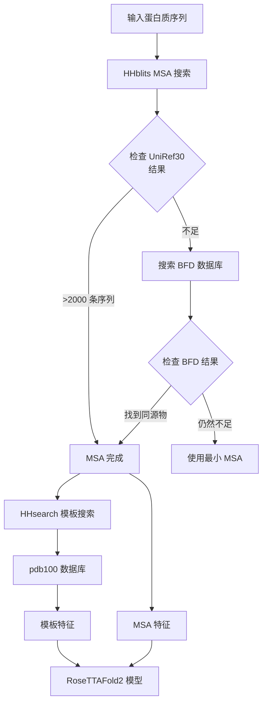
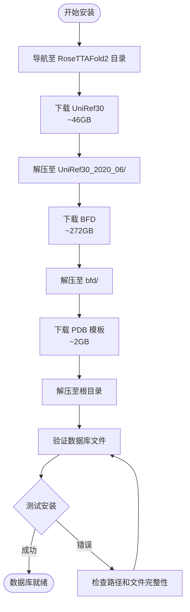

---
slug:4-database-downloads
blog_type:normal
---


RoseTTAFold2 需要三个核心数据库来生成多重序列比对（MSAs）并识别结构模板。这些数据库使模型能够利用进化信息和已知蛋白质结构进行准确预测。本指南将引导你下载并为 RoseTTAFold2 安装设置这些数据库。


*RoseTTAFold2 整合了多个数据库来源，为结构预测生成全面的输入特征*

## 必需数据库

RoseTTAFold2 需要三个数据库，总计约 **318GB** 的存储空间。每个数据库在预测流程中都有特定用途。

| 数据库名称 | 大小 | 用途 | 优先级 |
|--------------|------|---------|----------|
| **UniRef30** | ~46GB | 用于生成 MSA 的主要序列数据库 | 必需 |
| **BFD** | ~272GB | 针对同源蛋白较少的蛋白质的扩展序列数据库 | 可选但建议安装 |
| **pdb100_2021Mar03** | ~2GB | 用于同源搜索的结构模板数据库 | 必需 |

### 数据库层次结构及使用

数据库按分层方式工作。系统首先搜索 UniRef30，如果未找到足够的同源物，则回退到 BFD。结构模板针对 PDB 数据库进行搜索以指导预测。



这种分层方法确保了具有许多进化亲属的蛋白质可以使用 UniRef30 快速处理，而来自稀有家族的蛋白质仍然可以从全面的 BFD 数据库中受益 [input_prep/make_protein_msa.sh](input_prep/make_protein_msa.sh#L9-L10)。

<CgxTip>
虽然 BFD 数据库很大（272GB），但它显著提高了在 UniRef30 中同源物较少的蛋白质的预测准确性。如果存储空间有限，你可以仅从 UniRef30 和 pdb100 开始，但需预期对表征较少的蛋白质家族的预测准确性会降低。
</CgxTip>

## 下载说明

### 第一步：准备目录结构

导航至你的 RoseTTAFold2 安装目录：

```bash
cd /path/to/RoseTTAFold2
```

### 第二步：下载 UniRef30 数据库

UniRef30 数据库以 30% 的同一性聚类 UniProt 序列，提供全面而紧凑的序列资源。

```bash
# 下载 UniRef30 [46GB]
wget http://wwwuser.gwdg.de/~compbiol/uniclust/2020_06/UniRef30_2020_06_hhsuite.tar.gz

# 创建目标目录
mkdir -p UniRef30_2020_06

# 解压文件到目录
tar xfz UniRef30_2020_06_hhsuite.tar.gz -C ./UniRef30_2020_06
```

**解压后的预期内容：**
- `UniRef30_2020_06/UniRef30_2020_06` - HHsuite 数据库文件
- 用于快速序列查找的索引文件

UniRef30 数据库将作为通过迭代 HHblits 搜索生成 MSA 的主要搜索空间，使用递增的 E-value 截止值（1e-10, 1e-6, 1e-3）[input_prep/make_protein_msa.sh](input_prep/make_protein_msa.sh#L27-L41)。

### 第三步：下载 BFD 数据库

BFD（Big Fantastic Database）提供更广泛的序列覆盖范围，对于寻找远缘同源物至关重要。

```bash
# 下载 BFD [272GB]
wget https://bfd.mmseqs.com/bfd_metaclust_clu_complete_id30_c90_final_seq.sorted_opt.tar.gz

# 创建目标目录
mkdir -p bfd

# 解压文件到目录
tar xfz bfd_metaclust_clu_complete_id30_c90_final_seq.sorted_opt.tar.gz -C ./bfd
```

**解压后的预期内容：**
- `bfd/bfd_metaclust_clu_complete_id30_c90_final_seq.sorted_opt` - HHsuite 数据库文件

当 UniRef30 搜索产生的序列不足（满足 90% 同一性和 75% 覆盖率的序列少于 2000 条，或满足 90% 同一性和 50% 覆盖率的序列少于 4000 条）时，BFD 数据库将作为后备选项 [input_prep/make_protein_msa.sh](input_prep/make_protein_msa.sh#L49-L81)。

### 第四步：下载结构模板

PDB 模板数据库提供来自已知蛋白质结构的结构信息。

```bash
# 下载结构模板 [~2GB]
wget https://files.ipd.uw.edu/pub/RoseTTAFold/pdb100_2021Mar03.tar.gz

# 解压到根目录
tar xfz pdb100_2021Mar03.tar.gz
```

**解压后的预期内容：**
- `pdb100_2021Mar03/pdb100_2021Mar03_a3m.ffdata` - 模板序列数据
- `pdb100_2021Mar03/pdb100_2021Mar03_a3m.ffindex` - 模板索引文件
- `pdb100_2021Mar03/pdb100_2021Mar03_pdb.ffdata` - 模板结构数据
- `pdb100_2021Mar03/pdb100_2021Mar03_pdb.ffindex` - 模板结构索引

这些文件由 HHsearch 算法使用，以查找指导 RoseTTAFold2 预测的结构模板 [run_RF2.sh](run_RF2.sh#L16) 和 [network/predict.py](network/predict.py#L608-L614)。

## 数据库配置

脚本根据标准目录结构自动定位数据库。环境变量 `$PIPEDIR` 指向 RoseTTAFold2 根目录，数据库相对于此位置进行引用。

### 数据库路径配置

下表显示了数据库路径在流程中是如何配置的：

| 数据库 | 环境变量 | 脚本引用 | 路径 |
|----------|---------------------|------------------|------|
| UniRef30 | `$DB_UR30` | [make_protein_msa.sh](input_prep/make_protein_msa.sh#L9) | `$PIPEDIR/UniRef30_2020_06/UniRef30_2020_06` |
| BFD | `$DB_BFD` | [make_protein_msa.sh](input_prep/make_protein_msa.sh#L10) | `$PIPEDIR/bfd/bfd_metaclust_clu_complete_id30_c90_final_seq.sorted_opt` |
| PDB 模板 | `$HHDB` | [run_RF2.sh](run_RF2.sh#L16) | `$PIPEDIR/pdb100_2021Mar03/pdb100_2021Mar03` |

### 验证

下载后，通过检查数据库目录来验证你的安装：

```bash
# 检查 UniRef30
ls -lh UniRef30_2020_06/UniRef30_2020_06*

# 检查 BFD
ls -lh bfd/bfd_metaclust_clu_complete_id30_c90_final_seq.sorted_opt*

# 检查 PDB 模板
ls -lh pdb100_2021Mar03/
```

你应该会看到每个数据库的多个文件，包括 `.hhm`、`.a3m` 和索引文件。

## 完整设置流程

以下是显示数据库下载和设置过程的完整流程图：



## 故障排除

### 磁盘空间不足

如果遇到磁盘空间问题：

1. **检查可用空间：**
   ```bash
   df -h .
   ```

2. **最低要求：**
   - 仅 UniRef30：总计 ~50GB
   - UniRef30 + PDB：总计 ~55GB
   - 完整设置：总计 ~330GB

3. **考虑下载到外部驱动器或不同分区：**

   ```bash
   # 如果数据库位于其他驱动器，则创建符号链接
   ln -s /path/to/external/drive/UniRef30_2020_06 ./UniRef30_2020_06
   ln -s /path/to/external/drive/bfd ./bfd
   ln -s /path/to/external/drive/pdb100_2021Mar03 ./pdb100_2021Mar03
   ```

### 下载失败

由于网络中断，大文件下载可能会失败：

1. **使用 `wget -c` 恢复中断的下载：**
   ```bash
   wget -c http://wwwuser.gwdg.de/~compbiol/uniclust/2020_06/UniRef30_2020_06_hhsuite.tar.gz
   ```

2. **下载后验证文件完整性：**
   ```bash
   # 检查文件大小是否与预期值匹配
   ls -lh *.tar.gz
   ```

### 权限错误

如果在解压过程中遇到权限问题：

```bash
# 确保目录中的写入权限
chmod +w .

# 或根据需要使用 sudo（不推荐用于开发目录）
sudo tar xfz filename.tar.gz -C ./target_directory
```

### 找不到数据库错误

如果 RoseTTAFold2 报告找不到数据库：

1. **验证 [run_RF2.sh](run_RF2.sh#L16) 中的 `$PIPEDIR` 设置正确：**
   ```bash
   # 脚本应自动设置此变量：
   SCRIPT=`realpath -s $0`
   export PIPEDIR=`dirname $SCRIPT`
   ```

2. **检查数据库路径是否匹配预期结构：**
   ```bash
   # UniRef30 应位于：
   echo $PIPEDIR/UniRef30_2020_06/UniRef30_2020_06
   
   # BFD 应位于：
   echo $PIPEDIR/bfd/bfd_metaclust_clu_complete_id30_c90_final_seq.sorted_opt
   
   # PDB 应位于：
   echo $PIPEDIR/pdb100_2021Mar03/pdb100_2021Mar03
   ```

3. **如果路径不同，请更新 [input_prep/make_protein_msa.sh](input_prep/make_protein_msa.sh#L9-L10) 中的变量：**
   ```bash
   # 更新这些行以匹配你的实际路径：
   DB_UR30="/path/to/your/UniRef30_2020_06/UniRef30_2020_06"
   DB_BFD="/path/to/your/bfd/bfd_metaclust_clu_complete_id30_c90_final_seq.sorted_opt"
   ```

<CgxTip>
数据库下载过程可能需要几个小时，具体取决于你的网络连接。考虑使用 `aria2c` 等下载管理器进行并行下载，或在夜间运行大文件（如 BFD，272GB）的下载。
</CgxTip>

## 后续步骤

成功下载并验证所有数据库后，你可以继续执行后续设置步骤：

1. **[模型权重安装](5-model-weights-installation)** - 下载预训练的 RoseTTAFold2 模型权重（~1.5GB）
2. **[快速入门](2-quick-start)** - 使用示例文件运行你的第一个蛋白质结构预测

安装了数据库并加载了模型权重后，你将能够利用 RoseTTAFold2 进化和结构信息集成能力的全部功能来预测蛋白质结构。

## 设置后的目录结构

完成数据库下载后，你的 RoseTTAFold2 目录结构应包括：

```
RoseTTAFold2/
├── UniRef30_2020_06/           # 46GB
│   └── UniRef30_2020_06/       # HHsuite 数据库文件
│       ├── UniRef30_2020_06.hhm
│       ├── UniRef30_2020_06.a3m
│       └── ...
├── bfd/                        # 272GB
│   └── bfd_metaclust_clu_complete_id30_c90_final_seq.sorted_opt/
│       ├── bfd_metaclust_clu_complete_id30_c90_final_seq.sorted_opt.hhm
│       ├── bfd_metaclust_clu_complete_id30_c90_final_seq.sorted_opt.a3m
│       └── ...
├── pdb100_2021Mar03/            # ~2GB
│   ├── pdb100_2021Mar03_a3m.ffdata
│   ├── pdb100_2021Mar03_a3m.ffindex
│   ├── pdb100_2021Mar03_pdb.ffdata
│   └── pdb100_2021Mar03_pdb.ffindex
├── network/
│   ├── predict.py
│   └── ...
├── input_prep/
│   ├── make_protein_msa.sh
│   └── ...
├── run_RF2.sh
└── examples/
    └── *.fasta
```

此结构确保预测管道可以自动定位并使用所有必需的数据库，而无需手动配置。