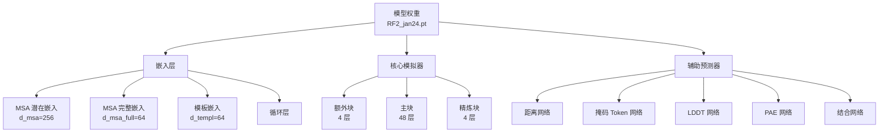

---
slug:5-model-weights-installation
blog_type:normal
---


本页面提供了关于下载、安装和管理 RoseTTAFold2 预训练模型权重的全面指南。正确安装权重对于运行蛋白质结构预测以及理解自定义训练工作流的检查点格式至关重要。

## 理解模型权重

RoseTTAFold2 使用预训练的神经网络参数，这些参数捕获了蛋白质序列、MSA（多序列比对）和 3D 结构关系中的复杂模式。权重文件包含 `RoseTTAFoldModule` 的完整状态，该模块实现了整合 MSA、Pair 和 3D 结构表示的三轨道架构 [RoseTTAFoldModel.py](network/RoseTTAFoldModel.py#L11-L19)。模型架构包括用于潜在 MSA 特征 (`latemt_emb`)、完整 MSA 序列 (`full_emb`)、模板信息 (`templ_emb`) 的嵌入层，一个循环机制 (`recycle`)，以及执行核心预测计算的迭代模拟器 [RoseTTAFoldModel.py](network/RoseTTAFoldModel.py#L23-L46)。此外，权重还包含用于距离和角度预测 (`c6d_pred`)、掩码 Token 预测 (`aa_pred`)、置信度估计 (`lddt_pred`, `pae_pred`) 以及复合物结合网络 (`bind_pred`) 的辅助预测器网络 [RoseTTAFoldModel.py](network/RoseTTAFoldModel.py#L47-L53)。

预训练权重以 PyTorch 检查点格式 (`.pt` 文件) 存储，当用于继续训练时，包含模型参数和训练元数据。权重对某些层使用混合精度 (float16)，以优化内存使用和推理速度，同时保持预测准确性 [predict.py](network/predict.py#L233-L249)。

## 架构概览



## 下载与安装

安装过程包括下载预训练权重存档、将其解压到正确位置并验证安装。RoseTTAFold2 提供了在包括 PDB 数据库在内的多样化蛋白质结构数据集上训练的预训练权重，使其适用于通用蛋白质结构预测任务 [README.md](README.md#L20-L24)。

**分步安装：**


在你的终端中执行以下命令：

```bash
# 激活 RoseTTAFold2 conda 环境
conda activate RF2

# 导航至 network 目录
cd network

# 下载预训练权重存档
wget https://files.ipd.uw.edu/dimaio/RF2_jan24.tgz

# 解压存档以创建 weights 子目录
tar xvfz RF2_jan24.tgz

# 返回根目录
cd ..
```

来源：[README.md](README.md#L20-L24)

解压后，权重文件应位于 `network/weights/RF2_jan24.pt`。解压操作会在 `network/` 目录内创建一个 `weights/` 子目录，其中包含预训练模型参数 [README.md](README.md#L20-L24)。

<CgxTip>权重文件压缩后大约 2.5 GB，解压后约为 5 GB。下载前请确保你有足够的磁盘空间。解压操作会自动创建所需的目录结构。</CgxTip>

## 文件结构与位置

RoseTTAFold2 项目根据你调用预测脚本的方式，期望模型权重位于特定位置。了解这些位置有助于解决路径相关问题，并实现自定义权重管理策略。

**默认位置：**

| 组件 | 默认路径 | 描述 |
|-----------|--------------|-------------|
| 预训练权重 | `network/weights/RF2_jan24.pt` | predict.py 的当前默认值 [predict.py](network/predict.py#L28) |
| 旧版权重 | `network/weights/RF2_apr23.pt` | run_RF2.sh 中引用的旧版本 [run_RF2.sh](run_RF2.sh#L147) |
| 训练检查点 | `models/{model_name}_{suffix}.pt` | 自定义训练输出 [train_multi_deep.py](network/train_multi_deep.py#L366) |

**可视化项目结构：**

```
RoseTTAFold2/
├── network/
│   ├── weights/
│   │   └── RF2_jan24.pt          ← 预训练模型权重
│   ├── predict.py                ← 主预测脚本
│   ├── RoseTTAFoldModel.py       ← 模型架构定义
│   └── train_multi_deep.py       ← 训练脚本 (保存检查点)
├── models/                       ← 自定义训练检查点
│   ├── BFF_last.pt              ← 示例训练检查点
│   └── BFF_best.pt              ← 最佳验证检查点
└── run_RF2.sh                   ← 包装脚本
```

`predict.py` 脚本通过编程方式定义默认模型路径，从而允许灵活的自定义部署 [predict.py](network/predict.py#L28)。当使用包装脚本 `run_RF2.sh` 时，权重路径通过传递给预测脚本的命令行参数显式指定 [run_RF2.sh](run_RF2.sh#L144-L151)。

## 在预测中使用模型权重

当你调用预测脚本时，RoseTTAFold2 预测流水线会自动从指定位置加载模型权重。加载过程会处理设备映射 (GPU/CPU) 并应用推理所需的必要精度优化 [predict.py](network/predict.py#L616-L621)。

**自动加载：**

`run_RF2.sh` 包装脚本会自动将权重位置传递给预测脚本：

```bash
# 摘自 run_RF2.sh，第 144-151 行
python $PIPEDIR/network/predict.py \
    -inputs $argstring \
    -prefix $WDIR/models/model \
    -model $PIPEDIR/network/weights/RF2_apr23.pt \
    -db $HHDB \
    -symm $symm
```

来源：[run_RF2.sh](run_RF2.sh#L144-L151)

**手动指定：**

直接运行预测脚本时，你可以使用 `-model` 命令行参数覆盖默认的权重位置：

```bash
python network/predict.py \
    -inputs path/to/input.a3m \
    -prefix output_prefix \
    -model /custom/path/to/RF2_jan24.pt \
    -db path/to/pdb_database \
    -symm C1
```

来源：[predict.py](network/predict.py#L27-L52)

`predict.py` 中的 `Predictor` 类实现了权重加载逻辑：

```python
def load_model(self, model_weights):
    if not os.path.exists(model_weights):
        return False
    checkpoint = torch.load(model_weights, map_location=self.device, weights_only=False)
    self.model.load_state_dict(checkpoint['model_state_dict'], strict=False)
    # 将特定层转换为半精度以提高内存效率
    for m_i in self.model.simulator.extra_block:
        m_i.pair2pair = m_i.pair2pair.half()
        m_i.msa2msa = m_i.msa2msa.half()
        m_i.msa2pair = m_i.msa2pair.half()
    # ... 其他精度转换
    return True
```

来源：[predict.py](network/predict.py#L231-L250)

加载器使用 `map_location` 确保权重在正确的设备 (GPU 或 CPU) 上加载，且 `strict=False` 参数允许在检查点架构略有差异时进行部分加载 [predict.py](network/predict.py#L234)。将特定层转换为半精度 (`half()`) 可在推理过程中减少内存占用，而不会显著降低准确性 [predict.py](network/predict.py#L236-L249)。

## 模型权重格式与内容

了解模型权重的内部结构可以实现高级用例，例如检查点检查、权重迁移和自定义训练工作流。RoseTTAFold2 使用 PyTorch 的标准检查点格式，该格式存储模型状态字典以及可选的训练元数据 [train_multi_deep.py](network/train_multi_deep.py#L368-L382)。

**检查点内容：**

| 键 | 描述 | 用途 |
|-----|-------------|---------|
| `model_state_dict` | 模型参数 | 用于推理和训练的核心网络权重 |
| `epoch` | 训练周期数 | 从特定检查点恢复训练 |
| `optimizer_state_dict` | 优化器内部状态 | 带有优化器动量的继续训练 |
| `scheduler_state_dict` | 学习率调度器状态 | 维持学习率计划 |
| `scaler_state_dict` | AMP 缩放器状态 | 混合精度训练状态 |

训练脚本演示了在恢复训练时如何加载这些组件：

```python
def load_model(self, model, optimizer, scheduler, scaler, model_name, rank, suffix='last', resume_train=True):
    chk_fn = "models/%s_%s.pt"%(model_name, suffix)
    loaded_epoch = -1
    if not os.path.exists(chk_fn):
        return -1, 999999.9
    map_location = {"cuda:%d"%0: "cuda:%d"%rank}
    checkpoint = torch.load(chk_fn, map_location=map_location, weights_only=False)
    # 将权重加载到主模型和 EMA 影子模型中
    model.module.model.load_state_dict(checkpoint['model_state_dict'], strict=False)
    model.module.shadow.load_state_dict(checkpoint['model_state_dict'], strict=False)
    if resume_train:
        loaded_epoch = checkpoint['epoch']
        optimizer.load_state_dict(checkpoint['optimizer_state_dict'])
        scaler.load_state_dict(checkpoint['scaler_state_dict'])
        # 处理调度器状态兼容性
        if 'scheduler_state_dict' in checkpoint:
            scheduler.load_state_dict(checkpoint['scheduler_state_dict'])
        else:
            scheduler.last_epoch = loaded_epoch + 1
    return loaded_epoch, best_valid_loss
```

来源：[train_multi_deep.py](network/train_multi_deep.py#L365-L382)

训练检查点使用指数移动平均 (EMA) 来提高推理质量。`Trainer` 类维护一个主模型和一个影子模型 (EMA 副本)，两者都根据检查点状态进行更新 [train_multi_deep.py](network/train_multi_deep.py#L60-L103), [train_multi_deep.py](network/train_multi_deep.py#L371-L372)。

<CgxTip>当仅将预训练权重用于推理时，只需要 `model_state_dict`。训练检查点元数据 (optimizer、scheduler、scaler) 仅在从保存的状态恢复训练时需要。</CgxTip>

## 自定义权重管理

对于高级用户，RoseTTAFold2 支持自定义权重管理场景，包括自定义训练、微调和权重迁移。模块化架构允许对加载和初始化的组件进行细粒度控制 [arguments.py](network/arguments.py#L13-L14), [train_multi_deep.py](network/train_multi_deep.py#L414-L420)。

**自定义训练工作流：**

训练自定义模型时，`Trainer` 类会自动以指定的时间间隔保存带有描述性后缀的检查点：

```python
def checkpoint_fn(self, model_name, description):
    if not os.path.exists("models"):
        os.mkdir("models")
    name = "%s_%s.pt"%(model_name, description)
    return os.path.join("models", name)
```

来源：[train_multi_deep.py](network/train_multi_deep.py#L387-L391)

常见的检查点后缀包括 `last` (最新)、`best` (最佳验证) 以及表示中间状态的周期数。

**微调预训练模型：**

要在自定义数据集上微调预训练权重，你可以加载预训练权重并使用你的数据继续训练：

```python
# 加载预训练权重
predictor = Predictor('network/weights/RF2_jan24.pt', device='cuda:0')

# 访问模型以进行微调
model = predictor.model

# 初始化训练组件
optimizer = torch.optim.Adam(model.parameters(), lr=1e-4)
# ... 设置数据加载器和损失函数

# 从预训练状态继续训练
# (训练循环实现类似于 train_multi_deep.py)
```

来源：[predict.py](network/predict.py#L204-L206), [train_multi_deep.py](network/train_multi_deep.py#L752-L882)

训练脚本使用分布式数据并行进行多 GPU 训练，并包含涵盖距离、角度、方向和置信度预测的综合损失函数 [train_multi_deep.py](network/train_multi_deep.py#L150-L156), [train_multi_deep.py](network/train_multi_deep.py#L398-L413)。

## 故障排除

**问题：找不到模型权重文件**

症状：指示无法定位权重文件的错误消息。

解决方案：验证权重文件是否存在于预期路径。检查你是否正确解压了存档，以及路径是否与预测命令中指定的路径匹配 [predict.py](network/predict.py#L232-L233)。

```bash
# 验证权重文件是否存在
ls -lh network/weights/RF2_jan24.pt

# 检查文件大小 (应约为 5 GB)
```

**问题：加载期间 CUDA 内存不足**

症状：加载模型权重时 GPU 内存耗尽。

解决方案：预测脚本包含一个 `-low_vram` 选项，可将部分计算卸载到 CPU，以便在有限的 GPU 内存上运行更大的系统 [predict.py](network/predict.py#L42)。

```bash
python network/predict.py \
    -inputs input.a3m \
    -prefix output \
    -low_vram \
    # ... 其他参数
```

**问题：权重加载到错误的设备上**

症状：加载权重时关于 CUDA 设备不匹配的错误。

解决方案：`load_model` 函数使用 `map_location` 自动处理设备映射。确保你在正确的设备上下文中加载权重：

```python
# 加载器自动处理设备映射
if torch.cuda.is_available():
    pred = Predictor(args.model, torch.device("cuda:0"))
else:
    pred = Predictor(args.model, torch.device("cpu"))
```

来源：[predict.py](network/predict.py#L616-L621)

## 后续步骤

随着模型权重的成功安装，你可以探索 RoseTTAFold2 的高级功能：

- **[三轨道设计：MSA、Pair 和 3D 结构轨道](6-three-track-design-msa-pair-and-3d-structure-tracks)** - 了解加载的权重如何实现同时处理不同蛋白质表示的三轨道架构
- **[用于迭代精炼的循环机制](8-recycling-mechanism-for-iterative-refinement)** - 了解模型如何使用循环层迭代改进预测
- **[使用分布式数据并行的训练流水线](19-training-pipeline-with-distributed-data-parallel)** - 探索如何使用检查点格式和训练基础设施来训练自定义模型