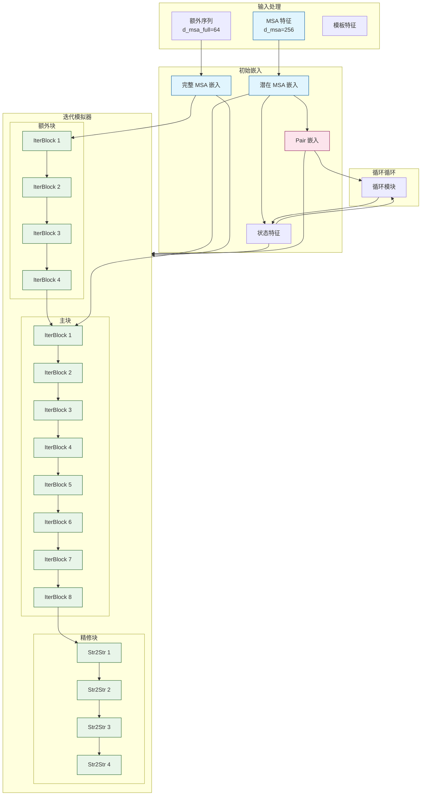

---
slug:6-three-track-design-msa-pair-and-3d-structure-tracks
blog_type:normal
---


三轨道架构代表了 RoseTTAFold2 的核心创新，它能够同时处理进化信息（MSA 轨道）、残基对关系（pair 轨道）和三维结构坐标（3D 轨道）。这种设计在每个迭代过程中促进了轨道间深度的双向通信，使得模型能够逐步利用互补的信息源。该架构为每个轨道初始化独立的嵌入，然后通过跨轨道信息交换迭代优化它们，最终收敛于准确的蛋白质结构预测。

来源：[RoseTTAFoldModel.py](network/RoseTTAFoldModel.py#L11-L50), [Track_module.py](network/Track_module.py#L701-L735)

## 架构概述

三轨道架构由三个并行的信息处理流组成，它们通过精心设计的通信通路进行交互。MSA 轨道处理多重序列比对信息以捕获进化约束，pair 轨道通过二维表示维护残基-残基关系特征，而 3D 轨道使用 SE(3)-等变操作直接操纵原子坐标。这些轨道并非独立的孤岛；相反，它们在每个迭代块中通过专用模块进行持续的信息交换。

基础模型类 `RoseTTAFoldModule` 实例化了三个嵌入层，用于创建初始轨道表示：用于潜在 MSA 轨道的 `MSA_emb`，用于额外 MSA 序列的 `Extra_emb`，以及用于基于模板的结构信息的 `Templ_emb`。核心迭代处理发生在 `IterativeSimulator` 内部，它编排了轨道交互的三个不同阶段：使用完整 MSA 表示的 extra block 更新，使用潜在 MSA 的 main block 更新，以及通过结构聚焦操作进行的最终精修。

来源：[RoseTTAFoldModel.py](network/RoseTTAFoldModel.py#L24-L30), [Track_module.py](network/Track_module.py#L701-L735)



## MSA 轨道：进化信息处理

MSA 轨道作为进化信息的主要通道，捕获同源蛋白质之间的序列保守性和协同进化模式。`MSA_emb` 模块通过线性投影（`d_init=48` 到 `d_msa=256` 维度）处理初始多重序列比对，并通过学习的嵌入融入查询序列信息。这创建了一个形状为 `(B, N, L, 256)` 的表示，其中 B 是批次大小，N 是 MSA 中的序列数量，L 是序列长度。

MSA 轨道维护两个并行的表示：用于深度处理的高维潜在 MSA，以及用于高效处理额外序列的降维完整 MSA（`d_msa_full=64`）。潜在 MSA 使用查询序列嵌入通过广播加法通知所有序列，而完整 MSA 经过类似但计算量更轻的处理。`MSAFeaturize` 函数创建结合氨基酸类型（22）、轮廓信息（22）、插入统计（2）和末端标志（2）的 48 维特征，并在训练期间应用 15% 的随机掩码以提高鲁棒性。

来源：[Embeddings.py](network/Embeddings.py#L54-L105), [featurizing.py](network/featurizing.py#L33-L100), [RoseTTAFoldModel.py](network/RoseTTAFoldModel.py#L24-L25)

**MSA 轨道处理流程：**

1. **初始特征化**：原始 MSA 序列被转换为结合氨基酸身份、进化轮廓和结构上下文特征的 48 维特征
2. **潜在嵌入**：通过带有查询序列条件的线性投影创建 256 维表示
3. **额外序列处理**：使用全局注意力机制为额外序列创建 64 维嵌入
4. **迭代精修**：带有 pair 和结构偏差的行和列注意力更新
5. **跨轨道更新**：信息通过外积聚合从 MSA 流向 pair 轨道

关键模块 `MSAPairStr2MSA` 实现了从 pair 和结构轨道回到 MSA 轨道的双向通信。它将 pair 表示与当前 3D 坐标的径向基函数（RBF）距离特征结合，以偏置 MSA 注意力操作。查询序列嵌入通过状态特征投影从结构轨道接收直接更新，而行注意力引入 pair 级偏差，列注意力捕获列向保守模式。

来源：[Track_module.py](network/Track_module.py#L49-L130)

## Pair 轨道：残基-残基关系建模

Pair 轨道维护残基-残基关系的全面 2D 表示，捕获几何约束和进化耦合。通过查询序列嵌入的对称左右投影（`d_pair=128`）初始化，pair 表示的形状为 `(B, L, L, 128)`，并存储关于序列中所有残基对之间潜在相互作用的信息。

位置编码对于 pair 轨道至关重要，通过 `PositionalEncoding2D` 模块实现，该模块添加相对位置信息以帮助模型区分局部和远程相互作用。这个初始 pair 嵌入从三个来源获得大量丰富：通过 `Templ_emb` 模块的模板结构，通过 `Recycling` 模块的先前迭代信息，以及在迭代处理期间来自 MSA 和 3D 轨道的持续更新。

来源：[Embeddings.py](network/Embeddings.py#L54-L100), [Embeddings.py](network/Embeddings.py#L337-L364)

`MSA2Pair` 模块通过外积操作实现从 MSA 轨道到 pair 轨道的信息流。它将 MSA 特征投影到隐藏维度（`d_hidden=32`），沿序列维度计算均值，并应用学习的投影以生成 pair 更新。该操作有效地将协同进化信号从 MSA 聚合为成对约束，使 pair 轨道能够学习哪些残基对在进化上是耦合的。

来源：[Track_module.py](network/Track_module.py#L297-L349)

`PairStr2Pair` 模块使用多种互补操作实现复杂的 pair 轨道精修：

- **三角形乘法**：传出和传入三角形乘法操作都通过考虑残基三元组来捕获高阶关系
- **轴向注意力**：沿 pair 矩阵每个维度的有偏行和列注意力，偏置由 RBF 距离特征和状态投影提供
- **结构门控**：来自结构轨道特征的学习门控调节几何信息对 pair 表示的影响

结构门控机制特别值得注意：它从状态特征的左右投影的外积计算门控值，应用 sigmoid 激活，并将此门控与 RBF 嵌入的距离特征相乘。这允许模型根据预测置信度学习何时信任几何信息而非进化信息。

来源：[Track_module.py](network/Track_module.py#L132-L295)

**Pair 轨道操作摘要：**

| 操作 | 输入维度 | 输出维度 | 目的 |
|-----------|-----------------|------------------|---------|
| 三角形乘法输出 | (B, L, L, 128) | (B, L, L, 128) | 捕获传出残基关系 |
| 三角形乘法输入 | (B, L, L, 128) | (B, L, L, 128) | 捕获传入残基关系 |
| 行注意力 | (B, L, L, 128) + 偏置 | (B, L, L, 128) | 行向残基关系建模 |
| 列注意力 | (B, L, L, 128) + 偏置 | (B, L, L, 128) | 列向残基关系建模 |
| 前馈网络 | (B, L, L, 128) | (B, L, L, 128) | 非线性变换 |

来源：[Track_module.py](network/Track_module.py#L132-L295)

## 3D 结构轨道：坐标生成和精修

3D 结构轨道代表架构的空间维度，使用 SE(3)-等变操作直接操纵原子坐标。状态特征（`d_state=16`）作为该轨道中的主要表示，封装了每个残基的几何信息和预测置信度。

`Str2Str` 模块编排结构轨道更新，实现了一个复杂的流程，集成来自 MSA 和 pair 轨道的信息。它使用 top-k 最近邻方法（默认 `top_k=64`）从当前坐标构建图表示，从查询 MSA 序列和结构状态创建节点，并从 pair 特征与几何距离特征的组合创建边。

来源：[Track_module.py](network/Track_module.py#L490-L617)

**节点特征构建：**

节点特征结合来自两个来源的信息：MSA 轨道（查询序列）和结构轨道（先前状态）。每个都被标准化并投影到 SE(3) transformer 所需的输入维度（`l0_in_features=32`），然后相加并通过带有层归一化的前馈层。这创建了一个丰富的表示，既编码了来自 MSA 的进化信号，也编码了来自先前坐标预测的几何信息。

**边特征构建：**

边特征通过连接两个来源构建：（1）投影到 `num_edge_features=32` 维度的标准化 pair 特征，和（2）RBF 编码的 Cα 距离与序列分离信息的组合。序列分离提供了关于残基是否处于同一二级结构元件或不同结构域的关键上下文，指导 SE(3) transformer 的注意力机制。

SE(3)-等变 transformer 更新标量特征（类型-0）和向量特征（类型-1）。标量更新产生状态偏移（`shift['0']`），该偏移被加到先前状态，而向量更新产生旋转和平移偏移。平移偏移按 10.0 的因子缩放，以确保坐标精修期间的适当步长，旋转偏移表示为归一化并转换为 3×3 旋转矩阵的四元数（4D）。

来源：[Track_module.py](network/Track_module.py#L490-L617), [SE3_network.py](network/SE3_network.py#L12-L87)

<CgxTip>SE(3)-等变设计是 3D 轨道有效性的基础：它保证对输入坐标应用旋转或平移会导致输出坐标的等效变换，确保无论方向如何，预测结构的物理一致性。</CgxTip>

## 迭代跨轨道通信

三轨道架构的真正力量源于轨道间的迭代通信模式。`IterBlock` 类实现了跨轨道更新的单次迭代，编排一系列精确的操作，使每个轨道都能从其他轨道的精修表示中受益。

来源：[Track_module.py](network/Track_module.py#L619-L699)

```mermaid
sequenceDiagram
    participant M as MSA 轨道
    participant P as Pair 轨道
    participant S as 结构轨道
    
    Note over M,P,S: IterBlock 执行
    
    M->>S: 查询序列和状态信息
    P->>S: Pair 关系
    S->>S: SE(3) Transformer
    S->>M: 状态投影（反馈）
    S->>P: 状态投影（偏置）
    
    P->>P: 三角形操作
    P->>P: 轴向注意力（带有 S 偏置）
    
    M->>M: 行注意力（带有 P 偏置）
    M->>M: 列注意力
    M->>P: MSA2Pair 外积
    
    Note over M,P,S: 迭代结束
```

**每个 IterBlock 内的迭代流程：**

1. **坐标重计算**：将当前旋转矩阵和平移应用于初始坐标以生成更新的 3D 结构
2. **RBF 特征计算**：从 Cα 位置计算基于距离的特征，并与序列分离结合
3. **结构轨道更新**：SE(3) transformer 处理节点和边特征以生成新的旋转/平移和状态更新
4. **Pair 轨道更新**：三角形乘法和轴向注意力操作，带有结构生成的偏置
5. **MSA 轨道更新**：带有 pair 偏置的行注意力、列注意力，以及通过状态投影的直接结构反馈

`IterativeSimulator` 在三个不同阶段编排 `IterBlock` 的多次迭代：extra block 阶段（`n_extra_block=4`）使用全局注意力处理完整 MSA，main block 阶段（`n_main_block=8`）使用局部注意力模式处理潜在 MSA，而精修阶段（`n_ref_block=4`）应用具有降维状态维度的额外 SE(3) 变换以进行最终抛光。

来源：[Track_module.py](network/Track_module.py#L753-L820)

**内存优化策略：**

该架构实现了几种内存优化技术，以实现长序列的处理：

- **梯度分离**：旋转和平移矩阵在每次迭代前被分离，以防止梯度爆炸并稳定训练
- **检查点**：可选的激活检查点以额外的计算为代价减少内存使用
- **条带处理**：大型 pair 矩阵可以按条带处理以减少峰值内存需求
- **CPU 卸载**：在推理期间，MSA 特征可以在内存密集的 pair 轨道操作期间临时移动到 CPU

来源：[Track_module.py](network/Track_module.py#L787-L792), [Track_module.py](network/Track_module.py#L671-L688)

## 循环机制

循环机制使模型能够使用先前迭代的信息迭代地精修预测。`Recycling` 模块通过学习的投影将先前迭代的 MSA、pair 和状态表示与当前序列和坐标信息结合，生成添加到初始嵌入的校正。

在第一次迭代（当不存在先前信息时）时，使用零值张量作为占位符。在后续迭代中，循环机制提供了关键的连续性，允许模型在其先前预测的基础上构建，同时融入来自更新 3D 坐标的新信息。

来源：[Embeddings.py](network/Embeddings.py#L337-L364), [RoseTTAFoldModel.py](network/RoseTTAFoldModel.py#L80-L98)

<CgxTip>循环机制对于实现高精度至关重要：它通常需要 3-4 次循环迭代才能收敛到最佳结构，每次迭代随着模型精修其对蛋白质折叠的理解而提供增量改进。</CgxTip>

## 默认配置参数

默认架构参数在模型容量和计算效率之间提供平衡：

| 参数 | 默认值 | 描述 |
|-----------|--------------|-------------|
| `d_msa` | 256 | MSA 轨道特征维度（潜在） |
| `d_msa_full` | 64 | MSA 轨道特征维度（额外序列） |
| `d_pair` | 128 | Pair 轨道特征维度 |
| `d_state` | 16 | 3D 轨道状态特征维度 |
| `n_extra_block` | 4 | 额外块迭代次数 |
| `n_main_block` | 8 | 主块迭代次数 |
| `n_ref_block` | 4 | 精修块迭代次数 |
| `n_head_msa` | 8 | MSA 操作的注意力头数 |
| `n_head_pair` | 4 | Pair 操作的注意力头数 |
| `top_k` | 64 | SE(3) 图的最近邻数 |
| `p_drop` | 0.15 | Dropout 概率 |

来源：[RoseTTAFoldModel.py](network/RoseTTAFoldModel.py#L12-L19), [Track_module.py](network/Track_module.py#L702-L707)

## 信息流摘要

三轨道架构通过以下通路实现丰富的双向信息交换：

- **MSA → Pair**：MSA 特征的外积聚合捕获协同进化约束
- **MSA ← Pair**：Pair 和几何偏置 MSA 注意力操作，特别是行注意力
- **Pair ← Structure**：状态特征生成门控，调节几何信息的影响
- **Structure ← MSA**：查询序列嵌入有助于 SE(3) transformer 中的节点特征
- **Structure ← Pair**：Pair 特征有助于 SE(3) 图中的边特征
- **Structure → MSA**：状态投影向查询序列提供直接反馈

这种全面的通信模式确保每个轨道都能从其他轨道的优势中受益：MSA 轨道提供进化上下文，pair 轨道捕获几何约束，3D 轨道生成物理上合理的结构。

来源：[Track_module.py](network/Track_module.py#L619-L699), [Track_module.py](network/Track_module.py#L490-L617)

---

**后续步骤**：要加深你对 RoseTTAFold2 架构的理解，请探索 [SE(3)-Equivariant Transformer Network](7-se-3-equivariant-transformer-network) 以了解几何变换的详细信息，或 [Recycling Mechanism for Iterative Refinement](8-recycling-mechanism-for-iterative-refinement) 以了解模型如何在迭代中逐步改进预测。