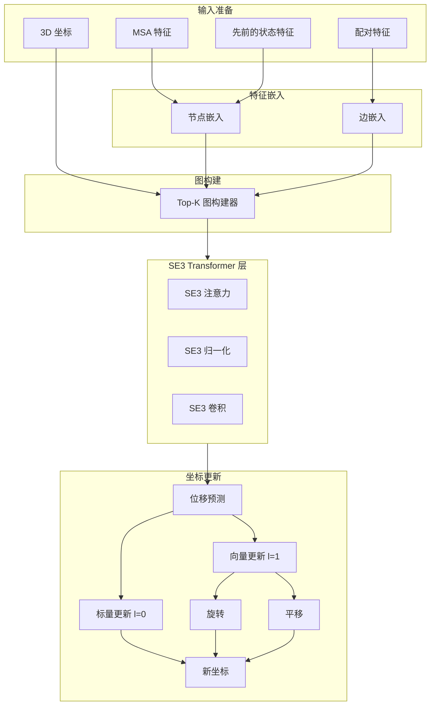
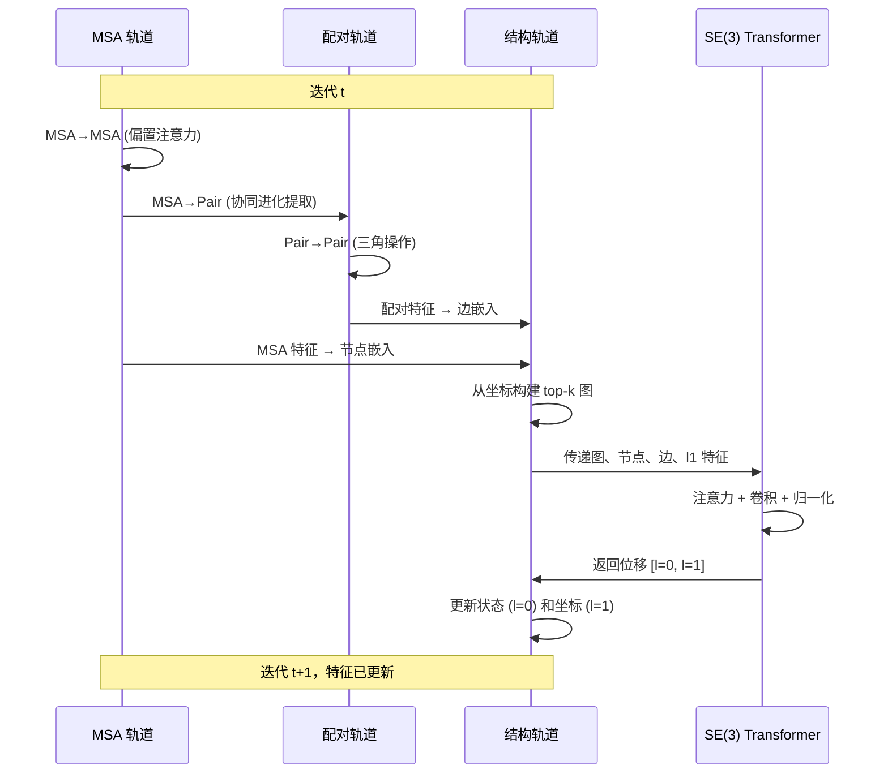

---
slug:7-se-3-equivariant-transformer-network
blog_type:normal
---


SE(3)-等变 Transformer 网络是 RoseTTAFold2 的几何引擎，使结构轨道能够处理 3D 坐标，同时保持旋转和平移等变性。该网络基于 NVIDIA SE3Transformer 库构建，通过一系列保持蛋白质结构几何性质的 SE(3)-等变操作来变换主干坐标。

## 核心架构原则

### SE(3) 等变性基础

该网络基于 **SE(3)-等变性** 原则运行：如果输入坐标经过旋转 R 和平移 T，输出特征将可预测地变换为 f(R·x + T) = R·f(x) + T。这种几何约束对于蛋白质结构预测至关重要，因为支配分子相互作用的物理定律对全局坐标变换具有不变性。该实现通过 **张量场网络** 实现这一点，该网络将特征分解为旋转群 SO(3) 的不可约表示。
来源：[SE3_network.py](network/SE3_network.py#L12-L14), [transformer.py](SE3Transformer/se3_transformer/model/transformer.py#L1-L50)

### 基于 Fiber 的特征表示

**Fiber 系统**提供了表示不同几何阶数的数学框架。每种特征类型都有特定的阶数 ℓ，维度为 2ℓ+1：

- **Type-0 (ℓ=0)**：维度为 1 的不变标量（例如，氨基酸身份、注意力分数）
- **Type-1 (ℓ=1)**：维度为 3 的等变 3D 向量（例如，位移向量、键方向）
- **Type-2 (ℓ=2)**：维度为 5 的等变对称无迹矩阵（高阶几何信息）
- **Type-3+ (ℓ≥3)**：用于复杂几何关系的高阶表示

这种多阶表示允许网络在保持其不同变换性质的同时，同时维护标量信息（如置信度分数）和向量信息（如坐标更新）。
来源：[fiber.py](SE3Transformer/se3_transformer/model/fiber.py#L21-L50)

### 网络架构概述



## 数学基础

### 基函数和球谐函数

该网络使用球谐函数 Y^ℓ_m(r̂) 计算**成对基矩阵**，其中 r̂ = (x - x')/||x - x'|| 是节点之间的单位向量。对于每一对输入阶数 ℓ_in 和输出阶数 ℓ_out，基 K^{ℓ_out,ℓ_in}_J 通过将球谐函数与 **Clebsch-Gordon 系数** Q^{ℓ_out,ℓ_in}_J 缩并来构造：

K^{ℓ_out,ℓ_in}_J = Y^J · Q^{ℓ_out,ℓ_in}_J

其中 J 的范围从 |ℓ_in - ℓ_out| 到 ℓ_in + ℓ_out。这些基函数提供了 SE(3)-等变操作的数学基础。该实现使用 LRU 缓存来缓存这些系数以提高效率，并支持部分和完全融合的基计算以进行优化。
来源：[basis.py](SE3Transformer/se3_transformer/model/basis.py#L34-L49), [basis.py](SE3Transformer/se3_transformer/model/basis.py#L79-L102)

### 径向剖面函数

**径向剖面函数** φ^{ℓ_out,ℓ_in}(r) 根据节点间距离 r 调制基矩阵的贡献。这是通过一个 MLP 实现的，该 MLP 接受不变的边特征（包括距离 ||r||）并输出权重：

φ^{ℓ_out,ℓ_in}(r) = MLP([||r||, additional_edge_features])

径向函数使网络能够学习依赖于距离的相互作用模式，同时保持等变性，因为它仅对不变量进行操作。MLP 架构通常包括两个带有层归一化和 ReLU 激活的隐藏层。
来源：[convolution.py](SE3Transformer/se3_transformer/model/layers/convolution.py#L54-L88)

### SE(3)-等变卷积

对于具有多重数 C_in 的节点特征 f^{ℓ_in}，卷积输出 f^{ℓ_out} 的多重数为 C_out：

f^{ℓ_out}_i = Σ_{j∈N(i)} Σ_J Σ_{ℓ_in} φ^{ℓ_out,ℓ_in}_J(||r_{ij}||) · K^{ℓ_out,ℓ_in}_J(r̂_{ij}) · f^{ℓ_in}_j

其中 N(i) 是节点 i 的邻域。该方程展示了网络如何结合径向调制和旋转基函数来实现等变性。该实现支持三种融合级别：FULL（所有操作融合以适应 Tensor Cores）、PARTIAL（选择性融合）和 NONE（成对操作），在内存与速度之间进行权衡。
来源：[convolution.py](SE3Transformer/se3_transformer/model/layers/convolution.py#L21-L52), [transformer.py](SE3Transformer/se3_transformer/model/transformer.py#L94-L99)

## 组件架构

### SE3TransformerWrapper 接口

`SE3TransformerWrapper` 提供了 RoseTTAFold2 和 SE3Transformer 库之间的集成点。它管理 fiber 配置并处理 RoseTTAFold2 的表示与 SE3Transformer 的预期输入格式之间的转换。该包装器支持针对不同特征维度的灵活配置：

- `l0_in_features`：输入标量特征维度（默认：32）
- `l0_out_features`：输出标量特征维度（默认：16）
- `num_edge_features`：边特征维度（默认：32）
- `num_layers`：SE3 transformer 层数（默认：2）
- `num_channels`：每个阶数的隐藏维度（默认：32）
- `num_degrees`：最大阶数（默认：3，支持 ℓ=0,1,2）

该包装器实现了专门的初始化策略，对大多数权重使用 LeCun 正态初始化，并对最后一层输出进行零初始化，以便从一开始就实现稳定的训练。
来源：[SE3_network.py](network/SE3_network.py#L12-L56), [SE3_network.py](network/SE3_network.py#L57-L75)

### 注意力机制

SE(3)-等变注意力机制遵循多头注意力模式，但在具有边特征的图结构数据上操作：

- **查询**：通过线性投影从节点特征计算得出
- **键**：通过 SE(3)-等变卷积从节点特征计算得出，然后投影到边上
- **值**：计算方式与键类似，但使用不同的投影权重

注意力权重计算如下：

α_{ij} = softmax(Σ_ℓ (key_{ij}^{ℓ} · query_i^{ℓ}) / √d_model)

其中点积在所有阶数上执行。然后输出计算为值的加权和，使用 DGL 的消息传递原语聚合邻居。这种设计保持了等变性，因为键/值计算和注意力加权聚合都是等变操作。
来源：[attention.py](SE3Transformer/se3_transformer/model/layers/attention.py#L66-L115), [attention.py](SE3Transformer/se3_transformer/model/layers/attention.py#L117-L165)

### SE(3)-等变归一化

`NormSE3` 模块通过将特征幅度与其方向分离来实现 SE(3)-等变非线性：

1. 计算每个阶数的特征的 L2 范数：||f^{ℓ}||
2. 对范数应用标准归一化和非线性：σ(LN(||f^{ℓ}||))
3. 重新缩放原始特征以匹配新范数：f^{ℓ}_out = σ(LN(||f^{ℓ}||)) · (f^{ℓ} / ||f^{ℓ}||)

这种方法保留了等变特征的相位（方向）信息，同时对其幅度应用可学习的变换。该实现使用钳位来防止小范数的数值不稳定性，特别是在 FP16 精度下。
来源：[norm.py](SE3Transformer/se3_transformer/model/layers/norm.py#L33-L68), [norm.py](SE3Transformer/se3_transformer/model/layers/norm.py#L70-L93)

<CgxTip>
基于范数的非线性对于稳定训练至关重要。与直接对等变特征应用 ReLU（这会破坏等变性）不同，这种设计在允许特征幅度的可学习调制的同时保持方向信息，确保网络能够学习有意义的表示而不牺牲几何约束。
</CgxTip>

## 在 RoseTTAFold2 中的集成

### 结构到结构轨道

SE(3) transformer 作为 RoseTTAFold2 中 **Str→Str (Structure to Structure) 轨道**的核心组件集成。该组件通过处理当前结构信息来更新 3D 坐标和状态特征。Str2Str 模块遵循三阶段流程：

**阶段 1 - 节点特征准备**：
1. 从 MSA 特征的第一行提取查询序列：`seq = msa[:, 0]`
2. 归一化并投影 MSA 和状态特征：`node = embed_node1(seq) + embed_node2(state)`
3. 应用前馈变换和层归一化
4. 重塑为图格式：对于 type-0（标量）特征为 `(B*L, n_node, 1)`

**阶段 2 - 边特征准备**：
1. 计算 Cα 原子之间的成对距离：`rbf_feat = rbf(||xyz_CA - xyz_CA'||)`
2. 提取序列分离嵌入：`seqsep = SeqSep(idx)`
3. 与配对特征结合：`edge = embed_edge1(pair) + embed_edge2([rbf_feat, seqsep])`
4. 应用前馈变换和归一化

**阶段 3 - 图构建和处理**：
1. 使用当前 Cα 位置构建 top-k 图（默认：k=64 个最近邻）
2. 提取等变 l=1 特征：CA-N 和 CA-C 向量
3. 应用 SE(3) transformer：`shift = se3(G, node, l1_feats, edge_feats)`
4. 将输出转换为坐标更新：
   - 标量更新：`state += shift['0']`（不变特征更新）
   - 向量更新：`offset = shift['1']`（等变坐标更新）
   - 平移：`T = offset[:,:,0,:] * 10.0`（缩放平移向量）
   - 旋转：`Q = offset[:,:,1,:]`（四元数表示）
   - 变换：`Rs = Qs2Rs(Q)`（将四元数转换为旋转矩阵）

这种设计允许网络直接预测坐标调整，同时更新用于后续迭代的内部状态表示。
来源：[Track_module.py](network/Track_module.py#L472-L530), [Track_module.py](network/Track_module.py#L530-L590)

### 迭代优化循环

SE(3) transformer 在 RoseTTAFold2 的迭代优化循环内运行，其中每个 `IterBlock` 在所有三个轨道上执行协调更新：



每次迭代都通过这种三方交互来优化结构：MSA 轨道提供序列上下文，配对轨道提供成对约束，结构轨道生成实际的 3D 坐标。SE(3) transformer 是将成对信息转换为坐标更新同时保持几何一致性的引擎。
来源：[Track_module.py](network/Track_module.py#L630-L680)

## 配置和优化

### 边特征填充策略

该网络支持多种将距离信息纳入边特征的策略，由 `populate_edge` 参数控制：

| 策略 | 公式 | 属性 | 用例 |
|----------|---------|------------|----------|
| **lin** | `r = ||r_ij||` | 线性距离，保留单位 | 通用，可解释的尺度 |
| **arcsin** | `r = arcsinh(max(r-4, 0)) / 3` | 压缩大距离，在 4Å 处截断 | 处理异常值，有界范围 |
| **log** | `r = log(1 + ||r_ij||)` | 对数压缩，平滑 | 强调短程相互作用 |
| **zero** | `r = 0` | 无距离信息 | 消融研究，基线 |

RoseTTAFold2 默认使用 arcsin 策略，在短程接触的敏感性和对异常值的鲁棒性之间取得了平衡。
来源：[transformer.py](SE3Transformer/se3_transformer/model/transformer.py#L153-L164)

### 融合级别优化

该实现提供了三种融合级别，在内存消耗和计算速度之间进行权衡：

- **FULL 融合**：融合所有阶数和通道的所有操作。需要统一的通道数和连续的阶数（0,1,2,...max_degree）。执行速度最快，但内存使用量最高。
- **PARTIAL 融合**：按输出阶数或输入阶数融合操作。更灵活的要求。平衡速度和内存。
- **NONE**：没有融合的成对操作。最节省内存，但执行最慢。

RoseTTAFold2 默认使用 PARTIAL 融合（除非有 Tensor Cores 可用），在适应三个轨道的不同通道配置的同时提供良好的性能。
来源：[convolution.py](SE3Transformer/se3_transformer/model/layers/convolution.py#L21-L52), [transformer.py](SE3Transformer/se3_transformer/model/transformer.py#L94-L99)

### 低内存优化

该网络支持几种用于训练大型蛋白质复合物的内存优化策略：

1. **梯度检查点**：通过在反向传播期间重新计算前向传播来交换计算以换取内存
2. **激活卸载**：在配对轨道操作期间将 MSA 特征临时移动到 CPU 以释放 GPU 内存
3. **跨步处理**：分块处理特征以减少峰值内存使用量
4. **混合精度**：使用 FP16 进行前向传播，并使用 FP32 主权重

<CgxTip>
`low_vram` 标志启用了一项关键优化，即在内存密集型的配对轨道操作期间将 MSA 特征卸载到 CPU，然后在结构处理时带回 GPU。这使得可以推理大型复合物（例如，>1000 个残基），否则这些复合物将超过 GPU 内存限制。
</CgxTip>

来源：[Track_module.py](network/Track_module.py#L666-L674), [RoseTTAFoldModel.py](network/RoseTTAFoldModel.py#L37-L100)

### 参数配置

RoseTTAFold2 中的默认 SE(3) transformer 参数：

```python
SE3_param_full = {
    'l0_in_features': 32,      # 输入标量特征
    'l0_out_features': 16,     # 输出标量特征（状态）
    'num_edge_features': 32,   # 边特征（配对 + 几何）
    'num_layers': 2,           # Transformer 层数
    'num_channels': 32,        # 每个阶数的隐藏维度
    'num_degrees': 3,          # 最大阶数（ℓ=0,1,2）
    'n_heads': 4,              # 注意力头数
    'div': 4                   # 值的通道除数
}
```

选择这些维度是为了平衡表示能力和计算效率。状态特征的较小输出维度（16 对 32）反映了将几何信息压缩为其他轨道使用的紧凑表示。
来源：[RoseTTAFoldModel.py](network/RoseTTAFoldModel.py#L15-L20), [SE3_network.py](network/SE3_network.py#L14-L20)

## 输出解释

### 坐标更新

SE(3) transformer 将坐标更新输出为平移和旋转分量：

- **平移向量 T ∈ ℝ³**：每个残基坐标系的直接位移
- **旋转矩阵 R ∈ ℝ³×³**：应用于残基局部坐标系的旋转
- **组合更新**：`X_new = R · X_old + T`

旋转被参数化为四元数（4D 向量）以获得数值稳定性，并转换为旋转矩阵以进行应用。平移按因子 10.0 缩放以匹配坐标系中使用的单位。
来源：[Track_module.py](network/Track_module.py#L581-L590)

### 状态更新

标量 (l=0) 输出更新内部状态表示：

- `state_new = state_old + shift['0']`
- 状态特征在后续迭代中被用于：
  - 通过偏置注意力向 MSA 轨道提供几何信息
  - 通过门控机制促进配对轨道更新
  - 作为侧链扭转预测的输入

这种状态表示编码了学习到的几何和进化信息，指导后续的优化步骤。
来源：[Track_module.py](network/Track_module.py#L579-L580), [Track_module.py](network/Track_module.py#L591-L593)

### 侧链预测

更新后的状态特征被传递到 `SCPred` 模块以预测侧链扭转角：

- 输入：序列嵌入 + 状态特征
- 输出：10 个扭转角（φ, ψ, ω, χ₁-χ₄, Cβ bend, Cβ twist, CG），具有 sin 和 cos 分量
- 这使得网络能够预测完整的原子坐标，而不仅仅是主干

侧链预测器是一个小型 ResNet，通过几个残差层处理组合的序列和状态信息。
来源：[Track_module.py](network/Track_module.py#L350-L394)

## 性能和实现注意事项

### 计算复杂度

计算成本主要取决于：
- **图构建**：成对距离计算的 O(N²)（但对于 top-k 图减少到 O(N·k)）
- **注意力**：O(E · d_model)，其中 E 是边数（k-NN 图的 N·k）
- **基计算**：O(E · max_degree⁴) 但计算一次并缓存
- **卷积**：O(E · Σ_{ℓ_in,ℓ_out} C_in · C_out · Σ_J dim(J))

使用 top-k 图（k=64）对于扩展到大型蛋白质至关重要，将全成对相互作用的二次复杂度降低到接近线性的复杂度。

### GPU 优化

该实现包括几种特定的 GPU 优化：

1. **Tensor Core 利用率**：将奇数维度填充到 8 的倍数以进行高效的张量核心操作
2. **NVTX 标记**：用于性能分析的配置区域
3. **JIT 编译**：对关键路径进行 TorchScript 编译（基计算、归一化）
4. **融合操作**：将多个内核组合成单个操作以减少内核启动开销

这些优化使得在使用分布式数据并行训练时，能够在多 GPU 系统上进行接近线性的扩展训练。
来源：[basis.py](SE3Transformer/se3_transformer/model/basis.py#L110-L131), [convolution.py](SE3Transformer/se3_transformer/model/layers/convolution.py#L140-L180)

### 等变性验证

该实现在 `tests/test_equivariance.py` 中包含等变性测试，以验证输入坐标的随机旋转在数值精度内产生输出特征的相应旋转。这种测试对于确保架构修改不会无意中破坏几何约束至关重要。
来源：[test_equivariance.py](SE3Transformer/tests/test_equivariance.py)

## 后续步骤

要全面了解 RoseTTAFold2 的架构：

- **[迭代优化的回收机制](8-recycling-mechanism-for-iterative-refinement)**：了解网络如何通过多个周期的回收迭代优化预测
- **[三轨道设计](6-three-track-design-msa-pair-and-3d-structure-tracks)**：了解集成 MSA、配对和结构轨道的整体架构
- **[轨道模块设计和交互](13-track-module-design-and-interaction)**：探索每次迭代中轨道之间详细的交互模式
- **[使用 SE3 层进行坐标生成](14-coordinate-generation-with-se3-layers)**：深入了解如何将 SE(3) 层输出转换为原子坐标