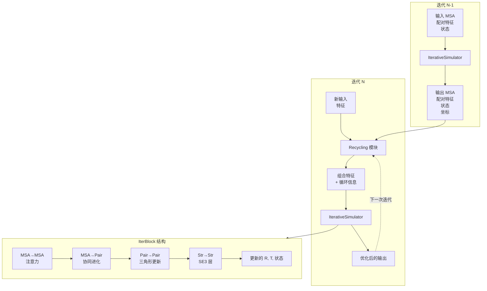

---
slug:8-recycling-mechanism-for-iterative-refinement
blog_type:normal
---


循环机制使 RoseTTAFold2 能够通过多次迭代逐步优化蛋白质结构预测，利用每一轮的预测输出作为下一轮的输入。这种迭代优化策略允许模型在每个周期中融入已学习的结构约束并提高预测精度，遵循与 AlphaFold 2 循环机制类似的范式。

## 循环架构概述

循环系统在两个不同的层面上运行：（1）跨迭代循环，在独立的前向传播之间传递信息；（2）迭代内细化块，在单次前向传播内逐步更新表示。跨迭代循环通过 [Embeddings.py](network/Embeddings.py#L337-L358) 中的 `Recycling` 模块实现，而迭代内细化发生在 [Track_module.py](network/Track_module.py#L701-L841) 中的 `IterativeSimulator` 中。



## 跨迭代循环

跨迭代循环机制在每次模型前向传播开始时通过 [RoseTTAFoldModel.py](network/RoseTTAFoldModel.py#L79-L98) 中的 `RoseTTAFoldModule.forward()` 方法运行。此过程转换上一迭代的输出，并将其作为扰动添加到当前输入嵌入中。

在第一次迭代中，当不存在先前的输出时，循环输入初始化为与目标特征形状相同的零张量：

```python
if msa_prev == None:
    msa_prev = torch.zeros_like(msa_latent[:,0])
    pair_prev = torch.zeros_like(pair)
    state_prev = torch.zeros_like(state)
```
来源：[RoseTTAFoldModel.py](network/RoseTTAFoldModel.py#L80-L83)

`Recycling` 模块接收上一迭代的 MSA、配对和状态特征以及 3D 坐标（`xyz`），并生成循环更新，这些更新按元素添加到当前嵌入中：

```python
msa_recycle, pair_recycle, state_recycle = self.recycle(
  seq, msa_prev, pair_prev, state_prev, xyz, recycl_stripe, mask_recycle)
msa_latent[:,0] += msa_recycle
pair += pair_recycle
state += state_recycle
```
来源：[RoseTTAFoldModel.py](network/RoseTTAFoldModel.py#L92-L98)

这种加性更新方案保留了原始输入特征，同时融入了从先前迭代中学习到的结构信息。循环特征捕获了关于原子几何结构、骨干扭转角和残基间空间关系的隐含知识，而这些在原始 MSA 和序列数据中未能充分体现。

## 使用 IterativeSimulator 进行迭代内细化

在每次前向传播中，`IterativeSimulator` 通过一系列专用处理块执行多轮特征细化。模拟器实例化时包含三种可配置的块类型：额外块（`n_extra_block`）、主块（`n_main_block`）和细化块（`n_ref_block`），如 [Track_module.py](network/Track_module.py#L702-L711) 所示。

| 块类型 | 默认数量 | 主要功能 | 关键操作 |
|------------|---------------|-------------------|----------------|
| 额外块 | 4 | 使用完整特征处理深度 MSA | 全局注意力，SE3 更新 |
| 主块 | 8 | 核心结构预测循环 | 三角形注意力，局部 SE3 更新 |
| 细化块 | 4 | 最终坐标细化 | 结构到结构细化 |

迭代过程系统地更新每个残基的旋转矩阵（`R_in`）和平移向量（`T_in`）。在每个块开始时，这些参数从计算图中分离，以防止梯度跨块流动并确保数值稳定性：

```python
R_in = R_in.detach()
T_in = T_in.detach()
xyz = einsum('bnij,bnaj->bnai', R_in, xyz_in) + T_in.unsqueeze(-2)
```
来源：[Track_module.py](network/Track_module.py#L787-L790)

当前骨干坐标由旋转矩阵和平移向量重建，提供了一个不断演化的结构假设，指导后续层中的注意力机制。

## IterBlock：单步细化单元

每个迭代块（`IterBlock`）实现三轨信息流的完整循环，如 [Track_module.py](network/Track_module.py#L619-L700) 中所定义。该块协调四个顺序更新操作，反映三轨架构：

1. **MSA→MSA 更新**（`MSAPairStr2MSA`）：偏置自注意力，其中注意力偏置源自配对表示和结构特征，允许 MSA 轨道融入来自配对和结构轨道的空间约束。

2. **MSA→Pair 更新**（`MSA2Pair`）：从 MSA 中提取协同进化信号以更新残基间配对特征，捕获指示物理接触的相关突变。

3. **Pair→Pair 更新**（`PairStr2Pair`）：三角形乘法运算，使用源自结构的 RBF（径向基函数）距离特征更新配对特征，实现对残基关系的几何推理。

4. **Str→Str 更新**（`Str2Str`）：SE(3) 等变 Transformer 层，基于 MSA 和配对表示更新旋转矩阵、平移向量和状态特征。

该块根据当前坐标计算基于距离的 RBF 特征，结合空间距离和序列分离信息：

```python
rbf_feat = (
  rbf(torch.cdist(xyz[:,rows,1], xyz[:,cols,1])).reshape(B,NR,NC,-1)
  + self.pos(idx[:,rows],idx[:,cols], B, L, nc_cycle)
)
```
来源：[Track_module.py](network/Track_module.py#L665-L668)

这些 RBF 特征编码了从演化结构中学习到的残基间距离，并作为配对到配对和结构到结构更新操作的几何先验。

<CgxTip>
循环机制的有效性取决于结构更新层的 SE(3) 等变性质。通过在迭代间保持几何等变性，模型确保旋转和平移更新一致累积而不引入系统偏差，从而实现向正确结构的稳定收敛。
</CgxTip>

## 状态特征管理和投影

状态特征在不同迭代阶段之间进行投影变换，以匹配各种 SE3 层的维度要求。`IterativeSimulator` 通过线性层 `proj_state` 和 `proj_state2` 管理这些投影：

```python
state = self.proj_state(state)
# ... 主块和额外块处理 ...
state = self.proj_state2(state)
# ... 细化块处理 ...
```
来源：[Track_module.py](network/Track_module.py#L780, L819)

第一个投影（`proj_state`）将状态特征从 SE3 top-k 维度（默认 16 个特征）转换为完整的 SE3 维度，用于额外块和主块。第二个投影（`proj_state2`）逆转此转换，为使用更高效的 top-k SE3 参数化的细化块准备状态特征。

## 坐标收集和多尺度输出

所有中间坐标预测在迭代过程中被系统收集，使模型能够生成多尺度结构候选集合。每个块的旋转矩阵和平移向量被附加到列表中：

```python
R_s.append(R_in)
T_s.append(T_in)
alpha_s.append(alpha)
```
来源：[Track_module.py](network/Track_module.py#L798-L800)

完成所有块后，这些列表被堆叠成张量：

```python
R_s = torch.stack(R_s, dim=0)
T_s = torch.stack(T_s, dim=0)
alpha_s = torch.stack(alpha_s, dim=0)
```
来源：[Track_module.py](network/Track_module.py#L836-L838)

[RoseTTAFoldModel.py](network/RoseTTAFoldModel.py#L145-L146) 中的最终坐标变换使用收集的旋转矩阵和平移向量重建所有中间骨干结构：

```python
xyz = einsum('rblij,blaj->rblai', R, xyz-xyz[:,:,1].unsqueeze(-2)) + T.unsqueeze(-2)
```

这产生了一组不同细化程度的结构预测，可用于基于集成的置信度估计，或根据 LDDT 分数等辅助指标选择最可靠的预测。

## 内存效率和低显存优化

循环和迭代细化机制包括针对内存受限环境的优化。`IterBlock.forward()` 方法支持 `low_vram` 模式，该模式在配对到配对注意力计算期间将大型 MSA 张量临时传输到 CPU 内存：

```python
if (low_vram and not self.training):
    msa = msa.cpu()
pair = self.pair2pair(pair, rbf_feat, state, strides, crop)
rbf_feat = None
if (low_vram and not self.training):
    msa = msa.to(pair.device)
```
来源：[Track_module.py](network/Track_module.py#L683-L688)

此外，系统通过 `use_checkpoint` 参数支持梯度检查点，通过在反向传播期间重新计算中间激活来牺牲计算时间以减少内存。`striping` 参数允许在嵌入和循环操作期间对特征进行子采样，以进一步减少内存占用。

## 与训练和预测的集成

在训练期间，循环机制允许网络通过在多次循环迭代中将其输出与真实结构进行比较，学习系统地减少预测误差。损失函数计算每次迭代的预测精度，提供梯度以指导循环模块如何在周期间最有效地传输信息。

<CgxTip>
在推理期间，可以调整循环次数以在预测准确性和计算成本之间进行权衡。虽然默认配置使用 3-4 次循环迭代，但研究表明，对于大多数蛋白质目标，超过此点的收益递减，尽管 MSA 信号较弱的困难目标可能会从额外周期中受益。
</CgxTip>

循环参数通过 [RoseTTAFoldModel.py](network/RoseTTAFoldModel.py#L12-L19) 中模型初始化期间的 `n_extra_block`、`n_main_block` 和 `n_ref_block` 参数控制。这些超参数决定了迭代内细化的深度，并可根据特定用例进行调整——用于快速预测的块较少的轻量级模型，或用于最大准确性的块较多的深层模型。

## 后续步骤

要了解在循环期间实现轨道内部和轨道之间信息流动的注意力机制，请阅读 [注意力机制 (MSA 行/列、三角形乘法)](9-attention-mechanisms-msa-row-column-triangle-multiplication)。有关如何通过 SE3 层实际生成坐标的详细信息，请参阅 [使用 SE3 层生成坐标](14-coordinate-generation-with-se3-layers)。要了解作为循环基础的三轨架构，请参考 [三轨设计：MSA、Pair 和 3D 结构轨道](6-three-track-design-msa-pair-and-3d-structure-tracks)。