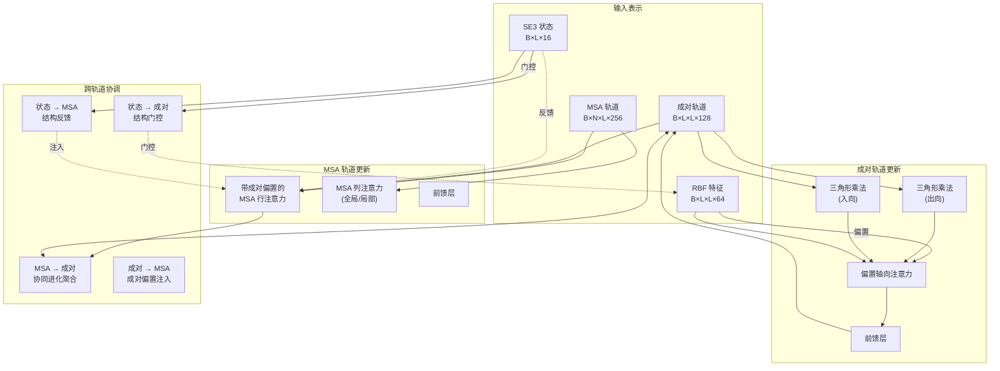

---
slug:9-attention-mechanisms-msa-row-column-triangle-multiplication
blog_type:normal
---


RoseTTAFold2 采用了一种复杂的多轨道注意力架构，结合了来自多序列比对（MSA）的进化信息和来自成对表示的几何推理。注意力机制作为核心计算引擎，在迭代优化过程中实现了 MSA 轨道、成对轨道和 3D 结构轨道之间的信息流动。该架构设计利用 **带成对偏置的 MSA 行注意力**、**MSA 列注意力** 和 **三角形乘法** 操作来捕获协同进化信号，并在残基对之间强制执行几何一致性。

来源：[network/Attention_module.py](network/Attention_module.py#L168-L643), [network/Track_module.py](network/Track_module.py#L48-L296)

## 架构概述

注意力机制在分层更新方案中运行，该方案转换三个轨道上的表示：MSA 轨道（B×N×L×d_msa）、成对轨道（B×L×L×d_pair）和 3D 坐标轨道。核心创新在于使用成对表示来偏置 MSA 轨道中的注意力模式，允许进化耦合指导序列信息的聚合。同时，成对轨道上的三角形乘法操作通过三角闭合约束推理残基对之间的关系，强制执行几何一致性。



## 带成对偏置的 MSA 行注意力

MSA 行注意力对 MSA 维度（N 个序列）中的每个位置（L 个残基）执行跨序列注意力，其关键创新在于成对表示为注意力分数提供可学习的偏置。这使得模型能够利用来自成对表示的进化耦合信息来指导在信息聚合期间哪些序列位置相互关注。

该实现扩展了标准多头注意力，包含三个关键增强：**序列依赖权重**用于缩放查询贡献，**成对偏置注入**用于将残基间耦合信息添加到注意力分数，以及控制信息流的**门控机制**。注意力机制计算分数如下：

```
attn[i,j,h] = sum_k(query[i,k,h] * key[j,k,h]) + bias[i,j,h]
```

其中 bias[i,j,h] 源自成对表示，反映了残基 i 和 j 之间的协同进化强度。
来源：[network/Attention_module.py](network/Attention_module.py#L168-L281)

行注意力集成了多个信息流。序列权重根据序列保守性模式缩放查询表示，成对表示被投影以为每个注意力头生成偏置项，来自 SE3 轨道的状态特征被注入到第一个 MSA 行（查询序列）中，以提供结构感知更新。在推理过程中，该实现使用了内存高效的跨步处理，将 MSA 分块处理以减少峰值内存使用。
来源：[network/Track_module.py](network/Track_module.py#L78-L130)

| 组件 | 输入形状 | 输出形状 | 用途 |
|-----------|-------------|--------------|---------|
| Query/Key/Value 投影 | B×N×L×256 | B×N×L×h×32 | 多头 Q/K/V 计算 |
| 成对偏置投影 | B×L×L×128 | B×L×L×h | 注入协同进化偏置 |
| 序列权重 | B×N×L×256 | B×N×L×h×32 | 按序列保守性缩放查询 |
| 门控 | B×N×L×256 | B×N×L×h×32 | 控制每个头的信息流 |

<CgxTip>行注意力对残差连接使用零初始化的输出投影，这确保该模块在训练早期表现为恒等映射，并稳定通过深层注意力堆叠的梯度流动。</CgxTip>

## MSA 列注意力

MSA 列注意力对 MSA 中的每个序列（N 个序列）在序列维度（L 个残基）上执行注意力，允许同一序列内不同残基位置之间的信息传播。该机制与行注意力互补：行注意力聚合每个残基跨序列的信息，而列注意力在每个序列内跨残基传播信息。

实现了两种变体：**局部列注意力**使用基于跨步的内存优化的标准多头注意力，以及 **全局列注意力**使用每个位置单个学习查询来同时关注所有序列。全局变体在序列维度上计算平均池化查询，然后使用此全局查询关注所有序列。这种设计在捕获序列级模式方面特别有效，同时计算效率高。
来源：[network/Attention_module.py](network/Attention_module.py#L284-L416)

列注意力模式在几个关键方面与行注意力不同。行注意力在序列维度（N）上操作并使用来自成对轨道的成对偏置，而列注意力在残基维度（L）上操作，没有显式的成对偏置。行注意力跨序列关注以聚合协同进化信息，而列注意力跨残基关注以传播位置信息。两种机制都使用相同的门控架构，具有 sigmoid 激活的门控，控制信息从注意力输出通过投影层的流动。

行和列注意力的组合实现了 MSA 轨道内的双向信息流动。行注意力通知每个残基关于 MSA 中的保守模式，而列注意力通知每个序列关于跨位置的模式。这种双向流动对于捕获表征蛋白质进化的序列保守性和位置变化之间的复杂依赖关系至关重要。
来源：[network/Track_module.py](network/Track_module.py#L121-L122)

## 三角形乘法

三角形乘法在成对轨道上操作，并通过三角闭合推理残基对之间的关系来强制执行几何一致性。基本见解是，对于任意三个残基 i、j、k，残基对 i-k 之间的关系应与残基对 i-j 和 j-k 之间关系的组合一致。三角形乘法通过计算左右成对特征的逐元素乘积并在共享维度上聚合来实现这一点。

实现了两种变体：**出向三角形乘法**计算：

```
out[i,j] = sum_k(left[i,k] * right[j,k]) / L
```

以及 **入向三角形乘法**计算：

```
out[i,j] = sum_k(left[k,i] * right[k,j]) / L
```

其中左右投影应用于成对表示并在乘法前独立进行门控。出向变体沿从共享中间节点出发的出向边传播信息，而入向变体沿入向边传播。
来源：[network/Attention_module.py](network/Attention_module.py#L531-L643)

该实现在推理过程中具有内存高效的跨步处理，将 L×L 成对矩阵分块处理以减少峰值内存使用。每个块独立计算三角形乘法，并通过索引操作聚合结果。对于大型蛋白质，这一点尤为重要，因为 L×L 成对矩阵可能消耗大量 GPU 内存。该实现还在投影之前和聚合步骤之后使用单独的归一化层，对成对输入和中间表示应用 LayerNorm，然后再进行最终投影。
来源：[network/Track_module.py](network/Track_module.py#L283-L284)

| 操作 | 爱因斯坦求和符号 | 几何直觉 | 更新方向 |
|-----------|------------------|---------------------|------------------|
| 出向 | `bikd,bjkd->bijd` | 通过共享目标传播 | 通过中间节点向前 |
| 入向 | `bkid,bkjd->bijd` | 通过共享源传播 | 通过中间节点向后 |

<CgxTip>三角形乘法对投影层使用 LeCun 正态初始化，这非常适合逐元素乘法操作，因为它通过乘法门保持方差，并防止深层三角形堆叠中的梯度消失或爆炸。</CgxTip>

## 成对轨道的偏置轴向注意力

偏置轴向注意力通过使用源自坐标的偏置处理行或列注意力模式，提供高效的成对轨道更新。该实现通过置换操作支持行和列变体，该操作在行操作时转置成对矩阵，从而实现两个方向的代码重用。关键创新在于注意力是“绑定”的——沿被关注维度的所有查询使用相同的键矩阵，这将计算复杂度从 O(L³) 降低到 O(L²)。

注意力机制使用成对表示作为查询、键和值，而 RBF 距离特征提供偏置项。RBF 特征编码从当前 3D 坐标计算的残基间距离，允许结构信息指导成对轨道上的注意力模式。来自 SE3 轨道的状态特征对 RBF 特征进行门控，实现对哪些几何信息注入注意力计算的结构感知控制。
来源：[network/Attention_module.py](network/Attention_module.py#L419-L529), [network/Track_module.py](network/Track_module.py#L249-L256)

偏置轴向注意力包括几个架构优化。键按 1/L 归一化，以考虑绑定注意力模式，其中每个键被多个查询重用。来自 RBF 特征的偏置项按头投影，并在 softmax 归一化之前添加到注意力分数中，允许几何邻近性调节注意力模式。门控机制对成对特征的投影使用 sigmoid 激活来控制最终输出，确保根据局部成对表示上下文对注意力更新进行门控。

三角形乘法和偏置轴向注意力的组合创建了一个强大的成对轨道更新机制。三角形乘法通过对整个成对矩阵的三角闭合推理强制执行全局几何一致性，而偏置轴向注意力提供受当前 3D 坐标引导的高效局部更新。这种双重机制使成对轨道能够在迭代优化期间整合全局协同进化约束和局部几何信息。
来源：[network/Track_module.py](network/Track_module.py#L146-L150)

## 迭代块中的集成

所有注意力机制都集成到 IterBlock 类中，该类在回收机制的每次迭代期间协调跨轨道的信息流动。该块遵循系统的更新顺序：使用带成对偏置的行和列注意力进行 MSA 到 MSA 更新，聚合序列信息的 MSA 到成对更新，使用三角形乘法和轴向注意力的成对到成对更新，以及使用 SE(3)-transformer 层的结构到结构更新。
来源：[network/Track_module.py](network/Track_module.py#L619-L700)

MSA 到 MSA 块（MSAPairStr2MSA）依次应用带成对偏置的行注意力、列注意力和前馈变换，并带有残差连接。来自 SE3 轨道的状态特征通过 index_add 操作注入到第一个 MSA 行中，为 MSA 轨道提供直接的结构反馈。成对到成对块（PairStr2Pair）应用出向和入向三角形乘法，然后是行和列偏置轴向注意力，最后以前馈变换结束。两个块都对注意力输出使用 dropout，并带有广播维度以防止过拟合。

在训练期间，块使用标准的残差连接，将变换的输出添加到输入。在内存受限的推理期间，块实现就地更新并使用可选跨步来分块处理张量。跨步配置通过跨步字典传递，该字典指定不同操作的跨步值（msarow_n、msarow_l、msacol、trimult、biasedax 等），从而允许在推理期间对内存精度权衡进行细粒度控制。
来源：[network/Track_module.py](network/Track_module.py#L680-692)

## 内存优化策略

注意力机制实现了几种内存优化策略，使大型蛋白质的高效推理成为可能。跨步处理将大型张量操作划分为适合 GPU 内存的小块，不同的跨步值应用于不同的注意力模式。检查点在反向传播期间重新计算中间激活，而不是存储它们，以计算换取内存节省。CPU 卸载在启用低 VRAM 模式时，在成对轨道操作期间将 MSA 张量临时移动到 CPU 内存。

跨步实现使用条件逻辑，根据是否指定了跨步值以及跨步是否小于张量维度，来选择分块和全张量操作。对于每个分块操作，实现按指定大小的跨步遍历张量，在块上计算操作，并通过 index_add 操作累积结果。这种方法通过一次处理一个块来保持数值准确性，同时减少峰值内存使用。
来源：[network/Attention_module.py](network/Attention_module.py#L211-258), [network/Track_module.py](network/Track_module.py#L683-688)

| 优化 | 节省的内存 | 计算成本 | 用例 |
|--------------|---------------|------------------|----------|
| 跨步处理 | 50-90% | 10-30% 开销 | 大型蛋白质（>500 个残基） |
| 激活检查点 | 30-60% | 2x 反向传播 | GPU 内存有限的训练 |
| CPU 卸载 | 40-70% | 传输延迟 | VRAM 极低的推理 |

注意力机制共同形成了一个强大的架构，用于在蛋白质结构预测期间整合进化和几何信息。MSA 行和列注意力实现跨序列和位置的双向信息流动，三角形乘法通过三角闭合推理强制执行几何一致性，偏置轴向注意力提供受当前 3D 坐标引导的高效成对轨道更新。这些机制在迭代回收框架内协同工作，逐步将预测从初始 MSA 和模板特征优化为高精度原子模型。