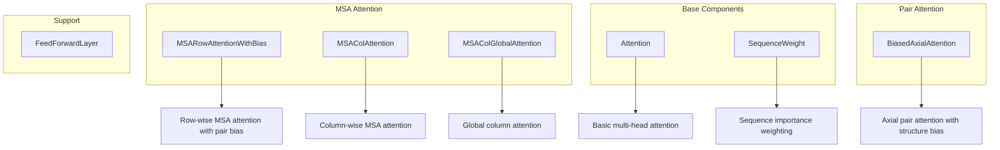
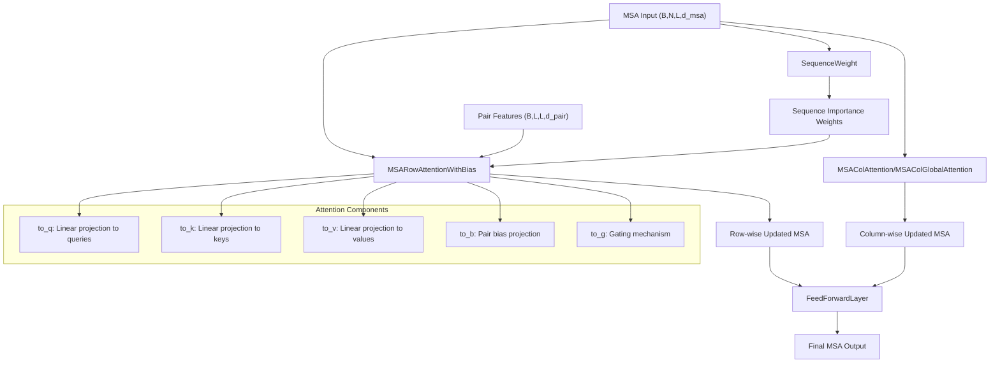
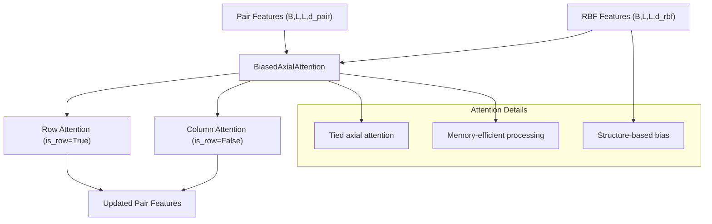
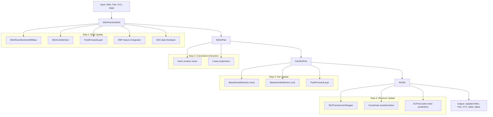
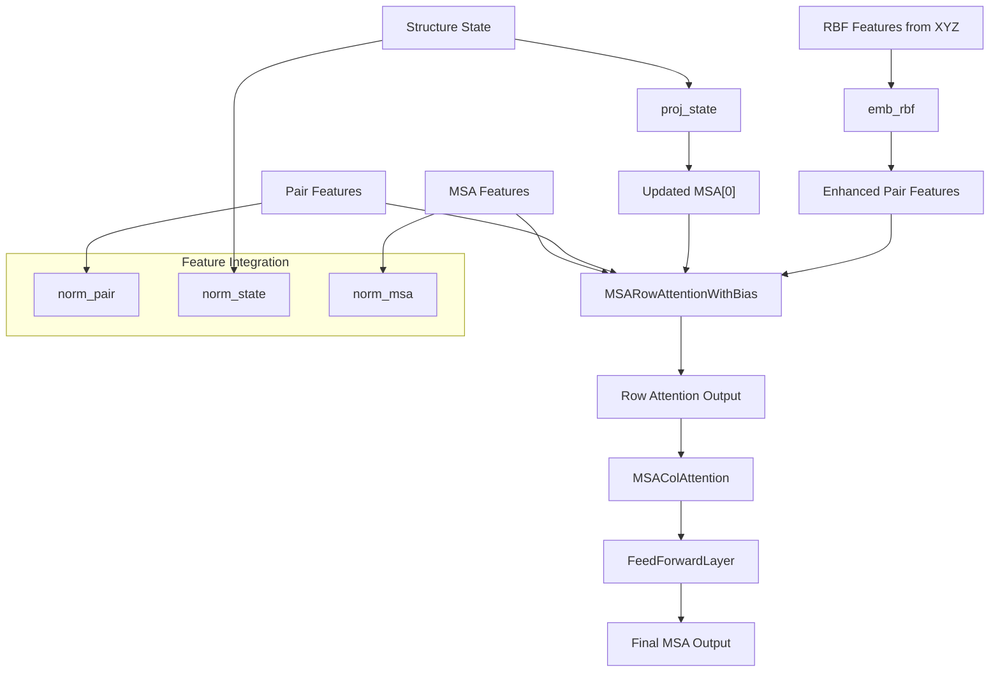
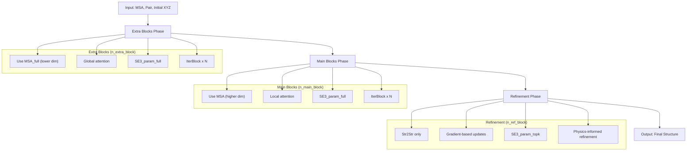
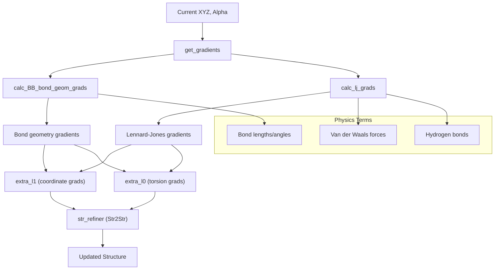

# Attention and Track Modules

> **Relevant source files**
> * [SE3Transformer/se3_transformer/model/layers/norm.py](https://github.com/uw-ipd/RoseTTAFold2NA/blob/f761af28/SE3Transformer/se3_transformer/model/layers/norm.py)
> * [network/Attention_module.py](https://github.com/uw-ipd/RoseTTAFold2NA/blob/f761af28/network/Attention_module.py)
> * [network/Track_module.py](https://github.com/uw-ipd/RoseTTAFold2NA/blob/f761af28/network/Track_module.py)

This page documents the attention mechanisms and iterative structure refinement components that form the core of RoseTTAFold2NA's neural network architecture. These modules implement the iterative simulation process where Multiple Sequence Alignment (MSA) features, pairwise residue features, and 3D structural coordinates are refined through alternating attention-based updates.

For information about the overall RoseTTAFold module architecture, see [Core RoseTTAFold Module](/uw-ipd/RoseTTAFold2NA/5.1-core-rosettafold-module). For details about the SE(3)-equivariant components used within the track modules, see [SE(3)-Equivariant Components](/uw-ipd/RoseTTAFold2NA/5.2-se(3)-equivariant-components).

## Attention Mechanisms

The attention system implements several specialized attention variants designed for protein structure prediction, each handling different aspects of the MSA and pairwise feature representations.

### Core Attention Classes

**Sources:** [network/Attention_module.py L32-L97](https://github.com/uw-ipd/RoseTTAFold2NA/blob/f761af28/network/Attention_module.py#L32-L97)

 [network/Attention_module.py L100-L130](https://github.com/uw-ipd/RoseTTAFold2NA/blob/f761af28/network/Attention_module.py#L100-L130)

 [network/Attention_module.py L131-L192](https://github.com/uw-ipd/RoseTTAFold2NA/blob/f761af28/network/Attention_module.py#L131-L192)

 [network/Attention_module.py L193-L242](https://github.com/uw-ipd/RoseTTAFold2NA/blob/f761af28/network/Attention_module.py#L193-L242)

 [network/Attention_module.py L244-L294](https://github.com/uw-ipd/RoseTTAFold2NA/blob/f761af28/network/Attention_module.py#L244-L294)

 [network/Attention_module.py L297-L380](https://github.com/uw-ipd/RoseTTAFold2NA/blob/f761af28/network/Attention_module.py#L297-L380)

 [network/Attention_module.py L8-L30](https://github.com/uw-ipd/RoseTTAFold2NA/blob/f761af28/network/Attention_module.py#L8-L30)

### MSA Attention Architecture

The MSA attention system processes multiple sequence alignments through specialized row and column attention mechanisms:

**Sources:** [network/Attention_module.py L131-L192](https://github.com/uw-ipd/RoseTTAFold2NA/blob/f761af28/network/Attention_module.py#L131-L192)

 [network/Attention_module.py L193-L242](https://github.com/uw-ipd/RoseTTAFold2NA/blob/f761af28/network/Attention_module.py#L193-L242)

 [network/Attention_module.py L244-L294](https://github.com/uw-ipd/RoseTTAFold2NA/blob/f761af28/network/Attention_module.py#L244-L294)

 [network/Attention_module.py L100-L130](https://github.com/uw-ipd/RoseTTAFold2NA/blob/f761af28/network/Attention_module.py#L100-L130)

The `MSARowAttentionWithBias` class implements attention across sequence positions within each MSA row, incorporating bias from pairwise residue features. The `SequenceWeight` mechanism computes importance weights for different sequences in the MSA relative to the target sequence.

### Pair Attention with Structural Bias

**Sources:** [network/Attention_module.py L297-L380](https://github.com/uw-ipd/RoseTTAFold2NA/blob/f761af28/network/Attention_module.py#L297-L380)

The `BiasedAxialAttention` implements tied axial attention for pair features, using structural information (RBF features from Ca-Ca distances) as bias. This allows the pair representation to be updated based on both sequence co-evolution patterns and current structural geometry.

## Track Modules: Iterative Structure Refinement

The track modules implement the iterative refinement process where MSA features, pair features, and 3D coordinates are updated in cycles. Each iteration block performs a four-step update process.

### IterBlock Architecture

**Sources:** [network/Track_module.py L329-L372](https://github.com/uw-ipd/RoseTTAFold2NA/blob/f761af28/network/Track_module.py#L329-L372)

 [network/Track_module.py L43-L106](https://github.com/uw-ipd/RoseTTAFold2NA/blob/f761af28/network/Track_module.py#L43-L106)

 [network/Track_module.py L128-L160](https://github.com/uw-ipd/RoseTTAFold2NA/blob/f761af28/network/Track_module.py#L128-L160)

 [network/Track_module.py L108-L126](https://github.com/uw-ipd/RoseTTAFold2NA/blob/f761af28/network/Track_module.py#L108-L126)

 [network/Track_module.py L223-L327](https://github.com/uw-ipd/RoseTTAFold2NA/blob/f761af28/network/Track_module.py#L223-L327)

### MSA-Pair-Structure Integration

The `MSAPairStr2MSA` class demonstrates how information flows between the three main feature tracks:

**Sources:** [network/Track_module.py L43-L106](https://github.com/uw-ipd/RoseTTAFold2NA/blob/f761af28/network/Track_module.py#L43-L106)

The integration works by:

1. Normalizing each feature type separately
2. Adding RBF-encoded structural information to pair features
3. Feeding SE3 state information back to the query sequence (MSA[0])
4. Using enhanced pair features as bias in MSA row attention

## Iterative Simulation Process

The `IterativeSimulator` orchestrates the complete iterative refinement process across multiple phases.

### Simulation Phases

**Sources:** [network/Track_module.py L373-L501](https://github.com/uw-ipd/RoseTTAFold2NA/blob/f761af28/network/Track_module.py#L373-L501)

### Gradient-Enhanced Refinement

In the refinement phase, the system incorporates physics-based gradients:

**Sources:** [network/Track_module.py L432-L455](https://github.com/uw-ipd/RoseTTAFold2NA/blob/f761af28/network/Track_module.py#L432-L455)

 [network/Track_module.py L478-L495](https://github.com/uw-ipd/RoseTTAFold2NA/blob/f761af28/network/Track_module.py#L478-L495)

The refinement process integrates physical constraints by computing gradients from:

* Bond geometry violations via `calc_BB_bond_geom_grads`
* Lennard-Jones interactions via `calc_lj_grads`
* Hydrogen bonding patterns

These gradients are passed as additional features (`extra_l0`, `extra_l1`) to the SE3 transformer for physics-informed structure updates.

## Key Implementation Details

### Memory Optimization

The attention modules implement several memory optimization strategies:

| Component | Strategy | Implementation |
| --- | --- | --- |
| `Attention` | Batch striding | Process large batches in chunks of 65536 [network/Attention_module.py L65-L82](https://github.com/uw-ipd/RoseTTAFold2NA/blob/f761af28/network/Attention_module.py#L65-L82) |
| `BiasedAxialAttention` | Sparse computation | STRIDE-based processing for inference [network/Track_module.py L345-L375](https://github.com/uw-ipd/RoseTTAFold2NA/blob/f761af28/network/Track_module.py#L345-L375) |
| `IterBlock` | Gradient checkpointing | Optional checkpointing for memory efficiency [network/Track_module.py L356-L362](https://github.com/uw-ipd/RoseTTAFold2NA/blob/f761af28/network/Track_module.py#L356-L362) |

### Parameter Initialization

All attention modules follow consistent initialization patterns:

| Parameter Type | Initialization | Purpose |
| --- | --- | --- |
| Query/Key/Value projections | Xavier uniform | Stable attention weights |
| Output projections | Zero initialization | Identity residual at start |
| Gating mechanisms | Zero weights, one biases | Open gates initially |
| Bias projections | LeCun normal | Proper gradient flow |

**Sources:** [network/Attention_module.py L50-L58](https://github.com/uw-ipd/RoseTTAFold2NA/blob/f761af28/network/Attention_module.py#L50-L58)

 [network/Attention_module.py L151-L166](https://github.com/uw-ipd/RoseTTAFold2NA/blob/f761af28/network/Attention_module.py#L151-L166)

 [network/Track_module.py L180-L200](https://github.com/uw-ipd/RoseTTAFold2NA/blob/f761af28/network/Track_module.py#L180-L200)