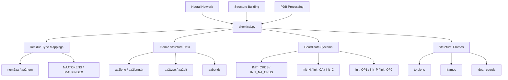
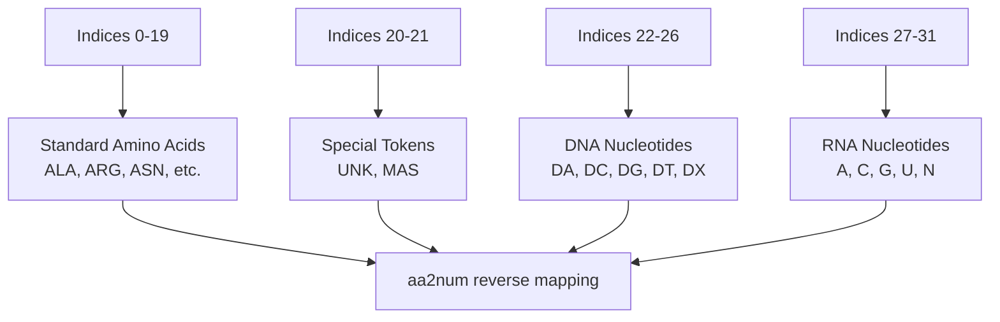
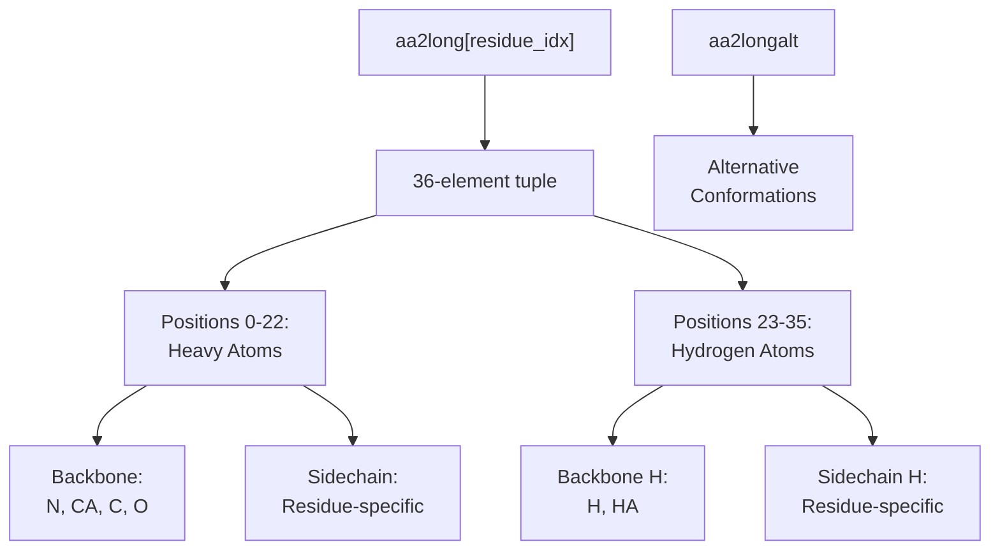
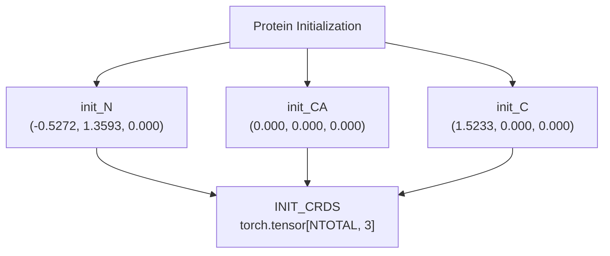
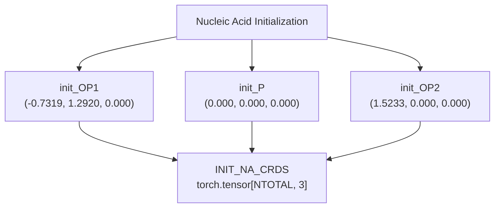
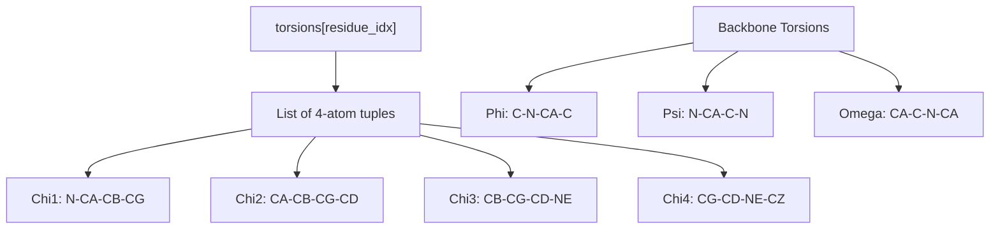
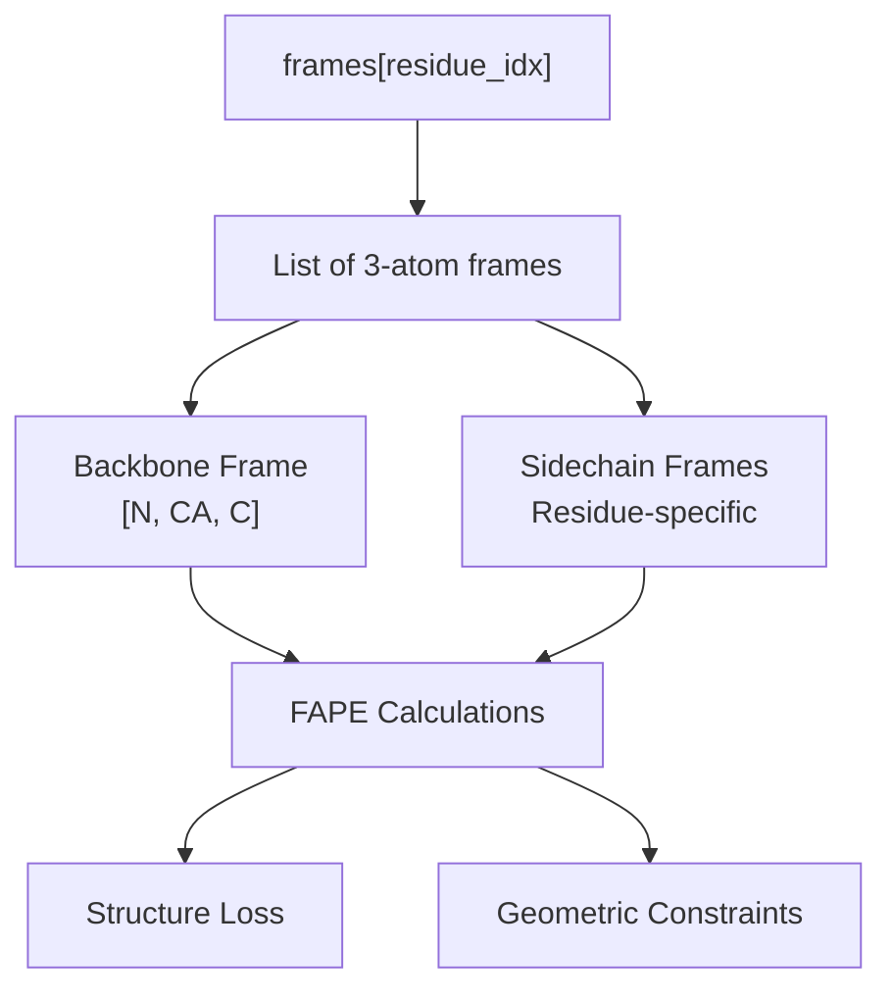
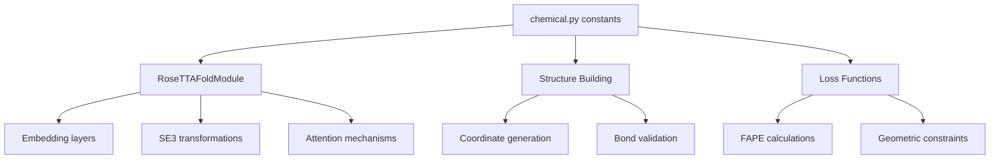

# Chemical Constants and Data Structures

> **Relevant source files**
> * [network/chemical.py](https://github.com/uw-ipd/RoseTTAFold2NA/blob/f761af28/network/chemical.py)

This document covers the chemical constants, molecular data structures, and atomic representations used throughout the RoseTTAFold2NA system for handling protein and nucleic acid structures. These definitions provide the foundational chemical knowledge that enables the neural network to understand and predict molecular structures.

For information about coordinate transformations and geometric calculations, see [Coordinate Systems and Transformations](/uw-ipd/RoseTTAFold2NA/6.2-coordinate-systems-and-transformations). For details about the neural network architecture that uses these chemical constants, see [Core RoseTTAFold Module](/uw-ipd/RoseTTAFold2NA/5.1-core-rosettafold-module).

## System Overview

The chemical constants system provides standardized representations for all molecular components that RoseTTAFold2NA can process, including the 20 standard amino acids, DNA nucleotides (dA, dC, dG, dT), RNA nucleotides (A, C, G, U), and unknown/masked residues.



**Sources:** [network/chemical.py L1-L1050](https://github.com/uw-ipd/RoseTTAFold2NA/blob/f761af28/network/chemical.py#L1-L1050)

## Basic Constants and Token System

The system defines fundamental constants that govern how molecular entities are represented and processed throughout the neural network.

| Constant | Value | Purpose |
| --- | --- | --- |
| `NAATOKENS` | 32 | Total number of residue tokens (20 AA + UNK/MAS + 10 nucleotides) |
| `MASKINDEX` | 21 | Index for protein masking token |
| `NHEAVY` | 23 | Number of heavy (non-hydrogen) atoms per residue |
| `NTOTAL` | 36 | Total atoms including hydrogens |
| `NPROTAAS` | 22 | Number of protein amino acid types (including UNK/MAS) |

The `PDB_CHAIN_IDS` constant provides the standard chain identifier characters used in PDB files:

```
PDB_CHAIN_IDS = "ABCDEFGHIJKLMNOPQRSTUVWXYZabcdefghijklmnopqrstuvwxyz0123456789"
```

**Sources:** [network/chemical.py L4-L24](https://github.com/uw-ipd/RoseTTAFold2NA/blob/f761af28/network/chemical.py#L4-L24)

## Residue Type Mappings

The core mapping system translates between numerical indices and three-letter residue codes, enabling the neural network to process diverse molecular types uniformly.

### Primary Mapping Arrays

The `num2aa` list defines the canonical ordering of all residue types:



The bidirectional mapping enables conversion between numerical representations used by the neural network and chemical identifiers:

| Index Range | Residue Types | Examples |
| --- | --- | --- |
| 0-19 | Standard amino acids | ALA (0), ARG (1), ASN (2) |
| 20-21 | Special tokens | UNK (20), MAS (21) |
| 22-26 | DNA nucleotides | DA (22), DC (23), DG (24), DT (25), DX (26) |
| 27-31 | RNA nucleotides | A (27), C (28), G (29), U (30), N (31) |

**Sources:** [network/chemical.py L6-L16](https://github.com/uw-ipd/RoseTTAFold2NA/blob/f761af28/network/chemical.py#L6-L16)

## Atomic Structure Representations

The system provides detailed atomic-level representations for each residue type, including atom names, connectivity, and chemical properties.

### Full Atom Representations

The `aa2long` array defines the complete atomic structure for each residue type, specifying all heavy atoms and hydrogens in standard PDB nomenclature:



### Chemical Type Classifications

The `aa2type` array assigns chemical types to each atomic position, enabling the neural network to understand chemical properties:

| Chemical Type | Description | Examples |
| --- | --- | --- |
| `Nbb` | Backbone nitrogen | Peptide bond nitrogen |
| `CAbb` | Backbone carbon alpha | Central carbon in amino acids |
| `CObb` | Backbone carbonyl carbon | Peptide bond carbon |
| `OCbb` | Backbone carbonyl oxygen | Peptide bond oxygen |
| `aroC` | Aromatic carbon | Benzene ring carbons |
| `Hpol` | Polar hydrogen | OH, NH hydrogen |
| `Hapo` | Apolar hydrogen | CH hydrogen |

**Sources:** [network/chemical.py L33-L174](https://github.com/uw-ipd/RoseTTAFold2NA/blob/f761af28/network/chemical.py#L33-L174)

### Bond Connectivity

The `aabonds` array defines covalent connectivity for each residue type, specifying which atoms are bonded together. This information is crucial for structure validation and energy calculations.

**Sources:** [network/chemical.py L106-L139](https://github.com/uw-ipd/RoseTTAFold2NA/blob/f761af28/network/chemical.py#L106-L139)

## Coordinate Systems and Initial Structures

The system defines standard coordinate systems and initial configurations for both protein and nucleic acid components.

### Protein Backbone Coordinates



### Nucleic Acid Backbone Coordinates



These initial coordinates provide starting geometries for structure building and serve as reference frames for the neural network's geometric understanding.

**Sources:** [network/chemical.py L248-L261](https://github.com/uw-ipd/RoseTTAFold2NA/blob/f761af28/network/chemical.py#L248-L261)

## Structural Building Blocks

### Torsion Angle Definitions

The `torsions` array defines the rotatable bonds (torsions) for each residue type, which are essential for structure prediction and conformational sampling:



### Frame Definitions for FAPE

The `frames` array defines coordinate frames used for Frame Aligned Point Error (FAPE) calculations, which are crucial for structure prediction accuracy:



**Sources:** [network/chemical.py L264-L334](https://github.com/uw-ipd/RoseTTAFold2NA/blob/f761af28/network/chemical.py#L264-L334)

### Ideal Coordinates Database

The `ideal_coords` array provides reference atomic coordinates for each residue type in ideal conformations. This extensive database contains 1050 lines of precisely defined atomic positions used for structure building and validation.

Each entry specifies:

* Atom name in PDB format
* Frame index for coordinate system
* (x, y, z) coordinates in Ångströms

**Sources:** [network/chemical.py L348-L1050](https://github.com/uw-ipd/RoseTTAFold2NA/blob/f761af28/network/chemical.py#L348-L1050)

## Integration with Neural Network



The chemical constants and data structures serve as the foundational layer that enables RoseTTAFold2NA to understand molecular chemistry and generate accurate structural predictions. These definitions ensure consistency across all components of the system and provide the chemical knowledge necessary for protein-nucleic acid structure prediction.

**Sources:** [network/chemical.py L1-L1050](https://github.com/uw-ipd/RoseTTAFold2NA/blob/f761af28/network/chemical.py#L1-L1050)