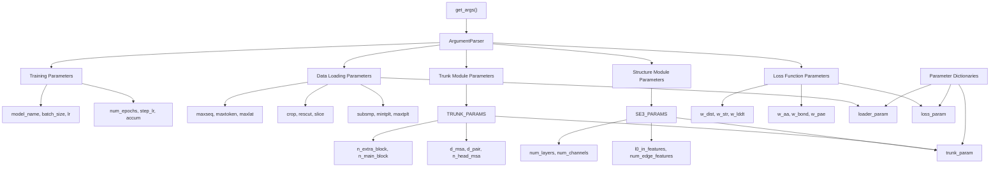
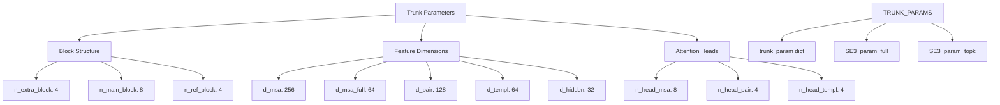
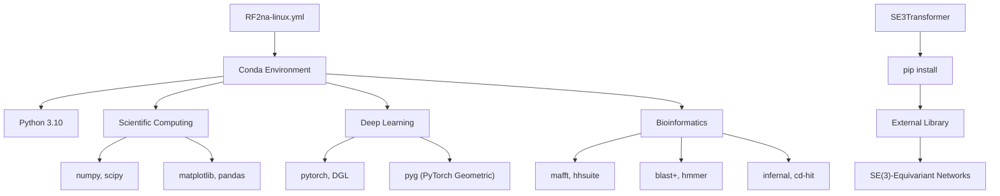
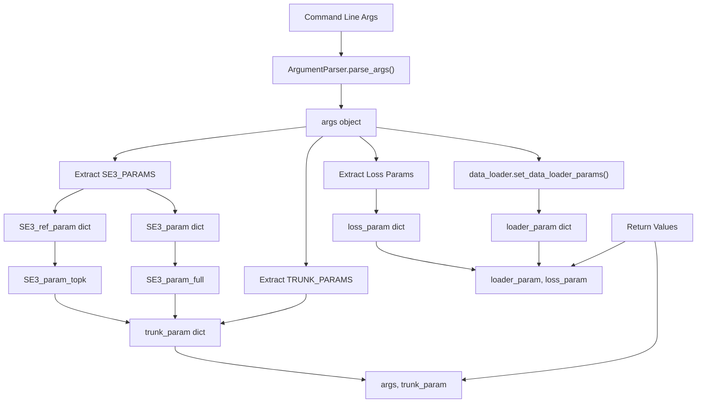

# Configuration and Parameters

> **Relevant source files**
> * [README.md](https://github.com/uw-ipd/RoseTTAFold2NA/blob/f761af28/README.md?plain=1)
> * [network/arguments.py](https://github.com/uw-ipd/RoseTTAFold2NA/blob/f761af28/network/arguments.py)

This document covers the configuration system and parameter management for RoseTTAFold2NA, including command-line arguments for the main prediction pipeline, neural network model parameters, and system configuration options. For information about the neural network architecture itself, see [Neural Network Architecture](/uw-ipd/RoseTTAFold2NA/5-neural-network-architecture). For details about input file formats and preparation, see [Input Preparation System](/uw-ipd/RoseTTAFold2NA/3-input-preparation-system).

## Main Pipeline Configuration

The primary interface for running RoseTTAFold2NA is the `run_RF2NA.sh` script, which accepts command-line arguments to specify the prediction job configuration.

### Command-Line Interface

The basic usage pattern follows this structure:

```
run_RF2NA.sh <output_folder> <input_files...>
```

**Input File Tags**

Input files must be prefixed with type tags to specify the molecular type:

| Tag | Description | Usage |
| --- | --- | --- |
| `P:` | Protein sequence | `P:protein.fa` |
| `R:` | RNA sequence | `R:rna.fa` |
| `D:` | Double-stranded DNA | `D:dna.fa` (auto-generates complement) |
| `S:` | Single-stranded DNA | `S:ssdna.fa` |
| `PR:` | Paired protein/RNA MSA | `PR:complex.fa` |

**Example Usage**

```markdown
# Protein-RNA complex prediction../run_RF2NA.sh rna_pred protein.fa R:RNA.fa # Protein-DNA complex prediction  ../run_RF2NA.sh dna_pred protein.fa D:DNA.fa # Multi-chain complex../run_RF2NA.sh output P:chain1.fa P:chain2.fa R:rna.fa
```

Sources: [README.md L79-L91](https://github.com/uw-ipd/RoseTTAFold2NA/blob/f761af28/README.md?plain=1#L79-L91)

## Neural Network Parameters

The neural network configuration is managed through the argument parsing system in `network/arguments.py`, which organizes parameters into logical groups.

### Parameter Organization



Sources: [network/arguments.py L13-L175](https://github.com/uw-ipd/RoseTTAFold2NA/blob/f761af28/network/arguments.py#L13-L175)

### Training Parameters

Core training configuration options control the learning process and model checkpointing.

| Parameter | Default | Description |
| --- | --- | --- |
| `model_name` | `None` | Model name for saving checkpoints |
| `batch_size` | `1` | Training batch size |
| `lr` | `2.0e-4` | Learning rate |
| `num_epochs` | `300` | Number of training epochs |
| `step_lr` | `300` | Step LR scheduler parameter |
| `accum` | `1` | Gradient accumulation steps |
| `eval` | `False` | Evaluation-only mode flag |

Sources: [network/arguments.py L17-L34](https://github.com/uw-ipd/RoseTTAFold2NA/blob/f761af28/network/arguments.py#L17-L34)

### Data Loading Parameters

These parameters control how input data is processed and sampled during training and prediction.

| Parameter | Default | Description |
| --- | --- | --- |
| `maxseq` | `1024` | Maximum MSA depth for subsampling |
| `maxtoken` | `262144` | Maximum token count (2^18) |
| `maxlat` | `128` | Maximum latent sequence depth |
| `crop` | `260` | Upper limit of crop size |
| `rescut` | `4.5` | Resolution cutoff for structures |
| `slice` | `"DISCONT"` | Cropping strategy (CONT/DISCONT) |
| `subsmp` | `"UNI"` | MSA subsampling method (UNI/LOG/CONST) |
| `mintplt` | `1` | Minimum number of templates |
| `maxtplt` | `4` | Maximum number of templates |
| `seqid` | `150.0` | Template sequence identity cutoff |
| `maxcycle` | `4` | Maximum recycling iterations |

Sources: [network/arguments.py L36-L59](https://github.com/uw-ipd/RoseTTAFold2NA/blob/f761af28/network/arguments.py#L36-L59)

### Trunk Module Architecture Parameters

The trunk module parameters define the core neural network architecture dimensions and attention mechanisms.



**Key Parameters:**

| Parameter | Default | Description |
| --- | --- | --- |
| `n_extra_block` | `4` | Iteration blocks for extra sequences |
| `n_main_block` | `8` | Iteration blocks for main sequences |
| `n_ref_block` | `4` | Number of refinement layers |
| `d_msa` | `256` | MSA feature dimension |
| `d_pair` | `128` | Pair feature dimension |
| `n_head_msa` | `8` | MSA attention heads |
| `p_drop` | `0.15` | Dropout probability |

Sources: [network/arguments.py L60-L87](https://github.com/uw-ipd/RoseTTAFold2NA/blob/f761af28/network/arguments.py#L60-L87)

 [network/arguments.py L5-L7](https://github.com/uw-ipd/RoseTTAFold2NA/blob/f761af28/network/arguments.py#L5-L7)

### SE(3)-Equivariant Structure Parameters

Structure module parameters control the SE(3)-equivariant neural network components used for geometric reasoning.

| Parameter | Default | Description |
| --- | --- | --- |
| `num_layers` | `1` | Number of equivariant layers |
| `num_channels` | `32` | Channel dimension |
| `num_degrees` | `2` | SE(3) representation degrees |
| `l0_in_features` | `64` | Type-0 input features |
| `l0_out_features` | `64` | Type-0 output features |
| `l1_in_features` | `3` | Type-1 input features |
| `l1_out_features` | `2` | Type-1 output features |
| `num_edge_features` | `64` | Edge feature dimension |
| `n_heads` | `4` | SE3-Transformer attention heads |
| `div` | `4` | SE3-Transformer division parameter |

**Refinement Parameters:**

* `ref_num_layers`: `2` - Refinement layers
* `ref_num_channels`: `32` - Refinement channels
* `ref_l0_in_features`: `64` - Refinement input features
* `ref_l0_out_features`: `64` - Refinement output features

Sources: [network/arguments.py L89-L119](https://github.com/uw-ipd/RoseTTAFold2NA/blob/f761af28/network/arguments.py#L89-L119)

 [network/arguments.py L9-L11](https://github.com/uw-ipd/RoseTTAFold2NA/blob/f761af28/network/arguments.py#L9-L11)

### Loss Function Configuration

Loss function weights control the relative importance of different prediction objectives during training.

| Parameter | Default | Description |
| --- | --- | --- |
| `w_dist` | `1.0` | Distance prediction weight |
| `w_str` | `10.0` | Structure prediction weight |
| `w_lddt` | `0.1` | LDDT prediction weight |
| `w_aa` | `3.0` | MSA masked token prediction weight |
| `w_bond` | `0.0` | Bond prediction weight |
| `w_dih` | `0.0` | Dihedral angle weight |
| `w_clash` | `0.0` | Clash penalty weight |
| `w_hb` | `0.0` | Hydrogen bond weight |
| `w_pae` | `0.1` | Predicted aligned error weight |
| `w_bind` | `5.0` | Binding prediction weight |
| `lj_lin` | `0.75` | Lennard-Jones linear inflection |

Sources: [network/arguments.py L120-L144](https://github.com/uw-ipd/RoseTTAFold2NA/blob/f761af28/network/arguments.py#L120-L144)

## Environment Configuration

### Conda Environment Setup

The system dependencies are managed through a conda environment specification file.



**Environment Creation:**

```sql
conda env create -f RF2na-linux.ymlconda activate RF2NAcd SE3Transformerpip install --no-cache-dir -r requirements.txtpython setup.py install
```

Sources: [README.md L17-L30](https://github.com/uw-ipd/RoseTTAFold2NA/blob/f761af28/README.md?plain=1#L17-L30)

### Database Configuration

The system requires several large sequence and structure databases with specific directory structures.

| Database | Size | Purpose | Location |
| --- | --- | --- | --- |
| UniRef30 | 46GB | Protein sequences | `UniRef30_2020_06/` |
| BFD | 272GB | Protein sequences | `bfd/` |
| PDB100 | ~20GB | Structure templates | `pdb100_2021Mar03/` |
| Rfam | 300MB | RNA families | `RNA/Rfam.cm` |
| RNAcentral | 12GB | RNA sequences | `RNA/rnacentral.fasta` |
| nt | 151GB | Nucleotide sequences | `RNA/nt/` |

**Database Setup Process:**

```markdown
# Download and extract databaseswget <database_url>tar xfz <database_archive> -C <target_directory> # Process RNA databasesmakeblastdb -in sequences.fasta -dbtype nucl -out database_namecmpress Rfam.cm  # For Infernal CM files
```

Sources: [README.md L41-L77](https://github.com/uw-ipd/RoseTTAFold2NA/blob/f761af28/README.md?plain=1#L41-L77)

## Parameter Processing Pipeline

The argument processing system transforms command-line arguments into structured parameter dictionaries used throughout the codebase.



**Parameter Dictionary Construction:**

The `get_args()` function constructs specialized parameter dictionaries:

* **trunk_param**: Contains all trunk module parameters plus SE3 configurations
* **loader_param**: Data loading and preprocessing parameters
* **loss_param**: Loss function weights and training objectives
* **SE3_param_full**: Full SE3-Transformer parameters
* **SE3_param_topk**: Refinement SE3-Transformer parameters

Sources: [network/arguments.py L148-L175](https://github.com/uw-ipd/RoseTTAFold2NA/blob/f761af28/network/arguments.py#L148-L175)

## Configuration File Locations

Key configuration files and their purposes:

| File | Purpose | Location |
| --- | --- | --- |
| `RF2na-linux.yml` | Conda environment specification | Repository root |
| `network/weights/` | Pre-trained model weights | Downloaded separately |
| `run_RF2NA.sh` | Main pipeline script | Repository root |
| `network/arguments.py` | Parameter definitions | Neural network module |

The system follows a modular configuration approach where different components have their parameters organized into logical groups, making it easy to modify specific aspects of the model behavior without affecting others.

Sources: [README.md L17-L39](https://github.com/uw-ipd/RoseTTAFold2NA/blob/f761af28/README.md?plain=1#L17-L39)

 [network/arguments.py L1-L176](https://github.com/uw-ipd/RoseTTAFold2NA/blob/f761af28/network/arguments.py#L1-L176)