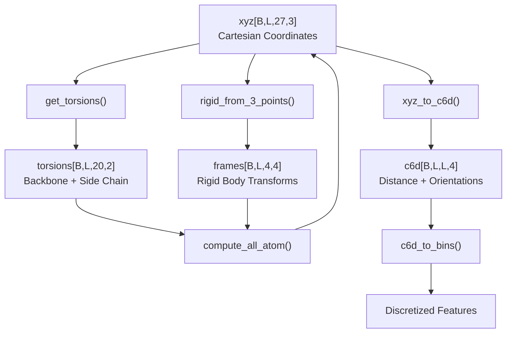
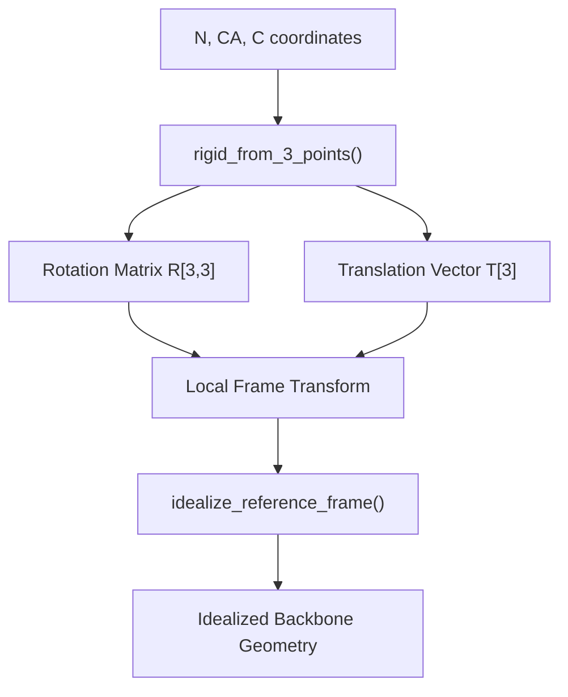
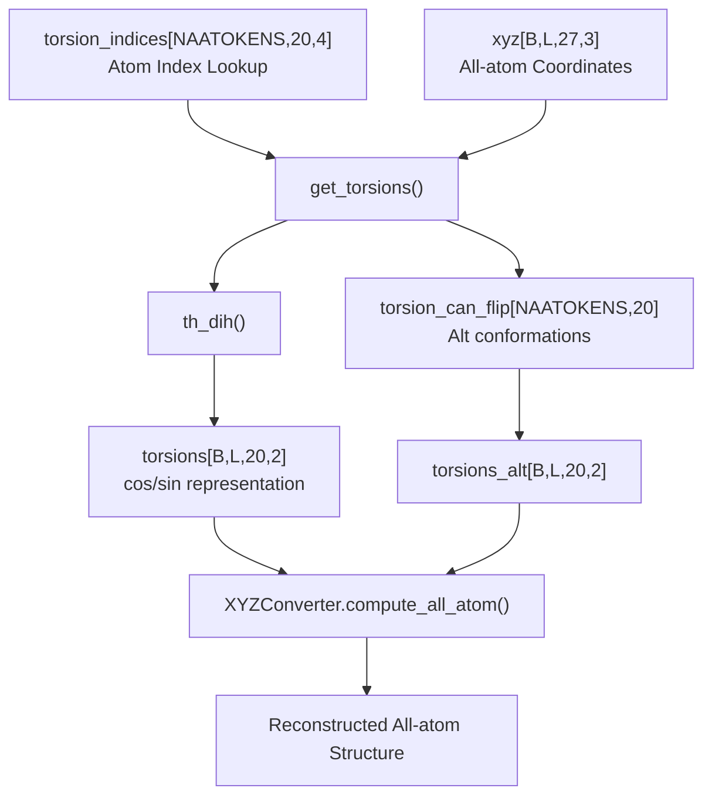
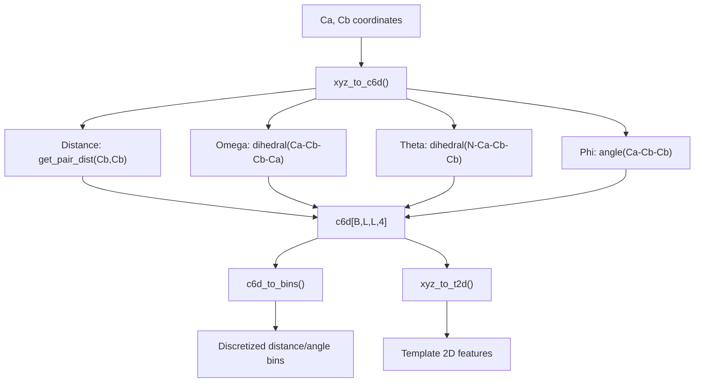
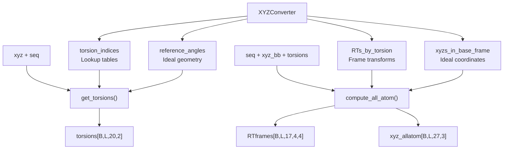

# Coordinate Systems and Transformations

> **Relevant source files**
> * [network/kinematics.py](https://github.com/uw-ipd/RoseTTAFold2NA/blob/f761af28/network/kinematics.py)
> * [network/util.py](https://github.com/uw-ipd/RoseTTAFold2NA/blob/f761af28/network/util.py)
> * [network/util_module.py](https://github.com/uw-ipd/RoseTTAFold2NA/blob/f761af28/network/util_module.py)

This page covers the geometric coordinate systems, transformations, and kinematic calculations used throughout RoseTTAFold2NA. These utilities handle conversion between different coordinate representations, frame construction, torsion angle calculations, and all-atom structure building from backbone coordinates and dihedral angles.

For chemical constants and molecular data structures, see [Chemical Constants and Data Structures](/uw-ipd/RoseTTAFold2NA/6.1-chemical-constants-and-data-structures). For the main neural network architecture that uses these transformations, see [Neural Network Architecture](/uw-ipd/RoseTTAFold2NA/5-neural-network-architecture).

## Coordinate Representations

RoseTTAFold2NA uses several coordinate representations for different purposes:

| Representation | Dimensions | Purpose | Key Functions |
| --- | --- | --- | --- |
| Cartesian XYZ | (B, L, 27, 3) | All-atom coordinates | `writepdb()`, `center_and_realign_missing()` |
| 6D Coordinates | (B, L, L, 4) | Distance + orientations | `xyz_to_c6d()`, `c6d_to_bins()` |
| Torsion Angles | (B, L, 20, 2) | Dihedral angles (cos/sin) | `get_torsions()`, `th_dih()` |
| Rigid Frames | (B, L, 4, 4) | Local coordinate frames | `rigid_from_3_points()` |

**Sources:** [network/util.py L12-L178](https://github.com/uw-ipd/RoseTTAFold2NA/blob/f761af28/network/util.py#L12-L178)

 [network/kinematics.py L84-L224](https://github.com/uw-ipd/RoseTTAFold2NA/blob/f761af28/network/kinematics.py#L84-L224)

 [network/util_module.py L308-L527](https://github.com/uw-ipd/RoseTTAFold2NA/blob/f761af28/network/util_module.py#L308-L527)

## Frame Construction and Rigid Transformations

The system constructs local coordinate frames from backbone atoms using the `rigid_from_3_points()` function, which builds orthonormal frames from N-CA-C atoms.

The frame construction follows this process:

1. **Primary axis** (e1): C-CA vector, normalized
2. **Secondary axis** (e2): N-CA vector, orthogonalized to e1
3. **Tertiary axis** (e3): Cross product e1 × e2
4. **Frame correction**: Adjust to ideal bond angles for protein (-0.3616) or nucleic acid (-0.4929)

Key functions:

* `rigid_from_3_points()` - constructs frames from three points [network/util.py L76-L104](https://github.com/uw-ipd/RoseTTAFold2NA/blob/f761af28/network/util.py#L76-L104)
* `idealize_reference_frame()` - applies ideal geometry corrections [network/util.py L115-L136](https://github.com/uw-ipd/RoseTTAFold2NA/blob/f761af28/network/util.py#L115-L136)
* `center_and_realign_missing()` - handles missing residues [network/util.py L21-L40](https://github.com/uw-ipd/RoseTTAFold2NA/blob/f761af28/network/util.py#L21-L40)

**Sources:** [network/util.py L76-L136](https://github.com/uw-ipd/RoseTTAFold2NA/blob/f761af28/network/util.py#L76-L136)

## Torsion Angle System

The torsion angle system handles 20 different dihedral angles for proteins and nucleic acids:

### Torsion Angle Categories

| Category | Indices | Description | Molecules |
| --- | --- | --- | --- |
| Backbone | 0-2 | omega, phi, psi | Protein |
| Side Chain | 3-6 | chi1-chi4 | Protein |
| Backbone Bends | 7-9 | CB/CG angles | Protein |
| NA Backbone | 10-15 | epsilon, zeta, alpha, beta, gamma, delta | DNA/RNA |
| Sugar Pucker | 16-18 | nu2, nu1, nu0 | DNA/RNA |
| NA Side Chain | 19 | chi1 | DNA/RNA |

Key torsion functions:

* `th_dih()` - calculates dihedral angles [network/util.py L70-L71](https://github.com/uw-ipd/RoseTTAFold2NA/blob/f761af28/network/util.py#L70-L71)
* `th_ang_v()` - calculates planar angles [network/util.py L42-L51](https://github.com/uw-ipd/RoseTTAFold2NA/blob/f761af28/network/util.py#L42-L51)
* `get_torsions()` - extracts all torsion angles [network/util_module.py L462-L527](https://github.com/uw-ipd/RoseTTAFold2NA/blob/f761af28/network/util_module.py#L462-L527)

**Sources:** [network/util.py L242-L306](https://github.com/uw-ipd/RoseTTAFold2NA/blob/f761af28/network/util.py#L242-L306)

 [network/util_module.py L462-L527](https://github.com/uw-ipd/RoseTTAFold2NA/blob/f761af28/network/util_module.py#L462-L527)

## Distance and Orientation Representations

The 6D coordinate system (`c6d`) encodes pairwise residue relationships as distance plus three orientation angles:

The binning parameters are configurable via `PARAMS`:

* `DMIN`: 2.0 Å minimum distance
* `DMAX`: 20.0 Å maximum distance
* `DBINS`: 36 distance bins
* `ABINS`: 36 angle bins

**Sources:** [network/kinematics.py L6-L224](https://github.com/uw-ipd/RoseTTAFold2NA/blob/f761af28/network/kinematics.py#L6-L224)

## XYZConverter System

The `XYZConverter` class is the main interface for coordinate transformations, handling bidirectional conversion between Cartesian coordinates and torsion angles.

### All-Atom Building Process

The `compute_all_atom()` method builds coordinates through a hierarchy of reference frames:

1. **Base frame** (RTF0): From backbone N-CA-C
2. **Backbone frames** (RTF1-3): omega, phi, psi rotations
3. **Side chain frames** (RTF4-7): chi1-chi4 rotations
4. **CB bend frame** (RTF8): CB angular corrections
5. **NA frames** (RTF9-16): nucleic acid backbone and sugar

Each frame applies rotation matrices generated by:

* `make_rotX()` - rotation about X-axis [network/util_module.py L230-L240](https://github.com/uw-ipd/RoseTTAFold2NA/blob/f761af28/network/util_module.py#L230-L240)
* `make_rotZ()` - rotation about Z-axis [network/util_module.py L243-L253](https://github.com/uw-ipd/RoseTTAFold2NA/blob/f761af28/network/util_module.py#L243-L253)
* `make_rot_axis()` - rotation about arbitrary axis [network/util_module.py L256-L277](https://github.com/uw-ipd/RoseTTAFold2NA/blob/f761af28/network/util_module.py#L256-L277)

**Sources:** [network/util_module.py L308-L527](https://github.com/uw-ipd/RoseTTAFold2NA/blob/f761af28/network/util_module.py#L308-L527)

## Utility Functions

Additional coordinate utilities provide supporting functionality:

### Coordinate Manipulation

* `random_rot_trans()` - applies random rotations/translations for data augmentation [network/util.py L12-L19](https://github.com/uw-ipd/RoseTTAFold2NA/blob/f761af28/network/util.py#L12-L19)
* `generate_Cbeta()` - generates virtual Cbeta from N-CA-C [network/util.py L149-L158](https://github.com/uw-ipd/RoseTTAFold2NA/blob/f761af28/network/util.py#L149-L158)
* `get_tips()` - extracts tip atoms for each residue type [network/util.py L160-L177](https://github.com/uw-ipd/RoseTTAFold2NA/blob/f761af28/network/util.py#L160-L177)

### File I/O

* `writepdb()` - writes coordinates to PDB format [network/util.py L181-L221](https://github.com/uw-ipd/RoseTTAFold2NA/blob/f761af28/network/util.py#L181-L221)

### Graph Construction

* `make_topk_graph()` - builds graphs for SE3 networks [network/util_module.py L132-L183](https://github.com/uw-ipd/RoseTTAFold2NA/blob/f761af28/network/util_module.py#L132-L183)
* `make_atom_graph()` - constructs atom-level graphs [network/util_module.py L185-L226](https://github.com/uw-ipd/RoseTTAFold2NA/blob/f761af28/network/util_module.py#L185-L226)

**Sources:** [network/util.py L12-L241](https://github.com/uw-ipd/RoseTTAFold2NA/blob/f761af28/network/util.py#L12-L241)

 [network/util_module.py L108-L226](https://github.com/uw-ipd/RoseTTAFold2NA/blob/f761af28/network/util_module.py#L108-L226)