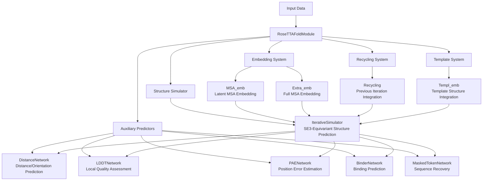
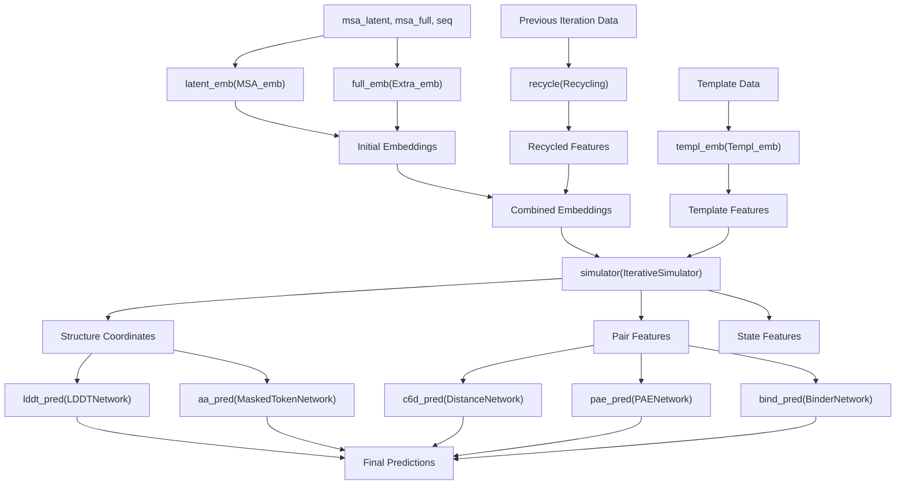
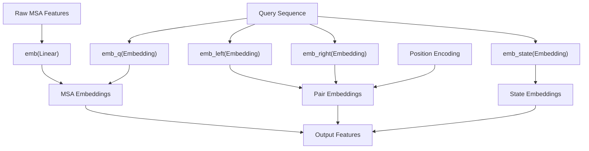
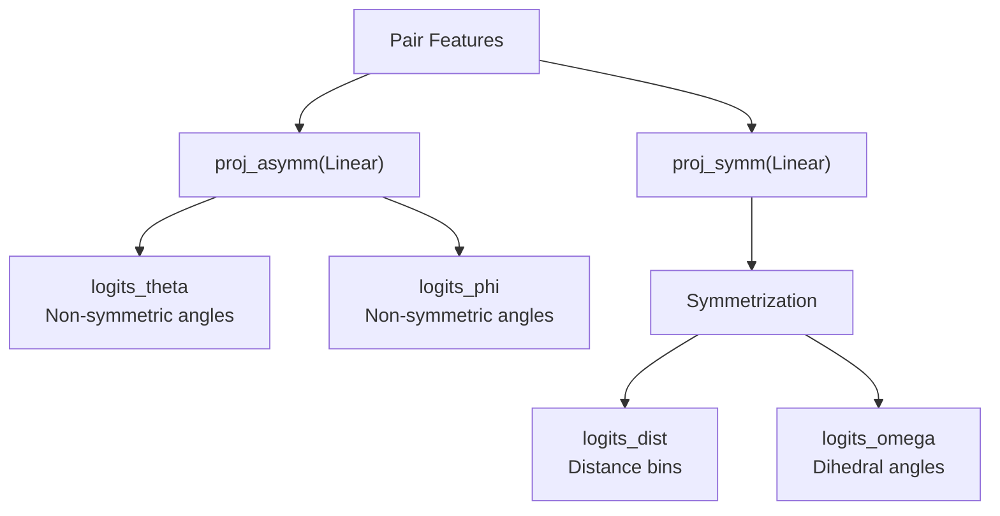

# Core RoseTTAFold Module

> **Relevant source files**
> * [network/AuxiliaryPredictor.py](https://github.com/uw-ipd/RoseTTAFold2NA/blob/f761af28/network/AuxiliaryPredictor.py)
> * [network/Embeddings.py](https://github.com/uw-ipd/RoseTTAFold2NA/blob/f761af28/network/Embeddings.py)
> * [network/RoseTTAFoldModel.py](https://github.com/uw-ipd/RoseTTAFold2NA/blob/f761af28/network/RoseTTAFoldModel.py)

## Purpose and Scope

This document covers the central neural network module of RoseTTAFold2NA, specifically the `RoseTTAFoldModule` class that orchestrates the entire deep learning pipeline. This module integrates input embeddings, iterative structure refinement, and auxiliary prediction networks to generate protein-nucleic acid complex structures.

For information about the SE3-equivariant components used within this module, see [SE(3)-Equivariant Components](/uw-ipd/RoseTTAFold2NA/5.2-se(3)-equivariant-components). For details about the training system and loss functions, see [Training System](/uw-ipd/RoseTTAFold2NA/5.4-training-system).

## Architecture Overview

The `RoseTTAFoldModule` serves as the central coordinator that combines multiple specialized neural network components into a unified prediction pipeline. It follows a multi-stage approach: embedding generation, iterative refinement through recycling, template integration, structure simulation, and auxiliary predictions.

**Sources:** [network/RoseTTAFoldModel.py L10-L114](https://github.com/uw-ipd/RoseTTAFold2NA/blob/f761af28/network/RoseTTAFoldModel.py#L10-L114)

## Core Module Components

### Main RoseTTAFoldModule Class

The `RoseTTAFoldModule` class is the primary neural network that integrates all components:

| Component | Class | Purpose |
| --- | --- | --- |
| Latent MSA Embedding | `MSA_emb` | Processes primary MSA sequences and generates initial embeddings |
| Full MSA Embedding | `Extra_emb` | Handles additional MSA sequences with reduced features |
| Template Embedding | `Templ_emb` | Integrates structural template information |
| Recycling | `Recycling` | Incorporates predictions from previous iterations |
| Structure Simulator | `IterativeSimulator` | Core SE3-equivariant structure prediction engine |
| Auxiliary Predictors | Multiple classes | Generate various quality and geometric predictions |

**Sources:** [network/RoseTTAFoldModel.py L21-L53](https://github.com/uw-ipd/RoseTTAFold2NA/blob/f761af28/network/RoseTTAFoldModel.py#L21-L53)

### Data Flow Through the Module

The forward pass follows a structured pipeline:

**Sources:** [network/RoseTTAFoldModel.py L62-L114](https://github.com/uw-ipd/RoseTTAFold2NA/blob/f761af28/network/RoseTTAFoldModel.py#L62-L114)

## Embedding System

### MSA Embedding (MSA_emb)

The `MSA_emb` class generates initial representations from multiple sequence alignments:

* **Input Processing**: Converts raw MSA features into high-dimensional embeddings
* **Query Integration**: Adds query sequence information to all MSA rows
* **Pair Generation**: Creates pairwise features from sequence embeddings
* **Positional Encoding**: Adds relative position information using `PositionalEncoding2D`

**Sources:** [network/Embeddings.py L32-L82](https://github.com/uw-ipd/RoseTTAFold2NA/blob/f761af28/network/Embeddings.py#L32-L82)

### Template Embedding (Templ_emb)

The `Templ_emb` class integrates structural template information:

* **2D Feature Processing**: Handles distance and orientation features through `TemplatePairStack`
* **1D Feature Processing**: Processes torsion angles and sequence information
* **Attention Integration**: Uses attention mechanisms to blend template and query features
* **RBF Features**: Incorporates radial basis function features from template coordinates

**Sources:** [network/Embeddings.py L136-L233](https://github.com/uw-ipd/RoseTTAFold2NA/blob/f761af28/network/Embeddings.py#L136-L233)

### Recycling System

The `Recycling` class enables iterative refinement by incorporating previous predictions:

| Feature Type | Processing Method | Purpose |
| --- | --- | --- |
| Distance | RBF + Linear projection | Previous coordinate information |
| Torsion Angles | Linear projection | Previous conformational state |
| State Features | Layer normalization | Previous residue-level predictions |

**Sources:** [network/Embeddings.py L236-L283](https://github.com/uw-ipd/RoseTTAFold2NA/blob/f761af28/network/Embeddings.py#L236-L283)

## Auxiliary Prediction Networks

### Distance and Orientation Prediction

The `DistanceNetwork` predicts geometric relationships between residues:

**Sources:** [network/AuxiliaryPredictor.py L5-L35](https://github.com/uw-ipd/RoseTTAFold2NA/blob/f761af28/network/AuxiliaryPredictor.py#L5-L35)

### Quality Assessment Networks

| Network | Class | Output | Purpose |
| --- | --- | --- | --- |
| Local Quality | `LDDTNetwork` | 50 confidence bins | Per-residue structure quality |
| Position Error | `PAENetwork` | 64 error bins | Pairwise position accuracy |
| Binding Prediction | `BinderNetwork` | Binary probability | Interface binding assessment |

**Sources:** [network/AuxiliaryPredictor.py L54-L109](https://github.com/uw-ipd/RoseTTAFold2NA/blob/f761af28/network/AuxiliaryPredictor.py#L54-L109)

### Sequence Recovery Network

The `MaskedTokenNetwork` predicts amino acid identities for masked positions, enabling assessment of sequence-structure compatibility.

**Sources:** [network/AuxiliaryPredictor.py L37-L52](https://github.com/uw-ipd/RoseTTAFold2NA/blob/f761af28/network/AuxiliaryPredictor.py#L37-L52)

## Integration with SE3 Components

The core module interfaces with SE3-equivariant components through the `IterativeSimulator`, which incorporates:

* **SE3_param_full**: Parameters for full attention mechanisms
* **SE3_param_topk**: Parameters for top-k sparse attention
* **Chemical Parameters**: Atom types, bonding information, and force field parameters

The integration ensures that geometric transformations preserve the proper symmetries required for molecular structure prediction.

**Sources:** [network/RoseTTAFoldModel.py L17-L19](https://github.com/uw-ipd/RoseTTAFold2NA/blob/f761af28/network/RoseTTAFoldModel.py#L17-L19)

 [network/RoseTTAFoldModel.py L34-L53](https://github.com/uw-ipd/RoseTTAFold2NA/blob/f761af28/network/RoseTTAFoldModel.py#L34-L53)

## Model Configuration

The module accepts extensive configuration parameters:

| Parameter Category | Key Parameters | Purpose |
| --- | --- | --- |
| Architecture | `n_extra_block`, `n_main_block`, `n_ref_block` | Network depth control |
| Dimensions | `d_msa`, `d_pair`, `d_state` | Feature dimensionality |
| Attention | `n_head_msa`, `n_head_pair` | Multi-head attention configuration |
| Regularization | `p_drop` | Dropout probability |
| Chemistry | `aamask`, `ljlk_parameters` | Chemical force field parameters |

**Sources:** [network/RoseTTAFoldModel.py L11-L20](https://github.com/uw-ipd/RoseTTAFold2NA/blob/f761af28/network/RoseTTAFoldModel.py#L11-L20)