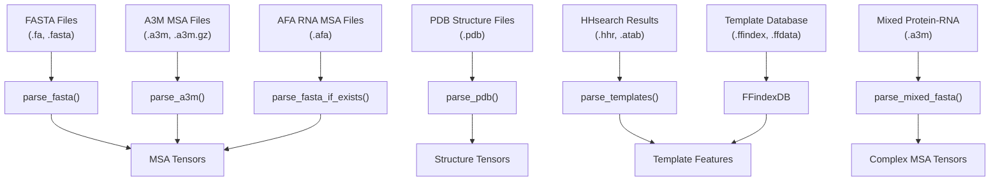
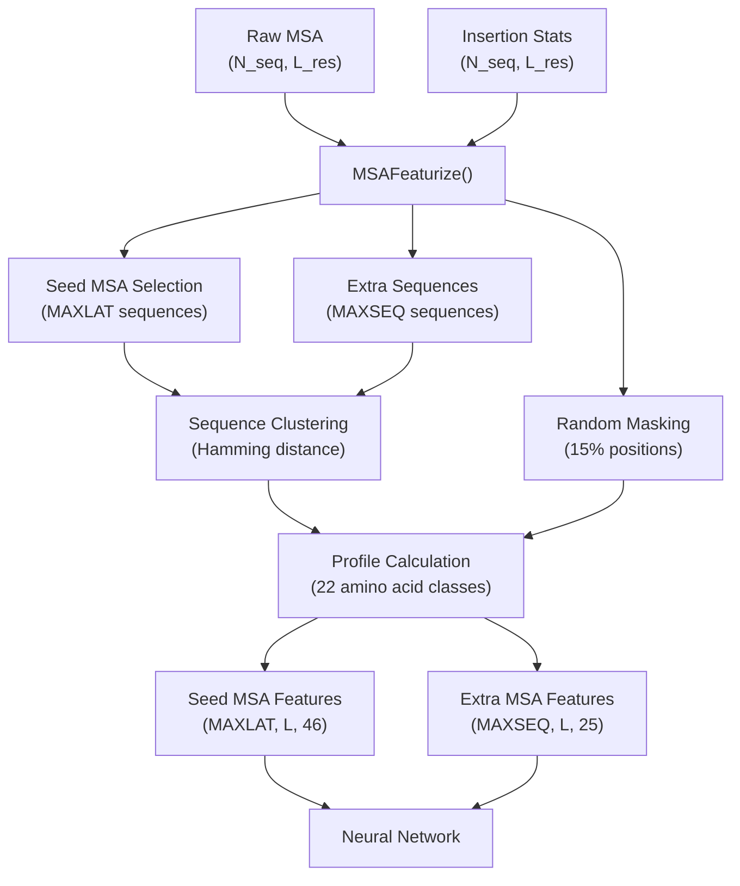
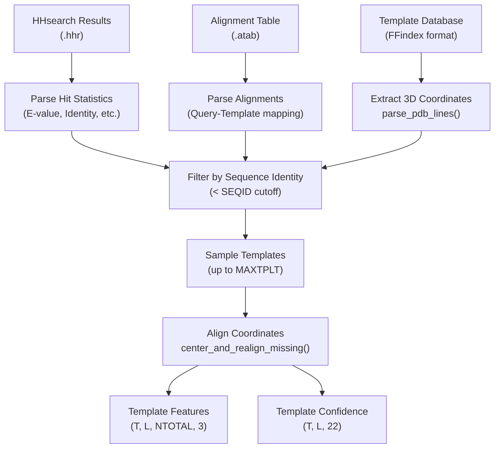
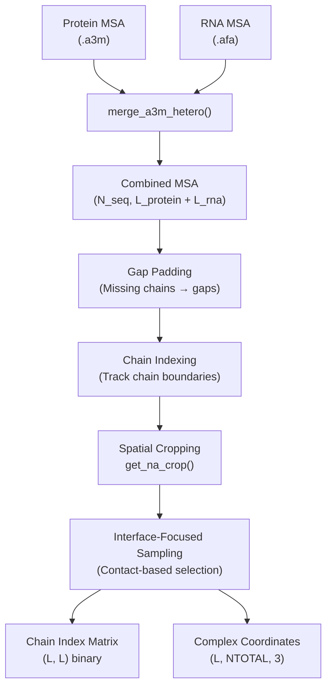
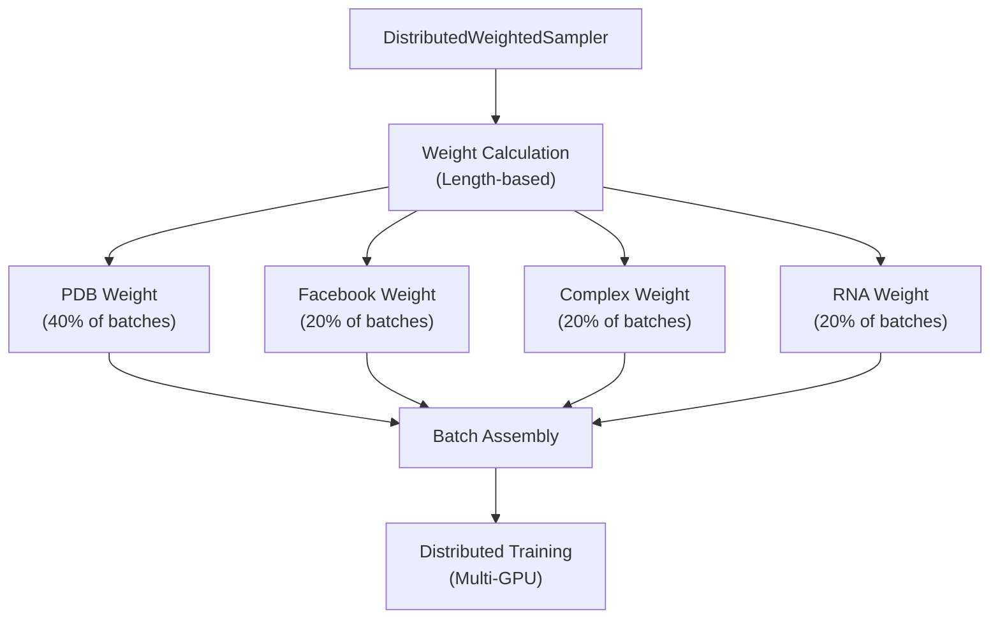
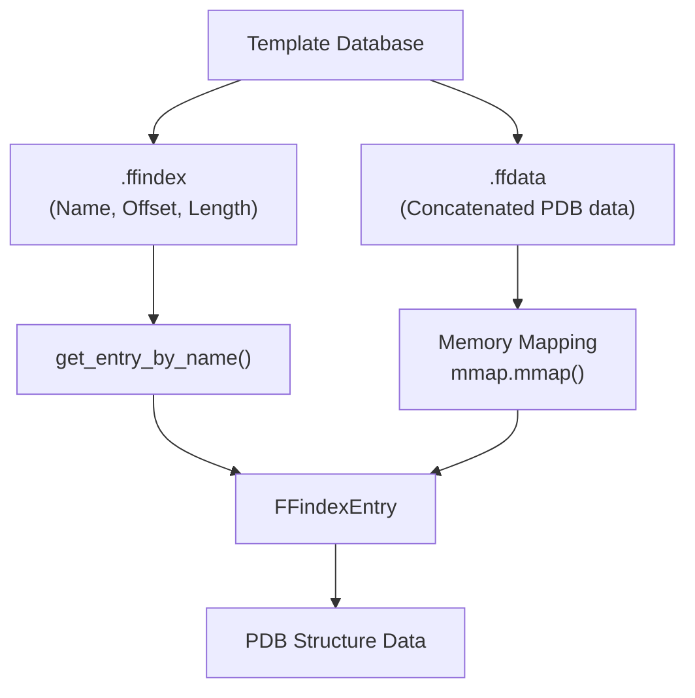
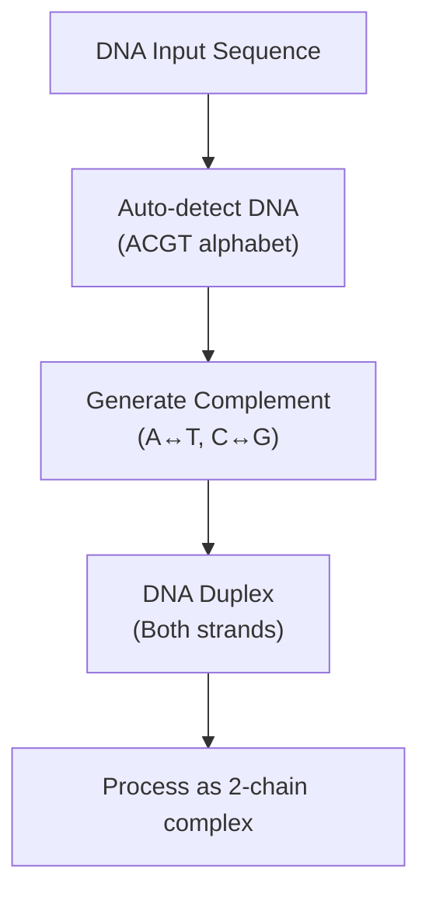

# File Processing and Data Loading

> **Relevant source files**
> * [network/data_loader.py](https://github.com/uw-ipd/RoseTTAFold2NA/blob/f761af28/network/data_loader.py)
> * [network/ffindex.py](https://github.com/uw-ipd/RoseTTAFold2NA/blob/f761af28/network/ffindex.py)
> * [network/parsers.py](https://github.com/uw-ipd/RoseTTAFold2NA/blob/f761af28/network/parsers.py)

This document covers the file processing and data loading components that convert various input file formats into tensor representations suitable for the RoseTTAFold2NA neural network. This includes parsing MSAs, sequences, structures, and template search results, as well as transforming them into feature tensors.

For information about the main pipeline orchestration that calls these components, see [4.1](/uw-ipd/RoseTTAFold2NA/4.1-pipeline-orchestration). For details about the neural network architecture that consumes these processed features, see [5.1](/uw-ipd/RoseTTAFold2NA/5.1-core-rosettafold-module).

## Input File Format Processing

The system processes multiple file formats through specialized parsers that handle the diverse data types required for protein-nucleic acid structure prediction.

### File Format Parser Mapping

**Sources:** [network/parsers.py L71-L123](https://github.com/uw-ipd/RoseTTAFold2NA/blob/f761af28/network/parsers.py#L71-L123)

 [network/parsers.py L225-L298](https://github.com/uw-ipd/RoseTTAFold2NA/blob/f761af28/network/parsers.py#L225-L298)

 [network/parsers.py L125-L193](https://github.com/uw-ipd/RoseTTAFold2NA/blob/f761af28/network/parsers.py#L125-L193)

 [network/parsers.py L303-L330](https://github.com/uw-ipd/RoseTTAFold2NA/blob/f761af28/network/parsers.py#L303-L330)

 [network/parsers.py L389-L460](https://github.com/uw-ipd/RoseTTAFold2NA/blob/f761af28/network/parsers.py#L389-L460)

 [network/ffindex.py L15-L92](https://github.com/uw-ipd/RoseTTAFold2NA/blob/f761af28/network/ffindex.py#L15-L92)

### Sequence and MSA Processing

The system handles multiple sequence types through alphabet-specific processing:

| Input Type | Alphabet | Parser Function | Key Features |
| --- | --- | --- | --- |
| Protein sequences | 20 amino acids + gap | `parse_fasta()` | Standard IUPAC codes |
| RNA sequences | A,C,G,U + gap | `parse_fasta(rna_alphabet=True)` | Handles T→U conversion |
| DNA sequences | A,C,G,T + gap | `parse_fasta(dna_alphabet=True)` | Supports complement generation |
| Mixed complexes | Combined alphabets | `parse_mixed_fasta()` | Protein-RNA pairs with '/' separator |

The parsers convert sequence characters to integer indices using predefined alphabets and handle insertion statistics for gapped alignments.

**Sources:** [network/parsers.py L103-L119](https://github.com/uw-ipd/RoseTTAFold2NA/blob/f761af28/network/parsers.py#L103-L119)

 [network/parsers.py L177-L187](https://github.com/uw-ipd/RoseTTAFold2NA/blob/f761af28/network/parsers.py#L177-L187)

 [network/parsers.py L208-L219](https://github.com/uw-ipd/RoseTTAFold2NA/blob/f761af28/network/parsers.py#L208-L219)

## Data Transformation Pipeline

### MSA Feature Generation

The `MSAFeaturize` function transforms raw MSA data into neural network features through several key steps:

1. **Seed Sequence Selection**: Randomly samples up to `MAXLAT` sequences as the core MSA
2. **Random Masking**: Applies 15% masking with replacement strategies (70% mask token, 10% random, 10% profile-based, 10% unchanged)
3. **Sequence Clustering**: Assigns extra sequences to nearest seed sequences using Hamming distance
4. **Profile Generation**: Computes position-specific amino acid frequencies across clustered sequences

**Sources:** [network/data_loader.py L89-L225](https://github.com/uw-ipd/RoseTTAFold2NA/blob/f761af28/network/data_loader.py#L89-L225)

### Template Feature Processing

Template processing extracts structural information from homologous proteins found by HHsearch:

1. **Hit Parsing**: Extracts statistics and alignments from HHsearch output files
2. **Structure Retrieval**: Loads 3D coordinates from the FFindex template database
3. **Quality Filtering**: Removes templates with sequence identity above specified cutoffs
4. **Coordinate Alignment**: Centers and realigns structures to handle missing atoms

**Sources:** [network/parsers.py L389-L460](https://github.com/uw-ipd/RoseTTAFold2NA/blob/f761af28/network/parsers.py#L389-L460)

 [network/parsers.py L530-L559](https://github.com/uw-ipd/RoseTTAFold2NA/blob/f761af28/network/parsers.py#L530-L559)

 [network/data_loader.py L227-L283](https://github.com/uw-ipd/RoseTTAFold2NA/blob/f761af28/network/data_loader.py#L227-L283)

## Complex Data Processing

### Protein-RNA Complex Assembly

For protein-nucleic acid complexes, the system merges heterogeneous MSAs and handles multiple chain types:

The system handles several complex assembly scenarios:

* **Single protein + RNA**: 2-chain complexes
* **Single protein + RNA duplex**: 3-chain complexes
* **Protein homodimer + RNA duplex**: 4-chain complexes

**Sources:** [network/data_loader.py L812-L834](https://github.com/uw-ipd/RoseTTAFold2NA/blob/f761af28/network/data_loader.py#L812-L834)

 [network/data_loader.py L1190-L1496](https://github.com/uw-ipd/RoseTTAFold2NA/blob/f761af28/network/data_loader.py#L1190-L1496)

 [network/data_loader.py L673-L808](https://github.com/uw-ipd/RoseTTAFold2NA/blob/f761af28/network/data_loader.py#L673-L808)

## Training Data Loading

### Dataset Organization

The training system organizes multiple data types through specialized dataset classes:

| Dataset Class | Data Type | Key Features |
| --- | --- | --- |
| `Dataset` | Single-chain proteins | PDB structures with MSAs |
| `DatasetComplex` | Protein-protein complexes | Interface-focused sampling |
| `DatasetNAComplex` | Protein-nucleic acid | Base-pairing analysis |
| `DatasetRNA` | RNA-only structures | Nucleic acid specific processing |
| `DistilledDataset` | Combined training | Weighted sampling across types |

### Weighted Sampling Strategy

The sampler applies length-based weighting where longer sequences get higher sampling probability, bounded between 256-512 residues for weight calculation.

**Sources:** [network/data_loader.py L1824-L1970](https://github.com/uw-ipd/RoseTTAFold2NA/blob/f761af28/network/data_loader.py#L1824-L1970)

 [network/data_loader.py L510-L545](https://github.com/uw-ipd/RoseTTAFold2NA/blob/f761af28/network/data_loader.py#L510-L545)

## File Format Support

### FFindex Template Database

The system uses FFindex format for efficient template database access:

The FFindex format provides memory-efficient access to large template databases by storing an index of entry positions and memory-mapping the data file.

**Sources:** [network/ffindex.py L18-L51](https://github.com/uw-ipd/RoseTTAFold2NA/blob/f761af28/network/ffindex.py#L18-L51)

 [network/parsers.py L394-L430](https://github.com/uw-ipd/RoseTTAFold2NA/blob/f761af28/network/parsers.py#L394-L430)

### DNA Processing and Complement Generation

For DNA sequences, the system automatically generates complementary strands:

This enables structure prediction for DNA duplexes from single-strand input.

**Sources:** [network/parsers.py L208-L219](https://github.com/uw-ipd/RoseTTAFold2NA/blob/f761af28/network/parsers.py#L208-L219)