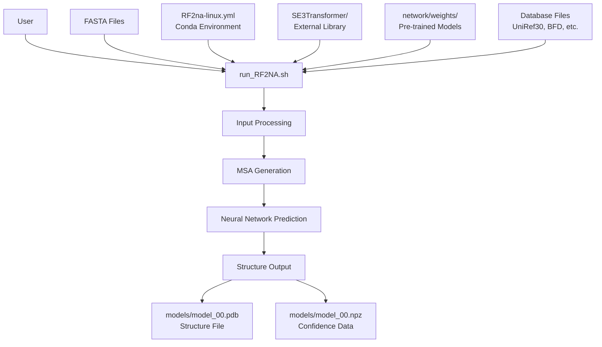
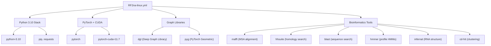
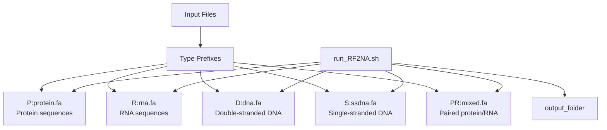
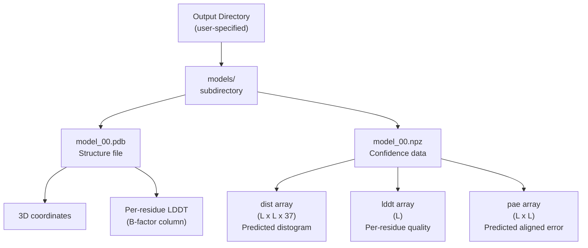

# Getting Started

> **Relevant source files**
> * [README.md](https://github.com/uw-ipd/RoseTTAFold2NA/blob/f761af28/README.md?plain=1)
> * [RF2na-linux.yml](https://github.com/uw-ipd/RoseTTAFold2NA/blob/f761af28/RF2na-linux.yml)
> * [example/dna_binding_protein.fa](https://github.com/uw-ipd/RoseTTAFold2NA/blob/f761af28/example/dna_binding_protein.fa)
> * [example/rna_binding_protein.fa](https://github.com/uw-ipd/RoseTTAFold2NA/blob/f761af28/example/rna_binding_protein.fa)

This page provides an overview of how to install and run RoseTTAFold2NA for protein-nucleic acid complex structure prediction. It covers the essential steps to get the system operational and perform your first predictions.

For detailed installation instructions including database setup, see [Installation and Environment Setup](/uw-ipd/RoseTTAFold2NA/2.1-installation-and-environment-setup). For a complete step-by-step tutorial with example files, see [Quick Start Tutorial](/uw-ipd/RoseTTAFold2NA/2.2-quick-start-tutorial). For comprehensive information about the input preparation pipeline, see [Input Preparation System](/uw-ipd/RoseTTAFold2NA/3-input-preparation-system).

## System Overview

RoseTTAFold2NA predicts the 3D structure of protein-nucleic acid complexes from sequence inputs. The system requires significant computational resources and database downloads (480+ GB total) but provides state-of-the-art structure prediction capabilities.

### Main Entry Point and Workflow



**Main Entry Point Workflow**

Sources: [README.md L80-L100](https://github.com/uw-ipd/RoseTTAFold2NA/blob/f761af28/README.md?plain=1#L80-L100)

 [run_RF2NA.sh](https://github.com/uw-ipd/RoseTTAFold2NA/blob/f761af28/run_RF2NA.sh)

## Installation Requirements

The system requires several components to be installed and configured:

| Component | Size/Requirements | Purpose |
| --- | --- | --- |
| Conda Environment | `RF2na-linux.yml` | Python dependencies and bioinformatics tools |
| SE3Transformer | External library | Geometric deep learning components |
| Pre-trained Weights | 1.1 GB | Neural network model parameters |
| Sequence Databases | 480+ GB total | MSA generation and homology search |
| Structure Templates | Variable | Template-based modeling |

### Key Dependencies from Environment File



**Conda Environment Dependencies**

Sources: [RF2na-linux.yml L1-L24](https://github.com/uw-ipd/RoseTTAFold2NA/blob/f761af28/RF2na-linux.yml#L1-L24)

## Basic Usage Patterns

The main interface is the `run_RF2NA.sh` script, which accepts an output directory and one or more FASTA files with type prefixes.

### Input File Type Specification



**Input Type Specification System**

Sources: [README.md L80-L91](https://github.com/uw-ipd/RoseTTAFold2NA/blob/f761af28/README.md?plain=1#L80-L91)

### Common Usage Examples

Based on the provided examples, typical command patterns include:

```markdown
# Protein-RNA complex predictionrun_RF2NA.sh rna_pred rna_binding_protein.fa R:RNA.fa # Protein-DNA complex prediction  run_RF2NA.sh dna_pred dna_binding_protein.fa D:DNA.fa
```

The system automatically generates complementary DNA strands when using the `D:` prefix, enabling double-stranded DNA modeling from single-strand input.

Sources: [README.md L83-L86](https://github.com/uw-ipd/RoseTTAFold2NA/blob/f761af28/README.md?plain=1#L83-L86)

 [example/rna_binding_protein.fa L1-L3](https://github.com/uw-ipd/RoseTTAFold2NA/blob/f761af28/example/rna_binding_protein.fa#L1-L3)

 [example/dna_binding_protein.fa L1-L3](https://github.com/uw-ipd/RoseTTAFold2NA/blob/f761af28/example/dna_binding_protein.fa#L1-L3)

## Output Structure

### Generated Files and Directory Organization



**Output File Structure**

The outputs provide both structural coordinates and confidence metrics essential for evaluating prediction quality.

Sources: [README.md L92-L100](https://github.com/uw-ipd/RoseTTAFold2NA/blob/f761af28/README.md?plain=1#L92-L100)

## System Requirements Summary

Before proceeding with installation, ensure you have:

* Linux operating system with CUDA-capable GPU
* Sufficient storage space (500+ GB for databases)
* Conda package manager
* Network access for downloading databases and weights

## Next Steps

1. **Complete Installation**: Follow the detailed instructions in [Installation and Environment Setup](/uw-ipd/RoseTTAFold2NA/2.1-installation-and-environment-setup) to set up all dependencies and download required databases.
2. **Run Tutorial**: Work through the [Quick Start Tutorial](/uw-ipd/RoseTTAFold2NA/2.2-quick-start-tutorial) using the provided example files to verify your installation.
3. **Understand Input Preparation**: Learn about the MSA generation pipeline in [Input Preparation System](/uw-ipd/RoseTTAFold2NA/3-input-preparation-system) to optimize your predictions.
4. **Explore Neural Architecture**: For advanced users, see [Neural Network Architecture](/uw-ipd/RoseTTAFold2NA/5-neural-network-architecture) to understand the model's internal components.

The system is designed to be run from the command line with minimal configuration once properly installed. The most time-consuming aspect is typically the initial database download and setup process.

Sources: [README.md L1-L100](https://github.com/uw-ipd/RoseTTAFold2NA/blob/f761af28/README.md?plain=1#L1-L100)

 [RF2na-linux.yml L1-L24](https://github.com/uw-ipd/RoseTTAFold2NA/blob/f761af28/RF2na-linux.yml#L1-L24)