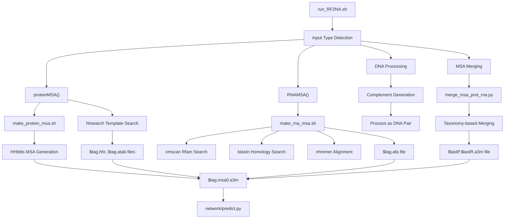
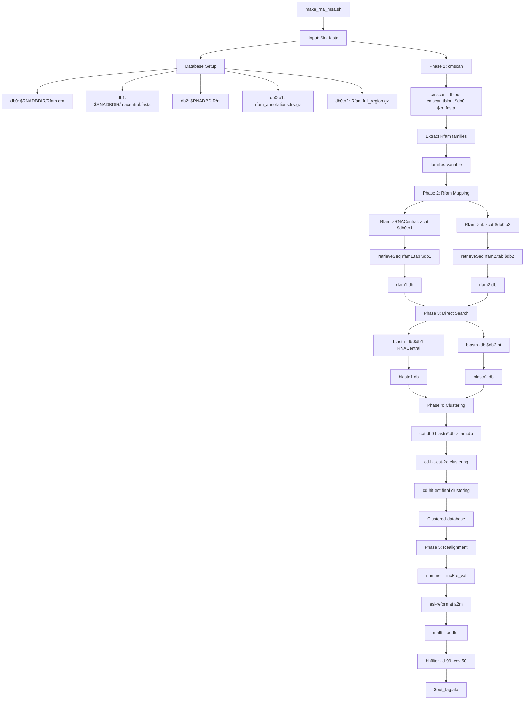
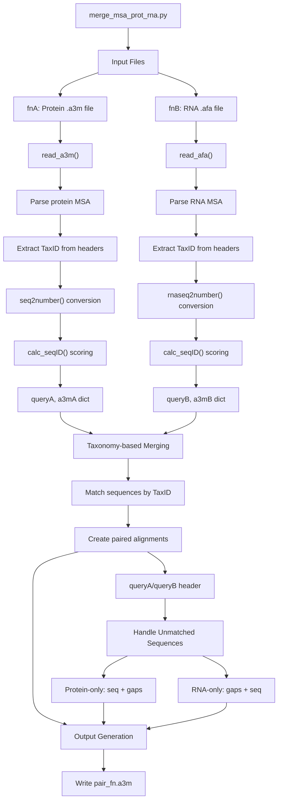

# Input Preparation System

> **Relevant source files**
> * [input_prep/make_rna_msa.sh](https://github.com/uw-ipd/RoseTTAFold2NA/blob/f761af28/input_prep/make_rna_msa.sh)
> * [input_prep/merge_msa_prot_rna.py](https://github.com/uw-ipd/RoseTTAFold2NA/blob/f761af28/input_prep/merge_msa_prot_rna.py)
> * [run_RF2NA.sh](https://github.com/uw-ipd/RoseTTAFold2NA/blob/f761af28/run_RF2NA.sh)

## Purpose and Scope

The Input Preparation System is responsible for converting raw FASTA sequence files into the structured multiple sequence alignments (MSAs) and template information required by the RoseTTAFold2NA neural network. This system handles protein sequences, RNA sequences, DNA sequences, and protein-RNA complexes, generating the necessary MSAs, structural templates, and merged alignments for downstream structure prediction.

For information about the core neural network that processes these prepared inputs, see [Neural Network Architecture](/uw-ipd/RoseTTAFold2NA/5-neural-network-architecture). For details about the main prediction pipeline orchestration, see [Main Prediction Pipeline](/uw-ipd/RoseTTAFold2NA/4-main-prediction-pipeline).

## System Overview

The Input Preparation System consists of three main components that work together to transform raw sequences into prediction-ready data:

### Main Pipeline Orchestration Flow



Sources: [run_RF2NA.sh L1-L134](https://github.com/uw-ipd/RoseTTAFold2NA/blob/f761af28/run_RF2NA.sh#L1-L134)

 [input_prep/make_rna_msa.sh L1-L135](https://github.com/uw-ipd/RoseTTAFold2NA/blob/f761af28/input_prep/make_rna_msa.sh#L1-L135)

 [input_prep/merge_msa_prot_rna.py L1-L246](https://github.com/uw-ipd/RoseTTAFold2NA/blob/f761af28/input_prep/merge_msa_prot_rna.py#L1-L246)

## RNA MSA Generation Pipeline

The RNA MSA generation process implements a sophisticated multi-database search strategy to identify homologous sequences and build comprehensive alignments.

### RNA MSA Generation Workflow



Sources: [input_prep/make_rna_msa.sh L58-L135](https://github.com/uw-ipd/RoseTTAFold2NA/blob/f761af28/input_prep/make_rna_msa.sh#L58-L135)

### Key Parameters and Thresholds

| Parameter | Value | Purpose |
| --- | --- | --- |
| `max_aln_seqs` | 50000 | Maximum sequences per alignment |
| `max_target_seqs` | 50000 | Maximum BLAST targets |
| `max_split_seqs` | 5000 | Batch size for sequence retrieval |
| `max_hhfilter_seqs` | 5000 | Maximum filtered sequences |
| `max_rfam_num` | 100 | Maximum Rfam families |
| `throw_away_sequences` | `$Lch*2/5` | Minimum sequence length threshold |

Sources: [input_prep/make_rna_msa.sh L27-L31](https://github.com/uw-ipd/RoseTTAFold2NA/blob/f761af28/input_prep/make_rna_msa.sh#L27-L31)

 [input_prep/make_rna_msa.sh L97](https://github.com/uw-ipd/RoseTTAFold2NA/blob/f761af28/input_prep/make_rna_msa.sh#L97-L97)

### Database Search Strategy

The RNA MSA pipeline employs a hierarchical search approach:

1. **Structure-based Search**: `cmscan` against Rfam covariance models to identify RNA family membership
2. **Annotation Mapping**: Use Rfam annotations to find related sequences in RNAcentral and nt databases
3. **Homology Search**: Direct `blastn` searches against RNAcentral and nt databases
4. **Redundancy Removal**: `cd-hit-est` clustering at multiple identity thresholds (1.00, 0.99, 0.95, 0.90)
5. **Profile Alignment**: `nhmmer` profile-based realignment with varying E-value thresholds

Sources: [input_prep/make_rna_msa.sh L58-L76](https://github.com/uw-ipd/RoseTTAFold2NA/blob/f761af28/input_prep/make_rna_msa.sh#L58-L76)

 [input_prep/make_rna_msa.sh L83-L93](https://github.com/uw-ipd/RoseTTAFold2NA/blob/f761af28/input_prep/make_rna_msa.sh#L83-L93)

 [input_prep/make_rna_msa.sh L101-L111](https://github.com/uw-ipd/RoseTTAFold2NA/blob/f761af28/input_prep/make_rna_msa.sh#L101-L111)

 [input_prep/make_rna_msa.sh L114-L132](https://github.com/uw-ipd/RoseTTAFold2NA/blob/f761af28/input_prep/make_rna_msa.sh#L114-L132)

## MSA Merging for Protein-RNA Complexes

When predicting protein-RNA complexes, the system must create joint MSAs that preserve evolutionary relationships between protein and RNA components.

### MSA Merging Process



Sources: [input_prep/merge_msa_prot_rna.py L36-L89](https://github.com/uw-ipd/RoseTTAFold2NA/blob/f761af28/input_prep/merge_msa_prot_rna.py#L36-L89)

 [input_prep/merge_msa_prot_rna.py L91-L144](https://github.com/uw-ipd/RoseTTAFold2NA/blob/f761af28/input_prep/merge_msa_prot_rna.py#L91-L144)

 [input_prep/merge_msa_prot_rna.py L146-L233](https://github.com/uw-ipd/RoseTTAFold2NA/blob/f761af28/input_prep/merge_msa_prot_rna.py#L146-L233)

### Sequence Processing Functions

The merging system uses specialized sequence processing functions:

| Function | Purpose | Alphabet |
| --- | --- | --- |
| `seq2number()` | Convert protein sequences to numeric | `ARNDCQEGHILKMFPSTWYV-` |
| `rnaseq2number()` | Convert RNA sequences to numeric | `ACGT-` |
| `calc_seqID()` | Calculate sequence identity score | N/A |
| `remove_lower()` | Remove lowercase insertions | N/A |

Sources: [input_prep/merge_msa_prot_rna.py L14-L34](https://github.com/uw-ipd/RoseTTAFold2NA/blob/f761af28/input_prep/merge_msa_prot_rna.py#L14-L34)

### Taxonomy-based Alignment Strategy

The merging process prioritizes evolutionary relationships by:

1. **TaxID Extraction**: Parse taxonomy IDs from sequence headers using `line.index("TaxID")`
2. **Best Sequence Selection**: For each TaxID with multiple sequences, select the one with highest sequence identity to query
3. **Paired Assembly**: Create joint alignments for sequences sharing the same TaxID
4. **Gap Insertion**: Add gaps for unmatched sequences to maintain alignment structure

Sources: [input_prep/merge_msa_prot_rna.py L53-L59](https://github.com/uw-ipd/RoseTTAFold2NA/blob/f761af28/input_prep/merge_msa_prot_rna.py#L53-L59)

 [input_prep/merge_msa_prot_rna.py L108-L114](https://github.com/uw-ipd/RoseTTAFold2NA/blob/f761af28/input_prep/merge_msa_prot_rna.py#L108-L114)

 [input_prep/merge_msa_prot_rna.py L197-L217](https://github.com/uw-ipd/RoseTTAFold2NA/blob/f761af28/input_prep/merge_msa_prot_rna.py#L197-L217)

## Integration with Main Pipeline

The Input Preparation System integrates seamlessly with the main prediction pipeline through standardized argument strings and file formats:

### Argument String Construction

The `run_RF2NA.sh` script builds argument strings based on input types:

```markdown
# Protein: P:$WDIR/$tag.msa0.a3m:$WDIR/$tag.hhr:$WDIR/$tag.atab# RNA: R:$WDIR/$tag.afa# Protein-RNA complex: PR:$WDIR/$lastP.$lastR.a3m:$WDIR/$lastP.hhr:$WDIR/$lastP.atab
```

Sources: [run_RF2NA.sh L87](https://github.com/uw-ipd/RoseTTAFold2NA/blob/f761af28/run_RF2NA.sh#L87-L87)

 [run_RF2NA.sh L93](https://github.com/uw-ipd/RoseTTAFold2NA/blob/f761af28/run_RF2NA.sh#L93-L93)

 [run_RF2NA.sh L117](https://github.com/uw-ipd/RoseTTAFold2NA/blob/f761af28/run_RF2NA.sh#L117-L117)

### Output File Formats

| File Extension | Content | Generator |
| --- | --- | --- |
| `.a3m` | Protein MSA in A3M format | `make_protein_msa.sh` |
| `.afa` | RNA MSA in AFA format | `make_rna_msa.sh` |
| `.hhr` | HHsearch results | `hhsearch` |
| `.atab` | HHsearch alignment table | `hhsearch` |

Sources: [run_RF2NA.sh L35-L52](https://github.com/uw-ipd/RoseTTAFold2NA/blob/f761af28/run_RF2NA.sh#L35-L52)

 [run_RF2NA.sh L63-L68](https://github.com/uw-ipd/RoseTTAFold2NA/blob/f761af28/run_RF2NA.sh#L63-L68)

The prepared inputs are then passed to `network/predict.py` for structure prediction, completing the end-to-end pipeline from raw sequences to predicted structures.

Sources: [run_RF2NA.sh L127-L131](https://github.com/uw-ipd/RoseTTAFold2NA/blob/f761af28/run_RF2NA.sh#L127-L131)