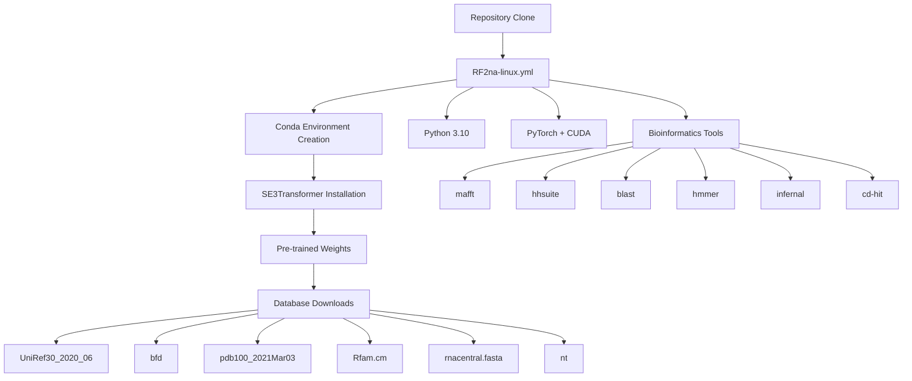
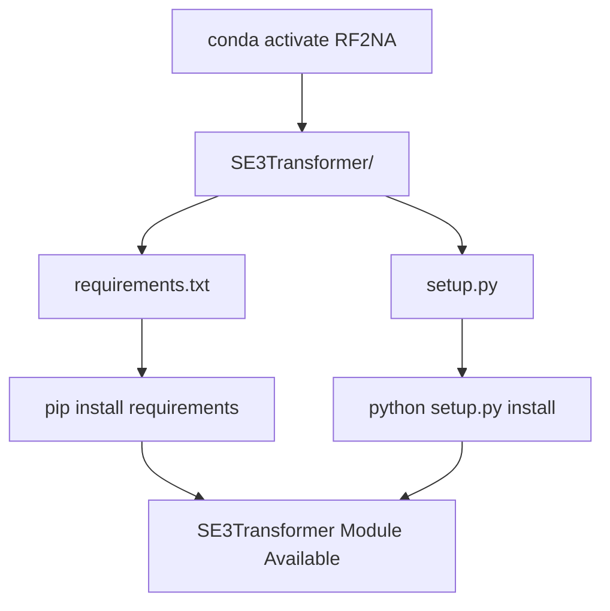
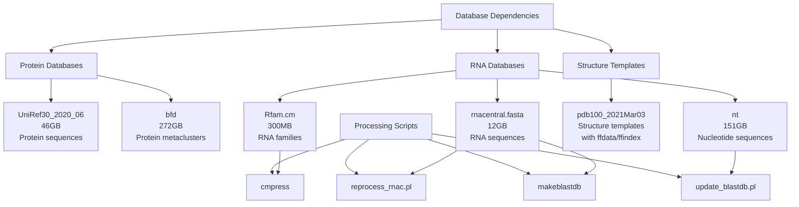

# Installation and Environment Setup

> **Relevant source files**
> * [README.md](https://github.com/uw-ipd/RoseTTAFold2NA/blob/f761af28/README.md?plain=1)
> * [RF2na-linux.yml](https://github.com/uw-ipd/RoseTTAFold2NA/blob/f761af28/RF2na-linux.yml)

This page provides comprehensive instructions for installing RoseTTAFold2NA and setting up its complete runtime environment. This covers dependency installation, database downloads, and environment configuration required before running structure predictions.

For information about running your first prediction after installation, see [Quick Start Tutorial](/uw-ipd/RoseTTAFold2NA/2.2-quick-start-tutorial). For details about the pipeline orchestration system, see [Pipeline Orchestration](/uw-ipd/RoseTTAFold2NA/4.1-pipeline-orchestration).

## Prerequisites

RoseTTAFold2NA requires a Linux system with:

* Conda package manager
* CUDA-compatible GPU with driver support
* Approximately 500GB available disk space for databases
* Internet connection for downloads

## Installation Workflow

### Installation Dependencies Overview



Sources: [README.md L9-L77](https://github.com/uw-ipd/RoseTTAFold2NA/blob/f761af28/README.md?plain=1#L9-L77)

 [RF2na-linux.yml L1-L24](https://github.com/uw-ipd/RoseTTAFold2NA/blob/f761af28/RF2na-linux.yml#L1-L24)

## Step 1: Repository Setup

Clone the repository and navigate to the project directory:

```
git clone https://github.com/uw-ipd/RoseTTAFold2NA.gitcd RoseTTAFold2NA
```

Sources: [README.md L11-L15](https://github.com/uw-ipd/RoseTTAFold2NA/blob/f761af28/README.md?plain=1#L11-L15)

## Step 2: Conda Environment Creation

### Environment Specification

The conda environment is defined in `RF2na-linux.yml` and includes all required dependencies:

| Component Category | Packages | Purpose |
| --- | --- | --- |
| Core Python | `python=3.10`, `pip` | Base runtime |
| Deep Learning | `pytorch`, `pytorch-cuda=11.7`, `dgl`, `pyg` | Neural network frameworks |
| Bioinformatics | `mafft`, `hhsuite`, `blast`, `hmmer>=3.3`, `infernal`, `cd-hit`, `csblast` | Sequence analysis tools |
| Utilities | `requests`, `psutil`, `tqdm` | Supporting libraries |

Create the environment:

```sql
conda env create -f RF2na-linux.yml
```

Sources: [README.md L17-L22](https://github.com/uw-ipd/RoseTTAFold2NA/blob/f761af28/README.md?plain=1#L17-L22)

 [RF2na-linux.yml L1-L24](https://github.com/uw-ipd/RoseTTAFold2NA/blob/f761af28/RF2na-linux.yml#L1-L24)

## Step 3: SE3Transformer Installation

### SE3Transformer Dependency Installation



The SE3Transformer must be installed from the included subdirectory after environment activation:

```
conda activate RF2NAcd SE3Transformerpip install --no-cache-dir -r requirements.txtpython setup.py installcd ..
```

This installs NVIDIA's SE(3)-Transformer library which provides the geometric deep learning components used by the neural network system.

Sources: [README.md L23-L30](https://github.com/uw-ipd/RoseTTAFold2NA/blob/f761af28/README.md?plain=1#L23-L30)

## Step 4: Pre-trained Weights Download

Download the neural network weights to the `network/` directory:

```markdown
cd networkwget https://files.ipd.uw.edu/dimaio/RF2NA_apr23.tgztar xvfz RF2NA_apr23.tgzls weights/ # should contain a 1.1GB weights filecd ..
```

The weights file contains the trained parameters for the RoseTTAFold2NA model, updated in April 2023 for improved homodimer:DNA interactions and DNA sequence recognition.

Sources: [README.md L32-L39](https://github.com/uw-ipd/RoseTTAFold2NA/blob/f761af28/README.md?plain=1#L32-L39)

## Step 5: Database Downloads

### Database Architecture



### Protein Sequence Databases

Download UniRef30 and BFD protein sequence databases:

```markdown
# UniRef30 [46G]wget http://wwwuser.gwdg.de/~compbiol/uniclust/2020_06/UniRef30_2020_06_hhsuite.tar.gzmkdir -p UniRef30_2020_06tar xfz UniRef30_2020_06_hhsuite.tar.gz -C ./UniRef30_2020_06 # BFD [272G]wget https://bfd.mmseqs.com/bfd_metaclust_clu_complete_id30_c90_final_seq.sorted_opt.tar.gzmkdir -p bfdtar xfz bfd_metaclust_clu_complete_id30_c90_final_seq.sorted_opt.tar.gz -C ./bfd
```

### Structure Template Database

Download PDB structure templates with FFindex format:

```
wget https://files.ipd.uw.edu/pub/RoseTTAFold/pdb100_2021Mar03.tar.gztar xfz pdb100_2021Mar03.tar.gz
```

This provides the template structures used by the template search system.

### RNA Sequence Databases

Create RNA database directory and download RNA-specific databases:

```markdown
mkdir -p RNAcd RNA # Rfam RNA families [300M]wget ftp://ftp.ebi.ac.uk/pub/databases/Rfam/CURRENT/Rfam.full_region.gzwget ftp://ftp.ebi.ac.uk/pub/databases/Rfam/CURRENT/Rfam.cm.gzgunzip Rfam.cm.gzcmpress Rfam.cm # RNAcentral sequences [12G]wget ftp://ftp.ebi.ac.uk/pub/databases/RNAcentral/current_release/rfam/rfam_annotations.tsv.gzwget ftp://ftp.ebi.ac.uk/pub/databases/RNAcentral/current_release/id_mapping/id_mapping.tsv.gzwget ftp://ftp.ebi.ac.uk/pub/databases/RNAcentral/current_release/sequences/rnacentral_species_specific_ids.fasta.gz../input_prep/reprocess_rnac.pl id_mapping.tsv.gz rfam_annotations.tsv.gzgunzip -c rnacentral_species_specific_ids.fasta.gz | makeblastdb -in - -dbtype nucl -parse_seqids -out rnacentral.fasta -title "RNACentral" # NCBI nt database [151G]update_blastdb.pl --decompress ntcd ..
```

The `reprocess_rnac.pl` script processes RNAcentral annotations to create search-optimized formats used by the RNA MSA generation pipeline.

Sources: [README.md L41-L77](https://github.com/uw-ipd/RoseTTAFold2NA/blob/f761af28/README.md?plain=1#L41-L77)

## Database Storage Requirements

| Database | Size | Purpose | Used By |
| --- | --- | --- | --- |
| UniRef30_2020_06 | 46GB | Protein homology search | `make_protein_msa.sh` |
| bfd | 272GB | Protein sequence clustering | `make_protein_msa.sh` |
| pdb100_2021Mar03 | ~5GB | Structure templates | Template search |
| Rfam.cm | 300MB | RNA family profiles | `make_rna_msa.sh` |
| rnacentral.fasta | 12GB | RNA sequence homology | `make_rna_msa.sh` |
| nt | 151GB | Nucleotide sequences | `make_rna_msa.sh` |
| **Total** | **~487GB** |  |  |

## Installation Verification

After completing installation, verify the setup:

1. **Environment activation**: `conda activate RF2NA`
2. **Weights presence**: `ls network/weights/` should show model files
3. **Database presence**: Verify all database directories exist with expected sizes
4. **SE3Transformer import**: Test `python -c "import se3_transformer"`

The installation is complete when all components are available and the example predictions can be executed as described in [Quick Start Tutorial](/uw-ipd/RoseTTAFold2NA/2.2-quick-start-tutorial).

Sources: [README.md L79-L100](https://github.com/uw-ipd/RoseTTAFold2NA/blob/f761af28/README.md?plain=1#L79-L100)