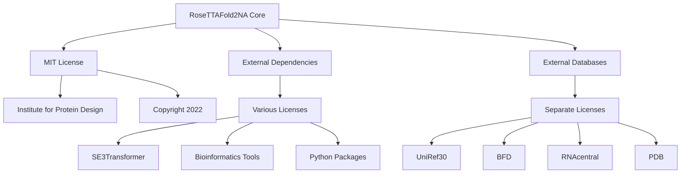
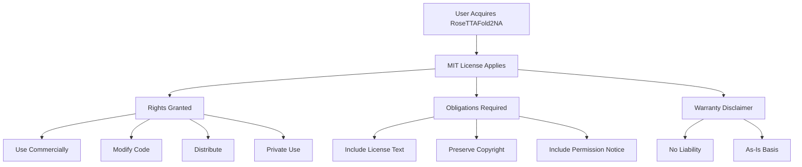
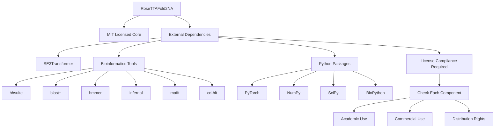

# License and Legal

> **Relevant source files**
> * [LICENSE](https://github.com/uw-ipd/RoseTTAFold2NA/blob/f761af28/LICENSE)

This document covers the licensing terms and legal considerations for the RoseTTAFold2NA software package. It outlines usage rights, attribution requirements, and licensing considerations for external dependencies and databases.

For technical configuration and setup information, see [Installation and Environment Setup](/uw-ipd/RoseTTAFold2NA/2.1-installation-and-environment-setup). For information about external databases and their requirements, see [Getting Started](/uw-ipd/RoseTTAFold2NA/2-getting-started).

## Software License

RoseTTAFold2NA is distributed under the MIT License, one of the most permissive open source licenses available. The software is copyright 2022 by the Institute for Protein Design.

### MIT License Terms

The MIT License grants broad permissions for use, modification, and distribution:

| Permission | Allowed |
| --- | --- |
| Commercial use | ✓ Yes |
| Modification | ✓ Yes |
| Distribution | ✓ Yes |
| Private use | ✓ Yes |
| Patent use | ⚠️ Not explicitly granted |

### License Requirements

The MIT License has minimal requirements:

| Requirement | Description |
| --- | --- |
| License inclusion | Must include the original license text in all copies |
| Copyright notice | Must preserve copyright notice in all copies |
| Attribution | Must credit the Institute for Protein Design |

The complete license text requires that the copyright notice and permission notice be included in all copies or substantial portions of the software.

**License Structure:**

Sources: [LICENSE L1-L22](https://github.com/uw-ipd/RoseTTAFold2NA/blob/f761af28/LICENSE#L1-L22)

## Usage Rights and Obligations

### Permitted Uses

Under the MIT License, you may:

* Use RoseTTAFold2NA for any purpose, including commercial applications
* Modify the source code to suit your needs
* Distribute original or modified versions
* Incorporate the code into proprietary software
* Use the software without paying licensing fees

### Attribution Requirements

When using RoseTTAFold2NA, you must:

1. **Include the license text**: The full MIT License text from [LICENSE L1-L22](https://github.com/uw-ipd/RoseTTAFold2NA/blob/f761af28/LICENSE#L1-L22)  must be included in any distribution
2. **Preserve copyright notice**: The copyright notice "Copyright (c) 2022 Institute for Protein Design" must be maintained
3. **Include permission notice**: The entire permission statement must be preserved

### Disclaimer of Warranty

The MIT License includes important limitations:

> THE SOFTWARE IS PROVIDED "AS IS", WITHOUT WARRANTY OF ANY KIND, EXPRESS OR IMPLIED

This means:

* No warranty of functionality or fitness for purpose
* No liability for damages arising from use
* Users assume all risks associated with the software

**Rights and Obligations Flow:**

Sources: [LICENSE L5-L21](https://github.com/uw-ipd/RoseTTAFold2NA/blob/f761af28/LICENSE#L5-L21)

## External Dependencies

RoseTTAFold2NA depends on numerous external components, each with their own licensing terms that users must consider.

### SE3Transformer Library

The system integrates with NVIDIA's SE3Transformer library for geometric deep learning functionality. Users must comply with the SE3Transformer license terms separately from the RoseTTAFold2NA MIT License.

### Bioinformatics Tools

The pipeline requires several bioinformatics tools, each with distinct licenses:

| Tool | Purpose | License Consideration |
| --- | --- | --- |
| `hhsuite` | Protein homology search | Check HH-suite license |
| `blast+` | Sequence similarity search | NCBI/NIH license |
| `hmmer` | Profile HMM search | Academic/commercial licensing |
| `infernal` | RNA structure search | Check Infernal license |
| `mafft` | Multiple sequence alignment | BSD-style license |
| `cd-hit` | Sequence clustering | Academic use license |

### Python Package Dependencies

The conda environment specified in `RF2na-linux.yml` includes numerous Python packages, each governed by their respective licenses (typically BSD, MIT, or Apache 2.0).

**Dependency License Hierarchy:**

Sources: [RF2na-linux.yml](https://github.com/uw-ipd/RoseTTAFold2NA/blob/f761af28/RF2na-linux.yml)

 (referenced in system architecture)

## Database Licensing

RoseTTAFold2NA requires access to large sequence and structure databases, each with specific usage terms.

### Sequence Databases

| Database | Size | Usage Terms |
| --- | --- | --- |
| UniRef30 | 46GB | Academic and commercial use allowed |
| BFD | 272GB | Check specific license terms |
| RNAcentral | 12GB | Open data, specific attribution required |
| nt (NCBI) | 151GB | NCBI terms apply |
| Rfam | 300MB | Creative Commons license |

### Structure Databases

| Database | Content | License Considerations |
| --- | --- | --- |
| PDB100 | Structure templates | PDB usage policy applies |
| PDB | Protein structures | Open access with attribution |

### Database Usage Obligations

When using RoseTTAFold2NA with these databases, users must:

1. **Respect database licenses**: Each database has specific terms that may restrict commercial use or require attribution
2. **Check redistribution rights**: Some databases prohibit redistribution or require separate licensing for redistribution
3. **Comply with update requirements**: Some databases require users to use current versions or acknowledge update frequencies

## Legal Recommendations

### For Academic Use

Academic users should:

* Verify institutional compliance with all dependency licenses
* Ensure proper attribution in publications
* Check for any restrictions on computational resource usage

### For Commercial Use

Commercial users should:

* Conduct thorough license review of all dependencies
* Obtain appropriate licenses for restricted bioinformatics tools
* Verify database usage rights for commercial applications
* Consider consulting legal counsel for complex licensing scenarios

### Distribution and Modification

When distributing modified versions:

* Include the original MIT License with your modifications
* Clearly document changes made to the original code
* Ensure all dependency licenses are properly handled
* Provide appropriate attribution to the Institute for Protein Design

Sources: [LICENSE L1-L22](https://github.com/uw-ipd/RoseTTAFold2NA/blob/f761af28/LICENSE#L1-L22)