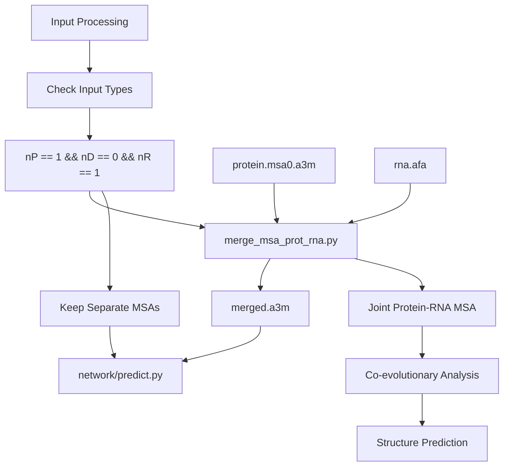
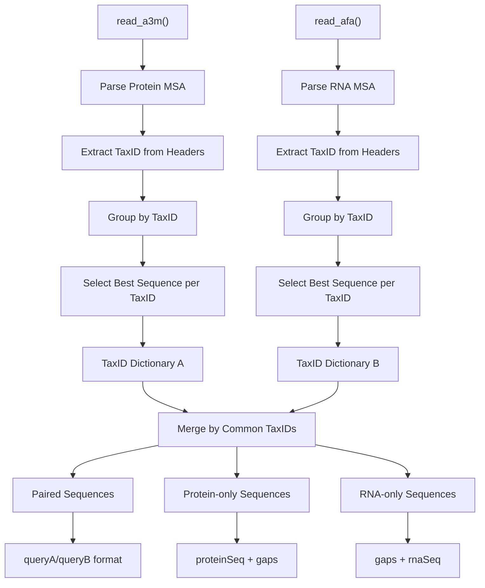
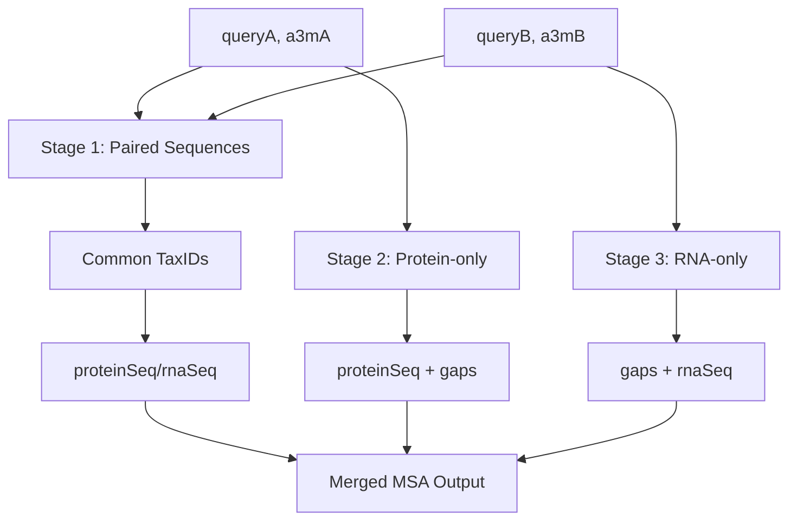

# MSA Merging for Protein-RNA Complexes

> **Relevant source files**
> * [input_prep/merge_msa_prot_rna.py](https://github.com/uw-ipd/RoseTTAFold2NA/blob/f761af28/input_prep/merge_msa_prot_rna.py)
> * [run_RF2NA.sh](https://github.com/uw-ipd/RoseTTAFold2NA/blob/f761af28/run_RF2NA.sh)

This document covers the process of combining protein and RNA multiple sequence alignments (MSAs) when predicting heteromeric protein-RNA complex structures. The merging process creates paired MSAs where homologous sequences from the same organism are aligned together, enabling the neural network to learn co-evolutionary patterns between interacting protein and RNA sequences.

For information about generating individual protein MSAs, see [Protein Processing and Template Search](/uw-ipd/RoseTTAFold2NA/3.2-protein-processing-and-template-search). For RNA MSA generation, see [RNA MSA Generation Pipeline](/uw-ipd/RoseTTAFold2NA/3.1-rna-msa-generation-pipeline).

## Pipeline Integration

MSA merging occurs automatically in the main pipeline when specific input conditions are met. The process is triggered when exactly one protein sequence and one RNA sequence are provided as inputs.



**MSA Merging Pipeline Workflow**

The merging logic is implemented in the main pipeline orchestrator at [run_RF2NA.sh L112-L118](https://github.com/uw-ipd/RoseTTAFold2NA/blob/f761af28/run_RF2NA.sh#L112-L118)

 which checks input counts and conditionally invokes the merging script.

Sources: [run_RF2NA.sh L112-L118](https://github.com/uw-ipd/RoseTTAFold2NA/blob/f761af28/run_RF2NA.sh#L112-L118)

## Merging Trigger Conditions

| Condition | Variable | Value | Description |
| --- | --- | --- | --- |
| Protein count | `nP` | 1 | Exactly one protein sequence |
| DNA count | `nD` | 0 | No DNA sequences |
| RNA count | `nR` | 1 | Exactly one RNA sequence |

When these conditions are met, the pipeline executes:

```
$PIPEDIR/input_prep/merge_msa_prot_rna.py $WDIR/$lastP.msa0.a3m $WDIR/$lastR.afa $WDIR/$lastP.$lastR.a3m
```

The merged MSA then replaces the individual MSAs in the argument string passed to the neural network.

Sources: [run_RF2NA.sh L112-L118](https://github.com/uw-ipd/RoseTTAFold2NA/blob/f761af28/run_RF2NA.sh#L112-L118)

## Input File Formats

The merging process accepts two distinct MSA file formats:

### Protein MSA Format (A3M)

* **File extension**: `.a3m`
* **Generated by**: `make_protein_msa.sh`
* **Content**: HHblits-generated protein MSA with taxonomic annotations
* **Header format**: Contains `TaxID=<id>` annotations

### RNA MSA Format (AFA)

* **File extension**: `.afa`
* **Generated by**: `make_rna_msa.sh`
* **Content**: RNA alignment from cmscan/blastn searches
* **Header format**: Contains `TaxID=<id>` annotations with possible `/` separators

Sources: [input_prep/merge_msa_prot_rna.py L36-L144](https://github.com/uw-ipd/RoseTTAFold2NA/blob/f761af28/input_prep/merge_msa_prot_rna.py#L36-L144)

## Taxonomic ID Matching Algorithm

The core merging algorithm operates by matching sequences based on taxonomic identifiers, ensuring that protein and RNA sequences from the same organism are paired together.



**Taxonomic ID Matching Process**

### Sequence Selection Strategy

For each taxonomic ID with multiple sequences, the algorithm selects the sequence with highest identity to the query sequence using the `calc_seqID()` function at [input_prep/merge_msa_prot_rna.py L32-L34](https://github.com/uw-ipd/RoseTTAFold2NA/blob/f761af28/input_prep/merge_msa_prot_rna.py#L32-L34)

| Alphabet | Encoding Function | Range |
| --- | --- | --- |
| Protein | `seq2number()` | 0-20 (21 states) |
| RNA | `rnaseq2number()` | 0-4 (5 states) |

Sources: [input_prep/merge_msa_prot_rna.py L14-L34](https://github.com/uw-ipd/RoseTTAFold2NA/blob/f761af28/input_prep/merge_msa_prot_rna.py#L14-L34)

 [input_prep/merge_msa_prot_rna.py L73-L87](https://github.com/uw-ipd/RoseTTAFold2NA/blob/f761af28/input_prep/merge_msa_prot_rna.py#L73-L87)

 [input_prep/merge_msa_prot_rna.py L128-L142](https://github.com/uw-ipd/RoseTTAFold2NA/blob/f761af28/input_prep/merge_msa_prot_rna.py#L128-L142)

## Merging Process Implementation

The `main()` function implements the three-stage merging process:



**Three-Stage Merging Process**

### Stage 1: Paired Sequences

For taxonomic IDs present in both MSAs:

```
wrt += ">%s %s\n"%(a3mA[taxA][0], a3mB[taxA][0])wrt += "%s/%s\n"%(remove_lower(a3mA[taxA][1]), remove_lower(a3mB[taxA][1]))
```

### Stage 2: Protein-only Sequences

For taxonomic IDs only in protein MSA:

```
wrt2 += ">%s %s\n"%(a3mA[taxA][0], 'singlerep')wrt2 += "%s%s\n"%(remove_lower(a3mA[taxA][1]), '-'*len(queryB))
```

### Stage 3: RNA-only Sequences

For taxonomic IDs only in RNA MSA:

```
wrt2 += ">%s %s\n"%(a3mB[taxB][0], 'singlerep') wrt2 += "%s%s\n"%('-'*len(queryA), remove_lower(a3mB[taxB][1]))
```

Sources: [input_prep/merge_msa_prot_rna.py L197-L217](https://github.com/uw-ipd/RoseTTAFold2NA/blob/f761af28/input_prep/merge_msa_prot_rna.py#L197-L217)

## Output Format

The merged MSA follows the A3M format with a specific structure:

### Query Sequence

```
>query
PROTEINSEQUENCE/RNASEQUENCE
```

### Homologous Sequences

```
>proteinSeqID rnaSeqID
ALIGNEDPROTEIN/ALIGNEDRNA

>proteinSeqID singlerep  
ALIGNEDPROTEIN/----------

>rnaSeqID singlerep
----------/ALIGNEDRNA
```

The `/` separator distinguishes protein and RNA portions within each sequence line. Gap characters (`-`) pad sequences when only one component is available for a given taxonomic ID.

The output file path follows the pattern: `$WDIR/$lastP.$lastR.a3m`, combining the protein and RNA input file base names.

Sources: [input_prep/merge_msa_prot_rna.py L188-L221](https://github.com/uw-ipd/RoseTTAFold2NA/blob/f761af28/input_prep/merge_msa_prot_rna.py#L188-L221)

 [run_RF2NA.sh L115-L117](https://github.com/uw-ipd/RoseTTAFold2NA/blob/f761af28/run_RF2NA.sh#L115-L117)

## Integration with Prediction Pipeline

The merged MSA is passed to the neural network using the `PR:` input type designation:

```
argstring="PR:$WDIR/$lastP.$lastR.a3m:$WDIR/$lastP.hhr:$WDIR/$lastP.atab"
```

This tells the prediction engine to process the file as a joint protein-RNA MSA rather than separate protein and RNA inputs, enabling the model to leverage co-evolutionary information for improved complex structure prediction.

Sources: [run_RF2NA.sh L117](https://github.com/uw-ipd/RoseTTAFold2NA/blob/f761af28/run_RF2NA.sh#L117-L117)