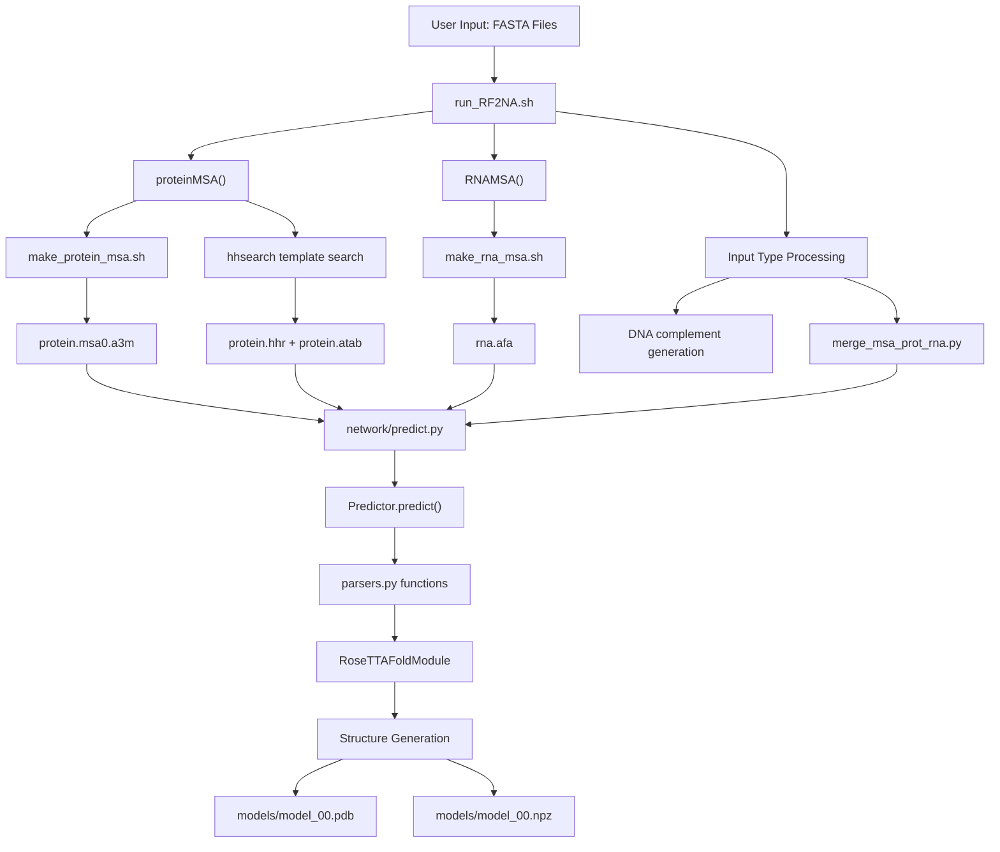
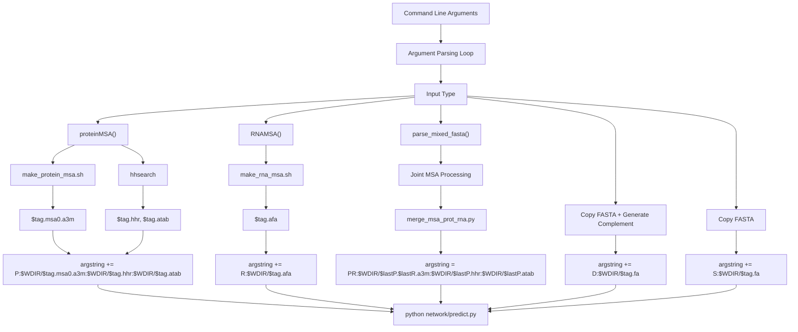
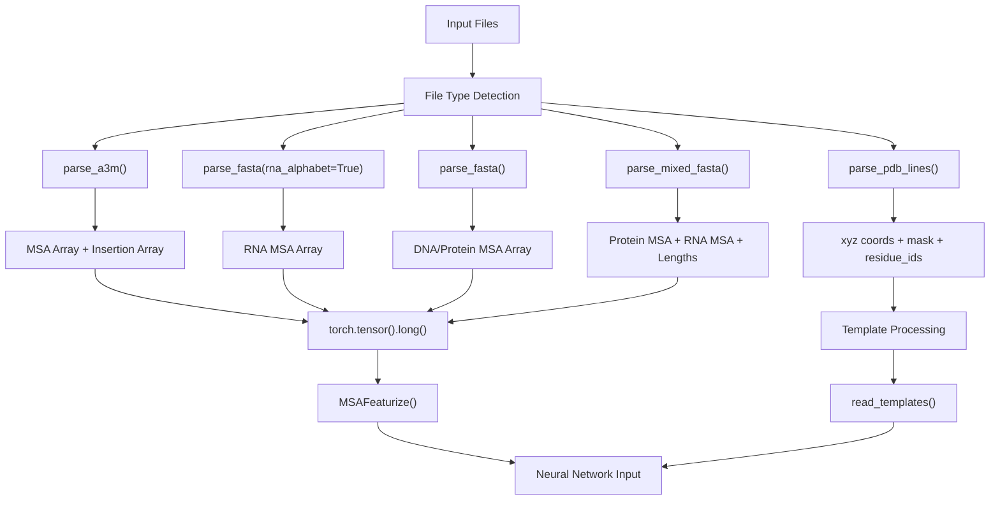
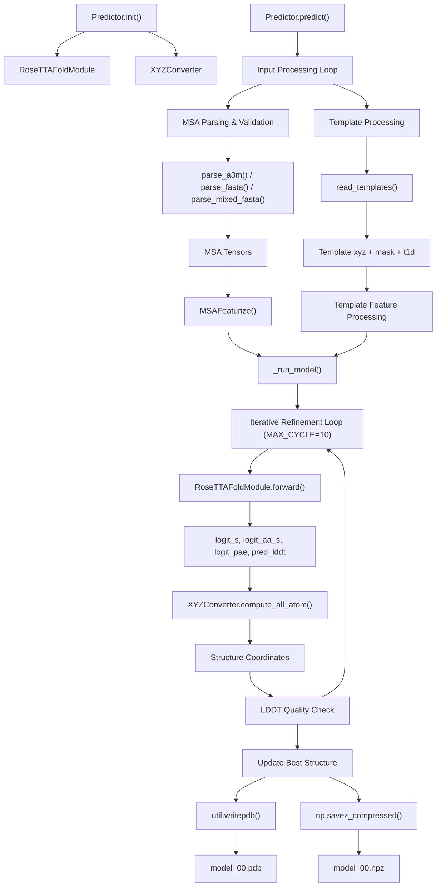
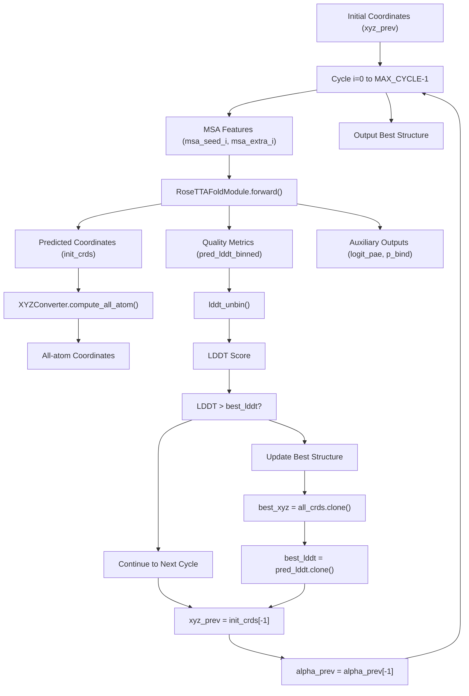

# Main Prediction Pipeline

> **Relevant source files**
> * [network/parsers.py](https://github.com/uw-ipd/RoseTTAFold2NA/blob/f761af28/network/parsers.py)
> * [network/predict.py](https://github.com/uw-ipd/RoseTTAFold2NA/blob/f761af28/network/predict.py)
> * [run_RF2NA.sh](https://github.com/uw-ipd/RoseTTAFold2NA/blob/f761af28/run_RF2NA.sh)

This document covers the core prediction pipeline that orchestrates the entire RoseTTAFold2NA system from input files to structural outputs. The pipeline consists of three main components: the bash orchestration script that coordinates input preparation, the Python parsers that process various file formats, and the neural network prediction engine that generates structures.

For detailed information about the input preparation systems (MSA generation, template search), see [Input Preparation System](/uw-ipd/RoseTTAFold2NA/3-input-preparation-system). For the neural network architecture details, see [Neural Network Architecture](/uw-ipd/RoseTTAFold2NA/5-neural-network-architecture).

## Overall Pipeline Architecture

The prediction pipeline follows a three-stage architecture where bash scripts orchestrate the workflow, Python parsers transform file formats, and the neural network generates predictions.

**Main Pipeline Data Flow**



Sources: [run_RF2NA.sh L1-L134](https://github.com/uw-ipd/RoseTTAFold2NA/blob/f761af28/run_RF2NA.sh#L1-L134)

 [network/predict.py L1-L375](https://github.com/uw-ipd/RoseTTAFold2NA/blob/f761af28/network/predict.py#L1-L375)

 [network/parsers.py L1-L560](https://github.com/uw-ipd/RoseTTAFold2NA/blob/f761af28/network/parsers.py#L1-L560)

## Pipeline Orchestration

The main orchestration happens in `run_RF2NA.sh`, which processes input arguments, calls appropriate MSA generation functions, and coordinates the final prediction.

**Input Processing Logic**



Sources: [run_RF2NA.sh L77-L131](https://github.com/uw-ipd/RoseTTAFold2NA/blob/f761af28/run_RF2NA.sh#L77-L131)

The orchestration script builds an `argstring` parameter that encodes all input files and their types, which gets passed to the prediction engine. The format is `TYPE:FILE1:FILE2:FILE3` where additional files are optional.

| Input Type | Format | Required Files | Optional Files |
| --- | --- | --- | --- |
| P (Protein) | `P:msa.a3m:template.hhr:template.atab` | MSA file | Template files |
| R (RNA) | `R:msa.afa` | MSA file | None |
| D (DNA) | `D:sequence.fa` | FASTA file | None |
| S (Single DNA) | `S:sequence.fa` | FASTA file | None |
| PR (Protein-RNA) | `PR:joint.a3m:template.hhr:template.atab` | Joint MSA | Template files |

Sources: [run_RF2NA.sh L84-L118](https://github.com/uw-ipd/RoseTTAFold2NA/blob/f761af28/run_RF2NA.sh#L84-L118)

## Data Processing and Loading

The `parsers.py` module handles conversion of various file formats into PyTorch tensors suitable for the neural network. It provides specialized parsing functions for different input types.

**Parser Functions and Data Flow**



Sources: [network/parsers.py L71-L123](https://github.com/uw-ipd/RoseTTAFold2NA/blob/f761af28/network/parsers.py#L71-L123)

 [network/parsers.py L125-L193](https://github.com/uw-ipd/RoseTTAFold2NA/blob/f761af28/network/parsers.py#L125-L193)

 [network/parsers.py L225-L298](https://github.com/uw-ipd/RoseTTAFold2NA/blob/f761af28/network/parsers.py#L225-L298)

 [network/parsers.py L530-L559](https://github.com/uw-ipd/RoseTTAFold2NA/blob/f761af28/network/parsers.py#L530-L559)

Key parsing functions and their purposes:

* `parse_a3m()`: Processes protein MSA files in A3M format, handling insertions and gaps [parsers.py L225-L298](https://github.com/uw-ipd/RoseTTAFold2NA/blob/f761af28/parsers.py#L225-L298)
* `parse_fasta()`: Handles FASTA files with RNA/DNA alphabet support [parsers.py L71-L123](https://github.com/uw-ipd/RoseTTAFold2NA/blob/f761af28/parsers.py#L71-L123)
* `parse_mixed_fasta()`: Processes joint protein-RNA MSAs with proper sequence separation [parsers.py L125-L193](https://github.com/uw-ipd/RoseTTAFold2NA/blob/f761af28/parsers.py#L125-L193)
* `read_templates()`: Extracts structural templates from PDB database using template search results [parsers.py L530-L559](https://github.com/uw-ipd/RoseTTAFold2NA/blob/f761af28/parsers.py#L530-L559)

The parsers convert sequence characters to numeric encodings using predefined alphabets:

```markdown
# Protein alphabet: ARNDCQEGHILKMFPSTWYV-X# RNA alphabet: ACGUN (with T also accepted)  # DNA alphabet: ACGTD
```

Sources: [network/parsers.py L104-L117](https://github.com/uw-ipd/RoseTTAFold2NA/blob/f761af28/network/parsers.py#L104-L117)

## Neural Network Prediction

The `predict.py` module contains the `Predictor` class that orchestrates the neural network inference process. It handles model loading, input preparation, iterative refinement, and output generation.

**Prediction Engine Architecture**



Sources: [network/predict.py L106-L138](https://github.com/uw-ipd/RoseTTAFold2NA/blob/f761af28/network/predict.py#L106-L138)

 [network/predict.py L139-L252](https://github.com/uw-ipd/RoseTTAFold2NA/blob/f761af28/network/predict.py#L139-L252)

 [network/predict.py L253-L357](https://github.com/uw-ipd/RoseTTAFold2NA/blob/f761af28/network/predict.py#L253-L357)

### Iterative Refinement Process

The prediction uses an iterative refinement approach with recycling:



Sources: [network/predict.py L291-L337](https://github.com/uw-ipd/RoseTTAFold2NA/blob/f761af28/network/predict.py#L291-L337)

### Input Format Processing

The prediction engine handles multiple input format combinations:

| Parameter | Description | Example |
| --- | --- | --- |
| `msa_orig` | Original MSA sequences | `torch.tensor(NSEQ, L)` |
| `ins_orig` | Insertion annotations | `torch.tensor(NSEQ, L)` |
| `xyz_t` | Template coordinates | `torch.tensor(NTEMPL, L, NTOTAL, 3)` |
| `t1d` | Template 1D features | `torch.tensor(NTEMPL, L, NAATOKENS)` |
| `t2d` | Template 2D features | Distance/angle matrices |
| `same_chain` | Chain boundary mask | `torch.tensor(1, L, L)` |

Sources: [network/predict.py L196-L245](https://github.com/uw-ipd/RoseTTAFold2NA/blob/f761af28/network/predict.py#L196-L245)

## Output Generation

The pipeline generates two primary output files per model:

1. **PDB Structure File** (`model_00.pdb`): Contains atomic coordinates with B-factors representing confidence scores
2. **NPZ Data File** (`model_00.npz`): Contains distance distributions, LDDT scores, and PAE (Predicted Aligned Error) matrices

The output generation occurs in the final steps of `_run_model()`:

```
util.writepdb(out_prefix+".pdb", best_xyz[0], seq[0, -1], L_s, bfacts=100*best_lddt[0].float())np.savez_compressed("%s.npz"%(out_prefix),     dist=prob_s[0].astype(np.float16),    lddt=best_lddt[0].detach().cpu().numpy().astype(np.float16),    pae=best_pae[0].detach().cpu().numpy().astype(np.float16))
```

Sources: [network/predict.py L350-L356](https://github.com/uw-ipd/RoseTTAFold2NA/blob/f761af28/network/predict.py#L350-L356)

The confidence scores are derived from the neural network's LDDT and PAE predictions, which are unbinned from probability distributions using `lddt_unbin()` and `pae_unbin()` functions.

Sources: [network/predict.py L89-L104](https://github.com/uw-ipd/RoseTTAFold2NA/blob/f761af28/network/predict.py#L89-L104)

 [network/predict.py L319-L320](https://github.com/uw-ipd/RoseTTAFold2NA/blob/f761af28/network/predict.py#L319-L320)