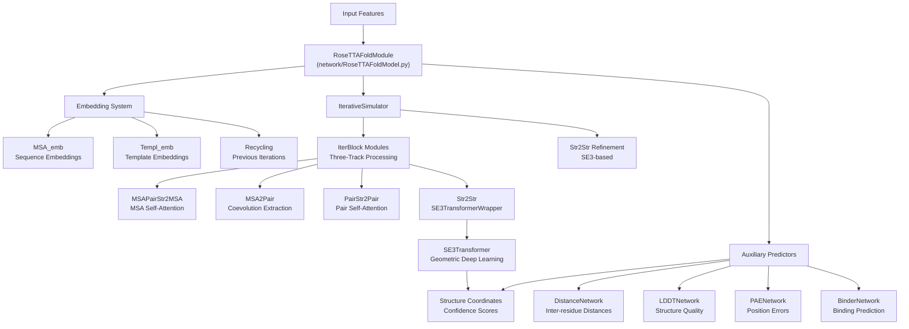
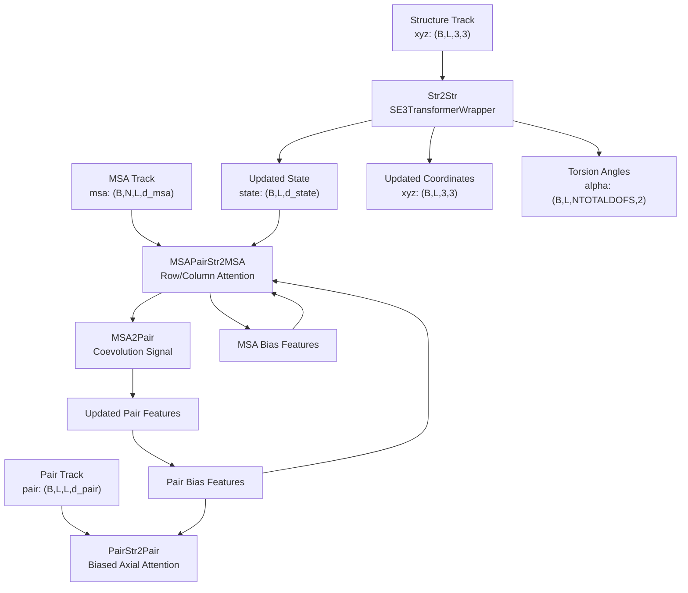
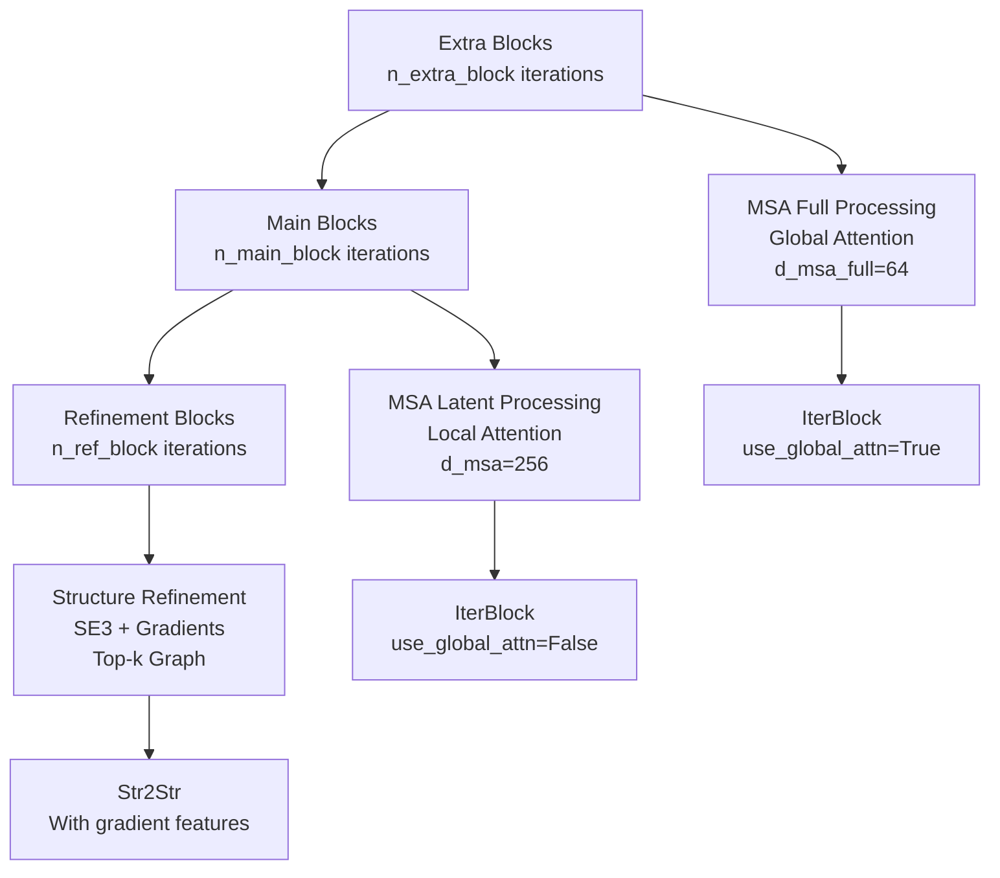
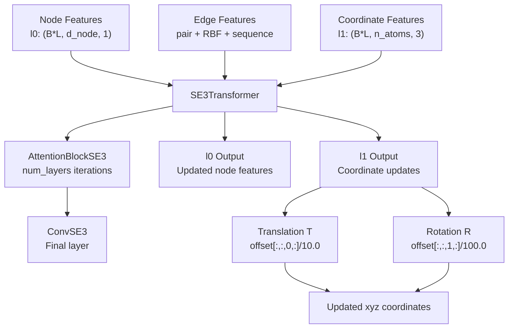
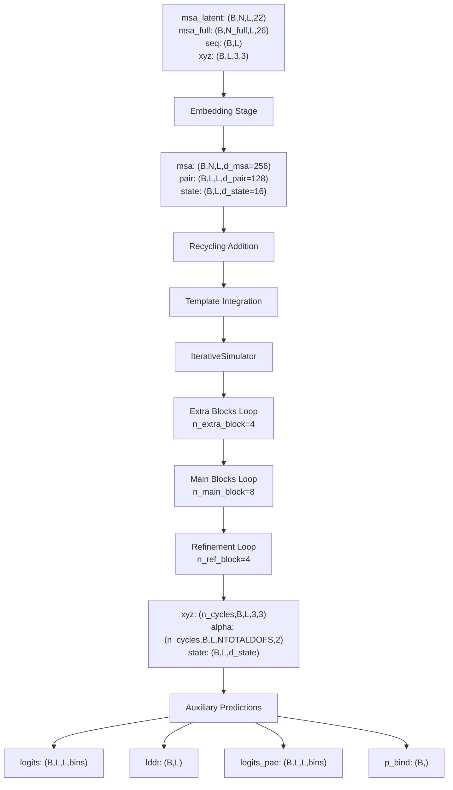
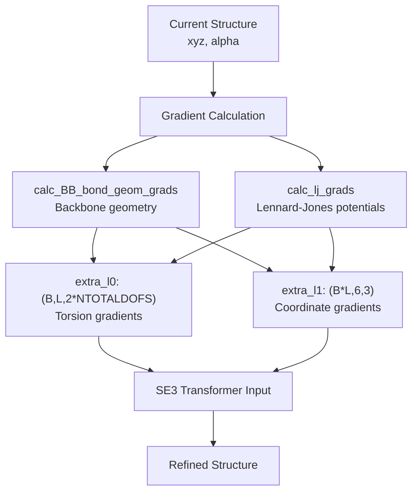

# Neural Network Architecture

> **Relevant source files**
> * [SE3Transformer/se3_transformer/model/transformer.py](https://github.com/uw-ipd/RoseTTAFold2NA/blob/f761af28/SE3Transformer/se3_transformer/model/transformer.py)
> * [network/RoseTTAFoldModel.py](https://github.com/uw-ipd/RoseTTAFold2NA/blob/f761af28/network/RoseTTAFoldModel.py)
> * [network/Track_module.py](https://github.com/uw-ipd/RoseTTAFold2NA/blob/f761af28/network/Track_module.py)

This document provides a comprehensive overview of the RoseTTAFold2NA neural network architecture, covering the core deep learning components that enable protein-nucleic acid complex structure prediction. The architecture consists of multiple interacting tracks that process sequence, pairing, and structural information through iterative refinement cycles.

For information about the training system and loss functions, see [Training System](/uw-ipd/RoseTTAFold2NA/5.4-training-system). For details about the prediction pipeline that orchestrates these components, see [Structure Prediction Engine](/uw-ipd/RoseTTAFold2NA/4.3-structure-prediction-engine).

## Architecture Overview

RoseTTAFold2NA implements a multi-track neural architecture that simultaneously processes three types of information: multiple sequence alignments (MSA track), residue pair relationships (Pair track), and 3D structural coordinates (Structure track). The system uses SE(3)-equivariant transformers to maintain geometric consistency while iteratively refining structural predictions.

### High-Level Neural Network Architecture

Sources: [network/RoseTTAFoldModel.py L10-L114](https://github.com/uw-ipd/RoseTTAFold2NA/blob/f761af28/network/RoseTTAFoldModel.py#L10-L114)

 [network/Track_module.py L373-L501](https://github.com/uw-ipd/RoseTTAFold2NA/blob/f761af28/network/Track_module.py#L373-L501)

## Core Component Architecture

The neural network consists of three main processing stages that operate on different data representations:

### Three-Track Processing System

Sources: [network/Track_module.py L329-L371](https://github.com/uw-ipd/RoseTTAFold2NA/blob/f761af28/network/Track_module.py#L329-L371)

 [network/Track_module.py L43-L106](https://github.com/uw-ipd/RoseTTAFold2NA/blob/f761af28/network/Track_module.py#L43-L106)

## Component Breakdown

### Input Embedding System

| Component | Input Dimensions | Output Dimensions | Purpose |
| --- | --- | --- | --- |
| `MSA_emb` | `(B,N,L,22+extras)` | `(B,N,L,d_msa)` | Process MSA features and sequence information |
| `Extra_emb` | `(B,N,L,NAATOKENS+3)` | `(B,N,L,d_msa_full)` | Process additional sequence context |
| `Templ_emb` | Template features | `(B,L,L,d_pair)` | Incorporate structural template information |
| `Recycling` | Previous outputs | Updated embeddings | Iterative refinement from previous cycles |

Sources: [network/RoseTTAFoldModel.py L25-L31](https://github.com/uw-ipd/RoseTTAFold2NA/blob/f761af28/network/RoseTTAFoldModel.py#L25-L31)

### Iterative Processing Blocks

The `IterativeSimulator` orchestrates three types of processing blocks:

Sources: [network/Track_module.py L373-L501](https://github.com/uw-ipd/RoseTTAFold2NA/blob/f761af28/network/Track_module.py#L373-L501)

 [network/Track_module.py L464-L495](https://github.com/uw-ipd/RoseTTAFold2NA/blob/f761af28/network/Track_module.py#L464-L495)

### SE(3)-Equivariant Components

The `SE3TransformerWrapper` integrates NVIDIA's SE3 Transformer library to maintain geometric equivariance:

Sources: [SE3Transformer/se3_transformer/model/transformer.py L63-L193](https://github.com/uw-ipd/RoseTTAFold2NA/blob/f761af28/SE3Transformer/se3_transformer/model/transformer.py#L63-L193)

 [network/Track_module.py L298-L326](https://github.com/uw-ipd/RoseTTAFold2NA/blob/f761af28/network/Track_module.py#L298-L326)

## Data Flow and Dimensions

### Forward Pass Data Flow

Sources: [network/RoseTTAFoldModel.py L62-L113](https://github.com/uw-ipd/RoseTTAFold2NA/blob/f761af28/network/RoseTTAFoldModel.py#L62-L113)

 [network/Track_module.py L457-L501](https://github.com/uw-ipd/RoseTTAFold2NA/blob/f761af28/network/Track_module.py#L457-L501)

### Auxiliary Prediction Networks

| Network | Input Features | Output | Purpose |
| --- | --- | --- | --- |
| `DistanceNetwork` | `pair: (B,L,L,d_pair)` | `(B,L,L,37)` | Inter-residue distance distribution |
| `LDDTNetwork` | `state: (B,L,d_state)` | `(B,L,50)` | Local structure quality scores |
| `PAENetwork` | `pair + 2*state` | `(B,L,L,64)` | Position error estimates |
| `BinderNetwork` | `logits_pae, same_chain` | `(B,)` | Binding probability prediction |

Sources: [network/RoseTTAFoldModel.py L56-L61](https://github.com/uw-ipd/RoseTTAFold2NA/blob/f761af28/network/RoseTTAFoldModel.py#L56-L61)

 [network/RoseTTAFoldModel.py L99-L112](https://github.com/uw-ipd/RoseTTAFold2NA/blob/f761af28/network/RoseTTAFoldModel.py#L99-L112)

## Integration Points

### SE3 Transformer Integration

The system integrates NVIDIA's SE3 Transformer through the `SE3TransformerWrapper` class, which handles:

* **Graph Construction**: Creates either full or top-k graphs from coordinates using `make_full_graph` or `make_topk_graph`
* **Feature Embedding**: Projects MSA and pair features to SE3-compatible dimensions
* **Coordinate Updates**: Processes SE3 outputs to update 3D coordinates via rotation and translation
* **Gradient Integration**: Incorporates physics-based gradients from bond geometry and Lennard-Jones potentials

Sources: [network/Track_module.py L268-L326](https://github.com/uw-ipd/RoseTTAFold2NA/blob/f761af28/network/Track_module.py#L268-L326)

 [network/Track_module.py L432-L455](https://github.com/uw-ipd/RoseTTAFold2NA/blob/f761af28/network/Track_module.py#L432-L455)

### Physics-Based Refinement

During refinement blocks, the system computes physics-based gradients and integrates them as additional features:

Sources: [network/Track_module.py L432-L455](https://github.com/uw-ipd/RoseTTAFold2NA/blob/f761af28/network/Track_module.py#L432-L455)

 [network/Track_module.py L484-L495](https://github.com/uw-ipd/RoseTTAFold2NA/blob/f761af28/network/Track_module.py#L484-L495)