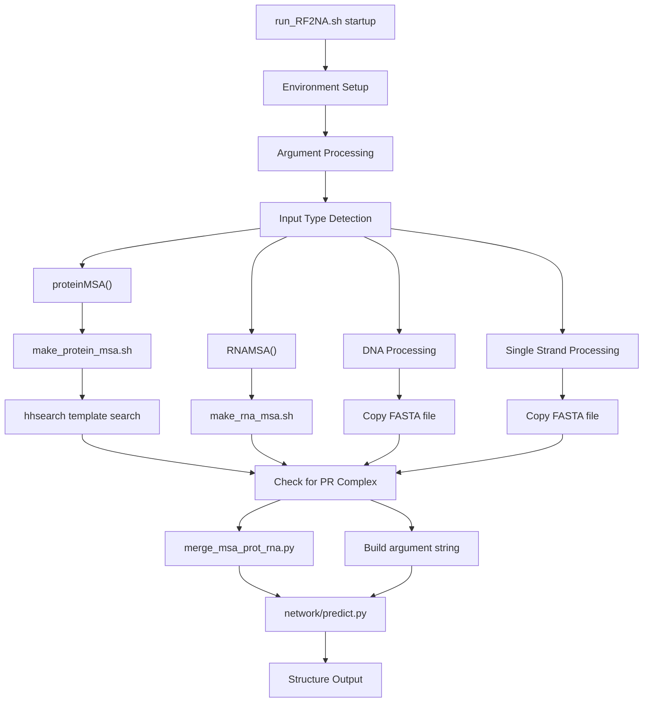
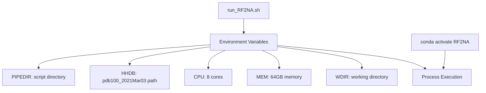
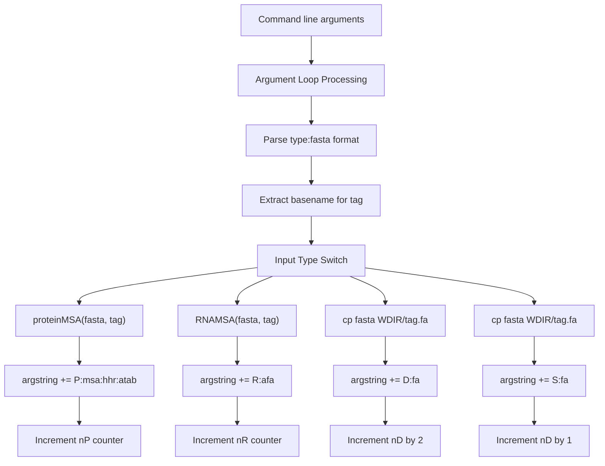
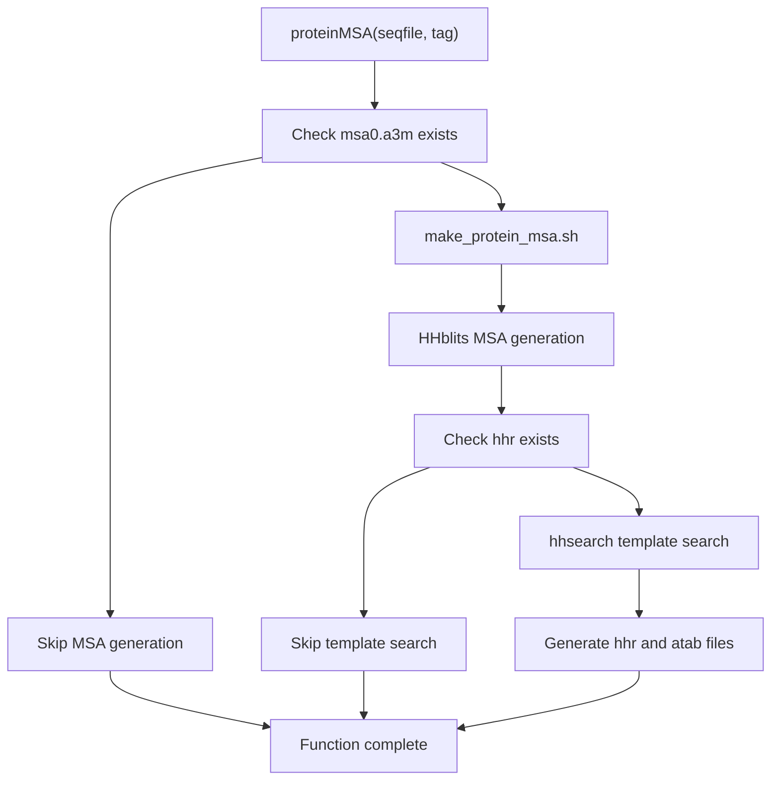
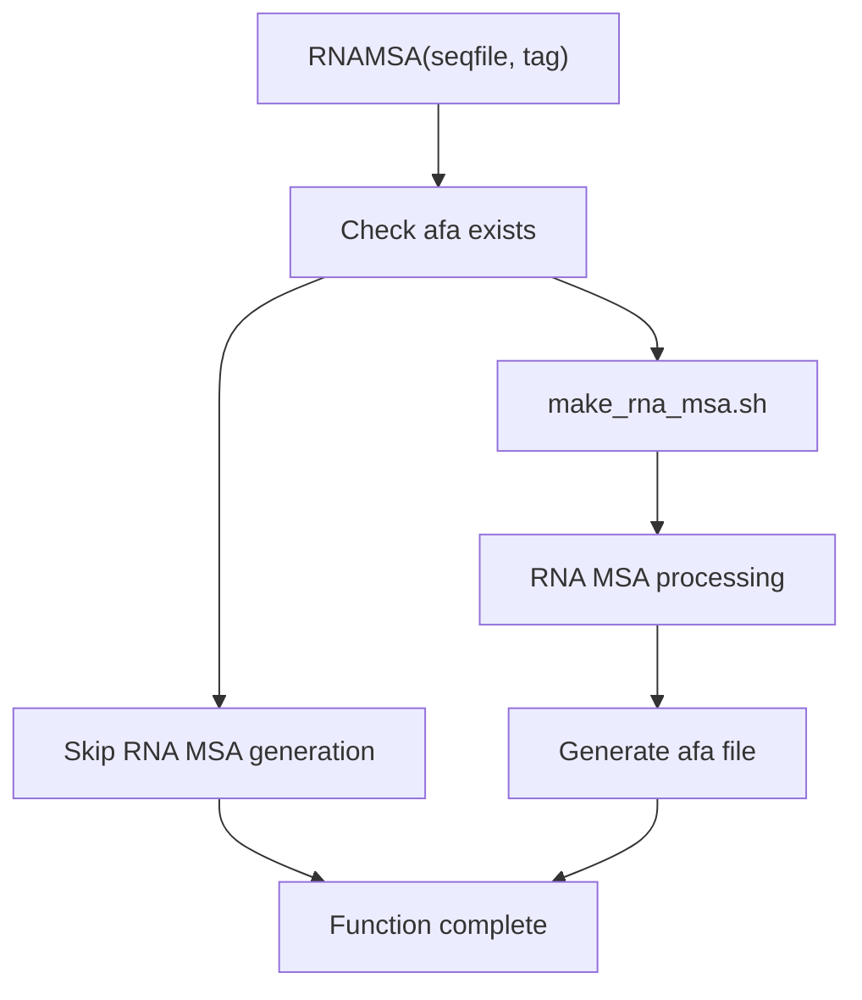
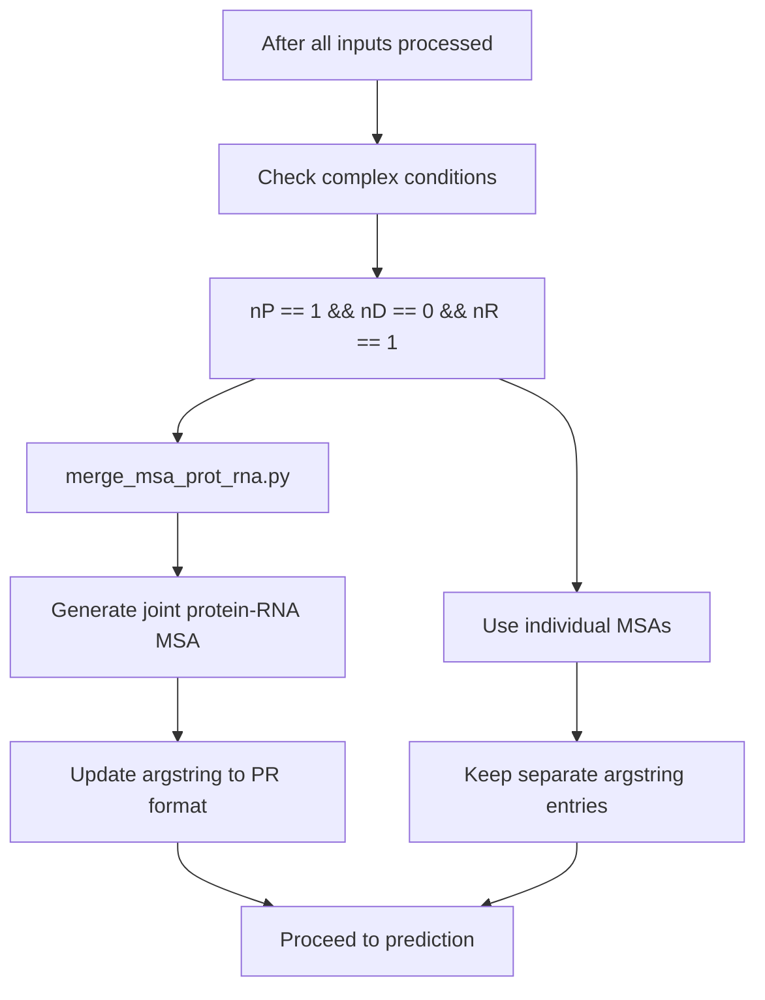
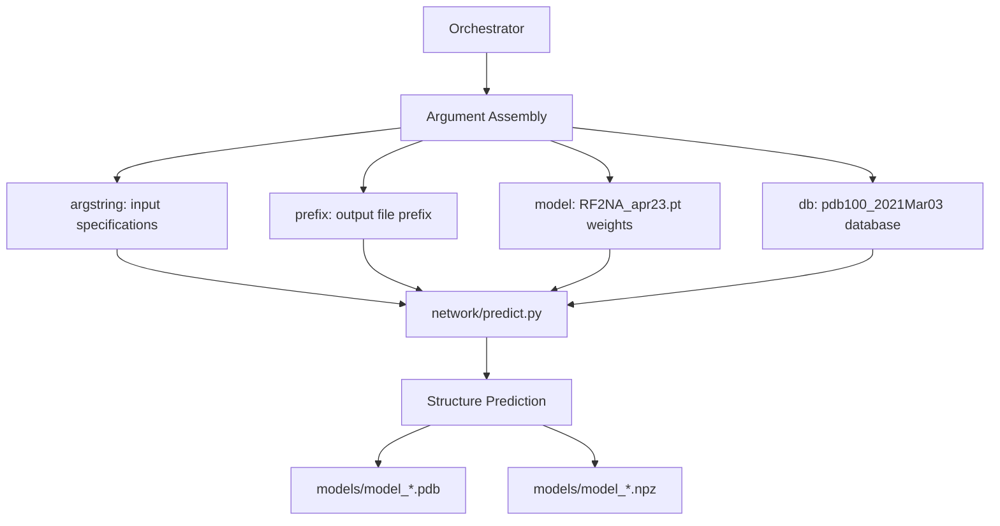
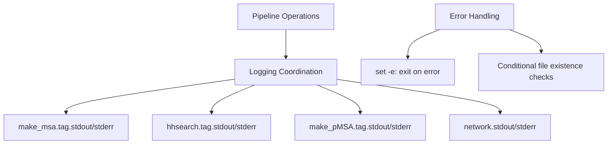

# Pipeline Orchestration

> **Relevant source files**
> * [run_RF2NA.sh](https://github.com/uw-ipd/RoseTTAFold2NA/blob/f761af28/run_RF2NA.sh)

This document explains how the main `run_RF2NA.sh` script coordinates the entire RoseTTAFold2NA prediction workflow, from input processing through structure prediction. The pipeline orchestrator manages the sequential execution of MSA generation, template search, and neural network prediction phases.

For detailed information about the input preparation components called by this orchestrator, see [Input Preparation System](/uw-ipd/RoseTTAFold2NA/3-input-preparation-system). For the neural network prediction engine that this orchestrator invokes, see [Structure Prediction Engine](/uw-ipd/RoseTTAFold2NA/4.3-structure-prediction-engine).

## Main Workflow Coordination

The `run_RF2NA.sh` script serves as the central orchestrator that coordinates the entire prediction pipeline. It manages the sequential execution of multiple phases while handling different input types and maintaining proper file organization.

### Pipeline Execution Flow

Sources: [run_RF2NA.sh L1-L134](https://github.com/uw-ipd/RoseTTAFold2NA/blob/f761af28/run_RF2NA.sh#L1-L134)

### Environment and Resource Configuration

The orchestrator initializes the execution environment with specific resource allocations and database paths:

Sources: [run_RF2NA.sh L15-L25](https://github.com/uw-ipd/RoseTTAFold2NA/blob/f761af28/run_RF2NA.sh#L15-L25)

## Input Type Detection and Processing

The pipeline orchestrator processes command-line arguments to determine input types and route them to appropriate processing functions.

### Input Type Classification

| Input Type | Prefix | Processing Function | Description |
| --- | --- | --- | --- |
| `P` | Protein | `proteinMSA()` | Protein sequences requiring MSA and template search |
| `R` | RNA | `RNAMSA()` | RNA sequences requiring specialized MSA generation |
| `D` | DNA | Direct copy | DNA sequences processed as double-strand pairs |
| `S` | Single | Direct copy | Single-strand DNA sequences |

### Argument Processing Logic

Sources: [run_RF2NA.sh L77-L107](https://github.com/uw-ipd/RoseTTAFold2NA/blob/f761af28/run_RF2NA.sh#L77-L107)

## MSA Generation Coordination

The orchestrator coordinates MSA generation by calling specialized functions that invoke the appropriate input preparation scripts.

### Protein MSA Processing Function

The `proteinMSA` function handles protein sequence processing through two main phases:

Sources: [run_RF2NA.sh L28-L53](https://github.com/uw-ipd/RoseTTAFold2NA/blob/f761af28/run_RF2NA.sh#L28-L53)

### RNA MSA Processing Function

The `RNAMSA` function handles RNA-specific MSA generation:

Sources: [run_RF2NA.sh L56-L69](https://github.com/uw-ipd/RoseTTAFold2NA/blob/f761af28/run_RF2NA.sh#L56-L69)

## Complex MSA Merging Logic

For protein-RNA complexes, the orchestrator implements special logic to merge MSAs based on taxonomic relationships.

### Protein-RNA Complex Detection

Sources: [run_RF2NA.sh L112-L118](https://github.com/uw-ipd/RoseTTAFold2NA/blob/f761af28/run_RF2NA.sh#L112-L118)

## Prediction Phase Coordination

The final phase involves coordinating the neural network prediction by constructing the appropriate command-line arguments and invoking the prediction script.

### Neural Network Invocation

Sources: [run_RF2NA.sh L123-L131](https://github.com/uw-ipd/RoseTTAFold2NA/blob/f761af28/run_RF2NA.sh#L123-L131)

## File Management and Logging

The orchestrator maintains organized file structures and comprehensive logging throughout the pipeline execution.

### Directory Structure Management

| Directory | Purpose | Created By |
| --- | --- | --- |
| `$WDIR/log` | Log files for all pipeline stages | `run_RF2NA.sh` |
| `$WDIR/models` | Final structure predictions | `run_RF2NA.sh` |
| `$WDIR/*.msa0.a3m` | Protein MSA files | `make_protein_msa.sh` |
| `$WDIR/*.afa` | RNA MSA files | `make_rna_msa.sh` |
| `$WDIR/*.hhr` | Template search results | `hhsearch` |

### Logging Strategy

Sources: [run_RF2NA.sh L3-L4](https://github.com/uw-ipd/RoseTTAFold2NA/blob/f761af28/run_RF2NA.sh#L3-L4)

 [run_RF2NA.sh L39](https://github.com/uw-ipd/RoseTTAFold2NA/blob/f761af28/run_RF2NA.sh#L39-L39)

 [run_RF2NA.sh L51](https://github.com/uw-ipd/RoseTTAFold2NA/blob/f761af28/run_RF2NA.sh#L51-L51)

 [run_RF2NA.sh L116](https://github.com/uw-ipd/RoseTTAFold2NA/blob/f761af28/run_RF2NA.sh#L116-L116)

 [run_RF2NA.sh L131](https://github.com/uw-ipd/RoseTTAFold2NA/blob/f761af28/run_RF2NA.sh#L131-L131)