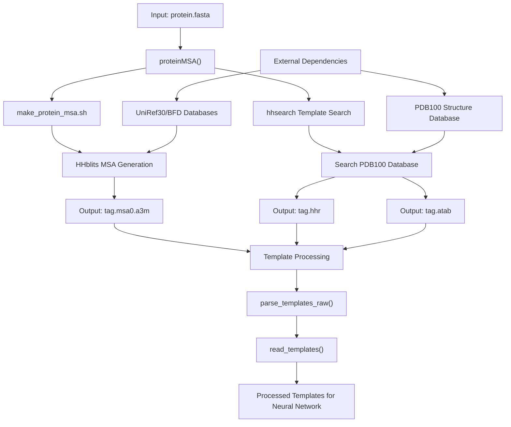
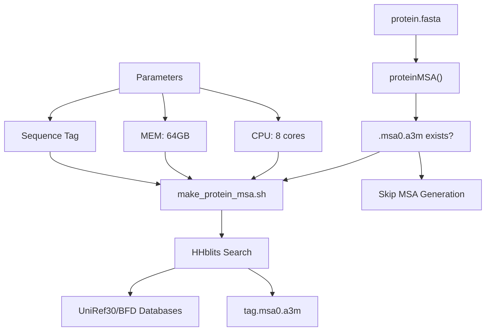
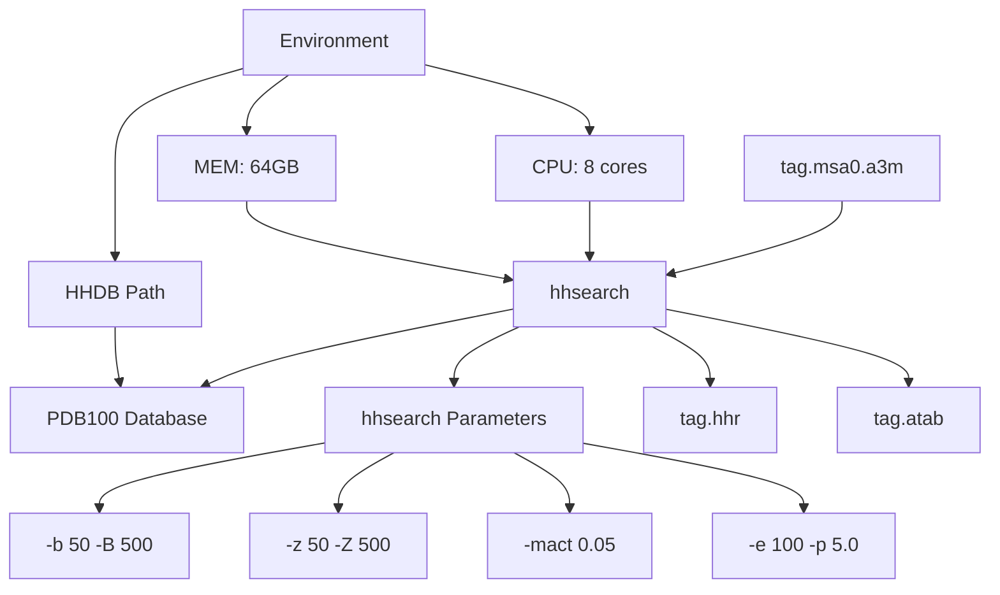
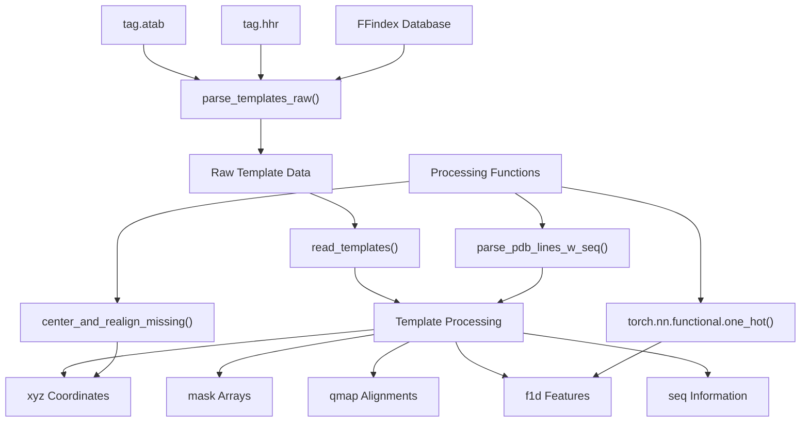
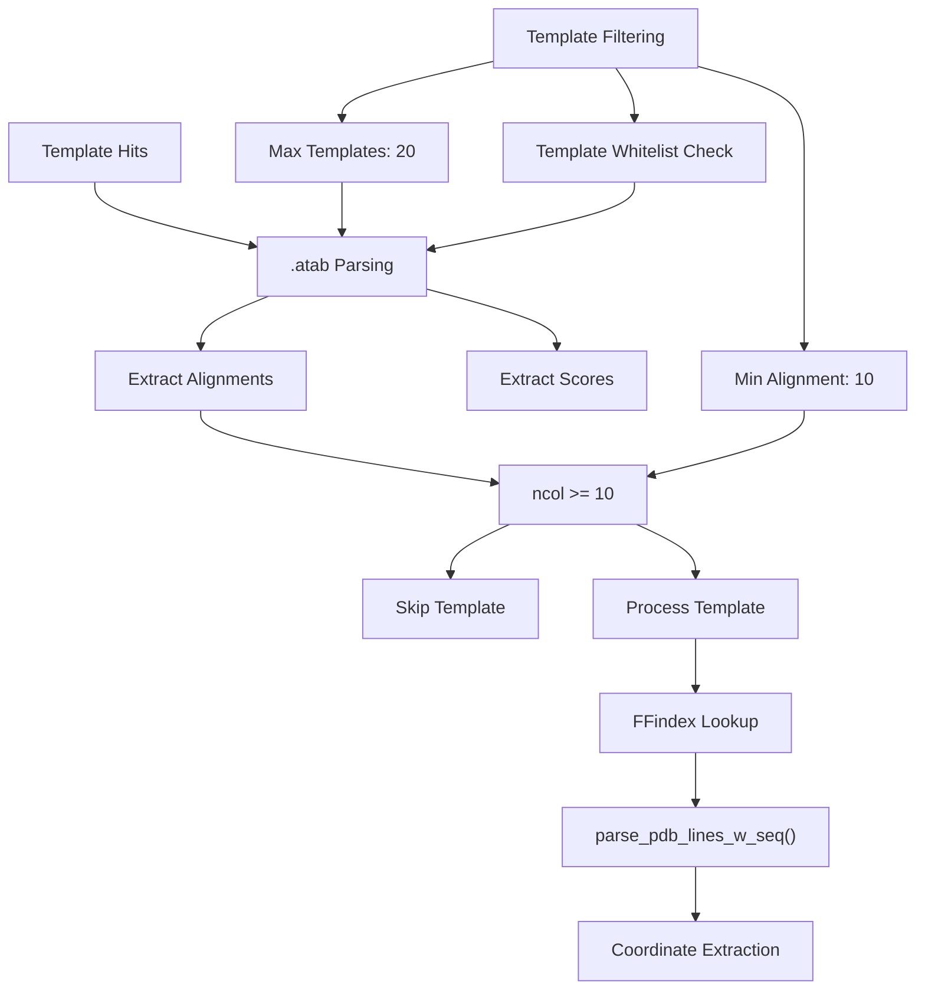
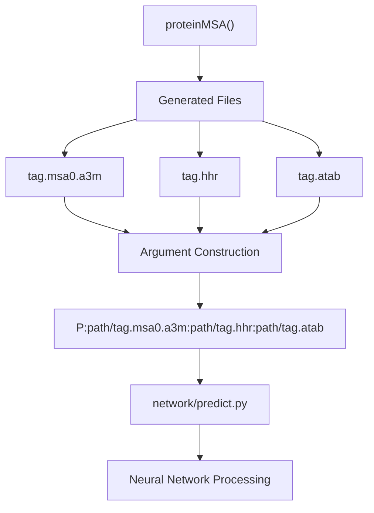

# Protein Processing and Template Search

> **Relevant source files**
> * [network/parsers.py](https://github.com/uw-ipd/RoseTTAFold2NA/blob/f761af28/network/parsers.py)
> * [run_RF2NA.sh](https://github.com/uw-ipd/RoseTTAFold2NA/blob/f761af28/run_RF2NA.sh)

This document covers the protein-specific components of the RoseTTAFold2NA input preparation pipeline, focusing on multiple sequence alignment (MSA) generation and structural template identification. The system processes protein FASTA sequences to generate evolutionary context through MSAs and identifies homologous protein structures to guide the neural network prediction.

For RNA-specific processing, see [RNA MSA Generation Pipeline](/uw-ipd/RoseTTAFold2NA/3.1-rna-msa-generation-pipeline). For combining protein and RNA MSAs in heteromeric complexes, see [MSA Merging for Protein-RNA Complexes](/uw-ipd/RoseTTAFold2NA/3.3-msa-merging-for-protein-rna-complexes).

## Overview

The protein processing pipeline consists of two main stages executed sequentially: MSA generation using HHblits and structural template search using hhsearch. Both processes leverage large sequence and structure databases to provide evolutionary and structural context for the target protein sequence.

Sources: [run_RF2NA.sh L28-L53](https://github.com/uw-ipd/RoseTTAFold2NA/blob/f761af28/run_RF2NA.sh#L28-L53)

 [network/parsers.py L389-L560](https://github.com/uw-ipd/RoseTTAFold2NA/blob/f761af28/network/parsers.py#L389-L560)

## MSA Generation Process

The MSA generation stage uses the `proteinMSA` function to orchestrate protein sequence alignment. The process checks for existing MSA files before executing to avoid redundant computation.

| Component | File Path | Purpose |
| --- | --- | --- |
| Orchestration | `run_RF2NA.sh` lines 28-53 | Main function coordinating protein processing |
| MSA Script | `input_prep/make_protein_msa.sh` | External script for HHblits execution |
| Output Format | `.msa0.a3m` | A3M format multiple sequence alignment |

The MSA generation process extracts a sequence tag from the input filename and uses it consistently across all output files. The system removes file extensions (`.fasta`, `.fas`, `.fa`) to create clean tag identifiers.

Sources: [run_RF2NA.sh L35-L40](https://github.com/uw-ipd/RoseTTAFold2NA/blob/f761af28/run_RF2NA.sh#L35-L40)

 [run_RF2NA.sh L82](https://github.com/uw-ipd/RoseTTAFold2NA/blob/f761af28/run_RF2NA.sh#L82-L82)

## Template Search Process

Template search identifies structural homologs using hhsearch against the PDB100 database. This process generates both summary results (`.hhr`) and detailed alignment tables (`.atab`) that are subsequently parsed for structural information.

### hhsearch Configuration

The hhsearch command uses specific parameters optimized for template detection:

| Parameter | Value | Purpose |
| --- | --- | --- |
| `-b 50` | 50 alignments | Number of alignments in summary |
| `-B 500` | 500 alignments | Number of alignments in alignment list |
| `-z 50` | 50 descriptions | Number of descriptions |
| `-Z 500` | 500 descriptions | Number of descriptions in alignment list |
| `-mact 0.05` | 0.05 threshold | Minimum aligned coverage threshold |
| `-e 100` | E-value 100 | E-value threshold |
| `-p 5.0` | 5.0 | Minimum probability in hit list |

Sources: [run_RF2NA.sh L46-L52](https://github.com/uw-ipd/RoseTTAFold2NA/blob/f761af28/run_RF2NA.sh#L46-L52)

 [run_RF2NA.sh L17](https://github.com/uw-ipd/RoseTTAFold2NA/blob/f761af28/run_RF2NA.sh#L17-L17)

 [run_RF2NA.sh L19-L20](https://github.com/uw-ipd/RoseTTAFold2NA/blob/f761af28/run_RF2NA.sh#L19-L20)

## Template Parsing and Processing

The template processing system converts hhsearch results into neural network inputs through a multi-stage parsing pipeline. The system uses FFindex databases for efficient template structure retrieval.

### Template Data Flow

Sources: [network/parsers.py L462-L528](https://github.com/uw-ipd/RoseTTAFold2NA/blob/f761af28/network/parsers.py#L462-L528)

 [network/parsers.py L530-L559](https://github.com/uw-ipd/RoseTTAFold2NA/blob/f761af28/network/parsers.py#L530-L559)

### Template Data Structures

The template processing system generates several key data structures for neural network consumption:

| Structure | Type | Dimensions | Purpose |
| --- | --- | --- | --- |
| `xyz` | `torch.Tensor` | `(n_templ, qlen, NTOTAL, 3)` | Template atom coordinates |
| `mask` | `torch.Tensor` | `(n_templ, qlen, NTOTAL)` | Valid atom indicators |
| `qmap` | `torch.Tensor` | `(n_matches, 2)` | Query-template position mapping |
| `f1d` | `torch.Tensor` | `(n_templ, qlen, NAATOKENS)` | One-hot sequence features |
| `f1d_val` | `torch.Tensor` | `(n_templ, qlen, 1)` | Template confidence values |

### Template Selection and Processing Logic

The system implements several quality control measures:

* Minimum alignment length of 10 residues per template
* Maximum of 20 templates processed per query
* Optional template whitelist filtering
* Coordinate centering and realignment for missing atoms

Sources: [network/parsers.py L499-L528](https://github.com/uw-ipd/RoseTTAFold2NA/blob/f761af28/network/parsers.py#L499-L528)

 [network/parsers.py L541-L554](https://github.com/uw-ipd/RoseTTAFold2NA/blob/f761af28/network/parsers.py#L541-L554)

## Integration with Main Pipeline

The protein processing outputs integrate seamlessly with the main prediction pipeline through standardized file formats and naming conventions. The `run_RF2NA.sh` script constructs argument strings that reference the generated files:

The argument string format follows the pattern `P:msa_file:hhr_file:atab_file` where the `P` prefix indicates protein input type, distinguishing it from RNA (`R`) and DNA (`D`) inputs in mixed-molecule predictions.

Sources: [run_RF2NA.sh L87](https://github.com/uw-ipd/RoseTTAFold2NA/blob/f761af28/run_RF2NA.sh#L87-L87)

 [run_RF2NA.sh L127-L131](https://github.com/uw-ipd/RoseTTAFold2NA/blob/f761af28/run_RF2NA.sh#L127-L131)