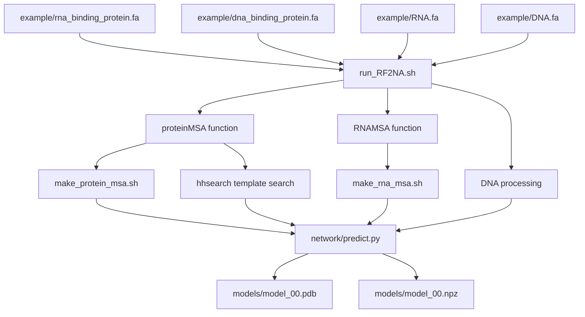
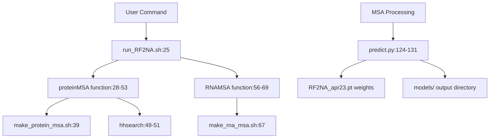
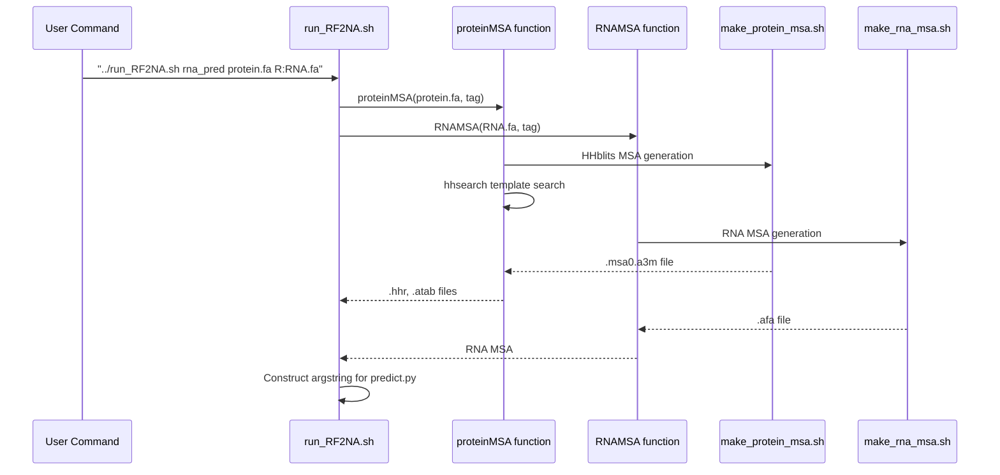

# Quick Start Tutorial

> **Relevant source files**
> * [README.md](https://github.com/uw-ipd/RoseTTAFold2NA/blob/f761af28/README.md?plain=1)
> * [example/dna_binding_protein.fa](https://github.com/uw-ipd/RoseTTAFold2NA/blob/f761af28/example/dna_binding_protein.fa)
> * [example/rna_binding_protein.fa](https://github.com/uw-ipd/RoseTTAFold2NA/blob/f761af28/example/rna_binding_protein.fa)
> * [run_RF2NA.sh](https://github.com/uw-ipd/RoseTTAFold2NA/blob/f761af28/run_RF2NA.sh)

This tutorial provides a step-by-step guide to running your first RoseTTAFold2NA prediction using the provided example files. It covers the basic command syntax, demonstrates both protein-RNA and protein-DNA predictions, and explains the expected outputs. For installation instructions, see [Installation and Environment Setup](/uw-ipd/RoseTTAFold2NA/2.1-installation-and-environment-setup). For detailed information about the input preparation pipeline, see [Input Preparation System](/uw-ipd/RoseTTAFold2NA/3-input-preparation-system).

## Tutorial Overview

RoseTTAFold2NA predictions are executed through the main `run_RF2NA.sh` script, which orchestrates MSA generation, template search, and neural network prediction. This tutorial uses two example files provided in the repository to demonstrate typical workflows.

### Example Files and Workflow



**Workflow Steps to Code Entities Mapping**



Sources: [run_RF2NA.sh L1-L134](https://github.com/uw-ipd/RoseTTAFold2NA/blob/f761af28/run_RF2NA.sh#L1-L134)

 [example/rna_binding_protein.fa L1-L3](https://github.com/uw-ipd/RoseTTAFold2NA/blob/f761af28/example/rna_binding_protein.fa#L1-L3)

 [example/dna_binding_protein.fa L1-L3](https://github.com/uw-ipd/RoseTTAFold2NA/blob/f761af28/example/dna_binding_protein.fa#L1-L3)

## Running Your First Prediction

### Prerequisites

Ensure you have completed the installation steps from [Installation and Environment Setup](/uw-ipd/RoseTTAFold2NA/2.1-installation-and-environment-setup) and have activated the conda environment:

```
conda activate RF2NA
```

### Example 1: Protein-RNA Complex Prediction

Navigate to the example directory and run a protein-RNA prediction:

```
cd example../run_RF2NA.sh rna_pred rna_binding_protein.fa R:RNA.fa
```

This command structure corresponds to the usage pattern defined in [run_RF2NA.sh L84-L118](https://github.com/uw-ipd/RoseTTAFold2NA/blob/f761af28/run_RF2NA.sh#L84-L118)

:

| Component | Purpose | Code Reference |
| --- | --- | --- |
| `../run_RF2NA.sh` | Main pipeline script | [run_RF2NA.sh L1](https://github.com/uw-ipd/RoseTTAFold2NA/blob/f761af28/run_RF2NA.sh#L1-L1) |
| `rna_pred` | Output directory name | [run_RF2NA.sh L22](https://github.com/uw-ipd/RoseTTAFold2NA/blob/f761af28/run_RF2NA.sh#L22-L22) |
| `rna_binding_protein.fa` | Protein sequence (auto-detected as P:) | [run_RF2NA.sh L79-L82](https://github.com/uw-ipd/RoseTTAFold2NA/blob/f761af28/run_RF2NA.sh#L79-L82) |
| `R:RNA.fa` | RNA sequence with explicit type tag | [run_RF2NA.sh L90-L95](https://github.com/uw-ipd/RoseTTAFold2NA/blob/f761af28/run_RF2NA.sh#L90-L95) |

### Example 2: Protein-DNA Complex Prediction

```
../run_RF2NA.sh dna_pred dna_binding_protein.fa D:DNA.fa
```

The DNA processing differs from RNA as shown in [run_RF2NA.sh L96-L100](https://github.com/uw-ipd/RoseTTAFold2NA/blob/f761af28/run_RF2NA.sh#L96-L100)

 where the `D:` prefix automatically generates a complementary DNA strand.

Sources: [README.md L80-L87](https://github.com/uw-ipd/RoseTTAFold2NA/blob/f761af28/README.md?plain=1#L80-L87)

 [run_RF2NA.sh L77-L107](https://github.com/uw-ipd/RoseTTAFold2NA/blob/f761af28/run_RF2NA.sh#L77-L107)

## Understanding the Pipeline Execution

### MSA Generation Phase

When you run the prediction, the script executes different MSA generation functions based on molecule type:



For protein-RNA complexes with single protein and RNA chains, the script creates a joint MSA using [run_RF2NA.sh L112-L118](https://github.com/uw-ipd/RoseTTAFold2NA/blob/f761af28/run_RF2NA.sh#L112-L118)

:

```
merge_msa_prot_rna.py $WDIR/$lastP.msa0.a3m $WDIR/$lastR.afa $WDIR/$lastP.$lastR.a3m
```

Sources: [run_RF2NA.sh L28-L69](https://github.com/uw-ipd/RoseTTAFold2NA/blob/f761af28/run_RF2NA.sh#L28-L69)

 [run_RF2NA.sh L112-L118](https://github.com/uw-ipd/RoseTTAFold2NA/blob/f761af28/run_RF2NA.sh#L112-L118)

## Expected Outputs

### Output Directory Structure

The prediction creates the following directory structure:

```markdown
rna_pred/
├── log/                          # Processing logs
│   ├── make_msa.*.stdout
│   ├── make_msa.*.stderr
│   └── hhsearch.*.stdout
├── models/                       # Main outputs
│   ├── model_00.pdb             # Predicted structure
│   └── model_00.npz             # Confidence data
└── *.msa0.a3m, *.afa, *.hhr     # Intermediate MSA files
```

### Structure Output (model_00.pdb)

The main structural prediction with estimated per-residue confidence scores in the B-factor column. This file can be visualized in standard molecular viewers like PyMOL or ChimeraX.

### Confidence Data (model_00.npz)

The numpy file contains three key arrays accessible via `numpy.load()`:

| Array | Dimensions | Description |
| --- | --- | --- |
| `dist` | L × L × 37 | Predicted distance distributions between residue pairs |
| `lddt` | L | Per-residue predicted Local Distance Difference Test scores |
| `pae` | L × L | Predicted Aligned Error matrix between residue pairs |

Where L is the total complex length (protein + nucleic acid residues).

Sources: [README.md L92-L99](https://github.com/uw-ipd/RoseTTAFold2NA/blob/f761af28/README.md?plain=1#L92-L99)

## Input Format Specifications

### Molecule Type Tags

The script recognizes specific prefixes for different molecule types as defined in [run_RF2NA.sh L79-L106](https://github.com/uw-ipd/RoseTTAFold2NA/blob/f761af28/run_RF2NA.sh#L79-L106)

:

| Tag | Molecule Type | Processing | Example |
| --- | --- | --- | --- |
| `P:` or none | Protein | MSA + template search | `protein.fa` or `P:protein.fa` |
| `R:` | RNA | RNA-specific MSA | `R:rna.fa` |
| `D:` | Double-stranded DNA | Auto-generates complement | `D:dna.fa` |
| `S:` | Single-stranded DNA | Direct processing | `S:ssdna.fa` |
| `PR:` | Paired protein/RNA | Joint MSA processing | `PR:complex.fa` |

### FASTA File Requirements

Each input file should contain a single sequence in standard FASTA format. The sequence identifier line is preserved but the actual prediction uses only the sequence content.

Example protein sequence from [example/rna_binding_protein.fa L1-L3](https://github.com/uw-ipd/RoseTTAFold2NA/blob/f761af28/example/rna_binding_protein.fa#L1-L3)

:

```
> prot
TRPNHTIYINNLNEKIKKDELKKSLHAIFSRFGQILDILVSRSLKMRGQAFVIFKEVSSATNALRSMQGFPFYDKPMRIQYAKTDSDIIAKM
```

Sources: [run_RF2NA.sh L79-L106](https://github.com/uw-ipd/RoseTTAFold2NA/blob/f761af28/run_RF2NA.sh#L79-L106)

 [README.md L88-L91](https://github.com/uw-ipd/RoseTTAFold2NA/blob/f761af28/README.md?plain=1#L88-L91)

 [example/rna_binding_protein.fa L1-L3](https://github.com/uw-ipd/RoseTTAFold2NA/blob/f761af28/example/rna_binding_protein.fa#L1-L3)

 [example/dna_binding_protein.fa L1-L3](https://github.com/uw-ipd/RoseTTAFold2NA/blob/f761af28/example/dna_binding_protein.fa#L1-L3)

## Monitoring Prediction Progress

### Log Files

Progress can be monitored through log files in the output directory:

* `log/make_msa.*.stdout` - MSA generation progress
* `log/hhsearch.*.stdout` - Template search progress
* `log/network.stdout` - Neural network prediction (if enabled)

### Expected Runtime

Typical prediction times vary by complex size and MSA depth:

* Small complexes (< 100 residues): 10-30 minutes
* Medium complexes (100-300 residues): 30-120 minutes
* Large complexes (> 300 residues): 2+ hours

The MSA generation phase typically dominates runtime, especially for the initial protein MSA generation via HHblits.

Sources: [run_RF2NA.sh L35-L40](https://github.com/uw-ipd/RoseTTAFold2NA/blob/f761af28/run_RF2NA.sh#L35-L40)

 [run_RF2NA.sh L63-L68](https://github.com/uw-ipd/RoseTTAFold2NA/blob/f761af28/run_RF2NA.sh#L63-L68)