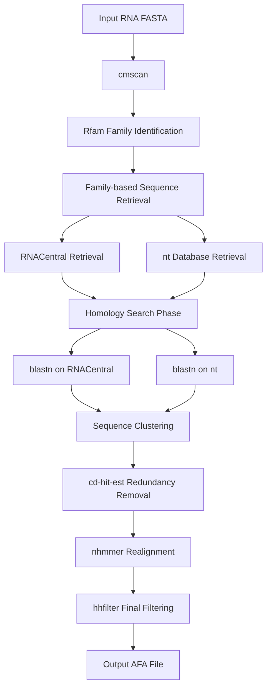
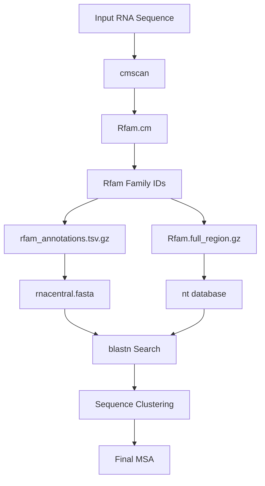
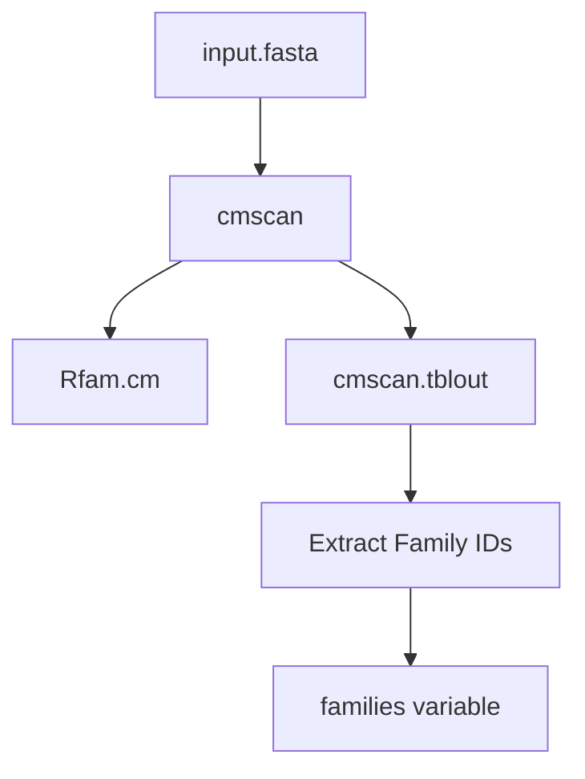
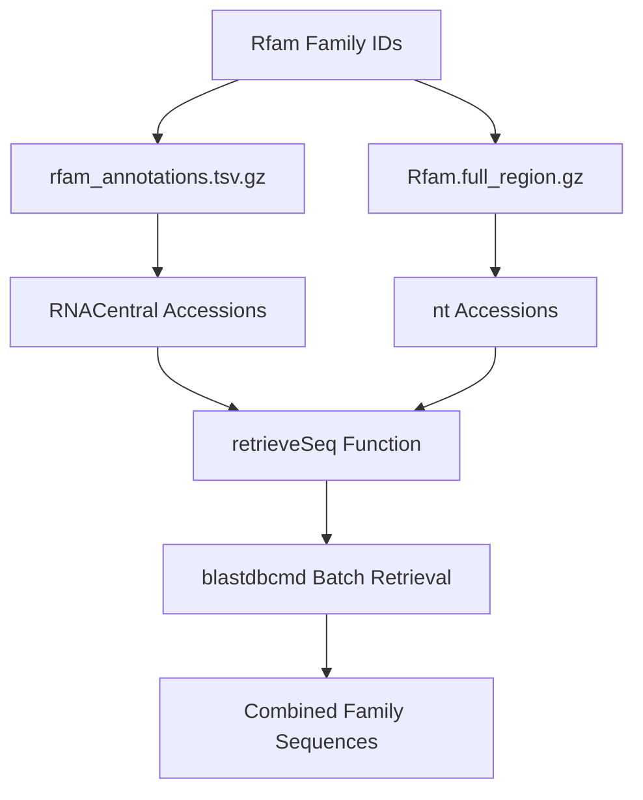
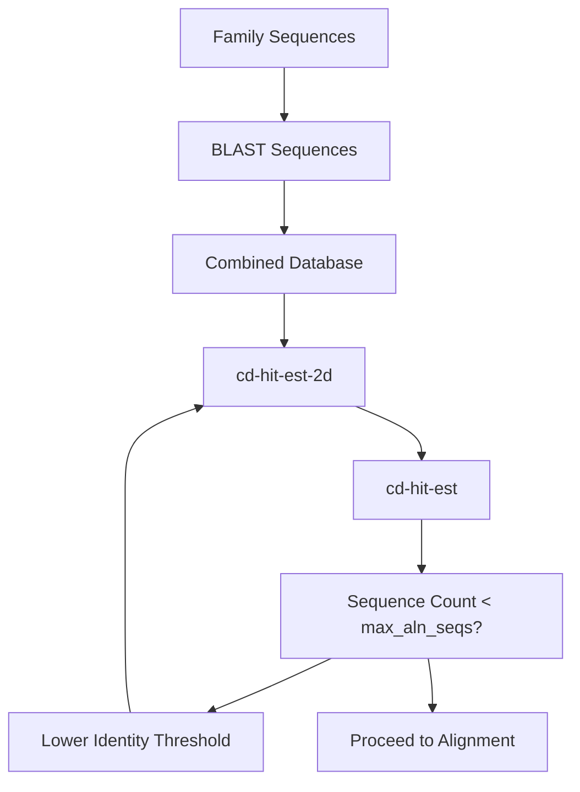
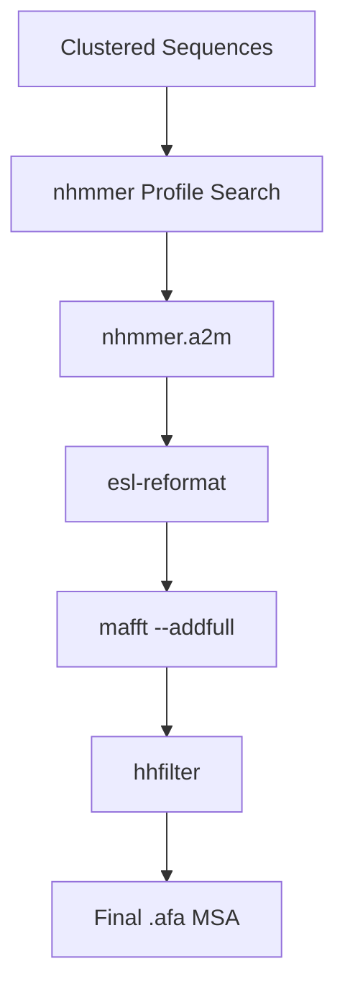

# RNA MSA Generation Pipeline

> **Relevant source files**
> * [input_prep/make_rna_msa.sh](https://github.com/uw-ipd/RoseTTAFold2NA/blob/f761af28/input_prep/make_rna_msa.sh)
> * [input_prep/reprocess_rnac.pl](https://github.com/uw-ipd/RoseTTAFold2NA/blob/f761af28/input_prep/reprocess_rnac.pl)

## Purpose and Scope

The RNA MSA Generation Pipeline is responsible for generating multiple sequence alignments (MSAs) for RNA input sequences in RoseTTAFold2NA. This pipeline searches multiple RNA databases, identifies homologous sequences, and creates filtered alignments that serve as input for the neural network structure prediction.

For protein MSA generation, see [Protein Processing and Template Search](/uw-ipd/RoseTTAFold2NA/3.2-protein-processing-and-template-search). For combining protein and RNA MSAs in heteromeric complexes, see [MSA Merging for Protein-RNA Complexes](/uw-ipd/RoseTTAFold2NA/3.3-msa-merging-for-protein-rna-complexes).

## Pipeline Overview

The RNA MSA generation process is orchestrated by the `make_rna_msa.sh` script, which implements a multi-stage search and alignment strategy. The pipeline combines family-based searches using Rfam covariance models with homology-based searches using BLAST, followed by iterative clustering and alignment refinement.



Sources: [input_prep/make_rna_msa.sh L1-L135](https://github.com/uw-ipd/RoseTTAFold2NA/blob/f761af28/input_prep/make_rna_msa.sh#L1-L135)

## Database Dependencies

The pipeline relies on several large RNA sequence and annotation databases stored in the `$PIPEDIR/RNA` directory:

| Database | File | Size | Purpose |
| --- | --- | --- | --- |
| Rfam | `Rfam.cm` | ~300MB | RNA family covariance models for cmscan |
| RNACentral | `rnacentral.fasta` | ~12GB | Curated RNA sequence database |
| NCBI nt | `nt` | ~151GB | Comprehensive nucleotide sequence database |
| Rfam Annotations | `rfam_annotations.tsv.gz` | Small | Maps Rfam families to RNACentral sequences |
| Rfam Regions | `Rfam.full_region.gz` | Small | Maps Rfam families to nt database sequences |



Sources: [input_prep/make_rna_msa.sh L18-L26](https://github.com/uw-ipd/RoseTTAFold2NA/blob/f761af28/input_prep/make_rna_msa.sh#L18-L26)

## Pipeline Configuration Parameters

The pipeline uses several configurable limits to control computational resources and output quality:

```markdown
max_aln_seqs=50000      # Maximum sequences in intermediate alignmentsmax_target_seqs=50000   # Maximum BLAST targetsmax_split_seqs=5000     # Batch size for sequence retrievalmax_hhfilter_seqs=5000  # Final filtering thresholdmax_rfam_num=100        # Maximum Rfam families to consider
```

Sources: [input_prep/make_rna_msa.sh L27-L31](https://github.com/uw-ipd/RoseTTAFold2NA/blob/f761af28/input_prep/make_rna_msa.sh#L27-L31)

## Stage 1: Rfam Family Identification

The pipeline begins by identifying RNA families using `cmscan` with Rfam covariance models:



The `cmscan` command searches the input sequence against all Rfam covariance models and outputs hits in tabular format. The script extracts up to `max_rfam_num` (100) unique family identifiers for subsequent searches.

Sources: [input_prep/make_rna_msa.sh L58-L63](https://github.com/uw-ipd/RoseTTAFold2NA/blob/f761af28/input_prep/make_rna_msa.sh#L58-L63)

## Stage 2: Family-Based Sequence Retrieval

Using the identified Rfam families, the pipeline retrieves homologous sequences from two sources:

### RNACentral Retrieval

* Maps Rfam families to RNACentral accessions using `rfam_annotations.tsv.gz`
* Extracts sequences with 6-nucleotide flanking regions
* Uses `blastdbcmd` for efficient batch retrieval

### nt Database Retrieval

* Maps Rfam families to nt database entries using `Rfam.full_region.gz`
* Retrieves sequences with flanking regions
* Handles strand orientation (plus/minus)



The `retrieveSeq` function [input_prep/make_rna_msa.sh L40-L56](https://github.com/uw-ipd/RoseTTAFold2NA/blob/f761af28/input_prep/make_rna_msa.sh#L40-L56)

 handles the batch retrieval process, splitting large requests and formatting outputs appropriately.

Sources: [input_prep/make_rna_msa.sh L65-L81](https://github.com/uw-ipd/RoseTTAFold2NA/blob/f761af28/input_prep/make_rna_msa.sh#L65-L81)

## Stage 3: Homology-Based Search

The pipeline performs BLAST searches against both RNACentral and nt databases to find additional homologous sequences:

### RNACentral Search

```
blastn -query input.fasta -strand plus -db rnacentral.fasta        -task blastn -max_target_seqs 50000        -outfmt '6 saccver sstart send evalue bitscore nident staxids'
```

### nt Database Search

```
blastn -query input.fasta -strand both -db nt       -task blastn -max_target_seqs 50000       -outfmt '6 saccver sstart send evalue bitscore nident staxids'
```

Both searches use the same tabular output format and sequence retrieval strategy.

Sources: [input_prep/make_rna_msa.sh L83-L93](https://github.com/uw-ipd/RoseTTAFold2NA/blob/f761af28/input_prep/make_rna_msa.sh#L83-L93)

## Stage 4: Redundancy Removal and Clustering

The pipeline combines all retrieved sequences and removes redundancy using `cd-hit-est` with multiple identity thresholds:



The clustering process uses identity thresholds of 1.00, 0.99, 0.95, and 0.90, progressively reducing stringency until the sequence count falls below `max_aln_seqs` (50,000).

Sources: [input_prep/make_rna_msa.sh L95-L112](https://github.com/uw-ipd/RoseTTAFold2NA/blob/f761af28/input_prep/make_rna_msa.sh#L95-L112)

## Stage 5: Profile-Based Realignment

The final stage uses `nhmmer` to create a profile HMM from the input sequence and search against all collected sequences:

```
nhmmer --noali -A nhmmer.a2m --incE $e_val --cpu $CPU --watson input.fasta db
```

The pipeline tests multiple E-value thresholds (1e-8 to 1e-1) until sufficient hits are found. The alignment process includes:

1. **Profile Construction**: `nhmmer` builds an HMM profile from the input sequence
2. **Homology Search**: Searches clustered sequences using the profile
3. **Alignment Addition**: `mafft --addfull` adds the query sequence to the alignment
4. **Final Filtering**: `hhfilter` applies identity (99%) and coverage (50%) filters



Sources: [input_prep/make_rna_msa.sh L113-L135](https://github.com/uw-ipd/RoseTTAFold2NA/blob/f761af28/input_prep/make_rna_msa.sh#L113-L135)

## Output Format

The pipeline generates an `.afa` format multiple sequence alignment file containing:

* The input query sequence (added by `mafft --addfull`)
* Homologous sequences from family-based and homology-based searches
* Filtered to remove redundancy and low-quality alignments
* Maximum of `max_hhfilter_seqs` (5,000) final sequences

The output file follows standard aligned FASTA format with gap characters and is ready for input to the neural network prediction pipeline.

Sources: [input_prep/make_rna_msa.sh L118-L132](https://github.com/uw-ipd/RoseTTAFold2NA/blob/f761af28/input_prep/make_rna_msa.sh#L118-L132)

## Utility Scripts

### reprocess_rnac.pl

The `reprocess_rnac.pl` script processes RNACentral annotations to incorporate taxonomy information. It maps sequence IDs to taxonomy IDs and reformats annotation files to include taxonomic context for better sequence diversity assessment.

Sources: [input_prep/reprocess_rnac.pl L1-L33](https://github.com/uw-ipd/RoseTTAFold2NA/blob/f761af28/input_prep/reprocess_rnac.pl#L1-L33)