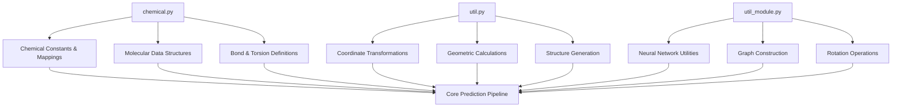
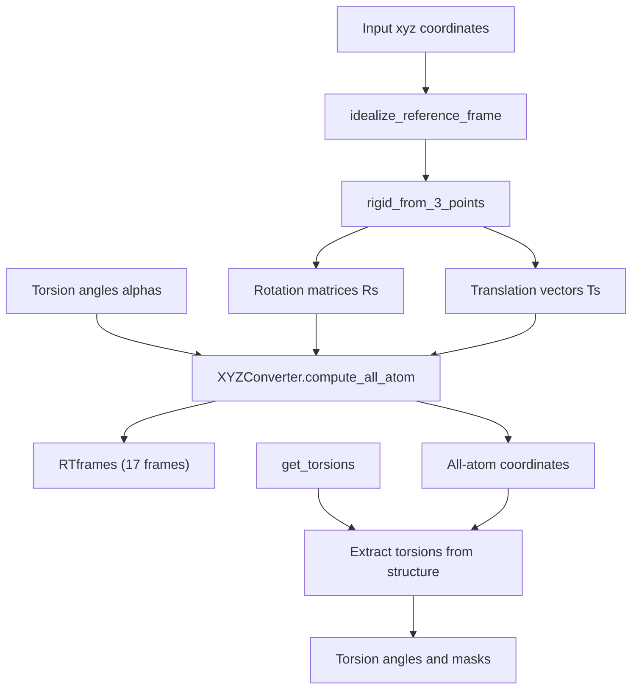

# Reference Documentation

> **Relevant source files**
> * [network/chemical.py](https://github.com/uw-ipd/RoseTTAFold2NA/blob/f761af28/network/chemical.py)
> * [network/util.py](https://github.com/uw-ipd/RoseTTAFold2NA/blob/f761af28/network/util.py)
> * [network/util_module.py](https://github.com/uw-ipd/RoseTTAFold2NA/blob/f761af28/network/util_module.py)

This document provides technical reference materials for RoseTTAFold2NA, including chemical constants, coordinate systems, and utility functions. The reference documentation serves as the foundational layer that supports the neural network architecture and prediction pipeline.

For information about the core neural network components, see [Neural Network Architecture](/uw-ipd/RoseTTAFold2NA/5-neural-network-architecture). For details about input preparation and file processing, see [File Processing and Data Loading](/uw-ipd/RoseTTAFold2NA/4.2-file-processing-and-data-loading).

## Overview

The reference documentation system consists of three primary components that provide the foundational data structures and utilities for protein-nucleic acid structure prediction:

### Reference Documentation Architecture

**Sources:** [network/chemical.py L1-L1050](https://github.com/uw-ipd/RoseTTAFold2NA/blob/f761af28/network/chemical.py#L1-L1050)

 [network/util.py L1-L614](https://github.com/uw-ipd/RoseTTAFold2NA/blob/f761af28/network/util.py#L1-L614)

 [network/util_module.py L1-L528](https://github.com/uw-ipd/RoseTTAFold2NA/blob/f761af28/network/util_module.py#L1-L528)

### Code Entity Mapping

The following diagram maps natural language concepts to their corresponding code entities in the reference system:

```mermaid
flowchart TD

A["Amino Acids"]
A1["num2aa"]
A2["aa2num"]
A3["aa2long"]
B["Chemical Properties"]
B1["aa2type"]
B2["aa2elt"]
B3["aa2tip"]
C["Molecular Structure"]
C1["aabonds"]
C2["torsions"]
C3["frames"]
D["Coordinates"]
D1["xyz"]
D2["rigid_from_3_points"]
D3["idealize_reference_frame"]
E["Torsions & Angles"]
E1["th_dih"]
E2["th_ang_v"]
E3["get_torsions"]
F["Neural Network"]
F1["XYZConverter"]
F2["make_topk_graph"]
F3["Dropout"]

A --> A1
A --> A2
A --> A3
B --> B1
B --> B2
B --> B3
C --> C1
C --> C2
C --> C3
D --> D1
D --> D2
D --> D3
E --> E1
E --> E2
E --> E3
F --> F1
F --> F2
F --> F3
```

**Sources:** [network/chemical.py L6-L32](https://github.com/uw-ipd/RoseTTAFold2NA/blob/f761af28/network/chemical.py#L6-L32)

 [network/util.py L42-L178](https://github.com/uw-ipd/RoseTTAFold2NA/blob/f761af28/network/util.py#L42-L178)

 [network/util_module.py L65-L528](https://github.com/uw-ipd/RoseTTAFold2NA/blob/f761af28/network/util_module.py#L65-L528)

## Chemical Constants and Data Structures

The chemical constants system provides comprehensive mappings and data structures for both protein and nucleic acid components. Key constants include:

| Constant | Value | Description |
| --- | --- | --- |
| `NAATOKENS` | 32 | Total amino acid and nucleotide tokens (20 AA + 2 special + 10 NA) |
| `NHEAVY` | 23 | Number of heavy atoms in full representation |
| `NTOTAL` | 36 | Total atoms including hydrogens |
| `NPROTAAS` | 22 | Number of protein amino acid types including UNK/MAS |

**Sources:** [network/chemical.py L18-L24](https://github.com/uw-ipd/RoseTTAFold2NA/blob/f761af28/network/chemical.py#L18-L24)

The `num2aa` and `aa2num` mappings provide bidirectional conversion between numeric indices and three-letter amino acid codes, supporting both standard amino acids and nucleotides.

**Sources:** [network/chemical.py L6-L16](https://github.com/uw-ipd/RoseTTAFold2NA/blob/f761af28/network/chemical.py#L6-L16)

## Coordinate Systems and Transformations

The coordinate system utilities handle the complex geometric transformations required for structure prediction:

### Key Transformation Functions

* `rigid_from_3_points()`: Constructs rotation matrices and translations from three reference points
* `idealize_reference_frame()`: Standardizes coordinate frames for consistent geometry
* `th_dih()` and `th_ang_v()`: Calculate dihedral angles and angle vectors with proper handling of periodicity

**Sources:** [network/util.py L76-L136](https://github.com/uw-ipd/RoseTTAFold2NA/blob/f761af28/network/util.py#L76-L136)

 [network/util.py L42-L71](https://github.com/uw-ipd/RoseTTAFold2NA/blob/f761af28/network/util.py#L42-L71)

### Coordinate Conversion Pipeline

**Sources:** [network/util.py L115-L136](https://github.com/uw-ipd/RoseTTAFold2NA/blob/f761af28/network/util.py#L115-L136)

 [network/util_module.py L308-L442](https://github.com/uw-ipd/RoseTTAFold2NA/blob/f761af28/network/util_module.py#L308-L442)

## Utility Modules and Neural Network Support

The utility modules provide essential infrastructure for the neural network components:

### Graph Construction

The system supports multiple graph construction strategies for different aspects of structure prediction:

* `make_full_graph()`: Creates fully connected graphs for comprehensive interactions
* `make_topk_graph()`: Constructs sparse graphs using k-nearest neighbors with local connectivity
* `make_atom_graph()`: Builds atom-level graphs with bond information

**Sources:** [network/util_module.py L108-L226](https://github.com/uw-ipd/RoseTTAFold2NA/blob/f761af28/network/util_module.py#L108-L226)

### Rotation and Transformation Utilities

Specialized rotation functions handle the geometric operations required for structure building:

* `make_rotX()`, `make_rotZ()`: Axis-specific rotations
* `make_rot_axis()`: Arbitrary axis rotations
* Support for torsional degrees of freedom in both protein and nucleic acid contexts

**Sources:** [network/util_module.py L230-L277](https://github.com/uw-ipd/RoseTTAFold2NA/blob/f761af28/network/util_module.py#L230-L277)

## Integration with Core Systems

The reference documentation components integrate with the broader RoseTTAFold2NA system through several key interfaces:

### Chemical Integration

Chemical constants and mappings are used throughout the prediction pipeline for:

* Sequence encoding and decoding
* Atom type determination
* Bond connectivity validation
* Torsion angle constraints

### Coordinate Integration

Coordinate utilities support:

* Structure initialization from backbone coordinates
* All-atom reconstruction from internal coordinates
* Geometric constraint validation
* Structure quality assessment

### Neural Network Integration

Utility modules provide:

* Graph neural network infrastructure
* Dropout and regularization components
* Coordinate transformation layers
* Initialization schemes for network parameters

**Sources:** [network/util.py L180-L241](https://github.com/uw-ipd/RoseTTAFold2NA/blob/f761af28/network/util.py#L180-L241)

 [network/util_module.py L10-L63](https://github.com/uw-ipd/RoseTTAFold2NA/blob/f761af28/network/util_module.py#L10-L63)