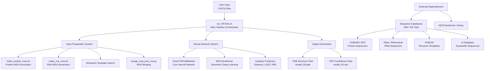
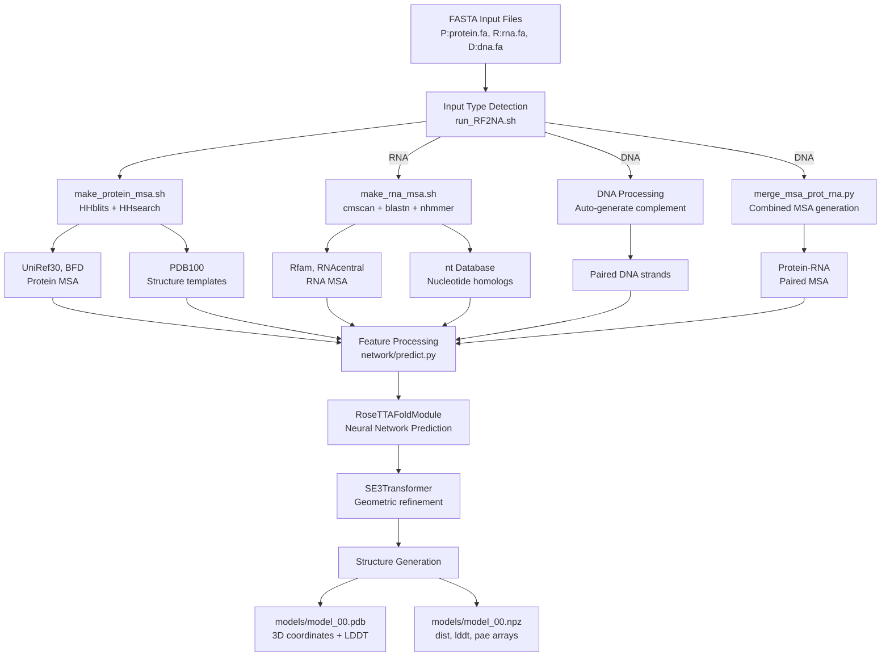
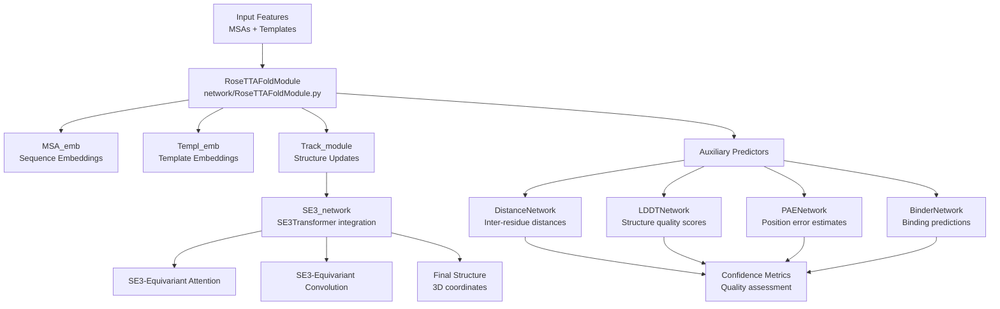

# Overview

# Overview

> **Relevant source files**
> - [README\.md](https://github.com/uw-ipd/RoseTTAFold2NA/blob/f761af28/README.md?plain=1)

## Purpose and Scope

 RoseTTAFold2NA is a deep learning system for predicting the three\-dimensional structures of protein\-nucleic acid complexes\. It extends the original RoseTTAFold architecture to handle RNA and DNA molecules in addition to proteins, enabling structure prediction for protein\-RNA, protein\-DNA, and protein\-nucleic acid complexes\.

 This document provides a high\-level overview of the RoseTTAFold2NA system architecture, main components, and data flow\. For detailed installation instructions, see [Installation and Environment Setup](https://deepwiki.com/uw-ipd/RoseTTAFold2NA/2.1-installation-and-environment-setup)\. For step\-by\-step usage instructions, see [Quick Start Tutorial](https://deepwiki.com/uw-ipd/RoseTTAFold2NA/2.2-quick-start-tutorial)\. For technical details about the neural network architecture, see [Neural Network Architecture](https://deepwiki.com/uw-ipd/RoseTTAFold2NA/5-neural-network-architecture)\.

## System Architecture

 The RoseTTAFold2NA system consists of three primary subsystems that work together to generate structure predictions:

### High\-Level System Components



 Sources: [README\.md?plain=1 L1-L100](https://github.com/uw-ipd/RoseTTAFold2NA/blob/f761af28/README.md?plain=1#L1-L100)

## Main Prediction Workflow

 The system processes input sequences through a multi\-stage pipeline that generates multiple sequence alignments \(MSAs\), searches for structural templates, and runs neural network prediction:

### Complete Data Flow Pipeline



 Sources: [README\.md?plain=1 L79-L100](https://github.com/uw-ipd/RoseTTAFold2NA/blob/f761af28/README.md?plain=1#L79-L100)

## Core System Components

### Input Processing System

 The input preparation system handles multiple sequence types and generates the necessary features for neural network prediction:

| Component | Purpose | Key Scripts | Databases Used |
| --- | --- | --- | --- |
| Protein MSA Generation | Generate protein multiple sequence alignments | make\_protein\_msa\.sh | UniRef30, BFD |
| RNA MSA Generation | Generate RNA multiple sequence alignments | make\_rna\_msa\.sh | Rfam, RNAcentral, nt |
| Template Search | Find structural templates | HHsearch integration | PDB100 |
| MSA Merging | Combine protein\-RNA MSAs | merge\_msa\_prot\_rna\.py | Combined data |

 Sources: [README\.md?plain=1 L42-L77](https://github.com/uw-ipd/RoseTTAFold2NA/blob/f761af28/README.md?plain=1#L42-L77)

### Neural Network System

 The core prediction engine uses a sophisticated neural architecture with geometric deep learning components:



 Sources: [README\.md?plain=1 L23-L29](https://github.com/uw-ipd/RoseTTAFold2NA/blob/f761af28/README.md?plain=1#L23-L29)

### Database Dependencies

 The system requires substantial external databases for sequence and structure searches:

| Database | Size | Purpose | Download Command |
| --- | --- | --- | --- |
| UniRef30\_2020\_06 | 46G | Protein sequences | wget http://wwwuser\.gwdg\.de/~compbiol/uniclust/2020\_06/UniRef30\_2020\_06\_hhsuite\.tar\.gz |
| BFD | 272G | Protein sequences | wget https://bfd\.mmseqs\.com/bfd\_metaclust\_clu\_complete\_id30\_c90\_final\_seq\.sorted\_opt\.tar\.gz |
| PDB100 | ~3G | Structure templates | wget https://files\.ipd\.uw\.edu/pub/RoseTTAFold/pdb100\_2021Mar03\.tar\.gz |
| Rfam | 300M | RNA families | wget ftp://ftp\.ebi\.ac\.uk/pub/databases/Rfam/CURRENT/Rfam\.cm\.gz |
| RNAcentral | 12G | RNA sequences | wget ftp://ftp\.ebi\.ac\.uk/pub/databases/RNAcentral/current\_release/sequences/rnacentral\_species\_specific\_ids\.fasta\.gz |
| nt | 151G | Nucleotide sequences | update\_blastdb\.pl \-\-decompress nt |

 Sources: [README\.md?plain=1 L42-L77](https://github.com/uw-ipd/RoseTTAFold2NA/blob/f761af28/README.md?plain=1#L42-L77)

## Input and Output Specifications

### Input Format

 RoseTTAFold2NA accepts FASTA files with specific chain type prefixes:

 - `P:protein.fa` \- Protein chains
- `R:rna.fa` \- RNA chains
- `D:dna.fa` \- Double\-stranded DNA \(complement auto\-generated\)
- `S:ssdna.fa` \- Single\-stranded DNA
- `PR:mixed.fa` \- Paired protein/RNA sequences

 Sources: [README\.md?plain=1 L88-L90](https://github.com/uw-ipd/RoseTTAFold2NA/blob/f761af28/README.md?plain=1#L88-L90)

### Output Format

 The system generates two primary output files:

 1. **`models/model_00.pdb`** \- 3D structure coordinates with per\-residue LDDT confidence scores in the B\-factor column
2. **`models/model_00.npz`** \- NumPy compressed arrays containing: - `dist` \(L×L×37\) \- Predicted distance distributions - `lddt` \(L\) \- Per\-residue local distance difference test scores - `pae` \(L×L\) \- Predicted aligned error between residue pairs

 Sources: [README\.md?plain=1 L92-L99](https://github.com/uw-ipd/RoseTTAFold2NA/blob/f761af28/README.md?plain=1#L92-L99)

## Usage Example

 Basic prediction workflow:

```
conda activate RF2NAcd example# Protein-RNA complex prediction../run_RF2NA.sh rna_pred rna_binding_protein.fa R:RNA.fa# Protein-DNA complex prediction  ../run_RF2NA.sh dna_pred dna_binding_protein.fa D:DNA.fa
```

 Sources: [README\.md?plain=1 L80-L87](https://github.com/uw-ipd/RoseTTAFold2NA/blob/f761af28/README.md?plain=1#L80-L87)

---
*Source: [https://deepwiki.com/uw-ipd/RoseTTAFold2NA/1-overview](https://deepwiki.com/uw-ipd/RoseTTAFold2NA/1-overview) on DeepWiki*