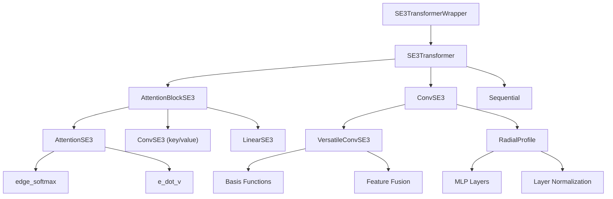
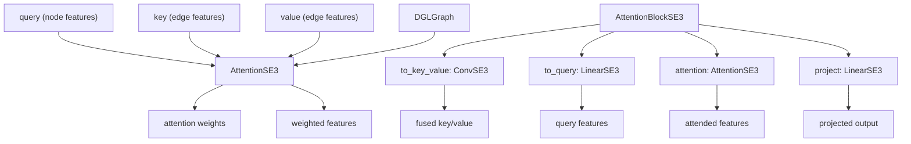
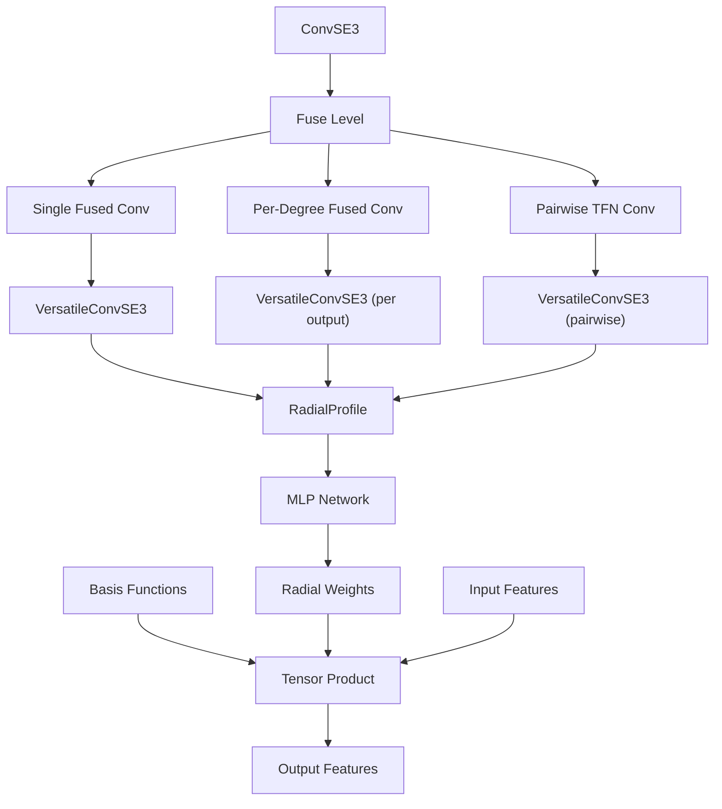

# SE(3)-Equivariant Components

> **Relevant source files**
> * [SE3Transformer/se3_transformer/model/layers/attention.py](https://github.com/uw-ipd/RoseTTAFold2NA/blob/f761af28/SE3Transformer/se3_transformer/model/layers/attention.py)
> * [SE3Transformer/se3_transformer/model/layers/convolution.py](https://github.com/uw-ipd/RoseTTAFold2NA/blob/f761af28/SE3Transformer/se3_transformer/model/layers/convolution.py)
> * [SE3Transformer/se3_transformer/model/transformer.py](https://github.com/uw-ipd/RoseTTAFold2NA/blob/f761af28/SE3Transformer/se3_transformer/model/transformer.py)
> * [network/SE3_network.py](https://github.com/uw-ipd/RoseTTAFold2NA/blob/f761af28/network/SE3_network.py)

This document covers the SE(3)-equivariant neural network components used in RoseTTAFold2NA for geometric deep learning on molecular structures. These components maintain equivariance under 3D rotations and translations, making them well-suited for protein and nucleic acid structure prediction. For information about the core RoseTTAFold module that uses these components, see [Core RoseTTAFold Module](/uw-ipd/RoseTTAFold2NA/5.1-core-rosettafold-module). For details about attention mechanisms in the main network, see [Attention and Track Modules](/uw-ipd/RoseTTAFold2NA/5.3-attention-and-track-modules).

## SE(3) Equivariance Overview

SE(3)-equivariant networks preserve their mathematical structure when inputs undergo rotations and translations in 3D space. This property is essential for molecular structure prediction because protein and nucleic acid structures should be prediction-invariant to their orientation in space.

The SE(3)-equivariant components in RoseTTAFold2NA are based on NVIDIA's SE3Transformer library, which implements Tensor Field Networks (TFNs) and equivariant attention mechanisms.

## Component Architecture



**SE(3)-Equivariant Component Hierarchy**

Sources: [SE3Transformer/se3_transformer/model/transformer.py L63-L194](https://github.com/uw-ipd/RoseTTAFold2NA/blob/f761af28/SE3Transformer/se3_transformer/model/transformer.py#L63-L194)

 [network/SE3_network.py L12-L89](https://github.com/uw-ipd/RoseTTAFold2NA/blob/f761af28/network/SE3_network.py#L12-L89)

 [SE3Transformer/se3_transformer/model/layers/attention.py L40-L204](https://github.com/uw-ipd/RoseTTAFold2NA/blob/f761af28/SE3Transformer/se3_transformer/model/layers/attention.py#L40-L204)

 [SE3Transformer/se3_transformer/model/layers/convolution.py L203-L392](https://github.com/uw-ipd/RoseTTAFold2NA/blob/f761af28/SE3Transformer/se3_transformer/model/layers/convolution.py#L203-L392)

## Core SE(3) Classes

### SE3Transformer Class

The `SE3Transformer` class is the main entry point for SE(3)-equivariant processing. It stacks multiple attention and convolution layers while maintaining equivariance.

| Parameter | Type | Description |
| --- | --- | --- |
| `num_layers` | int | Number of attention layers |
| `fiber_in` | Fiber | Input feature fiber description |
| `fiber_hidden` | Fiber | Hidden layer fiber description |
| `fiber_out` | Fiber | Output feature fiber description |
| `num_heads` | int | Number of attention heads |
| `channels_div` | int | Channel division factor |
| `tensor_cores` | bool | Enable Tensor Core optimizations |
| `low_memory` | bool | Use memory-efficient operations |

Sources: [SE3Transformer/se3_transformer/model/transformer.py L63-L96](https://github.com/uw-ipd/RoseTTAFold2NA/blob/f761af28/SE3Transformer/se3_transformer/model/transformer.py#L63-L96)

### AttentionSE3 and AttentionBlockSE3

The attention mechanisms maintain SE(3)-equivariance through careful handling of different feature types (scalars, vectors, tensors).



**SE(3)-Equivariant Attention Flow**

Sources: [SE3Transformer/se3_transformer/model/layers/attention.py L40-L103](https://github.com/uw-ipd/RoseTTAFold2NA/blob/f761af28/SE3Transformer/se3_transformer/model/layers/attention.py#L40-L103)

 [SE3Transformer/se3_transformer/model/layers/attention.py L106-L204](https://github.com/uw-ipd/RoseTTAFold2NA/blob/f761af28/SE3Transformer/se3_transformer/model/layers/attention.py#L106-L204)

### ConvSE3 and VersatileConvSE3

The convolution layers implement Tensor Field Network operations with multiple fusion levels for optimization.



**ConvSE3 Fusion Levels and Processing**

Sources: [SE3Transformer/se3_transformer/model/layers/convolution.py L203-L392](https://github.com/uw-ipd/RoseTTAFold2NA/blob/f761af28/SE3Transformer/se3_transformer/model/layers/convolution.py#L203-L392)

 [SE3Transformer/se3_transformer/model/layers/convolution.py L121-L201](https://github.com/uw-ipd/RoseTTAFold2NA/blob/f761af28/SE3Transformer/se3_transformer/model/layers/convolution.py#L121-L201)

 [SE3Transformer/se3_transformer/model/layers/convolution.py L71-L119](https://github.com/uw-ipd/RoseTTAFold2NA/blob/f761af28/SE3Transformer/se3_transformer/model/layers/convolution.py#L71-L119)

## Fiber System

The SE3Transformer uses a `Fiber` system to describe feature types and their degrees:

| Degree | Type | Dimension | Description |
| --- | --- | --- | --- |
| 0 | Scalar | 1 | Rotation-invariant features |
| 1 | Vector | 3 | Rotation-equivariant vectors |
| 2 | Tensor | 5 | Second-order tensors |
| 3+ | Higher | 2l+1 | Higher-order spherical harmonics |

Sources: [se3_transformer.model.fiber module usage throughout codebase](https://github.com/uw-ipd/RoseTTAFold2NA/blob/f761af28/se3_transformer.model.fiber module usage throughout codebase)

## Integration with RoseTTAFold2NA

The `SE3TransformerWrapper` class in [network/SE3_network.py L12-L89](https://github.com/uw-ipd/RoseTTAFold2NA/blob/f761af28/network/SE3_network.py#L12-L89)

 integrates the SE3Transformer into the RoseTTAFold2NA architecture:

```python
# From SE3_network.pyclass SE3TransformerWrapper(nn.Module):    def __init__(self, num_layers=2, num_channels=32, num_degrees=3,                  n_heads=4, div=4, l0_in_features=32, l0_out_features=32,                 l1_in_features=3, l1_out_features=2, num_edge_features=32)
```

### Key Configuration Parameters

| Parameter | Default | Purpose |
| --- | --- | --- |
| `num_layers` | 2 | SE3 transformer layers |
| `num_channels` | 32 | Hidden channel count |
| `num_degrees` | 3 | Maximum spherical harmonic degree |
| `n_heads` | 4 | Attention heads |
| `l0_in_features` | 32 | Scalar input features |
| `l1_in_features` | 3 | Vector input features |
| `l1_out_features` | 2 | Vector output features |

Sources: [network/SE3_network.py L14-L17](https://github.com/uw-ipd/RoseTTAFold2NA/blob/f761af28/network/SE3_network.py#L14-L17)

## Memory and Performance Optimizations

The SE(3) components include several optimization strategies:

### Fusion Levels

* **FULL**: All features fused into single tensor operations
* **PARTIAL**: Features fused by input or output degree
* **NONE**: Standard pairwise tensor field operations

### Memory Management

* `tensor_cores=True`: Enable Tensor Core optimizations on modern GPUs
* `low_memory=True`: Use slower but memory-efficient operations
* Edge stride processing for large graphs: [SE3Transformer/se3_transformer/model/layers/convolution.py L167-L201](https://github.com/uw-ipd/RoseTTAFold2NA/blob/f761af28/SE3Transformer/se3_transformer/model/layers/convolution.py#L167-L201)

Sources: [SE3Transformer/se3_transformer/model/layers/convolution.py L40-L69](https://github.com/uw-ipd/RoseTTAFold2NA/blob/f761af28/SE3Transformer/se3_transformer/model/layers/convolution.py#L40-L69)

 [SE3Transformer/se3_transformer/model/transformer.py L109-L114](https://github.com/uw-ipd/RoseTTAFold2NA/blob/f761af28/SE3Transformer/se3_transformer/model/transformer.py#L109-L114)

## Mathematical Foundation

SE(3)-equivariant operations preserve the structure:

```
f(Rx + t) = Rf(x)
```

Where `R` is a rotation matrix and `t` is a translation vector. The implementation uses:

1. **Spherical harmonics** as basis functions for rotational equivariance
2. **Tensor products** between features and basis functions
3. **Radial functions** that depend only on distances (rotation-invariant)
4. **Graph message passing** for neighborhood aggregation

Sources: [SE3Transformer/se3_transformer/model/layers/convolution.py L71-L119](https://github.com/uw-ipd/RoseTTAFold2NA/blob/f761af28/SE3Transformer/se3_transformer/model/layers/convolution.py#L71-L119)

 [SE3Transformer/se3_transformer/model/basis.py referenced in transformer.py](https://github.com/uw-ipd/RoseTTAFold2NA/blob/f761af28/SE3Transformer/se3_transformer/model/basis.py referenced in transformer.py)