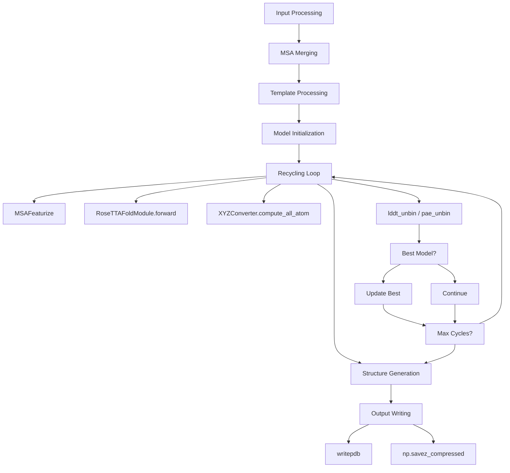
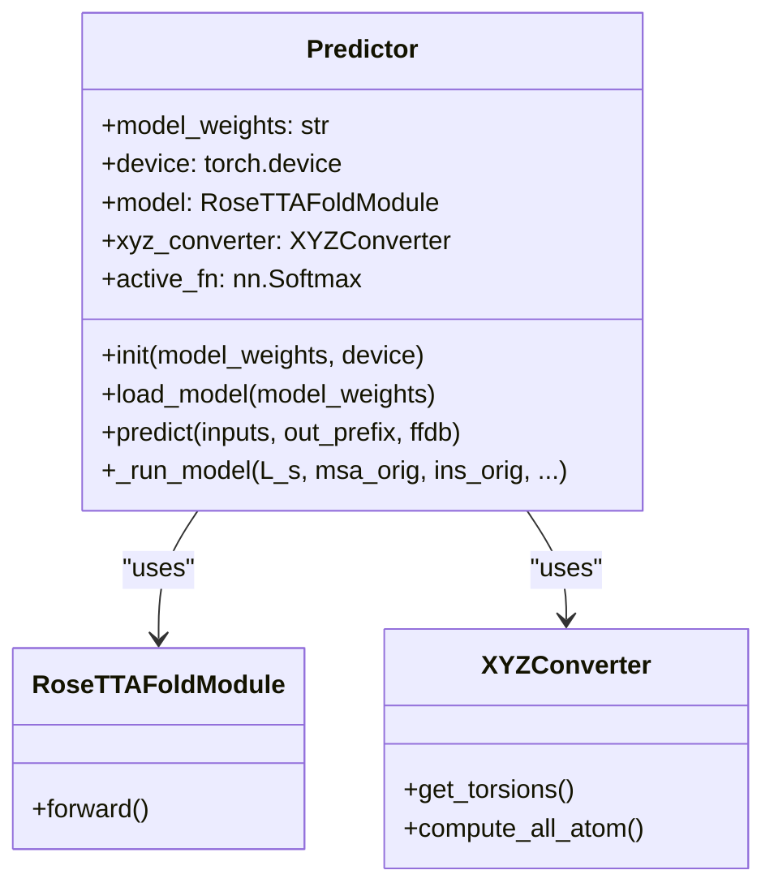
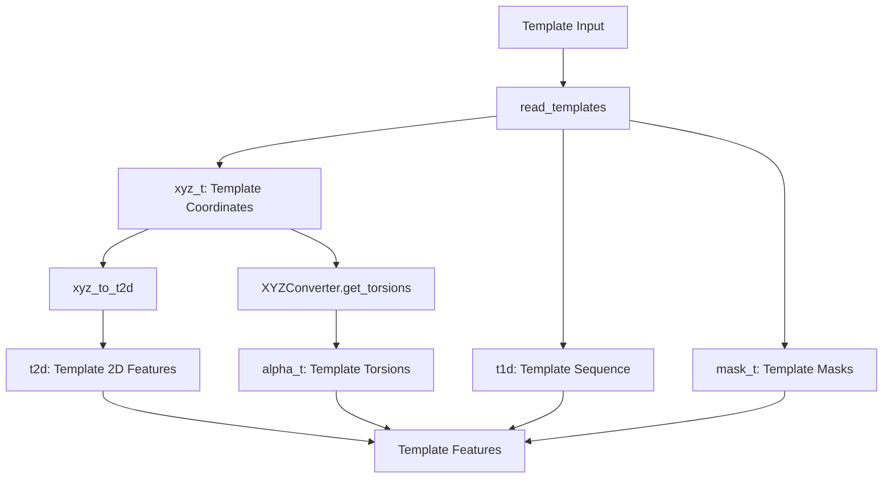
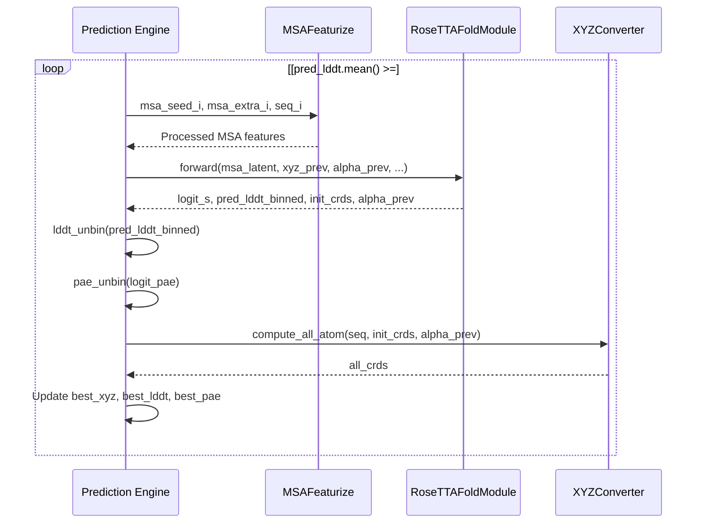
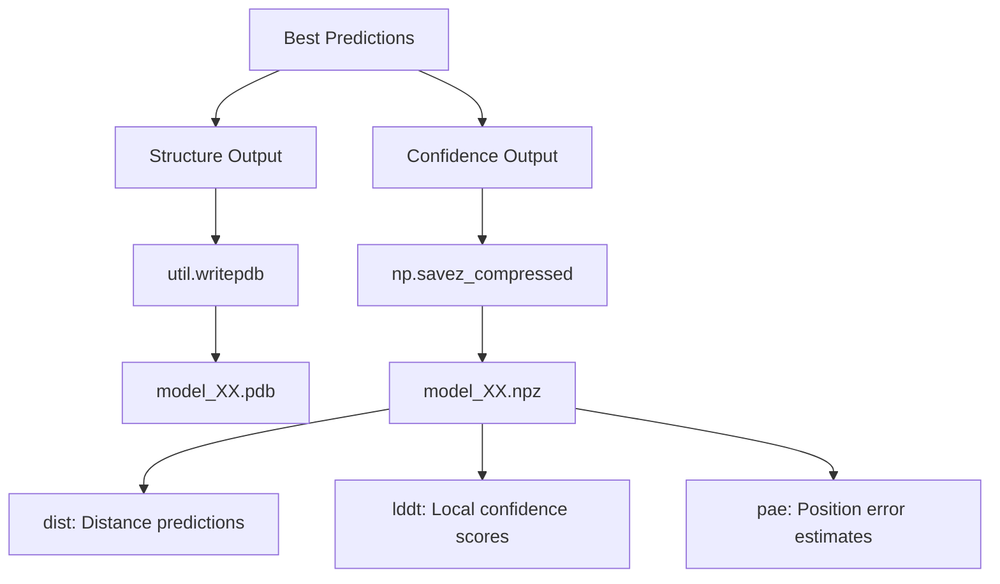

# Structure Prediction Engine

> **Relevant source files**
> * [network/predict.py](https://github.com/uw-ipd/RoseTTAFold2NA/blob/f761af28/network/predict.py)
> * [network/util.py](https://github.com/uw-ipd/RoseTTAFold2NA/blob/f761af28/network/util.py)

The Structure Prediction Engine is the core prediction module that orchestrates the RoseTTAFold2NA neural network to generate protein-nucleic acid complex structures. It handles input processing, model execution, iterative refinement, and output generation. For details about the underlying neural network architecture, see [Neural Network Architecture](/uw-ipd/RoseTTAFold2NA/5-neural-network-architecture). For information about input preparation that feeds into this engine, see [Input Preparation System](/uw-ipd/RoseTTAFold2NA/3-input-preparation-system).

## Core Prediction Workflow

The prediction engine follows a multi-stage workflow that processes inputs through iterative refinement cycles to generate final structural predictions.

### Prediction Pipeline Overview



Sources: [network/predict.py L139-L251](https://github.com/uw-ipd/RoseTTAFold2NA/blob/f761af28/network/predict.py#L139-L251)

 [network/predict.py L253-L357](https://github.com/uw-ipd/RoseTTAFold2NA/blob/f761af28/network/predict.py#L253-L357)

## Predictor Class Architecture

The `Predictor` class serves as the main orchestrator for the structure prediction process.

### Class Structure and Initialization



Sources: [network/predict.py L106-L131](https://github.com/uw-ipd/RoseTTAFold2NA/blob/f761af28/network/predict.py#L106-L131)

### Model Parameters and Configuration

The prediction engine uses several parameter sets to configure the neural network architecture:

| Parameter Set | Purpose | Key Settings |
| --- | --- | --- |
| `MODEL_PARAM` | Main architecture | `n_main_block: 32`, `d_msa: 256`, `d_pair: 128` |
| `SE3_param` | SE3 transformer | `num_layers: 1`, `num_channels: 32` |
| `SE3_ref_param` | SE3 refinement | `num_layers: 2`, `num_channels: 32` |

Sources: [network/predict.py L44-L87](https://github.com/uw-ipd/RoseTTAFold2NA/blob/f761af28/network/predict.py#L44-L87)

## Input Processing and Feature Generation

The prediction engine handles multiple input types and formats them for neural network consumption.

### Sequence Type Processing

Sources: [network/predict.py L143-L184](https://github.com/uw-ipd/RoseTTAFold2NA/blob/f761af28/network/predict.py#L143-L184)

### Template Feature Generation

The engine processes structural templates when available for protein sequences:



Sources: [network/predict.py L196-L244](https://github.com/uw-ipd/RoseTTAFold2NA/blob/f761af28/network/predict.py#L196-L244)

## Iterative Refinement Process

The core prediction uses iterative refinement through recycling to improve structure quality.

### Recycling Loop Implementation



Sources: [network/predict.py L291-L337](https://github.com/uw-ipd/RoseTTAFold2NA/blob/f761af28/network/predict.py#L291-L337)

### Quality Assessment Functions

The engine includes utility functions to convert model outputs to interpretable confidence scores:

```python
def lddt_unbin(pred_lddt):    # Converts binned LDDT predictions to continuous scores [0,1]    nbin = pred_lddt.shape[1]    bin_step = 1.0 / nbin    lddt_bins = torch.linspace(bin_step, 1.0, nbin, ...)    pred_lddt = nn.Softmax(dim=1)(pred_lddt)    return torch.sum(lddt_bins[None,:,None]*pred_lddt, dim=1) def pae_unbin(pred_pae):    # Converts binned PAE predictions to continuous error estimates    nbin = pred_pae.shape[1]    bin_step = 0.5    pae_bins = torch.linspace(bin_step, bin_step*(nbin-1), nbin, ...)    pred_pae = nn.Softmax(dim=1)(pred_pae)    return torch.sum(pae_bins[None,:,None,None]*pred_pae, dim=1)
```

Sources: [network/predict.py L89-L104](https://github.com/uw-ipd/RoseTTAFold2NA/blob/f761af28/network/predict.py#L89-L104)

## Output Generation

The prediction engine generates two types of outputs: structural coordinates and confidence data.

### Output File Generation



Sources: [network/predict.py L350-L356](https://github.com/uw-ipd/RoseTTAFold2NA/blob/f761af28/network/predict.py#L350-L356)

### PDB Writing Utilities

The engine uses utility functions from `util.py` for coordinate transformations and file output:

| Function | Purpose | Key Features |
| --- | --- | --- |
| `writepdb` | PDB file generation | Chain handling, B-factor assignment |
| `center_and_realign_missing` | Structure centering | Missing residue handling |
| `idealize_reference_frame` | Frame idealization | Protein/nucleic acid specific |

Sources: [network/util.py L181-L221](https://github.com/uw-ipd/RoseTTAFold2NA/blob/f761af28/network/util.py#L181-L221)

 [network/util.py L21-L40](https://github.com/uw-ipd/RoseTTAFold2NA/blob/f761af28/network/util.py#L21-L40)

 [network/util.py L115-L136](https://github.com/uw-ipd/RoseTTAFold2NA/blob/f761af28/network/util.py#L115-L136)

## Performance and Memory Management

The prediction engine includes several optimizations for computational efficiency:

### Memory Management Strategies

* **Sequence Limiting**: Maximum 2048 sequences in MSA (`MAXSEQ = 2048`)
* **Latent Limiting**: Maximum 256 latent sequences (`MAXLAT = 256`)
* **CUDA Cache Clearing**: `torch.cuda.empty_cache()` after each model run
* **Mixed Precision**: `torch.cuda.amp.autocast(True)` during forward pass

Sources: [network/predict.py L42-L43](https://github.com/uw-ipd/RoseTTAFold2NA/blob/f761af28/network/predict.py#L42-L43)

 [network/predict.py L168-L172](https://github.com/uw-ipd/RoseTTAFold2NA/blob/f761af28/network/predict.py#L168-L172)

 [network/predict.py L251](https://github.com/uw-ipd/RoseTTAFold2NA/blob/f761af28/network/predict.py#L251-L251)

 [network/predict.py L295](https://github.com/uw-ipd/RoseTTAFold2NA/blob/f761af28/network/predict.py#L295-L295)

### Recycling Parameters

| Parameter | Value | Purpose |
| --- | --- | --- |
| `MAX_CYCLE` | 10 | Maximum refinement iterations |
| `NMODELS` | 1 | Number of models to generate |
| `NBIN` | [37, 37, 37, 19] | Distance/angle binning |

Sources: [network/predict.py L37-L39](https://github.com/uw-ipd/RoseTTAFold2NA/blob/f761af28/network/predict.py#L37-L39)