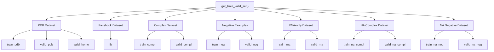
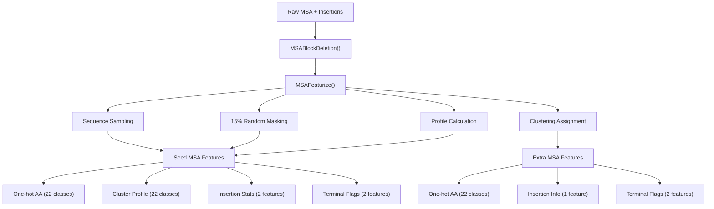
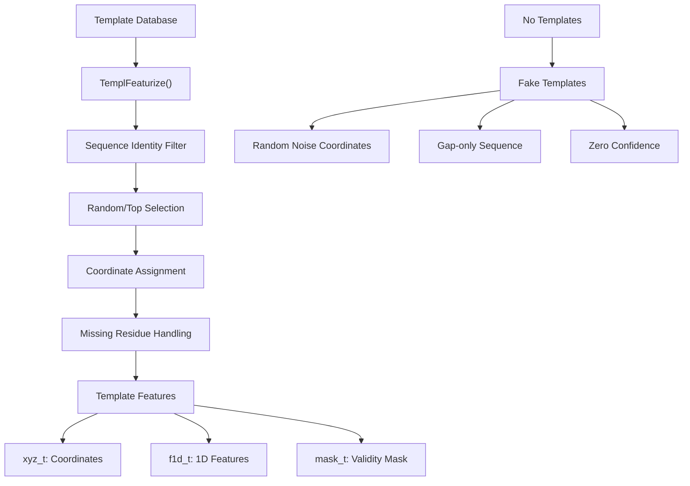
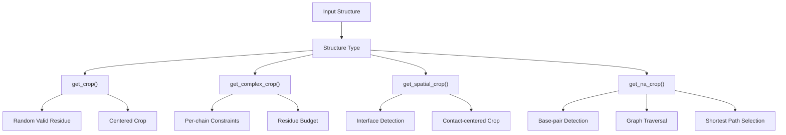
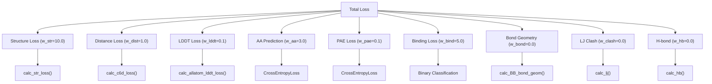
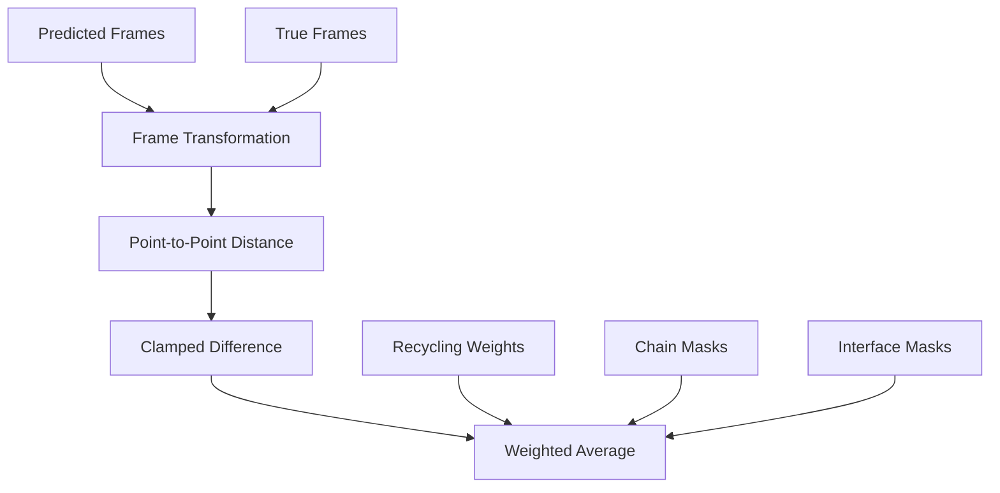
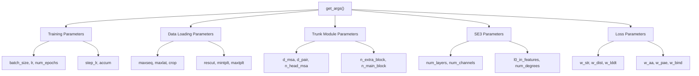
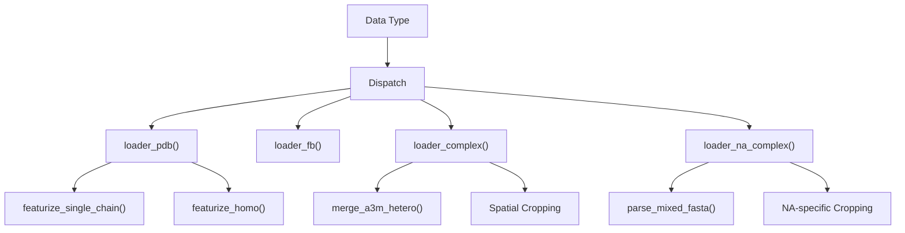

# Training System

> **Relevant source files**
> * [network/arguments.py](https://github.com/uw-ipd/RoseTTAFold2NA/blob/f761af28/network/arguments.py)
> * [network/data_loader.py](https://github.com/uw-ipd/RoseTTAFold2NA/blob/f761af28/network/data_loader.py)
> * [network/loss.py](https://github.com/uw-ipd/RoseTTAFold2NA/blob/f761af28/network/loss.py)

The Training System encompasses the data loading, loss computation, and parameter configuration components that enable supervised learning of the RoseTTAFold2NA neural network. This system handles diverse structural biology datasets including single proteins, RNA structures, protein-nucleic acid complexes, and negative examples, applying sophisticated data augmentation and multi-objective loss functions.

For information about the neural network architecture being trained, see [Core RoseTTAFold Module](/uw-ipd/RoseTTAFold2NA/5.1-core-rosettafold-module). For details about the prediction pipeline that uses trained models, see [Structure Prediction Engine](/uw-ipd/RoseTTAFold2NA/4.3-structure-prediction-engine).

## Training Data Management

The training system manages multiple heterogeneous datasets through a unified data loading framework that handles proteins, nucleic acids, and their complexes.

### Dataset Organization



The system maintains separate training and validation splits across all dataset types, with clustering-based organization to prevent data leakage. Each dataset type has associated weights based on sequence length to balance training contributions.

**Sources:** [network/data_loader.py L285-L600](https://github.com/uw-ipd/RoseTTAFold2NA/blob/f761af28/network/data_loader.py#L285-L600)

### Data Loading Parameters

| Parameter Category | Key Parameters | Default Values | Purpose |
| --- | --- | --- | --- |
| Sequence Limits | `MAXSEQ`, `MAXLAT` | 1024, 128 | Control MSA depth |
| Cropping | `CROP` | 256 | Maximum residues per batch |
| Quality Filters | `RESCUT`, `PLDDTCUT` | 4.5Å, 70.0 | Structure quality thresholds |
| Templates | `MINTPLT`, `MAXTPLT` | 0, 5 | Template count range |
| Recycling | `MAXCYCLE` | 4 | Training iteration cycles |

**Sources:** [network/data_loader.py L27-L65](https://github.com/uw-ipd/RoseTTAFold2NA/blob/f761af28/network/data_loader.py#L27-L65)

 [network/arguments.py L36-L58](https://github.com/uw-ipd/RoseTTAFold2NA/blob/f761af28/network/arguments.py#L36-L58)

## MSA Processing and Featurization

The system transforms raw MSA data into neural network features through a sophisticated pipeline that includes clustering, masking, and statistical calculations.

### MSA Feature Pipeline



The `MSAFeaturize` function implements a multi-cycle approach where each cycle generates different random crops and masking patterns, providing data augmentation during training.

**Sources:** [network/data_loader.py L89-L225](https://github.com/uw-ipd/RoseTTAFold2NA/blob/f761af28/network/data_loader.py#L89-L225)

### Masking Strategy

The masking strategy follows a sophisticated protocol:

* 70% of masked positions use special mask token (`MASKINDEX`)
* 10% use random amino acids
* 10% use amino acids sampled from MSA profile
* 10% remain unchanged

This approach, implemented in lines 141-153 of the data loader, helps the model learn robust sequence representations.

**Sources:** [network/data_loader.py L136-L153](https://github.com/uw-ipd/RoseTTAFold2NA/blob/f761af28/network/data_loader.py#L136-L153)

## Template Processing

Template structures provide geometric priors for structure prediction through the `TemplFeaturize` function.

### Template Selection and Processing



Templates are filtered by sequence identity (`seqID_cut`) and randomly selected up to `npick` count. Missing templates are replaced with noisy fake templates to maintain consistent input dimensions.

**Sources:** [network/data_loader.py L227-L283](https://github.com/uw-ipd/RoseTTAFold2NA/blob/f761af28/network/data_loader.py#L227-L283)

## Data Augmentation

The training system applies extensive data augmentation to improve model generalization.

### Cropping Strategies

The system implements multiple cropping strategies based on data type:



For nucleic acid complexes, the system uses sophisticated graph-based cropping that identifies base pairs and interface contacts, then selects residues via shortest-path algorithms to maintain structural connectivity.

**Sources:** [network/data_loader.py L602-L808](https://github.com/uw-ipd/RoseTTAFold2NA/blob/f761af28/network/data_loader.py#L602-L808)

### Nucleic Acid Augmentation

For DNA complexes, the system can apply sequence padding by adding random complementary base pairs at termini:

```markdown
# Padding implementation adds 0-5 random bases at each endlpad = np.random.randint(6)rpad = np.random.randint(6)# Complementary sequences: lseq2 = 3-flip(rseq1)
```

This augmentation, controlled by the `padding` parameter, helps the model handle variable-length nucleic acid sequences.

**Sources:** [network/data_loader.py L1268-L1298](https://github.com/uw-ipd/RoseTTAFold2NA/blob/f761af28/network/data_loader.py#L1268-L1298)

## Loss Function Architecture

The training system employs a multi-objective loss function that combines structural, geometric, and chemical constraints.

### Loss Components Overview



### Frame Aligned Point Error (FAPE)

The primary structural loss uses Frame Aligned Point Error, implemented in `calc_str_loss`:



FAPE loss computes transformations between rigid frames (N-CA-C for proteins, equivalent for nucleic acids) and measures coordinate differences in the local frame coordinate system. This approach is robust to global rotations and translations.

**Sources:** [network/loss.py L33-L94](https://github.com/uw-ipd/RoseTTAFold2NA/blob/f761af28/network/loss.py#L33-L94)

### Chemical Potential Losses

For high-accuracy structure refinement, the system includes Rosetta-style chemical potential functions:

#### Lennard-Jones Potential

The `calc_lj` function implements a 12-6 Lennard-Jones potential with linear switching for clash detection:

```markdown
# LJ potential with linear region for r < lj_lin*sigmaljE = epsilon * (sd12 - 2 * sd6)  # Standard 12-6 LJ# Linear correction for close contactsljE[linpart] += epsilon * derivative * (dist - deff)
```

#### Hydrogen Bonding

The `calc_hb` function evaluates geometric hydrogen bond criteria including:

* Donor-acceptor distance
* Angle-dependent terms (AHD angle)
* Hybridization-specific geometry (SP2, SP3, ring)

**Sources:** [network/loss.py L306-L547](https://github.com/uw-ipd/RoseTTAFold2NA/blob/f761af28/network/loss.py#L306-L547)

## Training Configuration

The training system provides extensive configuration through command-line arguments organized into logical groups.

### Parameter Organization



### Default Training Configuration

| Component | Parameter | Default | Description |
| --- | --- | --- | --- |
| Optimization | `lr` | 2e-4 | Learning rate |
| Architecture | `d_msa` | 256 | MSA feature dimension |
| Architecture | `d_pair` | 128 | Pair feature dimension |
| SE3 Network | `num_layers` | 1 | SE3 transformer layers |
| Loss Weights | `w_str` | 10.0 | Structure loss weight |
| Loss Weights | `w_aa` | 3.0 | MSA prediction weight |

**Sources:** [network/arguments.py L13-L175](https://github.com/uw-ipd/RoseTTAFold2NA/blob/f761af28/network/arguments.py#L13-L175)

## Specialized Loaders

The system provides specialized data loaders for different molecular systems.

### Loader Functions



Each loader handles the specific requirements of its molecular system:

* **`loader_pdb`**: Handles single proteins with optional homo-oligomer modeling
* **`loader_fb`**: Processes AlphaFold models with confidence-based masking
* **`loader_complex`**: Manages protein-protein complexes with paired MSAs
* **`loader_na_complex`**: Handles protein-nucleic acid complexes with base-pairing

**Sources:** [network/data_loader.py L844-L1592](https://github.com/uw-ipd/RoseTTAFold2NA/blob/f761af28/network/data_loader.py#L844-L1592)

### Complex Assembly Handling

For multi-chain complexes, the system applies biological assembly transformations:

```markdown
# Assembly transformation applicationxformA = meta['asmb_xform%d'%assem[0]][assem[1]]xformB = meta['asmb_xform%d'%assem[2]][assem[3]]xyzA = torch.einsum('ij,raj->rai', xformA[:3,:3], pdbA['xyz']) + xformA[:3,3]
```

This ensures complexes are presented in their biologically relevant conformations rather than crystal packing arrangements.

**Sources:** [network/data_loader.py L1125-L1141](https://github.com/uw-ipd/RoseTTAFold2NA/blob/f761af28/network/data_loader.py#L1125-L1141)