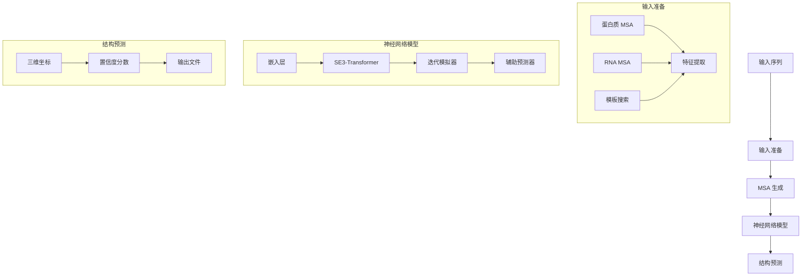

---
slug:1-overview
blog_type:normal
---

RoseTTAFold2NA 是一种先进的深度学习模型，用于预测蛋白质-核酸复合物的三维结构。作为原始 RoseTTAFold 的扩展版本，这个专门版本增加了对 RNA 和 DNA 分子的支持，使研究人员能够在原子水平上预测蛋白质与核酸的相互作用。这种能力对于理解基本生物过程和开发新疗法至关重要。

## 什么是 RoseTTAFold2NA？

RoseTTAFold2NA 在 RoseTTAFold 的成功基础上，将核酸纳入其结构预测流程。该模型使用三轨神经网络，同时处理蛋白质序列、氨基酸配对关系和三维坐标，以生成准确的结构预测。RoseTTAFold2NA 的独特之处在于它能够处理包含蛋白质、RNA 和 DNA 的各种组合的复合物，使其成为结构生物学研究的多功能工具。

该模型利用 **SE(3)-Transformers**，这是一种在三维旋转和平移下等变的图神经网络。这种数学特性确保无论输入分子在空间中如何取向，模型的预测都能保持一致，从而产生更稳定可靠的预测。

来源：[README.md#L1-L2](README.md#L1-L2), [SE3Transformer/README.md#L51-L53](SE3Transformer/README.md#L51-L53)

## 主要功能和特性

RoseTTAFold2NA 提供了多项强大功能，使其在结构预测领域脱颖而出：

1. **多分子支持**：该模型可以预测各种生物分子组合的结构：
   - 纯蛋白质结构
   - 蛋白质-RNA 复合物
   - 蛋白质-DNA 复合物
   - 包含不同类型多条链的复合物

2. **置信度指标**：对于每个预测，RoseTTAFold2NA 提供每个残基的置信度分数（LDDT）和预测对齐误差（PAE），帮助研究人员评估预测结构不同部分的可靠性。

3. **模板整合**：当存在同源结构时，该模型可以整合已知结构（模板）的信息来提高预测准确性。

4. **MSA 生成**：该流程包含专门工具，用于为蛋白质和 RNA 生成多序列比对（MSA），这是准确结构预测的关键输入。

5. **迭代优化**：该模型使用回收机制迭代优化其预测，从而产生越来越准确的结构。

来源：[README.md#L89-L99](README.md#L89-L99), [RoseTTAFoldModel.py#L75-L84](network/RoseTTAFoldModel.py#L75-L84)

## 架构概述

RoseTTAFold2NA 架构由几个关键组件组成，它们协同工作以预测三维结构：

该模型通过几个阶段处理输入序列：

1. **输入准备**：处理序列以生成 MSA 并搜索结构模板。对于蛋白质，这涉及使用 HHblits 对 UniRef30 和 BFD 数据库进行搜索。对于 RNA，该流程使用 cmscan 对 Rfam 数据库和 blastn 对 RNAcentral 及 nt 数据库进行搜索。

2. **嵌入层**：通过专门的嵌入层将处理后的输入转换为数值表示，这些层处理 MSA 数据、附加特征和模板信息。

3. **SE3-Transformer**：该组件以旋转和平移等变的方式处理三维结构信息，确保无论输入取向如何都能保持一致的预测。

4. **迭代模拟器**：模型的核心，通过回收先前迭代的信息来迭代优化预测结构。

5. **辅助预测器**：这些组件生成额外输出，如距离预测、掩码标记预测和置信度分数。

来源：[run_RF2NA.sh#L27-L53](run_RF2NA.sh#L27-L53), [RoseTTAFoldModel.py#L23-L31](network/RoseTTAFoldModel.py#L23-L31), [RoseTTAFoldModel.py#L34-L53](network/RoseTTAFoldModel.py#L34-L53)

## 实际应用

RoseTTAFold2NA 在基础研究和药物发现中有众多应用：

1. **理解蛋白质-核酸相互作用**：研究人员可以预测蛋白质如何与 RNA 或 DNA 结合，为基因调控、蛋白质合成和其他基本过程提供见解。

2. **药物发现**：通过揭示蛋白质-核酸复合物的详细结构，该模型可以帮助识别治疗化合物的潜在结合位点。

3. **蛋白质工程**：通过预测突变如何影响蛋白质-核酸相互作用，该模型可以指导设计具有所需结合特性的蛋白质。

4. **RNA 结构预测**：该模型可以预测 RNA 分子及其与蛋白质的复合物的三维结构，鉴于 RNA 在治疗中的重要性日益增加，这尤其有价值。

5. **假设生成**：当实验结构不可用时，RoseTTAFold2NA 的预测可以生成关于分子相互作用和功能的可检验假设。

<CgxTip>
当能够为输入序列生成高质量的 MSA 时，RoseTTAFold2NA 的预测最为准确。对于同源物较少的新序列，预测准确性可能较低，应仔细检查置信度指标。
</CgxTip>

来源：[README.md#L83-L86](README.md#L83-L86), [README.md#L95-L99](README.md#L95-L99)

## 开始使用 RoseTTAFold2NA

要开始使用 RoseTTAFold2NA，您需要遵循几个设置步骤：

1. **安装**：克隆存储库并使用提供的配置文件创建 conda 环境。

2. **依赖项**：安装 SE3-Transformer 组件，这对于三维等变处理至关重要。

3. **模型权重**：下载预训练的模型权重，其中包含在蛋白质-核酸复合物上训练的学习参数。

4. **数据库**：下载并设置所需的序列和结构数据库，包括 UniRef30、BFD、PDB 模板以及 Rfam 和 RNAcentral 等 RNA 特定数据库。

5. **运行预测**：使用提供的脚本对您的序列运行预测，使用适当的标签指定每个分子的类型（蛋白质、RNA 或 DNA）。

典型的工作流程包括以 FASTA 格式准备输入序列，运行预测脚本，以及分析输出的 PDB 文件及其置信度指标。

来源：[README.md#L11-L39](README.md#L11-L39), [README.md#L79-L87](README.md#L79-L87)

## 结论

RoseTTAFold2NA 通过将 AI 驱动的结构预测能力扩展到包括蛋白质-核酸复合物，代表了计算结构生物学领域的重大进步。它整合了用于等变三维处理的 SE3-Transformers，并结合针对不同分子类型的专门输入准备，使其成为研究构成生命过程基础的分子相互作用的研究人员的强大工具。

随着我们继续探索蛋白质-核酸相互作用的广阔领域，像 RoseTTAFold2NA 这样的工具将在加速发现和加深我们对分子水平生物系统的理解方面发挥越来越重要的作用。