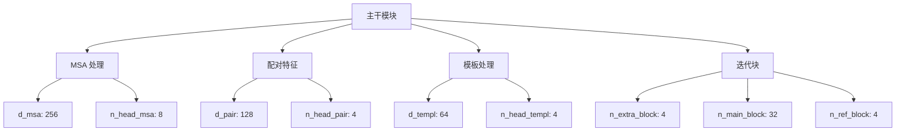
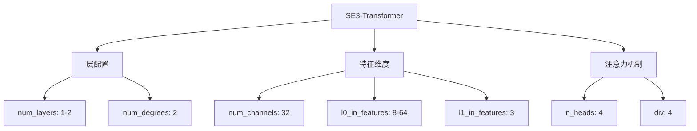

---
slug:10-model-parameters-and-configuration
blog_type:normal
---


理解和配置模型参数对于充分发挥 RoseTTAFold2NA 的最佳性能至关重要。本指南将为您详细介绍不同类型的参数、它们如何影响模型行为，以及如何针对特定用例进行自定义设置。

## 模型配置概述

RoseTTAFold2NA 采用分层配置系统，让您可以控制从基础模型架构到细粒度训练参数的所有内容。该配置系统在保持灵活性设计的同时，提供了适用于大多数蛋白质-核酸结构预测任务的合理默认值。

<CgxTip>
RoseTTAFold2NA 中的模型参数按逻辑分组组织：主干参数、SE(3)-Transformer 参数、损失函数权重和数据加载参数。这种组织方式便于理解和修改模型的特定方面而不影响其他部分。
</CgxTip>

## 预定义模型配置

RoseTTAFold2NA 提供两种开箱即用的预配置模型架构。这些配置在 `models.json` 中定义，代表了模型大小与性能之间的不同权衡。

### full_bigSE3 配置

`full_bigSE3` 配置使用更大的 SE(3)-Transformer，专为追求最高准确度而设计：

```json
{
    "description": "在完全连接图上使用大型 SE(3)-Transformer 的深度架构。在生物单元上训练",
    "model_param": {
        "n_extra_block": 4,
        "n_main_block": 32,
        "n_ref_block": 4,
        "d_msa": 256,
        "d_pair": 128,
        "d_templ": 64,
        "n_head_msa": 8,
        "n_head_pair": 4,
        "n_head_templ": 4,
        "d_hidden": 32,
        "d_hidden_templ": 64,
        "p_drop": 0.0,
        "lj_lin": 0.75
    }
}
```

**主要特点：**
- 使用 64 个输入/输出特征的大型 SE(3)-Transformer
- 更高容量的模板处理能力（d_hidden_templ: 64）
- 无 dropout（p_drop: 0.0）以实现最大模型利用率
- 当计算资源充足时，最适合高精度预测

来源：[models.json#L2-L33](network/models.json#L2-L33)

### full_smallSE3 配置

`full_smallSE3` 配置使用较小的 SE(3)-Transformer 以实现更快的推理速度：

```json
{
    "description": "在完全连接图上使用小型 SE(3)-Transformer 的深度架构。在生物单元上训练",
    "model_param": {
        "n_extra_block": 4,
        "n_main_block": 32,
        "n_ref_block": 4,
        "d_msa": 256,
        "d_pair": 128,
        "d_templ": 64,
        "n_head_msa": 8,
        "n_head_pair": 4,
        "n_head_templ": 4,
        "d_hidden": 32,
        "d_hidden_templ": 32,
        "p_drop": 0.0
    }
}
```

**主要特点：**
- 使用减小特征维度的小型 SE(3)-Transformer
- 推理速度更快，准确度略有降低
- 使用双 SE(3)-Transformer 配置（完整版和 topk 版）
- 在大多数应用中实现了速度与准确度的良好平衡

来源：[models.json#L34-L76](network/models.json#L34-L76)

## 参数类别及其用途

### 主干模块参数

主干模块构成 RoseTTAFold2NA 的核心，处理多序列比对（MSA）和模板信息。这些参数控制主要神经网络组件的架构和容量。



**关键主干参数：**

| 参数 | 默认值 | 描述 | 影响 |
|------|--------|------|------|
| `n_main_block` | 32 | 主迭代块数量 | 较高值增加模型容量和准确度，但会减慢推理速度 |
| `d_msa` | 256 | MSA 特征维度 | 较大值能捕获更复杂的模式，但会增加内存使用量 |
| `d_pair` | 128 | 配对特征维度 | 控制保留多少成对信息 |
| `n_head_msa` | 8 | MSA 处理的注意力头数 | 更多头可以捕获 MSA 中不同类型的关系 |
| `p_drop` | 0.15 | Dropout 率 | 较高值减少过拟合，但可能降低模型容量 |

来源：[arguments.py#L61-L87](network/arguments.py#L61-L87), [predict.py#L44-L58](network/predict.py#L44-L58)

### SE(3)-Transformer 参数

SE(3)-Transformer 负责处理 3D 结构信息，是实现准确蛋白质-核酸结构预测的关键组件。



**关键 SE(3) 参数：**

| 参数 | 默认值 | 描述 | 影响 |
|------|--------|------|------|
| `num_layers` | 1-2 | 等变层数量 | 更多层增加几何推理能力 |
| `num_channels` | 32 | 每层通道数 | 较高值增加模型容量 |
| `l0_in_features` | 8-64 | 0 型（标量）输入特征 | 控制标量信息处理能力 |
| `l1_in_features` | 3 | 1 型（向量）输入特征 | 3D 坐标通常为 3 |
| `n_heads` | 4 | 注意力头数 | 更多头可以捕获不同的几何关系 |

来源：[arguments.py#L91-L118](network/arguments.py#L91-L118), [predict.py#L60-L84](network/predict.py#L60-L84)

### 损失函数参数

损失函数参数控制训练期间不同预测方面的权重。这些参数对于在蛋白质-核酸复合物上获得良好性能至关重要。

```python
# 损失函数配置示例
loss_param = {
    'w_dist': 1.0,      # 距离损失权重
    'w_str': 10.0,      # 结构损失权重  
    'w_lddt': 0.1,      # LDDT 预测损失权重
    'w_aa': 3.0,        # 氨基酸预测损失权重
    'w_pae': 0.1,       # 预测比对误差损失权重
    'w_bind': 5.0,      # 结合预测损失权重
    'lj_lin': 0.75      # Lennard-Jones 线性参数
}
```

**关键损失参数：**

| 参数 | 默认值 | 描述 | 用途 |
|------|--------|------|------|
| `w_str` | 10.0 | 结构损失权重 | 强调准确的 3D 结构预测 |
| `w_bind` | 5.0 | 结合预测权重 | 对蛋白质-核酸相互作用很重要 |
| `w_dist` | 1.0 | 距离损失权重 | 控制原子间距离准确度 |
| `w_aa` | 3.0 | 氨基酸预测权重 | 有助于保持序列-结构一致性 |
| `w_pae` | 0.1 | 预测比对误差 | 控制置信度估计准确度 |

来源：[arguments.py#L121-L143](network/arguments.py#L121-L143)

### 数据加载参数

这些参数控制输入数据的处理和馈送方式，对于处理大型蛋白质-核酸复合物尤为重要。

**关键数据加载参数：**

| 参数 | 默认值 | 描述 | 影响 |
|------|--------|------|------|
| `maxseq` | 1024 | 最大 MSA 深度 | 限制大型 MSA 的内存使用 |
| `crop` | 260 | 训练裁剪大小 | 较小值加快训练速度，但可能丢失上下文 |
| `rescut` | 4.5 | 分辨率阈值 | 过滤低质量模板结构 |
| `maxcycle` | 4 | 最大循环迭代次数 | 更多迭代提高准确度，但增加推理时间 |
| `subsmp` | "UNI" | MSA 子采样方法 | 控制为提高效率而对 MSA 进行子采样的方式 |

来源：[arguments.py#L36-L58](network/arguments.py#L36-L58)

## 为您的用例自定义参数

### 基本配置更改

对于大多数用户，默认配置效果良好。但是，您可能希望根据特定需求进行一些调整：

```bash
# 示例：使用自定义参数运行
python network/predict.py \
    -inputs "P:protein.msa0.a3m:protein.hhr:protein.atab R:rna.afa" \
    -prefix output/models/model \
    -model network/weights/RF2NA_apr23.pt \
    -db /path/to/hhdb \
    -maxcycle 6 \
    -crop 300
```

此示例增加了循环迭代次数和裁剪大小，以便在更大复合物上获得更好的准确度。

来源：[run_RF2NA.sh#L127-L131](run_RF2NA.sh#L127-L131)

### 高级配置

对于更高级的用户，您可以通过直接编辑代码中的参数字典来修改模型架构：

```python
# 示例：predict.py 中的自定义模型配置
MODEL_PARAM = {
    "n_extra_block": 4,
    "n_main_block": 48,    # 从 32 增加以获得更大容量
    "n_ref_block": 6,      # 从 4 增加以获得更好的优化
    "d_msa": 320,          # 增加 MSA 特征维度
    "d_pair": 160,         # 增加配对特征维度
    "d_templ": 80,         # 增加模板特征维度
    "n_head_msa": 12,      # 更多注意力头
    "n_head_pair": 6,      # 更多配对注意力头
    "d_hidden": 48,        # 更大的隐藏维度
    "d_hidden_templ": 80,  # 更大的模板隐藏维度
    "p_drop": 0.1,         # 小 dropout 用于正则化
    "lj_lin": 0.75
}
```

此配置创建了一个容量更大的模型，适合复杂的蛋白质-核酸相互作用。

来源：[predict.py#L44-L58](network/predict.py#L44-L58)

### 资源感知配置

当计算资源有限时，您可以创建更高效的配置：

```python
# 示例：资源高效配置
MODEL_PARAM = {
    "n_extra_block": 2,      # 减少额外块
    "n_main_block": 16,      # 减少主块
    "n_ref_block": 2,        # 减少优化块
    "d_msa": 128,            # 较小的 MSA 特征
    "d_pair": 64,            # 较小的配对特征
    "d_templ": 32,           # 较小的模板特征
    "n_head_msa": 4,         # 更少的注意力头
    "n_head_pair": 2,        # 更少的配对注意力头
    "d_hidden": 16,          # 较小的隐藏维度
    "d_hidden_templ": 32,    # 较小的模板隐藏维度
    "p_drop": 0.0,           # 无 dropout 以实现最大效率
    "lj_lin": 0.75
}
```

此配置减少了内存使用并加快了推理速度，同时保持了合理的准确度。

<CgxTip>
修改模型参数时，请记住对架构参数（如 d_msa、n_main_block）的更改需要从头开始重新训练模型。但是，推理参数（如 maxcycle、crop）可以在不重新训练的情况下更改。
</CgxTip>

## 实用配置示例

### 高准确度配置

对于准确度至关重要且计算资源充足的研究应用：

```bash
# 高准确度配置
python network/predict.py \
    -inputs "PR:protein_rna.a3m:protein.hhr:protein.atab" \
    -prefix high_accuracy/model \
    -model network/weights/RF2NA_apr23.pt \
    -db /path/to/hhdb \
    -maxcycle 8 \
    -crop 400 \
    -maxseq 2048
```

此配置使用最大循环迭代次数、更大的裁剪大小和更深的 MSA 处理，以获得最佳的准确度。

### 快速推理配置

对于速度比最大准确度更重要的高通量应用：

```bash
# 快速推理配置
python network/predict.py \
    -inputs "P:protein.msa0.a3m:protein.hhr:protein.atab" \
    -prefix fast/model \
    -model network/weights/RF2NA_apr23.pt \
    -db /path/to/hhdb \
    -maxcycle 3 \
    -crop 200 \
    -maxseq 512
```

此配置减少了循环迭代次数，使用较小的裁剪区域，并限制 MSA 深度以实现更快的处理。

### 内存高效配置

对于非常大的复合物或 GPU 内存有限的系统：

```bash
# 内存高效配置
python network/predict.py \
    -inputs "P:large_protein.msa0.a3m:protein.hhr:protein.atab" \
    -prefix memory_efficient/model \
    -model network/weights/RF2NA_apr23.pt \
    -db /path/to/hhdb \
    -maxcycle 4 \
    -crop 150 \
    -maxseq 256
```

此配置使用较小的裁剪区域和较浅的 MSA 来减少内存需求。

## 参数验证和最佳实践

配置 RoseTTAFold2NA 时，请记住以下最佳实践：

1. **从默认值开始**：默认配置已针对大多数蛋白质-核酸预测任务进行了良好调整。

2. **一次更改一个参数**：进行实验时，一次只修改一个参数类别以了解其影响。

3. **监控资源使用**：使用 `nvidia-smi` 等工具测试新配置时监控 GPU 内存使用情况。

4. **使用已知结构验证**：在具有已知结构的蛋白质-核酸复合物上测试新配置，以确保准确度得到保持。

5. **考虑输入大小**：较大的复合物可能受益于增加的 `crop` 和 `maxcycle` 值，而较小的复合物可以使用默认值。

通过理解这些参数及其相互作用方式，您可以为特定的研究需求和计算约束优化 RoseTTAFold2NA。