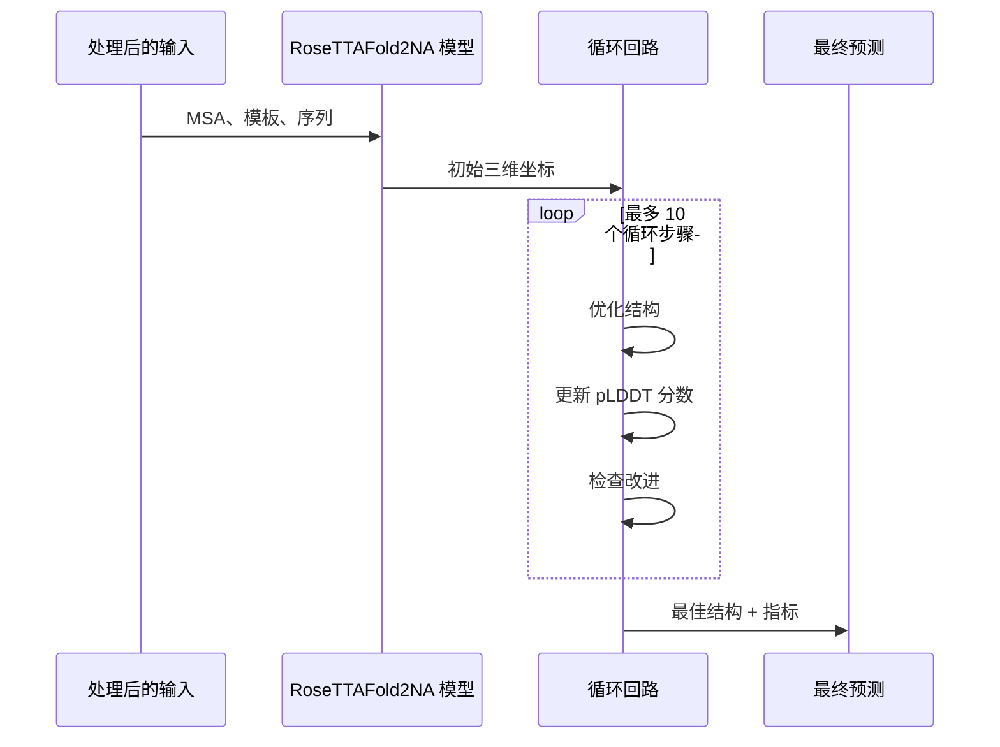

---
slug:11-running-custom-predictions
blog_type:normal
---


RoseTTAFold2NA 使研究人员能够以极高的准确性预测蛋白质-核酸复合物的三维结构。本指南将引导您为自有序列运行自定义预测，详细解释从输入准备到结果解读的完整工作流程。

## 理解预测工作流程

在开始自定义预测之前，首先需要了解 RoseTTAFold2NA 如何处理您的输入。预测流水线采用系统化的方法：

1. **输入准备**：您的蛋白质和/或核酸序列将被处理以生成多序列比对（MSA）
2. **模板搜索**：对于蛋白质，系统会在已知蛋白质数据库中搜索结构模板
3. **模型推理**：处理后的输入被输入神经网络以预测三维结构
4. **输出生成**：模型生成包含预测结构和置信度指标的 PDB 文件

整个工作流程由 `run_RF2NA.sh` 脚本协调执行，该脚本会自动处理所有中间步骤。不过，了解每个组件将帮助您在需要时排查问题并自定义预测。
来源：[run_RF2NA.sh#L1-L134](run_RF2NA.sh), [README.md#L79-L87](README.md#L79-L87)

## 准备输入序列

RoseTTAFold2NA 接受多种类型的分子序列，每种序列都通过特定前缀标识：

- **P:** 蛋白质序列
- **R:** RNA 序列
- **D:** 双链 DNA 序列
- **S:** 单链 DNA 序列
- **PR:** 配对的蛋白质-RNA 序列（用于共进化对）

您的输入文件应为 FASTA 格式，这是一种简单的文本格式，其中每个序列以包含序列名的 ">" 行开头，后续行则为序列本身。

例如，一个蛋白质 FASTA 文件可能如下所示：
```
> my_protein
MAGICSEQWENCEHEREEXAMPLEPROTEINSEQUENCE
```
来源：[example/rna_binding_protein.fa](example/rna_binding_protein.fa), [example/RNA.fa](example/RNA.fa), [README.md#L89-L91](README.md#L89-L91)

<CgxTip>
请始终确保您的序列格式正确，且仅包含对应类型的有效字符（蛋白质为标准氨基酸，RNA 为 ACGU，DNA 为 ACGT）。无效字符将导致预测失败。
</CgxTip>

## 运行基本预测

准备好输入文件后，您可以使用主脚本运行预测。基本语法如下：

```bash
../run_RF2NA.sh output_folder input1 input2 ...
```

其中每个输入都需指定其类型前缀。以下是一些常见示例：

### 蛋白质-RNA 复合物预测
```bash
../run_RF2NA.sh protein_rna_complex P:protein.fa R:rna.fa
```

### 蛋白质-DNA 复合物预测
```bash
../run_RF2NA.sh protein_dna_complex P:protein.fa D:dna.fa
```

### 多链复合物预测
```bash
../run_RF2NA.sh multi_chain P:protein1.fa P:protein2.fa R:rna.fa
```

该脚本会自动适当处理每种序列类型，生成 MSA，搜索模板（仅限蛋白质），并运行预测模型。
来源：[run_RF2NA.sh#L73-L107](run_RF2NA.sh#L73-L107), [README.md#L84-L86](README.md#L84-L86)

## 理解预测过程

当您运行预测脚本时，后台会执行多个步骤：

### 1. MSA 生成

对于蛋白质，系统使用 HHblits 搜索 UniRef30 和 BFD 数据库，创建捕获进化信息的多序列比对。此过程采用逐步放宽的 E 值阈值（1e-10、1e-6、1e-3）运行，以确保足够的序列覆盖度。

对于 RNA 序列，流水线更为复杂：
- 使用 cmscan 搜索 Rfam 以识别 RNA 家族
- 使用 blastn 从 RNAcentral 和 nt 数据库检索相关序列
- 使用 CD-HIT 对序列进行聚类以去除冗余
- 使用不同 E 值阈值的 nhmmer 重新比对序列

```mermaid
flowchart TD
    A[输入序列] --> B{序列类型？}
    B -->|蛋白质| C[HHblits vs UniRef30/BFD]
    B -->|RNA| D[cmscan vs Rfam]
    C --> E[过滤后的 MSA]
    D --> F[blastn vs RNAcentral/nt]
    F --> G[使用 CD-HIT 聚类]
    G --> H[nhmmer 重新比对]
    H --> E
    E --> I[模板搜索<br>(仅限蛋白质)]
    I --> J[模型预测]
```
来源：[input_prep/make_protein_msa.sh#L26-L56](input_prep/make_protein_msa.sh#L26-L56), [input_prep/make_rna_msa.sh#L58-L132](input_prep/make_rna_msa.sh#L58-L132)

### 2. 模板搜索（仅限蛋白质）

对于蛋白质链，系统使用 hhsearch 针对 PDB 数据库搜索结构模板。此步骤识别可能与您的蛋白质相似的已知结构，为预测提供额外约束。

模板信息存储在 `.hhr` 和 `.atab` 文件中，分别包含比对统计信息和模板坐标。
来源：[run_RF2NA.sh#L46-L52](run_RF2NA.sh#L46-L52)

### 3. 模型预测

核心预测由 `predict.py` 脚本处理，该脚本加载预训练的 RoseTTAFold2NA 模型并通过神经网络处理您的输入。模型采用迭代优化过程，最多包含 10 个循环步骤以提高预测质量。

在每个循环步骤中，模型会：
1. 处理 MSA 和模板信息
2. 预测残基间距离和角度
3. 生成三维坐标
4. 评估预测置信度（pLDDT）
5. 将最佳预测用作下一次迭代的输入


来源：[network/predict.py#L291-L337](network/predict.py#L291-L337)

## 解读预测输出

预测完成后，您会在指定的输出目录中找到多个输出文件：

### 主要输出

1. **PDB 文件** (`models/model_00.pdb`)
   - 包含标准 PDB 格式的预测三维结构
   - B 因子列包含每个残基的置信度分数（pLDDT × 100）
   - 较高值表示较高置信度（0-100 量表）

2. **NPZ 文件** (`models/model_00.npz`)
   - 包含额外预测指标的压缩 numpy 文件
   - 可使用 `numpy.load()` 加载以进行进一步分析
   - 包含三个关键数组：
     - `dist`: 预测距离直方图（L × L × 37）
     - `lddt`: 每残基置信度分数（L）
     - `pae`: 预测比对误差矩阵（L × L）

### 理解置信度指标

- **pLDDT（局部距离差异检验）**: 每残基置信度分数
  - > 90: 非常高置信度
  - 70-90: 良好置信度
  - 50-70: 低置信度
  - < 50: 非常低置信度

- **PAE（预测比对误差）**: 显示残基对之间预期误差的矩阵
  - 低值（蓝色）表示相对位置置信度高
  - 高值（红色）表示相对位置不确定

<CgxTip>
PDB 文件 B 因子列中的 pLDDT 分数可以直接在 PyMOL 或 ChimeraX 等分子查看器中可视化，让您能立即看到预测中哪些部分最可靠。
</CgxTip>
来源：[README.md#L93-L99](README.md#L93-L99), [network/predict.py#L350-L356](network/predict.py#L350-L356)

## 高级自定义选项

虽然基本的 `run_RF2NA.sh` 脚本能处理大多数用例，但您可能需要自定义预测过程的某些方面。

### 直接调用模型

为了获得更多控制权，您可以直接调用预测脚本：
```bash
python network/predict.py \
    -inputs "P:protein.msa0.a3m:protein.hhr:protein.atab R:rna.afa" \
    -prefix output/models/model \
    -model network/weights/RF2NA_apr23.pt \
    -db pdb100_2021Mar03/pdb100_2021Mar03
```

这允许您：
- 使用预计算的 MSA 和模板结果
- 指定不同的模型权重
- 控制输出命名和位置
来源：[network/predict.py#L21-L35](network/predict.py#L21-L35)

### 模型参数

预测模型有几个影响其行为的关键参数：

| 参数 | 默认值 | 描述 |
|-----------|---------------|-------------|
| MAX_CYCLE | 10 | 循环迭代次数 |
| MAXSEQ | 2048 | MSA 中的最大序列数 |
| MAXLAT | 256 | 最大潜在维度 |
| n_extra_block | 4 | 额外 Transformer 块数量 |
| n_main_block | 32 | 主要 Transformer 块数量 |

这些参数在 `predict.py` 中定义，如果您有特定需求可以修改，但默认值在大多数情况下效果良好。
来源：[network/predict.py#L37-L58](network/predict.py#L37-L58)

### 资源分配

`run_RF2NA.sh` 中的默认分配使用 8 个 CPU 和 64GB 内存：
```bash
CPU="8"   # 使用的 CPU 数量
MEM="64"  # 最大内存（GB）
```

对于较大的复合物或如果您有更多可用资源，可以在运行预测前在脚本中增加这些值。
来源：[run_RF2NA.sh#L19-L20](run_RF2NA.sh#L19-L20)

## 常见问题排查

运行自定义预测时，您可能会遇到一些常见问题：

### MSA 生成失败

如果 MSA 生成步骤失败，请检查：
1. 脚本中的数据库路径是否正确
2. 是否有足够的磁盘空间
3. 序列格式是否有效（无无效字符）
4. 数据库文件是否已正确下载和解压

### 内存不足错误

对于大型复合物，您可能会遇到内存问题：
1. 使用 `CPU` 参数减少 CPU 数量
2. 确保有足够的 RAM（推荐 64GB）
3. 考虑将大型复合物分解为更小的亚基

### 预测质量不佳

如果预测置信度低：
1. 检查输入序列是否有错误
2. 确保复合物类型正确指定（P、R、D、S）
3. 验证 MSA 是否包含足够的多样性
4. 如果序列是共进化的，考虑使用配对的蛋白质-RNA（PR）

### 模板搜索问题

对于蛋白质模板搜索问题：
1. 验证 PDB 数据库路径是否正确
2. 确保数据库文件已正确索引
3. 检查 `.hhr` 和 `.atab` 文件是否已生成

来源：[run_RF2NA.sh#L35-L40](run_RF2NA.sh#L35-L40), [run_RF2NA.sh#L46-L52](run_RF2NA.sh#L46-L52)

## 结论

一旦您了解了输入要求和输出格式，使用 RoseTTAFold2NA 运行自定义预测就是一个简单的过程。系统自动处理大部分复杂性，从 MSA 生成到模板搜索和模型推理。

通过遵循本指南，您应该能够：
- 以正确格式准备您的序列
- 为各种复合物类型运行预测
- 解读输出中的置信度指标
- 排查可能出现的常见问题

请记住，预测质量很大程度上取决于输入质量和数据库中进化信息的可用性。为获得最佳结果，请确保您的序列准确，并在研究共进化系统时考虑使用配对的蛋白质-RNA 输入。

随着您对系统的熟悉，您可以探索高级自定义选项，以根据您的特定研究需求调整预测过程。