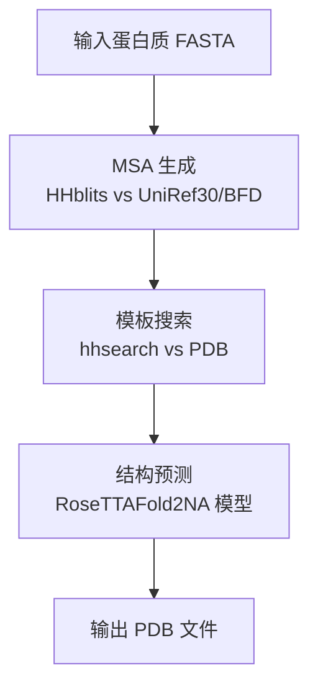
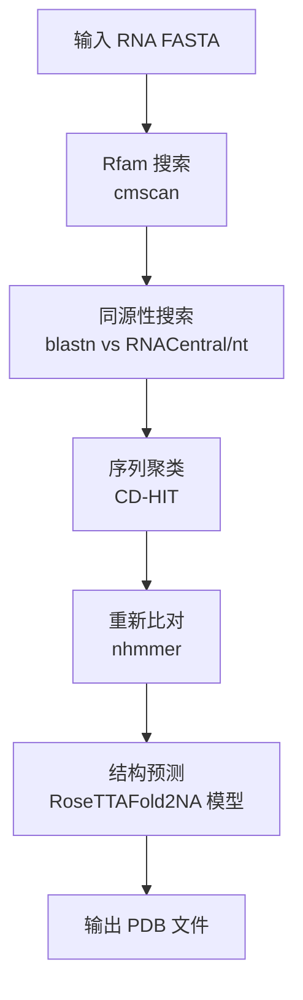
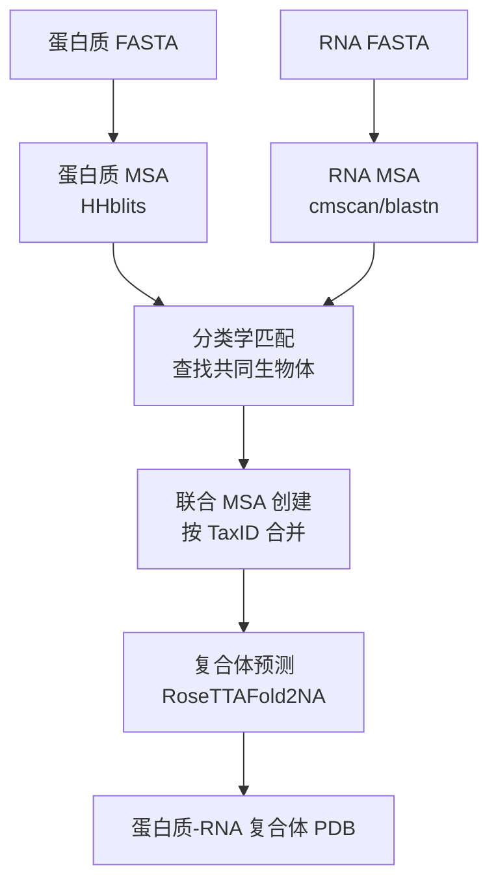

---
slug:4-example-workflows
blog_type:normal
---


RoseTTAFold2NA 提供了几个示例工作流程，帮助您开始进行蛋白质、RNA 以及蛋白质-RNA 复合体结构预测。在本指南中，我们将使用提供的示例文件演示三个主要工作流程，说明如何准备输入并成功运行预测。

## 了解主要工作流程

运行预测的主要入口点是 `run_RF2NA.sh` 脚本，它协调整个流程，从输入准备到最终结构预测。该脚本处理多种输入类型，并根据分子类型自动处理它们。

脚本接受特定格式的输入：`TYPE:fasta_file`，其中 TYPE 可以是：
- **P**: 蛋白质序列
- **R**: RNA 序列  
- **D**: DNA 序列
- **S**: 单链 DNA 序列
- **PR**: 蛋白质-RNA 复合体（当提供一个蛋白质和一个 RNA 时自动生成）

<CgxTip>
当您恰好提供一个蛋白质和一个 RNA 序列时，工作流程会自动检测，并为蛋白质-RNA 复合体预测创建联合 MSA。这是 RoseTTAFold2NA 最强大的功能！
</CgxTip>

来源：[run_RF2NA.sh#L73-118](run_RF2NA.sh#L73-118)

## 工作流程 1：蛋白质结构预测

让我们从最简单的工作流程开始——预测单条蛋白质链的结构。我们将使用提供的 DNA 结合蛋白示例。

### 步骤 1：准备输入

仓库在 `example/dna_binding_protein.fa` 中提供了一个示例蛋白质序列：

```fasta
> ANTENNAPEDIA HOMEODOMAIN|Drosophila melanogaster (7227)
MERKRGRQTYTRYQTLELEKEFHFNRYLTRRRRIEIAHALSLTERQIKIWFQNRRMKWKKEN
```

这是一个来自果蝇（Drosophila melanogaster）的结合 DNA 的同源域蛋白。

### 步骤 2：运行预测

使用蛋白质输入执行主脚本：

```bash
./run_RF2NA.sh working_directory P:example/dna_binding_protein.fa
```

### 幕后发生了什么

脚本执行几个关键步骤：

1. **MSA 生成**：使用 HHblits 搜索 UniRef30 和 BFD 数据库，创建捕获进化信息的多序列比对。
2. **模板搜索**：对 PDB 数据库运行 hhsearch 以查找结构模板。
3. **结构预测**：将 MSA 和模板信息输入 RoseTTAFold2NA 神经网络以预测 3D 结构。



### 预期输出

预测在 `working_directory/models/` 目录中生成几个输出文件：
- `model_*.pdb`：PDB 格式的预测 3D 结构
- `model_*.json`：附加模型信息和置信度分数

来源：[run_RF2NA.sh#L27-53](run_RF2NA.sh#L27-53), [example/dna_binding_protein.fa](example/dna_binding_protein.fa)

## 工作流程 2：RNA 结构预测

接下来，让我们使用提供的 RNA 示例预测 RNA 分子的结构。

### 步骤 1：准备输入

示例 RNA 序列在 `example/RNA.fa` 中提供：

```fasta
> RNA
GAGAGAGAAGTCAACCAGAGAAACACACCAACCCATTGCACTCCGGGTTGGTGGTATATTACCTGGTACGGGGGAAACTTCGTGGTGGCCGGCCACCTGACA
```

### 步骤 2：运行预测

使用 RNA 输入执行脚本：

```bash
./run_RF2NA.sh working_directory R:example/RNA.fa
```

### RNA 特定处理

RNA 处理遵循与蛋白质不同的流程：

1. **Rfam 搜索**：使用 cmscan 识别 RNA 家族和结构域
2. **同源性搜索**：对 RNACentral 和 nt 数据库执行 blastn 搜索
3. **序列聚类**：使用 CD-HIT 去除冗余序列
4. **重新比对**：使用 nhmmer 进行最终序列比对



由于 RNA 数据库的多样性以及处理序列和结构同源性的需要，RNA MSA 生成更为复杂。

来源：[run_RF2NA.sh#L55-69](run_RF2NA.sh#L55-69), [example/RNA.fa](example/RNA.fa), [input_prep/make_rna_msa.sh#L58-132](input_prep/make_rna_msa.sh#L58-132)

## 工作流程 3：蛋白质-RNA 复合体预测

这是最先进和最强大的工作流程，预测蛋白质-RNA 复合体的结构。我们将使用 RNA 结合蛋白示例结合 RNA 序列。

### 步骤 1：准备输入

我们需要蛋白质和 RNA 序列：
- 蛋白质：`example/rna_binding_protein.fa`
- RNA：`example/RNA.fa`

### 步骤 2：运行预测

使用两个输入执行脚本：

```bash
./run_RF2NA.sh working_directory P:example/rna_binding_protein.fa R:example/RNA.fa
```

### 联合 MSA 处理的魔力

当您恰好提供一个蛋白质和一个 RNA 序列时，RoseTTAFold2NA 执行特殊的联合 MSA 处理：

1. **单独 MSA 生成**：为蛋白质和 RNA 创建单独的 MSA
2. **基于分类学的匹配**：在两个 MSA 中识别来自相同生物体的序列
3. **联合 MSA 创建**：组合来自匹配分类群的蛋白质和 RNA 序列
4. **复合体结构预测**：使用联合 MSA 预测蛋白质-RNA 复合体结构



联合 MSA 方法是革命性的，因为它利用了来自相同生物体的蛋白质和 RNA 序列之间的共进化信号，显著提高了复合体结构预测的准确性。

### 了解合并过程

`merge_msa_prot_rna.py` 脚本执行复杂的匹配：

1. **解析 TaxID**：从两个 MSA 文件中提取分类学 ID
2. **查找匹配**：识别来自相同生物体的序列
3. **创建配对**：组合匹配的蛋白质-RNA 序列
4. **处理单链**：添加带间隙字符的未配对序列
5. **输出联合 MSA**：为复合体预测创建统一的 MSA

此过程确保模型接收有关蛋白质和 RNA 在自然界中如何共同进化的进化信息。

来源：[run_RF2NA.sh#L112-118](run_RF2NA.sh#L112-118), [example/rna_binding_protein.fa](example/rna_binding_protein.fa), [input_prep/merge_msa_prot_rna.py#L146-232](input_prep/merge_msa_prot_rna.py#L146-232)

## 高级用法：多条链和 DNA

RoseTTAFold2NA 还支持更复杂的场景：

### 多条蛋白质链

对于具有多条链的蛋白质复合体：

```bash
./run_RF2NA.sh working_directory P:protein1.fa P:protein2.fa P:protein3.fa
```

### DNA 序列

对于 DNA 或单链 DNA：

```bash
# 双链 DNA
./run_RF2NA.sh working_directory D:dna_sequence.fa

# 单链 DNA  
./run_RF2NA.sh working_directory S:ssdna_sequence.fa
```

### 混合复合体

对于蛋白质-DNA 或蛋白质-RNA-DNA 复合体：

```bash
# 蛋白质-DNA 复合体
./run_RF2NA.sh working_directory P:protein.fa D:dna.fa

# 蛋白质-RNA-DNA 复合体
./run_RF2NA.sh working_directory P:protein.fa R:rna.fa D:dna.fa
```

<CgxTip>
处理混合复合体时，联合 MSA 功能仅适用于蛋白质-RNA 对。DNA 序列单独处理，不进行共进化分析。
</CgxTip>

来源：[run_RF2NA.sh#L84-107](run_RF2NA.sh#L84-107), [network/predict.py#L24-29](network/predict.py#L24-29)

## 常见问题故障排除

### MSA 生成失败

如果 MSA 生成失败，请检查：
1. 脚本中数据库路径设置正确
2. 有足够的可用磁盘空间（MSA 文件可能很大）
3. 数据库文件已正确下载和解压

### 内存问题

对于大序列，您可能需要调整内存分配：
```bash
# 在 run_RF2NA.sh 中，修改这些行：
CPU="16"  # 增加 CPU 数量
MEM="128" # 以 GB 为单位增加内存
```

### 输出解释

预测输出具有置信度分数的多个模型。通常：
- 较高的模型编号表示较高的置信度
- 检查 JSON 文件获取每个残基的置信度分数
- pLDDT 分数 > 70 的模型通常是可靠的

来源：[run_RF2NA.sh#L19-20](run_RF2NA.sh#L19-20)

## 后续步骤

成功运行这些示例工作流程后，您可以：

1. **准备您自己的序列**：使用您的蛋白质、RNA 或 DNA 序列创建 FASTA 文件
2. **尝试不同组合**：尝试各种蛋白质-RNA 对以研究相互作用
3. **分析结果**：使用 PyMOL 或 Chimera 等分子可视化工具检查预测结构
4. **验证预测**：在可用时与实验结构进行比较

示例工作流程为探索 RoseTTAFold2NA 在预测核酸结构及其与蛋白质复合体方面的能力提供了坚实的基础。