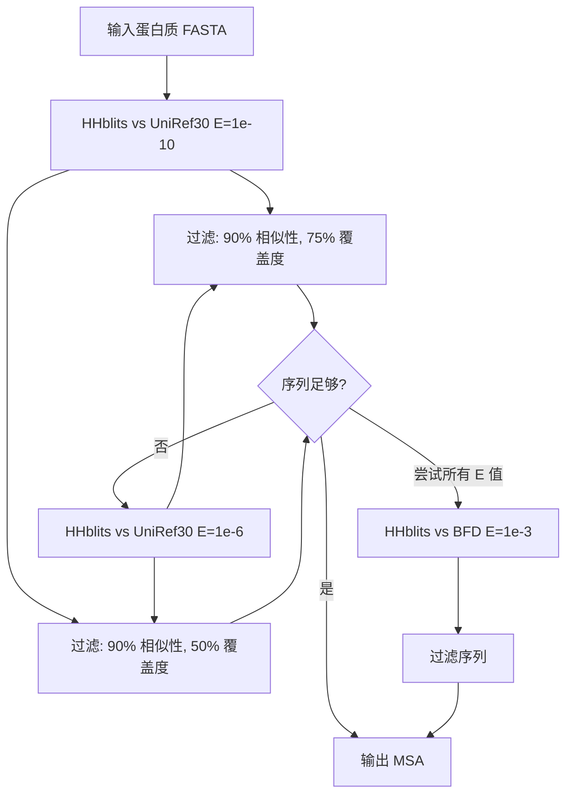
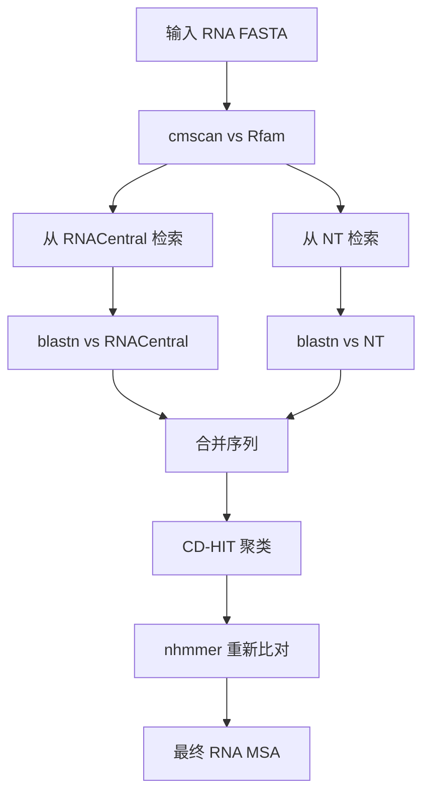

---
slug:5-input-preparation-for-proteins-and-rna
blog_type:normal
---


在运行 RoseTTAFold2NA 预测之前，您需要通过为蛋白质和 RNA 分子生成多序列比对（MSA）来正确准备输入序列。这个过程至关重要，因为 MSA 提供了进化背景，帮助模型理解序列与结构的关系。在本指南中，我们将详细介绍蛋白质和 RNA 序列的完整输入准备流程。

## 理解输入准备流程

RoseTTAFold2NA 的输入准备过程包含三个主要阶段：

1. **蛋白质 MSA 生成**：使用 HHblits 针对 UniRef30 和 BFD 数据库为蛋白质序列创建多序列比对
2. **RNA MSA 生成**：使用 cmscan、blastn 和 nhmmer 等专业工具为 RNA 序列创建多序列比对
3. **MSA 合并**：基于共享的分类学信息合并蛋白质和 RNA MSA，用于蛋白质-RNA 复合物预测

这个流程旨在最大化模型可用的进化信息，同时确保最高质量的比对，以实现准确的结构预测。

## 输入序列格式

RoseTTAFold2NA 接受标准 FASTA 格式的蛋白质和 RNA 序列文件。让我们看看预期的格式：

### 蛋白质输入格式

蛋白质序列应以 FASTA 格式提供，头部以 '>' 开头，后跟序列：

```
> ANTENNAPEDIA HOMEODOMAIN|Drosophila melanogaster (7227)
MERKRGRQTYTRYQTLELEKEFHFNRYLTRRRRIEIAHALSLTERQIKIWFQNRRMKWKKEN
```

头部可以包含蛋白质的描述信息，但只有序列本身用于 MSA 生成。

### RNA 输入格式

RNA 序列遵循相同的 FASTA 格式约定：

```
> RNA
GAGAGAGAAGTCAACCAGAGAAACACACCAACCCATTGCACTCCGGGTTGGTGGTATATTACCTGGTACGGGGGAAACTTCGTGGTGGCCGGCCACCTGACA
```

RNA 序列应使用标准核苷酸代码（A、C、G、U/T）。

## 蛋白质 MSA 生成

蛋白质 MSA 生成由 `make_protein_msa.sh` 脚本处理，该脚本对大型蛋白质数据库执行迭代搜索以找到同源序列。

### 蛋白质 MSA 生成原理

该脚本遵循一个复杂的流程：

1. **迭代 HHblits 搜索**：脚本对 UniRef30 执行多轮 HHblits 搜索，使用逐渐放宽的 E 值阈值（1e-10、1e-6、1e-3）来寻找远缘同源序列。

2. **序列过滤**：每轮搜索后，使用 hhfilter 过滤序列，保持 90% 相似性和 75% 或 50% 的覆盖度阈值。

3. **质量控制**：脚本继续运行，直到找到：
   - 超过 2000 个具有 75% 覆盖度的序列，或
   - 超过 4000 个具有 50% 覆盖度的序列

4. **回退到 BFD**：如果 UniRef30 未能产生足够序列，脚本会搜索更大的 BFD 数据库作为备份。



### 运行蛋白质 MSA 生成

要生成蛋白质 MSA，使用以下命令：

```bash
./input_prep/make_protein_msa.sh input.fasta output_dir tag cpu memory
```

其中：
- `input.fasta`：您的 FASTA 格式蛋白质序列
- `output_dir`：输出文件将保存的目录
- `tag`：您运行的唯一标识符
- `cpu`：要使用的 CPU 核心数
- `memory`：最大内存（GB）

该脚本生成包含过滤后 MSA 的 `.a3m` 文件，这是 RoseTTAFold2NA 使用的标准格式。

来源：[make_protein_msa.sh#L1-L87](input_prep/make_protein_msa.sh), [run_RF2NA.sh#L27-L53](run_RF2NA.sh#L27-L53)

## RNA MSA 生成

由于 RNA 数据库的不同性质和二级结构的重要性，RNA MSA 生成比蛋白质 MSA 生成更复杂。`make_rna_msa.sh` 脚本使用专业工具组合处理此过程。

### RNA MSA 生成原理

RNA MSA 生成流程涉及几个复杂步骤：

1. **Rfam 数据库搜索**：使用 `cmscan` 识别序列中的 RNA 家族和结构域。

2. **序列检索**：基于 Rfam 命中，从 RNACentral 和 NT 数据库检索相关序列。

3. **BLAST 搜索**：使用 `blastn` 对 RNACentral 和 NT 数据库执行额外搜索，以找到更远的同源序列。

4. **序列聚类**：使用 CD-HIT 在不同相似性阈值（100%、99%、95%、90%）下聚类并去除冗余序列。

5. **重新比对**：使用 `nhmmer` 将所有序列与查询序列重新比对，确保正确的比对质量。



### 运行 RNA MSA 生成

要生成 RNA MSA，使用以下命令：

```bash
./input_prep/make_rna_msa.sh input.fasta output_dir tag cpu memory
```

参数与蛋白质 MSA 生成类似，但输出是 `.afa` 文件（比对 FASTA 格式）而不是 `.a3m`。

该脚本包含几个质量控制参数：
- `max_aln_seqs=50000`：比对中的最大序列数
- `max_target_seqs=50000`：BLAST 搜索的最大目标序列数
- `max_hhfilter_seqs=5000`：过滤后的最大序列数

来源：[make_rna_msa.sh#L1-L135](input_prep/make_rna_msa.sh), [run_RF2NA.sh#L55-L69](run_RF2NA.sh#L55-L69)

<CgxTip>
由于涉及更复杂的流程和更大的搜索空间，RNA MSA 生成可能比蛋白质 MSA 生成耗时显著更长。为获得最佳性能，请确保您有足够的计算资源，并且 RNA 数据库已正确索引。
</CgxTip>

## 合并蛋白质和 RNA MSA

在预测蛋白质-RNA 复合物时，RoseTTAFold2NA 需要一个包含来自相同生物体的配对蛋白质和 RNA 序列的联合 MSA。`merge_msa_prot_rna.py` 脚本处理这个关键步骤。

### MSA 合并原理

合并过程旨在创建具有生物学意义的配对：

1. **基于分类学的配对**：脚本读取蛋白质（.a3m）和 RNA（.afa）MSA，识别共享相同 TaxID 的序列。

2. **序列选择**：对于每个 TaxID，根据与查询序列的相似性选择最佳的蛋白质和 RNA 序列。

3. **配对比对构建**：创建联合比对，其中：
   - 配对序列（相同 TaxID）表示为 protein_sequence/RNA_sequence
   - 未配对的蛋白质序列在 RNA 部分用空位表示
   - 未配对的 RNA 序列在蛋白质部分用空位表示

4. **输出格式**：最终合并的 MSA 以 RoseTTAFold2NA 可解释的特殊格式保存，用于蛋白质-RNA 复合物预测。

### 运行 MSA 合并

要合并蛋白质和 RNA MSA，使用以下命令：

```bash
python ./input_prep/merge_msa_prot_rna.py protein.a3m rna.afa output.a3m
```

脚本将输出有关找到的配对序列数量的统计信息，这对于评估联合 MSA 的质量至关重要。

来源：[merge_msa_prot_rna.py#L1-L246](input_prep/merge_msa_prot_rna.py), [run_RF2NA.sh#L110-L118](run_RF2NA.sh#L110-L118)

## 完整流程示例

主要的 `run_RF2NA.sh` 脚本协调整个输入准备和预测过程。以下是它处理不同输入场景的方式：

### 单个蛋白质-RNA 复合物预测

对于预测蛋白质-RNA 复合物，流程为：

```bash
./run_RF2NA.sh output_dir P:protein.fa R:rna.fa
```

这将：
1. 使用 `make_protein_msa.sh` 生成蛋白质 MSA
2. 使用 `make_rna_msa.sh` 生成 RNA MSA
3. 使用 `merge_msa_prot_rna.py` 合并 MSA
4. 运行 RoseTTAFold2NA 预测

### 多组分预测

您还可以预测具有多个组分的结构：

```bash
./run_RF2NA.sh output_dir P:protein1.fa P:protein2.fa R:rna1.fa R:rna2.fa
```

脚本将单独处理每个组分，然后为最终预测适当组合它们。

来源：[run_RF2NA.sh#L71-L118](run_RF2NA.sh#L71-L118)

## 数据库要求

为了成功进行输入准备，您需要几个大型数据库：

### 蛋白质数据库
- **UniRef30**（约 46GB）：用于初始蛋白质同源搜索
- **BFD**（约 272GB）：当 UniRef30 未能产生足够序列时使用的更大数据库

### RNA 数据库
- **Rfam**：RNA 家族和协方差模型数据库
- **RNACentral**：非编码 RNA 序列的综合数据库
- **NT**：NCBI 核苷酸数据库

<CgxTip>
数据库设置是一次性过程，但需要大量磁盘空间（总计超过 300GB）。在开始数据库设置过程之前，请确保您有足够的存储空间和下载带宽。
</CgxTip>

## 质量评估和故障排除

### 检查 MSA 质量

生成 MSA 后，您应该评估其质量：

1. **蛋白质 MSA 质量**：检查 `.a3m` 文件中的序列数量。良好的蛋白质 MSA 应该至少有 100-1000 个序列，具体取决于蛋白质家族。

2. **RNA MSA 质量**：RNA MSA 通常较小。检查您的 `.afa` 文件的序列数量和比对质量。

3. **合并 MSA 质量**：对于蛋白质-RNA 复合物，配对序列（相同 TaxID）的数量至关重要。更多的配对序列通常会导致更好的预测。

### 常见问题和解决方案

| 问题 | 可能原因 | 解决方案 |
|-------|----------------|----------|
| 蛋白质 MSA 序列少 | 蛋白质新颖或同源序列少 | 尝试降低覆盖度阈值或使用 BFD 数据库 |
| RNA MSA 生成失败 | 缺少 RNA 数据库或格式问题 | 验证所有 RNA 数据库都已正确安装和索引 |
| 合并 MSA 配对少 | 数据库中共同出现有限 | 考虑使用未配对的 MSA 运行或扩展搜索参数 |
| 内存错误 | 大型搜索超过可用 RAM | 减少 CPU 数量或增加内存分配 |

来源：[make_protein_msa.sh#L38-L87](input_prep/make_protein_msa.sh#L38-L87), [make_rna_msa.sh#L95-L132](input_prep/make_rna_msa.sh#L95-L132)

## 后续步骤

准备好 MSA 后，您就可以运行 RoseTTAFold2NA 预测了。输入准备过程是整个流程中最耗时的部分，但对于获得准确的结构预测至关重要。

有关使用准备好的输入运行预测的更多信息，请参阅我们文档系列中的[运行自定义预测](11-running-custom-predictions)指南。