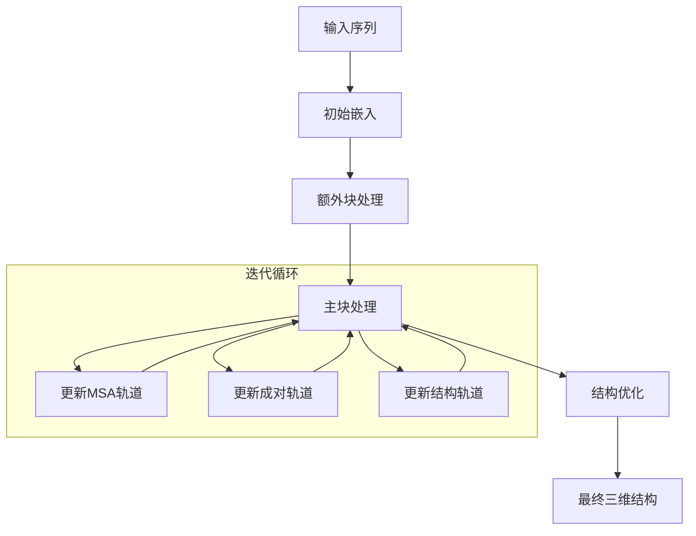

---
slug:6-computational-method-and-theory
blog_type:normal
---


RoseTTAFold2NA代表了蛋白质结构预测领域的重大进展，它扩展了RoseTTAFold的功能，能够精确模拟蛋白质-核酸复合物。本文探讨了使RoseTTAFold2NA能够预测与DNA和RNA分子相互作用的蛋白质三维结构的计算方法和理论基础。

## 三轨神经网络架构

RoseTTAFold2NA的核心采用了一种先进的**三轨神经网络**，能够同时在多个层面处理和整合信息：序列、成对关系和三维结构。这种架构使模型能够通过在这三个相互关联的轨道上迭代优化预测，从而全面理解蛋白质-核酸复合物。

三轨方法处理：
1. **序列轨道**：通过多序列比对（MSA）表示处理氨基酸和核苷酸序列
2. **成对轨道**：捕获整个复合物中残基之间的成对相互作用
3. **结构轨道**：通过SE(3)等变变换维护和优化三维坐标

这种集成方法使模型能够利用MSA中的进化信息，同时构建蛋白质-核酸复合物的精确三维结构模型。

来源：[RoseTTAFoldModel.py#L1-L114](network/RoseTTAFoldModel.py#L1-L114)

## 输入嵌入与表示

RoseTTAFold2NA首先将输入序列转换为丰富的数值表示，这些表示既包含序列信息又包含结构潜力。嵌入过程通过专门组件处理蛋白质和核酸序列：

### MSA嵌入

`MSA_emb`类将输入序列及其多序列比对转换为初始特征表示。它处理：
- 蛋白质序列（20种标准氨基酸加未知和掩码标记）
- DNA序列（A、T、C、G和未知标记）
- RNA序列（A、U、C、G和未知标记）
- 捕获相对序列位置和链信息的位置编码

嵌入过程生成三个关键表示：
- `msa`：表示MSA特征的三维张量（批次×序列×长度×特征）
- `pair`：捕获残基成对相互作用的四维张量（批次×长度×长度×特征）
- `state`：三维结构预测的初始节点特征

来源：[Embeddings.py#L19-L65](network/Embeddings.py#L19-L65), [chemical.py#L1-L40](network/chemical.py#L1-L40)

### 化学表示

模型使用全面的化学表示系统，定义了氨基酸和核苷酸的原子结构。`chemical.py`文件包含详细映射：
- 20种标准氨基酸
- DNA核苷酸（dA、dT、dC、dG）
- RNA核苷酸（A、U、C、G）
- 每种残基类型的原子坐标和连接性

这种详细的化学表示使模型能够从预测的主链坐标准确生成全原子结构。

来源：[chemical.py#L1-L40](network/chemical.py#L1-L40)

## 迭代结构优化

RoseTTAFold2NA计算方法的核心是`IterativeSimulator`类，它实现了一个迭代优化过程，逐步改进预测的三维结构。该过程包含三个主要阶段：

### 1. 额外块处理

初始额外块处理额外的MSA序列以提取进化信息：
- 在降维的更大序列集上运行
- 使用全局注意力捕获长程依赖关系
- 为主要优化过程奠定基础

### 2. 主块处理

主块执行核心结构优化：
- 以更高维度处理目标序列
- 应用局部注意力机制进行精确的局部结构预测
- 迭代更新三轨表示（MSA、成对和结构）

### 3. 结构优化

最终优化阶段应用专门的SE(3)等变变换：
- 通过基于梯度的力整合物理约束
- 应用键几何、范德华力和氢键约束
- 生成最终的高精度三维结构



来源：[Track_module.py#L400-L501](network/Track_module.py#L400-L501)

## SE(3)-等变Transformer集成

RoseTTAFold2NA的一个关键创新是集成了SE(3)-等变transformer，这确保了模型的预测尊重三维空间的旋转和平移对称性。`SE3TransformerWrapper`类实现了这一关键组件：

### 数学基础

SE(3)-transformer基于**等变性**原理运行：如果输入坐标被旋转或平移，输出特征应经历相同的变换。这在数学上表示为：

```
f(R·x + t) = R·f(x) + t
```

其中R是旋转矩阵，t是平移向量，f是变换函数。

### 实现细节

SE(3)-transformer实现：
- 使用球谐函数和Clebsch-Gordan系数进行旋转等变操作
- 分别处理不同阶数的特征（标量、向量等）
- 将等变注意力与不变注意力权重相结合
- 无论输入方向如何，都能实现稳定一致的预测

这种等变性质对于准确的三维结构预测至关重要，因为它确保模型不依赖于输入坐标的任意方向。

来源：[SE3_network.py#L1-L90](network/SE3_network.py#L1-L90), [SE3Transformer/README.md#L1-L200](SE3Transformer/README.md#L1-L200)

## 注意力机制

RoseTTAFold2NA采用先进的注意力机制来捕获蛋白质-核酸复合物中的局部和长程相互作用：

### MSA注意力

`MSAPairStr2MSA`类实现了MSA处理的偏置自注意力：
- 使用成对特征和结构信息作为注意力偏置
- 结合行向和列向注意力模式
- 整合来自结构轨道的反馈以优化序列表示

### 成对注意力

`PairStr2Pair`类更新残基成对相互作用：
- 通过基于距离的特征整合结构信息
- 使用注意力捕获长程依赖关系
- 在整个优化过程中维护L×L相互作用矩阵

这些注意力机制使模型能够有效捕获蛋白质-核酸复合物中序列进化与结构约束之间的复杂相互作用。

来源：[Track_module.py#L19-L100](network/Track_module.py#L19-L100)

## 损失函数与训练目标

RoseTTAFold2NA使用多组件损失函数进行训练，同时优化结构准确性和辅助预测：

### 结构损失

主要结构损失基于**帧对齐点误差（FAPE）**：
- 计算预测原子坐标与真实原子坐标之间的误差
- 使用由主链原子定义的局部坐标帧
- 对链内和链间相互作用应用不同的距离阈值
- 对蛋白质-蛋白质、蛋白质-核酸和核酸-核酸相互作用采用不同处理方式

### 辅助损失

额外的损失组件包括：
- **距离损失**：预测残基间距离分布
- **PAE损失**：预测每残基对误差估计
- **LDDT损失**：预测局部距离差异测试分数
- **键几何损失**：确保适当的键长和键角
- **范德华损失**：防止原子碰撞
- **氢键损失**：稳定二级结构

这些组合损失确保模型产生物理上合理的结构，同时为其预测提供置信度估计。

来源：[loss.py#L1-L100](network/loss.py#L1-L100)

<CgxTip>
RoseTTAFold2NA的SE(3)-等变性质对其成功至关重要。与传统神经网络可能对旋转输入产生不同输出不同，RoseTTAFold2NA的预测无论输入方向如何都保持一致，这使其特别适用于三维结构预测任务。
</CgxTip>

## 模板集成

RoseTTAFold2NA可以通过`Templ_emb`类选择性地整合已知模板的结构信息：

- 处理模板结构以提取一维和二维特征
- 将模板信息与目标序列对齐
- 将模板特征与MSA和成对表示整合
- 在同源结构可用时提供额外的结构约束

这种模板集成能力使RoseTTAFold2NA能够利用现有结构知识，同时仍能预测没有模板的新折叠。

来源：[RoseTTAFoldModel.py#L1-L114](network/RoseTTAFoldModel.py#L1-L114)

## 回收机制

模型采用回收机制，能够迭代优化其预测：

- 将一次迭代的输出作为下一次迭代的输入
- 逐步提高序列和结构预测的准确性
- 通常在3-4次迭代内收敛
- 使模型能够纠正错误并优化细节

这种迭代方法类似于人类模型构建和优化的过程，其中初始粗略模型被逐步改进。

来源：[RoseTTAFoldModel.py#L1-L114](network/RoseTTAFoldModel.py#L1-L114)

## 结论

RoseTTAFold2NA代表了多种计算方法的复杂集成，以解决蛋白质-核酸结构预测这一挑战性问题。通过结合三轨神经网络、SE(3)-等变transformer、迭代优化和多组件损失函数，该模型在预测这些重要生物复合物的三维结构方面实现了高精度。

RoseTTAFold2NA的理论基础在于其同时处理进化信息、物理约束和几何关系的能力，这使其成为理解蛋白质-核酸相互作用分子基础的强大工具。