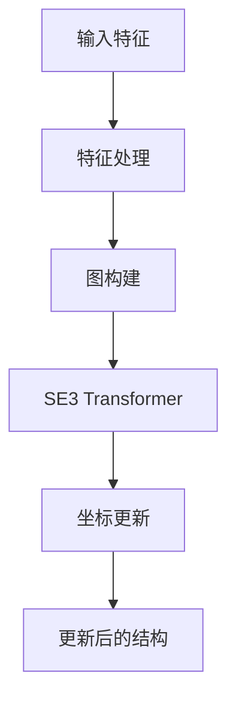

---
slug:8-se3-transformer-integration
blog_type:normal
---


SE3 Transformer 是 RoseTTAFold2NA 的核心组件，为蛋白质和核酸结构预测提供了几何基础。这种等变神经网络架构使模型能够推理三维结构，同时保持旋转和平移不变性——这是分子建模的关键特性。

## 什么是 SE3 等变性？

在深入实现之前，理解 SE3 等变性对分子建模的重要性至关重要。简单来说，SE3 等变性意味着如果旋转或平移分子的输入坐标，模型的预测应该以相同量进行旋转或平移。这一特性确保了无论分子在空间中的朝向如何，模型的预测都能保持一致。

可以这样理解：如果旋转蛋白质结构，原子之间的距离和它们的相对朝向保持不变。SE3 等变模型"理解"三维空间的这一基本特性，使其特别适合分子结构预测。

## 集成架构

SE3 Transformer 通过名为 `SE3TransformerWrapper` 的包装类集成到 RoseTTAFold2NA 中，该类将通用 SE3 Transformer 适配为蛋白质-RNA 结构预测的特定需求。

来源：[network/SE3_network.py#L12-L90](network/SE3_network.py#L12-L90)

该包装类处理几个关键职责：

1. **纤配置**：它使用"纤"定义输入、隐藏和输出特征表示——"纤"是一种描述不同等变类型（标量、向量、矩阵等）特征的数据结构。

2. **参数初始化**：它适当初始化 SE3 Transformer 的权重，以在分子建模环境中实现最佳性能。

3. **接口适配**：它提供简化的接口，匹配 RoseTTAFold2NA 架构预期的输入和输出。

### 纤结构

Fiber 类是 SE3 Transformer 表示不同等变类型特征的基础：

来源：[SE3Transformer/se3_transformer/model/fiber.py#L37-50](SE3Transformer/se3_transformer/model/fiber.py#L37-50)

```python
class Fiber(dict):
    """
    描述某些特征集的结构。
    特征分为类型（0, 1, 2, 3, ...）。k 型特征的维度为 2k+1。
    0 型特征：不变标量
    1 型特征：等变 3D 向量
    2 型特征：等变对称无迹矩阵
    ...
    """
```

在 RoseTTAFold2NA 中，SE3 Transformer 通常处理：
- 0 型特征：标量特征，如氨基酸身份、二级结构预测
- 1 型特征：向量特征，如坐标位移、朝向向量

## 在迭代结构优化中的使用

SE3 Transformer 用于 RoseTTAFold2NA 迭代优化过程的 `Str2Str`（结构到结构）模块中。该模块负责基于当前序列和成对特征更新蛋白质和 RNA 的三维坐标。

来源：[network/Track_module.py#L223-326](network/Track_module.py#L223-326)

```python
class Str2Str(nn.Module):
    def __init__(self, d_msa=256, d_pair=128, d_state=16, 
            SE3_param={}, 
            nextra_l0=0, nextra_l1=0,
            rbf_sigma=1.0, p_drop=0.1
    ):
        # ...
        self.se3 = SE3TransformerWrapper(**SE3_param_temp)
        # ...
```

`Str2Str` 模块通过 SE3 Transformer 处理当前三维坐标、序列特征和成对特征，以生成更新的坐标。过程如下：

1. **特征处理**：MSA 和成对特征被组合并转换为 SE3 Transformer 期望的格式。

2. **图构建**：创建一个图，其中节点代表残基，边代表空间关系或序列邻近性。

3. **SE3 变换**：SE3 Transformer 处理该图，生成对节点特征（代表残基状态）和边特征（代表相互作用）的等变更新。

4. **坐标更新**：使用基于四元数的旋转和平移，将 Transformer 的输出转换为实际的坐标更新。



来源：[network/Track_module.py#L268-326](network/Track_module.py#L268-326)

## 在整体架构中的集成

SE3 Transformer 在 RoseTTAFold2NA 架构的多个点使用：

1. **主迭代块**：每个迭代块包含一个 `Str2Str` 模块，该模块使用 SE3 Transformer 基于当前预测优化结构。

2. **最终优化**：在主迭代块之后，应用额外的基于 SE3 的优化步骤，结合梯度信息微调结构。

来源：[network/Track_module.py#L373-501](network/Track_module.py#L373-501)

```python
class IterativeSimulator(nn.Module):
    def __init__(self, 
        n_extra_block=4, n_main_block=8, n_ref_block=4,
        # ...
        SE3_param_full={}, SE3_param_topk={},
        # ...
    ):
        # ...
        # 使用种子序列更新
        if n_main_block > 0:
            self.main_block = nn.ModuleList([IterBlock(
                # ...
                SE3_param=SE3_param_full
            )])
        
        # 最终 SE(3) 优化
        if n_ref_block > 0:
            self.str_refiner = Str2Str(
                # ...
                SE3_param=SE3_param_topk,
                # ...
            )
```

<CgxTip>
SE3 Transformer 参数可以为网络的不同部分进行不同配置。通常，主块使用"完整"图配置，而优化块使用"top-k"配置，仅考虑最近邻以提高效率。
</CgxTip>

## 配置参数

RoseTTAFold2NA 中的 SE3 Transformer 配置了几个关键参数：

来源：[network/SE3_network.py#L14-17](network/SE3_network.py#L14-17)

```python
def __init__(self, num_layers=2, num_channels=32, num_degrees=3, n_heads=4, div=4,
             l0_in_features=32, l0_out_features=32,
             l1_in_features=3, l1_out_features=2,
             num_edge_features=32):
```

- `num_layers`：SE3 Transformer 层数（通常为 2）
- `num_channels`：隐藏特征中的通道数
- `num_degrees`：使用的球谐函数最大度（通常为 3）
- `n_heads`：注意力头数
- `l0_in_features`/`l0_out_features`：标量输入/输出特征的维度
- `l1_in_features`/`l1_out_features`：向量输入/输出特征的维度
- `num_edge_features`：边特征的维度

## 性能考虑

RoseTTAFold2NA 中的 SE3 Transformer 实现包含几个性能优化：

1. **张量核支持**：实现可以利用现代 NVIDIA GPU 上的张量核进行更快的计算。

2. **低内存模式**：提供低内存选项，使用稍慢的操作但显著减少内存使用。

3. **Top-k 图构建**：在优化阶段，模型可以在仅包含 k 最近邻的稀疏图上运行，而不是完整图，提高效率。

来源：[SE3Transformer/se3_transformer/model/transformer.py#L105-113](SE3Transformer/se3_transformer/model/transformer.py#L105-113)

```python
self.tensor_cores = tensor_cores
self.low_memory = low_memory

if low_memory and not tensor_cores:
    logging.warning('低内存模式在没有张量核时将无效')

# 使用张量核时完全融合卷积（且非低内存模式）
fuse_level = ConvSE3FuseLevel.FULL if tensor_cores and not low_memory else ConvSE3FuseLevel.PARTIAL
```

## 结论

SE3 Transformer 集成到 RoseTTAFold2NA 中代表了等变神经网络在蛋白质-RNA 结构预测这一挑战性问题上的复杂应用。通过在整个结构优化过程中保持 SE3 等变性，模型确保其预测尊重三维空间的基本对称性，从而产生更准确且物理上合理的结构。

模块化设计——通过 SE3TransformerWrapper 将通用 Transformer 适配为分子建模的特定需求——展示了神经网络架构设计的最佳实践，实现了灵活性和专业化的平衡。