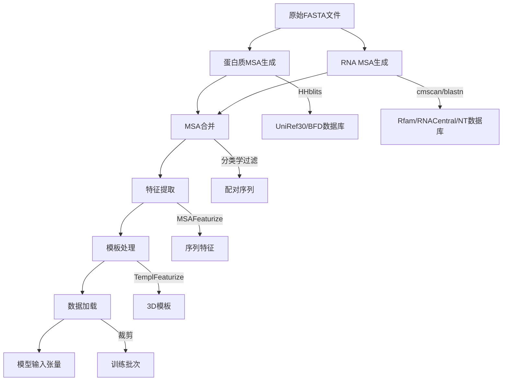

---
slug:9-data-processing-pipeline
blog_type:normal
---


<text>
RoseTTAFold2NA中的数据处理管道是一个精密的系统，专为处理蛋白质和核酸序列的结构预测准备和加载而设计。该管道将原始序列数据转换为神经网络能够高效处理的格式化输入。

## 管道概述

数据处理管道包含三个主要阶段：
1. **输入准备** - 将原始FASTA序列处理为多重序列比对（MSA）
2. **数据合并** - 将蛋白质和RNA的MSA合并为统一格式
3. **数据加载** - 将处理后的数据转换为适合模型训练和推理的张量

每个阶段都以前一阶段为基础，构建了一个全面的处理流程，能够处理具有独特需求的蛋白质和核酸数据。

## 输入准备阶段

### 蛋白质MSA生成

蛋白质MSA生成过程始于FASTA格式的原始蛋白质序列。`make_protein_msa.sh`脚本通过对序列数据库进行迭代搜索来构建全面的MSA。

```bash
#!/bin/bash
# 输入参数
in_fasta="$1"  # 输入FASTA文件
out_dir="$2"   # 输出目录
tag="$3"       # 输出标签
```

该脚本使用**HHblits**搜索两个主要数据库：
- **UniRef30**：提供广泛覆盖的聚类序列数据库
- **BFD**：在需要时用于更深入序列搜索的更大数据库

搜索策略采用迭代过滤，使用逐渐放宽的E值阈值（1e-10、1e-6、1e-3）来平衡序列多样性和质量。每次迭代时，脚本在两个级别应用序列过滤：
- **90%相似度且75%覆盖率** - 更严格的过滤条件
- **90%相似度且50%覆盖率** - 更宽松的过滤条件

该过程持续进行，直到找到足够数量的序列（75%覆盖率下>2000条序列或50%覆盖率下>4000条序列）或耗尽所有搜索选项。

来源：[make_protein_msa.sh#L1-L87](input_prep/make_protein_msa.sh#L1-L87)

### RNA MSA生成

由于核酸的独特特性，RNA序列处理采用不同的方法。`make_rna_msa.sh`脚本实现了一个多步骤处理流程：

```bash
#!/bin/bash
# 输入参数
in_fasta="$1"  # 输入RNA FASTA文件
out_dir="$2"   # 输出目录
out_tag="$3"   # 输出标签
```

RNA处理流程包括：

1. **Rfam数据库搜索**：使用`cmscan`识别RNA家族和结构域
2. **序列检索**：从多个数据库获取相关序列：
   - **RNACentral**：综合RNA序列数据库
   - **NT**：NCBI核苷酸数据库
3. **同源性搜索**：对RNACentral和NT数据库执行`blastn`搜索
4. **序列聚类**：使用`cd-hit-est`在不同相似度阈值（1.00、0.99、0.95、0.90）下去除冗余序列
5. **重新比对**：使用`nhmmer`以逐渐放宽的E值阈值重新比对序列，以获得最佳覆盖率

由于需要处理二级结构考虑因素以及核酸的不同进化模式，RNA流程比蛋白质处理更为复杂。

来源：[make_rna_msa.sh#L1-L135](input_prep/make_rna_msa.sh#L1-L135)

## 数据合并阶段

### 合并蛋白质和RNA MSA

一旦为蛋白质和RNA生成了单独的MSA，`merge_msa_prot_rna.py`脚本会将它们合并为适合联合结构预测的统一格式。

合并过程处理几个关键挑战：

1. **序列格式转换**：
   - 蛋白质序列为A3M格式
   - RNA序列为AFA格式
   - 两者都需要转换为数值表示

```python
# 定义蛋白质和RNA的字母表
ALPHABET = np.array(list("ARNDCQEGHILKMFPSTWYV-"), dtype='|S1').view(np.uint8)
RNA_ALPHABET = np.array(list("ACGT-"), dtype='|S1').view(np.uint8)

def seq2number(seq):
    # 将蛋白质序列转换为数值表示
    seq_no_ins = seq.translate(TABLE)
    seq_no_ins = np.array(list(seq_no_ins), dtype='|S1').view(np.uint8)
    for i in range(ALPHABET.shape[0]):
        seq_no_ins[seq_no_ins == ALPHABET[i]] = i
    seq_no_ins[seq_no_ins > 20] = 20
    return seq_no_ins
```

2. **基于分类学的过滤**：脚本确保每个分类学ID只包含一条序列，选择与查询序列相似度最高的序列。

3. **配对序列处理**：来自蛋白质和RNA MSA中相同分类学ID的序列会配对在一起。未配对的序列会包含缺失组分的间隔字符。

输出格式使用斜杠（`/`分隔符来区分同一比对条目内的蛋白质和RNA序列，创建一个表示两种分子类型的统一MSA。

来源：[merge_msa_prot_rna.py#L1-L246](input_prep/merge_msa_prot_rna.py#L1-L246)

## 数据加载阶段

### 数据集组织

`data_loader.py`文件实现了核心数据加载功能，将数据组织为几个类别：

- **单链蛋白质**：单体蛋白质结构
- **蛋白质复合物**：多链蛋白质组装体
- **RNA结构**：单链和多链RNA分子
- **蛋白质-RNA复合物**：包含蛋白质和RNA组分的结构
- **负样本**：用于训练区分功能的非相互作用蛋白质-RNA对

数据加载器维护独立的训练集和验证集，通过仔细过滤来防止集合间的数据泄露。

来源：[data_loader.py#L285-L600](network/data_loader.py#L285-L600)

### MSA特征提取

`MSAFeaturize`函数将原始MSA数据转换为适合神经网络处理的丰富特征表示：

```python
def MSAFeaturize(msa, ins, params, p_mask=0.15, eps=1e-6, L_s=[]):
    '''
    输入：完整MSA信息和插入信息
    输出：种子MSA特征和额外序列
    
    种子MSA特征包括：
    - 种子序列的氨基酸类型（20种常规氨基酸 + 1个间隔/未知 + 1个掩码）
    - 聚类序列的谱（22）
    - 插入统计信息（2）
    - N端或C端？（2）
    '''
```

关键处理步骤包括：

1. **序列掩码**：应用15%的随机掩码，采用不同策略：
   - 70%替换为掩码标记
   - 10%替换为随机氨基酸
   - 10%替换为基于MSA谱的采样
   - 10%保持不变

2. **聚类**：将相似序列分组并计算聚类谱，比单独使用所有序列更有效地捕获进化信息。

3. **特征工程**：创建多个特征通道，包括：
   - 独热编码的氨基酸类型
   - 位置特异性评分矩阵（PSSM）
   - 插入/缺失统计信息
   - 末端位置指示器

来源：[data_loader.py#L89-L225](network/data_loader.py#L89-L225)

### 模板处理

`TemplFeaturize`函数处理结构模板，这些是与目标序列相似的已知蛋白质或RNA结构：

```python
def TemplFeaturize(tplt, qlen, params, offset=0, npick=1, npick_global=None, pick_top=True, random_noise=5.0):
    # 将模板信息处理为3D坐标和特征
    # 返回：xyz坐标、1D特征和有效性掩码
```

模板处理包括：
- **序列相似度过滤**：排除高相似度模板以防止过拟合
- **坐标提取**：从模板结构中提取3D坐标
- **特征生成**：创建模板特征，包括比对置信度分数
- **掩码生成**：识别模板结构中的有效/缺失原子

来源：[data_loader.py#L227-L283](network/data_loader.py#L227-L283)

### 裁剪策略

为提高训练效率，管道实现了复杂的裁剪策略来处理大型结构：

1. **单链裁剪**：从单链结构中随机选择连续片段
2. **复合物裁剪**：处理多链结构同时保留界面
3. **核酸感知裁剪**：对蛋白质-RNA复合物进行特殊处理以保留相互作用界面

```python
def get_na_crop(seq, xyz, mask, sel, len_s, params, negative=False, incl_protein=True, cutoff=12.0, bp_cutoff=4.0, eps=1e-6):
    # 针对含核酸结构的专门裁剪
    # 保留碱基配对和蛋白质-RNA相互作用
```

裁剪策略确保训练示例专注于生物学相关区域，同时保持计算效率。

来源：[data_loader.py#L673-L799](network/data_loader.py#L673-L799)

## 数据流可视化

下图展示了完整的数据处理管道：



## 关键设计原则

数据处理管道体现了几个重要的设计原则：

1. **模块化**：每个处理阶段都作为独立组件实现，允许独立开发和测试。

2. **可扩展性**：通过智能裁剪和批处理策略，管道能够处理不同大小的结构。

3. **生物学相关性**：特别关注保留重要的生物学特征，如蛋白质-RNA界面和RNA碱基配对。

4. **效率**：多种优化策略，包括序列聚类和智能裁剪，确保计算效率而不牺牲信息内容。

<CgxTip>
数据处理管道计算密集，特别是MSA生成阶段。对于生产使用，考虑为频繁研究的序列预先计算MSA并缓存结果以加速预测时间。
</CgxTip>

## 结论

RoseTTAFold2NA数据处理管道代表了为结构预测准备蛋白质和核酸数据的全面解决方案。通过仔细处理两种分子类型的独特特征并实现复杂的特征提取策略，该管道为准确的3D结构预测提供了丰富、信息丰富的输入。模块化设计允许随着新数据源或处理需求的出现而轻松扩展和修改。
</text>