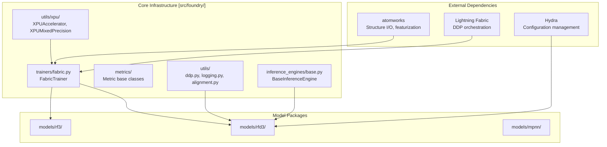

# Advanced Topics

> **Relevant source files**
> * [models/rf3/configs/trainer/xpu.yaml](https://github.com/RosettaCommons/foundry/blob/cee116dc/models/rf3/configs/trainer/xpu.yaml)
> * [models/rfd3/configs/trainer/xpu.yaml](https://github.com/RosettaCommons/foundry/blob/cee116dc/models/rfd3/configs/trainer/xpu.yaml)
> * [models/rfd3/src/rfd3/model/inference_sampler.py](https://github.com/RosettaCommons/foundry/blob/cee116dc/models/rfd3/src/rfd3/model/inference_sampler.py)
> * [models/rfd3/src/rfd3/model/layers/block_utils.py](https://github.com/RosettaCommons/foundry/blob/cee116dc/models/rfd3/src/rfd3/model/layers/block_utils.py)
> * [src/foundry/trainers/fabric.py](https://github.com/RosettaCommons/foundry/blob/cee116dc/src/foundry/trainers/fabric.py)
> * [src/foundry/utils/xpu/__init__.py](https://github.com/RosettaCommons/foundry/blob/cee116dc/src/foundry/utils/xpu/__init__.py)
> * [src/foundry/utils/xpu/single_xpu_strategy.py](https://github.com/RosettaCommons/foundry/blob/cee116dc/src/foundry/utils/xpu/single_xpu_strategy.py)
> * [src/foundry/utils/xpu/xpu_accelerator.py](https://github.com/RosettaCommons/foundry/blob/cee116dc/src/foundry/utils/xpu/xpu_accelerator.py)
> * [src/foundry/utils/xpu/xpu_precision.py](https://github.com/RosettaCommons/foundry/blob/cee116dc/src/foundry/utils/xpu/xpu_precision.py)

This section covers advanced usage patterns and customization options for users who need to extend beyond standard inference workflows. Topics include distributed training, custom dataset creation, and metrics implementation.

## Overview

Advanced topics in Foundry span three main areas:

* **[Distributed Training and Inference](/RosettaCommons/foundry/9.1-distributed-training-and-inference)**: Multi-GPU and multi-node execution patterns using Lightning Fabric.
* **[Custom Datasets](/RosettaCommons/foundry/9.2-custom-datasets)**: Creating and using custom AtomWorks datasets for specialized protein design tasks.
* **[Metrics and Evaluation](/RosettaCommons/foundry/9.3-metrics-and-evaluation)**: Available metrics and implementation of custom evaluation protocols.

These capabilities build on the core infrastructure documented in [Infrastructure and Configuration](/RosettaCommons/foundry/8-infrastructure-and-configuration).

## System Architecture for Advanced Use Cases

Understanding Foundry's architecture is essential for advanced customization. The system separates shared infrastructure from model-specific implementations.

### Repository Structure



The strict dependency hierarchy is: `atomworks` → `foundry` → `model packages`. Models are independent packages that depend on foundry but not on each other.

**Sources:** [src/foundry/trainers/fabric.py L57-L129](https://github.com/RosettaCommons/foundry/blob/cee116dc/src/foundry/trainers/fabric.py#L57-L129)

 [src/foundry/utils/xpu/__init__.py L1-L27](https://github.com/RosettaCommons/foundry/blob/cee116dc/src/foundry/utils/xpu/__init__.py#L1-L27)

 [models/rfd3/src/rfd3/model/inference_sampler.py L12-L18](https://github.com/RosettaCommons/foundry/blob/cee116dc/models/rfd3/src/rfd3/model/inference_sampler.py#L12-L18)

## Key Extension Points

Foundry provides primary extension points for customization:

### Training Infrastructure

The `FabricTrainer` class in [src/foundry/trainers/fabric.py L57-L84](https://github.com/RosettaCommons/foundry/blob/cee116dc/src/foundry/trainers/fabric.py#L57-L84)

 orchestrates distributed training. It includes native support for:

* **Mixed Precision**: Supports `bf16-mixed` and `16-mixed` [src/foundry/trainers/fabric.py L65](https://github.com/RosettaCommons/foundry/blob/cee116dc/src/foundry/trainers/fabric.py#L65-L65)
* **Hardware Abstraction**: Includes specialized support for Intel GPUs via `XPUAccelerator` and `XPUMixedPrecision` [src/foundry/utils/xpu/xpu_precision.py L11-L42](https://github.com/RosettaCommons/foundry/blob/cee116dc/src/foundry/utils/xpu/xpu_precision.py#L11-L42)
* **Gradient Management**: Configurable `grad_accum_steps`, `clip_grad_max_norm`, and `skip_nan_grad` [src/foundry/trainers/fabric.py L69-L76](https://github.com/RosettaCommons/foundry/blob/cee116dc/src/foundry/trainers/fabric.py#L69-L76)

See [Distributed Training and Inference](/RosettaCommons/foundry/9.1-distributed-training-and-inference) for detailed usage.

### Diffusion Sampling Customization

For generative tasks in RFD3, the `SampleDiffusionConfig` and `SampleDiffusionWithMotif` classes allow for deep control over the sampling process [models/rfd3/src/rfd3/model/inference_sampler.py L24-L58](https://github.com/RosettaCommons/foundry/blob/cee116dc/models/rfd3/src/rfd3/model/inference_sampler.py#L24-L58)

* **Noise Schedules**: Custom inference noise schedules following AlphaFold 3 specifications [models/rfd3/src/rfd3/model/inference_sampler.py L61-L88](https://github.com/RosettaCommons/foundry/blob/cee116dc/models/rfd3/src/rfd3/model/inference_sampler.py#L61-L88)
* **Partial Diffusion**: Filtering the noise schedule based on a `partial_t` parameter for motif scaffolding [models/rfd3/src/rfd3/model/inference_sampler.py L89-L131](https://github.com/RosettaCommons/foundry/blob/cee116dc/models/rfd3/src/rfd3/model/inference_sampler.py#L89-L131)

**Sources:** [models/rfd3/src/rfd3/model/inference_sampler.py L24-L131](https://github.com/RosettaCommons/foundry/blob/cee116dc/models/rfd3/src/rfd3/model/inference_sampler.py#L24-L131)

 [src/foundry/trainers/fabric.py L57-L129](https://github.com/RosettaCommons/foundry/blob/cee116dc/src/foundry/trainers/fabric.py#L57-L129)

## Hardware-Specific Advanced Usage

### Intel XPU Support

Foundry includes a dedicated utility suite for Intel XPU devices, allowing the same training code to run on Intel hardware with minimal configuration changes.

| Component | Class | File Path |
| --- | --- | --- |
| Accelerator | `XPUAccelerator` | [src/foundry/utils/xpu/xpu_accelerator.py L9-L14](https://github.com/RosettaCommons/foundry/blob/cee116dc/src/foundry/utils/xpu/xpu_accelerator.py#L9-L14) |
| Strategy | `SingleXPUStrategy` | [src/foundry/utils/xpu/single_xpu_strategy.py L13-L20](https://github.com/RosettaCommons/foundry/blob/cee116dc/src/foundry/utils/xpu/single_xpu_strategy.py#L13-L20) |
| Precision | `XPUMixedPrecision` | [src/foundry/utils/xpu/xpu_precision.py L11-L16](https://github.com/RosettaCommons/foundry/blob/cee116dc/src/foundry/utils/xpu/xpu_precision.py#L11-L16) |

To use XPU, you can apply the `xpu` trainer configuration:

```
python models/rfd3/src/rfd3/train.py trainer=xpu
```

**Sources:** [models/rfd3/configs/trainer/xpu.yaml L1-L7](https://github.com/RosettaCommons/foundry/blob/cee116dc/models/rfd3/configs/trainer/xpu.yaml#L1-L7)

 [src/foundry/utils/xpu/__init__.py L1-L27](https://github.com/RosettaCommons/foundry/blob/cee116dc/src/foundry/utils/xpu/__init__.py#L1-L27)

## Distributed Training Overview

Foundry uses Lightning Fabric for distributed execution. The `FabricTrainer` handles rank-aware logging and device setup.

### Rank Management

The `RankedLogger` ensures that logs are clean during multi-GPU runs by restricting output to rank zero where appropriate [models/rfd3/src/rfd3/model/inference_sampler.py L21](https://github.com/RosettaCommons/foundry/blob/cee116dc/models/rfd3/src/rfd3/model/inference_sampler.py#L21-L21)

### Configuration Parameters

| Parameter | Purpose | Example |
| --- | --- | --- |
| `strategy` | Distributed strategy | `"ddp"` or `"xpu_single"` |
| `devices_per_node` | Number of GPUs/XPUs | `8` |
| `num_nodes` | Number of machines | `1` |
| `precision` | Floating point mode | `"bf16-mixed"` |

**Sources:** [src/foundry/trainers/fabric.py L61-L65](https://github.com/RosettaCommons/foundry/blob/cee116dc/src/foundry/trainers/fabric.py#L61-L65)

 [models/rf3/configs/trainer/xpu.yaml L1-L7](https://github.com/RosettaCommons/foundry/blob/cee116dc/models/rf3/configs/trainer/xpu.yaml#L1-L7)

## Next Steps

* **[Distributed Training and Inference](/RosettaCommons/foundry/9.1-distributed-training-and-inference)**: Document multi-GPU training setup, DDP configuration, and rank management.
* **[Custom Datasets](/RosettaCommons/foundry/9.2-custom-datasets)**: Guide for creating and using custom datasets with AtomWorks for both training and inference.
* **[Metrics and Evaluation](/RosettaCommons/foundry/9.3-metrics-and-evaluation)**: Document available metrics including hydrogen bond statistics, RMSD, and sequence recovery.