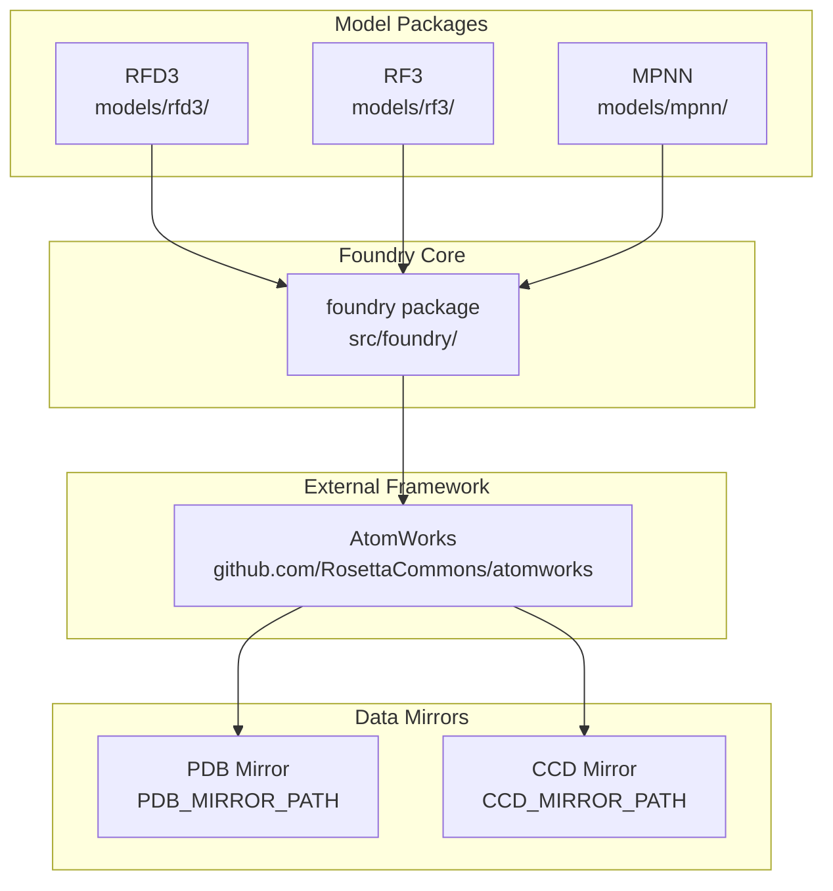
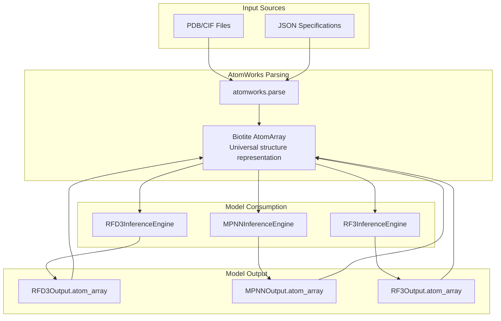
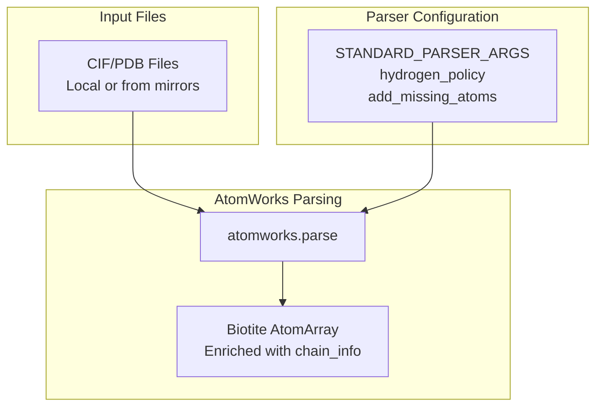

# AtomWorks Foundation

> **Relevant source files**
> * [.env](https://github.com/RosettaCommons/foundry/blob/cee116dc/.env)
> * [README.md](https://github.com/RosettaCommons/foundry/blob/cee116dc/README.md?plain=1)
> * [examples/all.ipynb](https://github.com/RosettaCommons/foundry/blob/cee116dc/examples/all.ipynb)
> * [models/rf3/configs/inference_engine/base.yaml](https://github.com/RosettaCommons/foundry/blob/cee116dc/models/rf3/configs/inference_engine/base.yaml)
> * [models/rf3/configs/inference_engine/rf3.yaml](https://github.com/RosettaCommons/foundry/blob/cee116dc/models/rf3/configs/inference_engine/rf3.yaml)
> * [models/rf3/src/rf3/data/extra_xforms.py](https://github.com/RosettaCommons/foundry/blob/cee116dc/models/rf3/src/rf3/data/extra_xforms.py)
> * [models/rf3/src/rf3/data/pipelines.py](https://github.com/RosettaCommons/foundry/blob/cee116dc/models/rf3/src/rf3/data/pipelines.py)
> * [models/rf3/src/rf3/inference.py](https://github.com/RosettaCommons/foundry/blob/cee116dc/models/rf3/src/rf3/inference.py)
> * [models/rf3/src/rf3/inference_engines/rf3.py](https://github.com/RosettaCommons/foundry/blob/cee116dc/models/rf3/src/rf3/inference_engines/rf3.py)
> * [models/rf3/src/rf3/symmetry/resolve.py](https://github.com/RosettaCommons/foundry/blob/cee116dc/models/rf3/src/rf3/symmetry/resolve.py)
> * [models/rf3/src/rf3/utils/inference.py](https://github.com/RosettaCommons/foundry/blob/cee116dc/models/rf3/src/rf3/utils/inference.py)
> * [models/rfd3/README.md](https://github.com/RosettaCommons/foundry/blob/cee116dc/models/rfd3/README.md?plain=1)
> * [models/rfd3/src/rfd3/engine.py](https://github.com/RosettaCommons/foundry/blob/cee116dc/models/rfd3/src/rfd3/engine.py)
> * [models/rfd3/src/rfd3/inference/datasets.py](https://github.com/RosettaCommons/foundry/blob/cee116dc/models/rfd3/src/rfd3/inference/datasets.py)
> * [models/rfd3/src/rfd3/utils/inference.py](https://github.com/RosettaCommons/foundry/blob/cee116dc/models/rfd3/src/rfd3/utils/inference.py)
> * [models/rfd3na/src/rfd3na/utils/inference.py](https://github.com/RosettaCommons/foundry/blob/cee116dc/models/rfd3na/src/rfd3na/utils/inference.py)
> * [src/foundry/inference_engines/base.py](https://github.com/RosettaCommons/foundry/blob/cee116dc/src/foundry/inference_engines/base.py)
> * [src/foundry/inference_engines/checkpoint_registry.py](https://github.com/RosettaCommons/foundry/blob/cee116dc/src/foundry/inference_engines/checkpoint_registry.py)
> * [src/foundry_cli/__init__.py](https://github.com/RosettaCommons/foundry/blob/cee116dc/src/foundry_cli/__init__.py)
> * [src/foundry_cli/download_checkpoints.py](https://github.com/RosettaCommons/foundry/blob/cee116dc/src/foundry_cli/download_checkpoints.py)

## Purpose and Scope

This document describes **AtomWorks** as the foundational framework underlying the entire Foundry ecosystem. AtomWorks provides the unified infrastructure for manipulating and processing biomolecular structures, serving as the core dependency for all Foundry models. This page covers AtomWorks' role in the system architecture, the `Biotite AtomArray` data structure that enables interoperability between models, and the key operations provided by the framework.

For information about specific model implementations that use AtomWorks, see [RFD3 Overview and Capabilities](/RosettaCommons/foundry/4.1-rfd3-overview-and-capabilities), [RF3 Overview](/RosettaCommons/foundry/5.1-rf3-overview), and [MPNN Overview](/RosettaCommons/foundry/6.1-mpnn-overview). For details on the transform pipeline that builds upon AtomWorks, see [Data Pipeline and Transforms](/RosettaCommons/foundry/8.5-data-pipeline-and-transforms).

---

## AtomWorks in the Foundry Architecture

### Strict Dependency Hierarchy

Foundry enforces a **unidirectional dependency flow**: `foundry → atomworks`. This means:

* Foundry depends on AtomWorks for all structure operations. [README.md L112-L113](https://github.com/RosettaCommons/foundry/blob/cee116dc/README.md?plain=1#L112-L113)
* AtomWorks remains independent and can be used standalone. [README.md L5](https://github.com/RosettaCommons/foundry/blob/cee116dc/README.md?plain=1#L5-L5)
* All model packages (RFD3, RF3, MPNN) access AtomWorks through Foundry shared utilities or direct imports. [README.md L114-L115](https://github.com/RosettaCommons/foundry/blob/cee116dc/README.md?plain=1#L114-L115)
* No reverse dependencies are allowed.

**Diagram: Dependency Architecture**



**Sources:** [README.md L5-L6](https://github.com/RosettaCommons/foundry/blob/cee116dc/README.md?plain=1#L5-L6)

 [README.md L112-L115](https://github.com/RosettaCommons/foundry/blob/cee116dc/README.md?plain=1#L112-L115)

 [.env L9-L22](https://github.com/RosettaCommons/foundry/blob/cee116dc/.env#L9-L22)

### Core Capabilities

AtomWorks provides three primary categories of functionality:

| Category | Description | Key Operations |
| --- | --- | --- |
| **Structure I/O** | Reading and writing biomolecular structure files | CIF/PDB parsing, format conversion, mirror access |
| **Preprocessing** | Preparing structures for model consumption | Bond detection, atom annotation, non-standard residue handling |
| **Featurization** | Extracting model-ready features from structures | Token-level, atom-level, and pair-level feature extraction |

**Sources:** [README.md L114-L115](https://github.com/RosettaCommons/foundry/blob/cee116dc/README.md?plain=1#L114-L115)

 [models/rfd3/src/rfd3/utils/inference.py L11-L23](https://github.com/RosettaCommons/foundry/blob/cee116dc/models/rfd3/src/rfd3/utils/inference.py#L11-L23)

---

## The Biotite AtomArray Data Structure

### Universal Data Representation

The **`biotite.structure.AtomArray`** serves as the universal data structure throughout Foundry, enabling seamless interoperability between all models and pipeline components. [examples/all.ipynb L20](https://github.com/RosettaCommons/foundry/blob/cee116dc/examples/all.ipynb#L20-L20)

**Diagram: AtomArray as the Universal Format**



**Sources:** [models/rfd3/src/rfd3/engine.py L91-L92](https://github.com/RosettaCommons/foundry/blob/cee116dc/models/rfd3/src/rfd3/engine.py#L91-L92)

 [models/rf3/src/rf3/inference_engines/rf3.py L99-L106](https://github.com/RosettaCommons/foundry/blob/cee116dc/models/rf3/src/rf3/inference_engines/rf3.py#L99-L106)

 [models/rfd3/src/rfd3/utils/inference.py L11-L13](https://github.com/RosettaCommons/foundry/blob/cee116dc/models/rfd3/src/rfd3/utils/inference.py#L11-L13)

### AtomArray Properties and Annotations

An `AtomArray` is a structured representation of atomic coordinates and properties. In Foundry, it is often enriched with custom annotations required for specific model logic. [models/rfd3/src/rfd3/utils/inference.py L53-L73](https://github.com/RosettaCommons/foundry/blob/cee116dc/models/rfd3/src/rfd3/utils/inference.py#L53-L73)

```python
# Example from the codebaseatom_array = outputs[first_key][0].atom_array  # RFD3 output# atom_array contains:# - Coordinates: atom_array.coord# - Atom names: atom_array.atom_name# - Residue names: atom_array.res_name# - Chain IDs: atom_array.chain_id# - Custom annotations (e.g., is_motif_atom_with_fixed_coord)
```

Common annotations include:

* `is_motif_atom_with_fixed_coord`: Boolean mask for design constraints. [models/rfd3/src/rfd3/utils/inference.py L128-L134](https://github.com/RosettaCommons/foundry/blob/cee116dc/models/rfd3/src/rfd3/utils/inference.py#L128-L134)
* `src_component`: Tracks the origin of a residue or ligand. [models/rfd3/src/rfd3/utils/inference.py L61-L72](https://github.com/RosettaCommons/foundry/blob/cee116dc/models/rfd3/src/rfd3/utils/inference.py#L61-L72)
* `molecule_id`: Groups atoms into distinct molecules. [models/rfd3/src/rfd3/utils/inference.py L80](https://github.com/RosettaCommons/foundry/blob/cee116dc/models/rfd3/src/rfd3/utils/inference.py#L80-L80)
* `occupancy`, `b_factor`, `charge`: Standard PDB properties. [models/rfd3/src/rfd3/utils/inference.py L55-L60](https://github.com/RosettaCommons/foundry/blob/cee116dc/models/rfd3/src/rfd3/utils/inference.py#L55-L60)

**Sources:** [models/rfd3/src/rfd3/utils/inference.py L53-L85](https://github.com/RosettaCommons/foundry/blob/cee116dc/models/rfd3/src/rfd3/utils/inference.py#L53-L85)

 [models/rfd3/src/rfd3/engine.py L105-L110](https://github.com/RosettaCommons/foundry/blob/cee116dc/models/rfd3/src/rfd3/engine.py#L105-L110)

---

## Structure I/O and Parsing

### File Format Support

AtomWorks provides parsers for standard biomolecular structure formats:

| Format | Extension | Usage |
| --- | --- | --- |
| **CIF** | `.cif`, `.cif.gz` | Primary format, supports metadata. [models/rfd3/src/rfd3/engine.py L105-L111](https://github.com/RosettaCommons/foundry/blob/cee116dc/models/rfd3/src/rfd3/engine.py#L105-L111) |
| **PDB** | `.pdb` | Legacy format, widely compatible. [models/rf3/src/rf3/utils/inference.py L80-L83](https://github.com/RosettaCommons/foundry/blob/cee116dc/models/rf3/src/rf3/utils/inference.py#L80-L83) |

**Diagram: Structure Parsing Flow**



**Sources:** [models/rf3/src/rf3/utils/inference.py L94-L105](https://github.com/RosettaCommons/foundry/blob/cee116dc/models/rf3/src/rf3/utils/inference.py#L94-L105)

 [models/rfd3/src/rfd3/utils/inference.py L11-L15](https://github.com/RosettaCommons/foundry/blob/cee116dc/models/rfd3/src/rfd3/utils/inference.py#L11-L15)

### Mirror Access for Training Data

AtomWorks integrates with local mirrors of PDB and CCD databases for efficient access during training. [models/rfd3/README.md L110-L114](https://github.com/RosettaCommons/foundry/blob/cee116dc/models/rfd3/README.md?plain=1#L110-L114)

**PDB Mirror Structure:**

```
PDB_MIRROR_PATH/
  ├── a2/
  │   └── 1a2b.cif.gz
  ├── b3/
  │   └── 2b3c.cif.gz
```

**CCD Mirror Structure:**

```
CCD_MIRROR_PATH/
  ├── H/
  │   └── HEM/
  │       └── HEM.cif
```

**Sources:** [.env L9-L22](https://github.com/RosettaCommons/foundry/blob/cee116dc/.env#L9-L22)

 [models/rfd3/README.md L110-L115](https://github.com/RosettaCommons/foundry/blob/cee116dc/models/rfd3/README.md?plain=1#L110-L115)

---

## Preprocessing Operations

### Bond Detection and Annotation

AtomWorks automatically detects bonds and adds structural annotations during preprocessing. This is critical for non-standard residues like PTMs or modified amino acids. [models/rfd3/src/rfd3/utils/inference.py L167-L184](https://github.com/RosettaCommons/foundry/blob/cee116dc/models/rfd3/src/rfd3/utils/inference.py#L167-L184)

Operations include:

* **Covalent bond detection**: Identifies bonds based on atomic distances and chemical rules. [models/rfd3/src/rfd3/utils/inference.py L186-L187](https://github.com/RosettaCommons/foundry/blob/cee116dc/models/rfd3/src/rfd3/utils/inference.py#L186-L187)
* **Chain identification**: Determines polypeptide/nucleotide chains. [models/rfd3/src/rfd3/utils/inference.py L141-L146](https://github.com/RosettaCommons/foundry/blob/cee116dc/models/rfd3/src/rfd3/utils/inference.py#L141-L146)
* **Non-standard residue handling**: Restores bonds for PTMs from source structures. [models/rfd3/src/rfd3/utils/inference.py L167-L171](https://github.com/RosettaCommons/foundry/blob/cee116dc/models/rfd3/src/rfd3/utils/inference.py#L167-L171)

**Sources:** [models/rfd3/src/rfd3/utils/inference.py L167-L187](https://github.com/RosettaCommons/foundry/blob/cee116dc/models/rfd3/src/rfd3/utils/inference.py#L167-L187)

 [models/rfd3/src/rfd3/utils/inference.py L141-L160](https://github.com/RosettaCommons/foundry/blob/cee116dc/models/rfd3/src/rfd3/utils/inference.py#L141-L160)

### Token-Level Operations

AtomWorks provides utilities for working at the **token level** (residues/ligands) rather than the atom level. [models/rfd3/src/rfd3/utils/inference.py L20-L23](https://github.com/RosettaCommons/foundry/blob/cee116dc/models/rfd3/src/rfd3/utils/inference.py#L20-L23)

**Key Functions:**

| Function | Module | Description |
| --- | --- | --- |
| `get_token_starts` | `atomworks.ml.utils.token` | Get indices of first atom in each token. [models/rfd3/src/rfd3/utils/inference.py L21](https://github.com/RosettaCommons/foundry/blob/cee116dc/models/rfd3/src/rfd3/utils/inference.py#L21-L21) |
| `spread_token_wise` | `atomworks.ml.utils.token` | Broadcast token-level values to all atoms in token. [models/rfd3/src/rfd3/utils/inference.py L22](https://github.com/RosettaCommons/foundry/blob/cee116dc/models/rfd3/src/rfd3/utils/inference.py#L22-L22) |

**Sources:** [models/rfd3/src/rfd3/utils/inference.py L20-L23](https://github.com/RosettaCommons/foundry/blob/cee116dc/models/rfd3/src/rfd3/utils/inference.py#L20-L23)

---

## Featurization Framework

### Multi-Level Feature Extraction

AtomWorks extracts features at three levels of granularity:

1. **Token-Level**: Per-residue features (residue type, sequence encoding). [models/rfd3/src/rfd3/utils/inference.py L44-L46](https://github.com/RosettaCommons/foundry/blob/cee116dc/models/rfd3/src/rfd3/utils/inference.py#L44-L46)
2. **Atom-Level**: Per-atom features (coordinates, element type). [models/rfd3/src/rfd3/engine.py L92](https://github.com/RosettaCommons/foundry/blob/cee116dc/models/rfd3/src/rfd3/engine.py#L92-L92)
3. **Pair-Level**: Token-token interactions (distances, contact maps).

**Sources:** [models/rfd3/src/rfd3/utils/inference.py L16-L23](https://github.com/RosettaCommons/foundry/blob/cee116dc/models/rfd3/src/rfd3/utils/inference.py#L16-L23)

 [models/rfd3/src/rfd3/engine.py L92-L93](https://github.com/RosettaCommons/foundry/blob/cee116dc/models/rfd3/src/rfd3/engine.py#L92-L93)

### Token Encoding Systems

Different models use encoding schemes defined in AtomWorks, such as the `AF3SequenceEncoding` which categorizes residues into amino acids, nucleic acids, and ligands. [models/rfd3/src/rfd3/utils/inference.py L16](https://github.com/RosettaCommons/foundry/blob/cee116dc/models/rfd3/src/rfd3/utils/inference.py#L16-L16)

 [models/rfd3/src/rfd3/utils/inference.py L44-L46](https://github.com/RosettaCommons/foundry/blob/cee116dc/models/rfd3/src/rfd3/utils/inference.py#L44-L46)

**Sources:** [models/rfd3/src/rfd3/utils/inference.py L16-L46](https://github.com/RosettaCommons/foundry/blob/cee116dc/models/rfd3/src/rfd3/utils/inference.py#L16-L46)

---

## Summary

AtomWorks serves as the **universal adapter layer** for biomolecular structures in Foundry:

| Aspect | Role |
| --- | --- |
| **Dependency** | Core external framework, strict unidirectional dependency. [README.md L112-L113](https://github.com/RosettaCommons/foundry/blob/cee116dc/README.md?plain=1#L112-L113) |
| **Data Structure** | Provides `Biotite AtomArray` as universal format. [examples/all.ipynb L20](https://github.com/RosettaCommons/foundry/blob/cee116dc/examples/all.ipynb#L20-L20) |
| **I/O** | Handles all structure reading/writing (CIF, PDB). [models/rfd3/src/rfd3/engine.py L12-L13](https://github.com/RosettaCommons/foundry/blob/cee116dc/models/rfd3/src/rfd3/engine.py#L12-L13) |
| **Preprocessing** | Bond detection, annotation, residue handling. [models/rfd3/src/rfd3/utils/inference.py L167-L171](https://github.com/RosettaCommons/foundry/blob/cee116dc/models/rfd3/src/rfd3/utils/inference.py#L167-L171) |
| **Interoperability** | Enables seamless data flow between RFD3, MPNN, and RF3. [examples/all.ipynb L24-L27](https://github.com/RosettaCommons/foundry/blob/cee116dc/examples/all.ipynb#L24-L27) |

**Sources:** [README.md L112-L113](https://github.com/RosettaCommons/foundry/blob/cee116dc/README.md?plain=1#L112-L113)

 [examples/all.ipynb L20-L27](https://github.com/RosettaCommons/foundry/blob/cee116dc/examples/all.ipynb#L20-L27)

 [models/rfd3/src/rfd3/engine.py L12-L13](https://github.com/RosettaCommons/foundry/blob/cee116dc/models/rfd3/src/rfd3/engine.py#L12-L13)