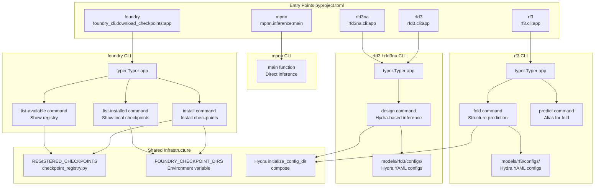

# CLI Reference

> **Relevant source files**
> * [.env](https://github.com/RosettaCommons/foundry/blob/cee116dc/.env)
> * [README.md](https://github.com/RosettaCommons/foundry/blob/cee116dc/README.md?plain=1)
> * [models/rf3/configs/experiment/pretrained/rf3.yaml](https://github.com/RosettaCommons/foundry/blob/cee116dc/models/rf3/configs/experiment/pretrained/rf3.yaml)
> * [models/rf3/src/rf3/callbacks/dump_validation_structures.py](https://github.com/RosettaCommons/foundry/blob/cee116dc/models/rf3/src/rf3/callbacks/dump_validation_structures.py)
> * [models/rf3/src/rf3/cli.py](https://github.com/RosettaCommons/foundry/blob/cee116dc/models/rf3/src/rf3/cli.py)
> * [models/rf3/src/rf3/utils/io.py](https://github.com/RosettaCommons/foundry/blob/cee116dc/models/rf3/src/rf3/utils/io.py)
> * [models/rfd3/README.md](https://github.com/RosettaCommons/foundry/blob/cee116dc/models/rfd3/README.md?plain=1)
> * [models/rfd3/src/rfd3/cli.py](https://github.com/RosettaCommons/foundry/blob/cee116dc/models/rfd3/src/rfd3/cli.py)
> * [pyproject.toml](https://github.com/RosettaCommons/foundry/blob/cee116dc/pyproject.toml)
> * [src/foundry/inference_engines/base.py](https://github.com/RosettaCommons/foundry/blob/cee116dc/src/foundry/inference_engines/base.py)
> * [src/foundry/inference_engines/checkpoint_registry.py](https://github.com/RosettaCommons/foundry/blob/cee116dc/src/foundry/inference_engines/checkpoint_registry.py)
> * [src/foundry_cli/__init__.py](https://github.com/RosettaCommons/foundry/blob/cee116dc/src/foundry_cli/__init__.py)
> * [src/foundry_cli/download_checkpoints.py](https://github.com/RosettaCommons/foundry/blob/cee116dc/src/foundry_cli/download_checkpoints.py)

This page documents the command-line interfaces for the Foundry system. Foundry provides four main CLI commands for model checkpoint management and inference across RFdiffusion3, RosettaFold3, and ProteinMPNN/LigandMPNN.

For detailed usage examples of specific design applications, see the model-specific documentation: [RFD3 Overview and Capabilities](/RosettaCommons/foundry/4.1-rfd3-overview-and-capabilities), [RF3 Overview](/RosettaCommons/foundry/5.1-rf3-overview), and [MPNN Overview](/RosettaCommons/foundry/6.1-mpnn-overview). For information about the underlying configuration system that powers these CLIs, see [Configuration System](/RosettaCommons/foundry/8.2-configuration-system).

## CLI Architecture Overview



**Sources**: [pyproject.toml L90-L94](https://github.com/RosettaCommons/foundry/blob/cee116dc/pyproject.toml#L90-L94)

 [src/foundry_cli/download_checkpoints.py L29-L30](https://github.com/RosettaCommons/foundry/blob/cee116dc/src/foundry_cli/download_checkpoints.py#L29-L30)

 [models/rfd3/src/rfd3/cli.py L6-L7](https://github.com/RosettaCommons/foundry/blob/cee116dc/models/rfd3/src/rfd3/cli.py#L6-L7)

 [models/rf3/src/rf3/cli.py L6](https://github.com/RosettaCommons/foundry/blob/cee116dc/models/rf3/src/rf3/cli.py#L6-L6)

## Command Entry Points

All CLI commands are registered as console scripts in [pyproject.toml L90-L94](https://github.com/RosettaCommons/foundry/blob/cee116dc/pyproject.toml#L90-L94)

 and become available after package installation:

| Command | Module Path | Purpose |
| --- | --- | --- |
| `foundry` | `foundry_cli.download_checkpoints:app` | Checkpoint management |
| `rfd3` | `rfd3.cli:app` | RFdiffusion3 design |
| `rfd3na` | `rfd3na.cli:app` | RFdiffusion3NA design |
| `rf3` | `rf3.cli:app` | RosettaFold3 structure prediction |
| `mpnn` | `mpnn.inference:main` | ProteinMPNN/LigandMPNN sequence design |

**Sources**: [pyproject.toml L90-L94](https://github.com/RosettaCommons/foundry/blob/cee116dc/pyproject.toml#L90-L94)

## foundry CLI

The `foundry` command manages model checkpoint installation and discovery. It uses a checkpoint registry [src/foundry/inference_engines/checkpoint_registry.py L80-L122](https://github.com/RosettaCommons/foundry/blob/cee116dc/src/foundry/inference_engines/checkpoint_registry.py#L80-L122)

 and supports multiple checkpoint directories via the `FOUNDRY_CHECKPOINT_DIRS` environment variable [src/foundry/inference_engines/checkpoint_registry.py L32-L41](https://github.com/RosettaCommons/foundry/blob/cee116dc/src/foundry/inference_engines/checkpoint_registry.py#L32-L41)

### Subcommands

#### install

Install model checkpoints from the remote registry.

**Syntax:**

```
foundry install MODELS [OPTIONS]
```

**Arguments:**

* `MODELS` (required): Space-separated list of models to install. Options: * `all` - All available models [src/foundry_cli/download_checkpoints.py L173-L174](https://github.com/RosettaCommons/foundry/blob/cee116dc/src/foundry_cli/download_checkpoints.py#L173-L174) * `base-models` - Core models: rfd3, rfd3na, proteinmpnn, ligandmpnn, rf3 [src/foundry_cli/download_checkpoints.py L175-L176](https://github.com/RosettaCommons/foundry/blob/cee116dc/src/foundry_cli/download_checkpoints.py#L175-L176) * Individual model names: `rfd3`, `rfd3na`, `rf3`, `proteinmpnn`, `ligandmpnn`, etc.

**Options:**

* `--checkpoint-dir, -d PATH` - Directory to save checkpoints (default: `~/.foundry/checkpoints`) [src/foundry_cli/download_checkpoints.py L150-L155](https://github.com/RosettaCommons/foundry/blob/cee116dc/src/foundry_cli/download_checkpoints.py#L150-L155)
* `--force, -f` - Overwrite existing checkpoints [src/foundry_cli/download_checkpoints.py L156-L158](https://github.com/RosettaCommons/foundry/blob/cee116dc/src/foundry_cli/download_checkpoints.py#L156-L158)

**Implementation:** [src/foundry_cli/download_checkpoints.py L144-L186](https://github.com/RosettaCommons/foundry/blob/cee116dc/src/foundry_cli/download_checkpoints.py#L144-L186)

#### list-available

Display all models in the checkpoint registry defined in `REGISTERED_CHECKPOINTS`.

**Syntax:**

```
foundry list-available
```

**Implementation:** [src/foundry_cli/download_checkpoints.py L188-L193](https://github.com/RosettaCommons/foundry/blob/cee116dc/src/foundry_cli/download_checkpoints.py#L188-L193)

#### list-installed

Show checkpoints installed in search directories (defined by `FOUNDRY_CHECKPOINT_DIRS` and `~/.foundry/checkpoints`).

**Syntax:**

```
foundry list-installed
```

**Implementation:** [src/foundry_cli/download_checkpoints.py L196-L222](https://github.com/RosettaCommons/foundry/blob/cee116dc/src/foundry_cli/download_checkpoints.py#L196-L222)

**Sources**: [src/foundry_cli/download_checkpoints.py L1-L274](https://github.com/RosettaCommons/foundry/blob/cee116dc/src/foundry_cli/download_checkpoints.py#L1-L274)

 [src/foundry/inference_engines/checkpoint_registry.py L1-L122](https://github.com/RosettaCommons/foundry/blob/cee116dc/src/foundry/inference_engines/checkpoint_registry.py#L1-L122)

## rfd3 / rfd3na CLI

The `rfd3` and `rfd3na` commands provide access to RFdiffusion generative design. They use Hydra for configuration management.

### design Command

Run generative protein or nucleic acid design.

**Syntax:**

```
rfd3 design [HYDRA_OVERRIDES...]rfd3na design [HYDRA_OVERRIDES...]
```

**Common Parameters:**

| Parameter | Default | Description |
| --- | --- | --- |
| `out_dir` | Required | Output directory for generated structures |
| `inputs` | Required | Path to input specification JSON/YAML file |
| `inference_engine` | `rfdiffusion3` | Inference engine config to use [models/rfd3/src/rfd3/cli.py L33](https://github.com/RosettaCommons/foundry/blob/cee116dc/models/rfd3/src/rfd3/cli.py#L33-L33) |
| `dump_trajectories` | `False` | Save diffusion trajectories [models/rfd3/README.md L52](https://github.com/RosettaCommons/foundry/blob/cee116dc/models/rfd3/README.md?plain=1#L52-L52) |
| `prevalidate_inputs` | `False` | Validate inputs before loading model [models/rfd3/README.md L53](https://github.com/RosettaCommons/foundry/blob/cee116dc/models/rfd3/README.md?plain=1#L53-L53) |

**Implementation:** [models/rfd3/src/rfd3/cli.py L9-L43](https://github.com/RosettaCommons/foundry/blob/cee116dc/models/rfd3/src/rfd3/cli.py#L9-L43)

**Sources**: [models/rfd3/src/rfd3/cli.py L1-L48](https://github.com/RosettaCommons/foundry/blob/cee116dc/models/rfd3/src/rfd3/cli.py#L1-L48)

 [models/rfd3/README.md L40-L64](https://github.com/RosettaCommons/foundry/blob/cee116dc/models/rfd3/README.md?plain=1#L40-L64)

## rf3 CLI

The `rf3` command provides structure prediction using RosettaFold3. It supports `fold` and `predict` aliases.

### fold / predict Commands

**Syntax:**

```
rf3 fold [OPTIONS] [ARGUMENTS...]rf3 predict [OPTIONS] [ARGUMENTS...]
```

**Options:**

* `--verbose, -v` - Show detailed logging output [models/rf3/src/rf3/cli.py L14-L16](https://github.com/RosettaCommons/foundry/blob/cee116dc/models/rf3/src/rf3/cli.py#L14-L16)

**Arguments:**
The CLI supports Hydra override style (`key=value`). If a single argument without `=` is provided, it is assumed to be the `inputs` path [models/rf3/src/rf3/cli.py L46-L48](https://github.com/RosettaCommons/foundry/blob/cee116dc/models/rf3/src/rf3/cli.py#L46-L48)

**Implementation:** [models/rf3/src/rf3/cli.py L9-L86](https://github.com/RosettaCommons/foundry/blob/cee116dc/models/rf3/src/rf3/cli.py#L9-L86)

**Sources**: [models/rf3/src/rf3/cli.py L1-L87](https://github.com/RosettaCommons/foundry/blob/cee116dc/models/rf3/src/rf3/cli.py#L1-L87)

## mpnn CLI

The `mpnn` command provides sequence design using ProteinMPNN/LigandMPNN.

**Syntax:**

```
mpnn [ARGUMENTS...]
```

**Implementation:** The entry point is `mpnn.inference:main` [pyproject.toml L93](https://github.com/RosettaCommons/foundry/blob/cee116dc/pyproject.toml#L93-L93)

 This engine handles inverse-folding tasks for backbones under constrained conditions [README.md L102](https://github.com/RosettaCommons/foundry/blob/cee116dc/README.md?plain=1#L102-L102)

**Sources**: [pyproject.toml L93](https://github.com/RosettaCommons/foundry/blob/cee116dc/pyproject.toml#L93-L93)

 [README.md L101-L105](https://github.com/RosettaCommons/foundry/blob/cee116dc/README.md?plain=1#L101-L105)

## Infrastructure Integration

### Checkpoint Resolution

When a model name is provided to an inference engine, it is resolved via `BaseInferenceEngine`:

1. If the path is a registered name, it looks up the default path from the registry [src/foundry/inference_engines/base.py L72-L80](https://github.com/RosettaCommons/foundry/blob/cee116dc/src/foundry/inference_engines/base.py#L72-L80)
2. It searches all directories in the `FOUNDRY_CHECKPOINT_DIRS` search path [src/foundry/inference_engines/checkpoint_registry.py L71-L77](https://github.com/RosettaCommons/foundry/blob/cee116dc/src/foundry/inference_engines/checkpoint_registry.py#L71-L77)

### Environment Variables

Foundry uses a `.env` file to manage external tool paths and data mirrors:

* `HBPLUS_PATH`: Path to the `hbplus` executable for hydrogen bond calculation [models/rfd3/README.md L38](https://github.com/RosettaCommons/foundry/blob/cee116dc/models/rfd3/README.md?plain=1#L38-L38)  [.env L29-L32](https://github.com/RosettaCommons/foundry/blob/cee116dc/.env#L29-L32)
* `FOUNDRY_CHECKPOINT_DIRS`: Colon-separated list of directories to search for model weights [.env L61-L63](https://github.com/RosettaCommons/foundry/blob/cee116dc/.env#L61-L63)
* `PDB_MIRROR_PATH` and `CCD_MIRROR_PATH`: Paths to local PDB and CCD mirrors for training and inference [.env L9-L22](https://github.com/RosettaCommons/foundry/blob/cee116dc/.env#L9-L22)

**Sources**: [src/foundry/inference_engines/base.py L71-L91](https://github.com/RosettaCommons/foundry/blob/cee116dc/src/foundry/inference_engines/base.py#L71-L91)

 [src/foundry/inference_engines/checkpoint_registry.py L25-L42](https://github.com/RosettaCommons/foundry/blob/cee116dc/src/foundry/inference_engines/checkpoint_registry.py#L25-L42)

 [.env L1-L63](https://github.com/RosettaCommons/foundry/blob/cee116dc/.env#L1-L63)