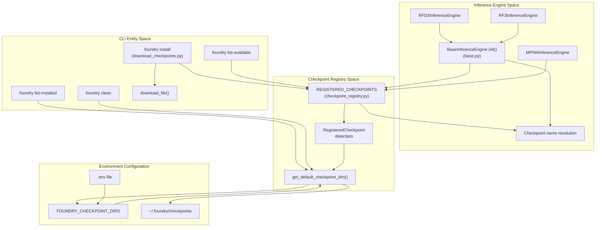
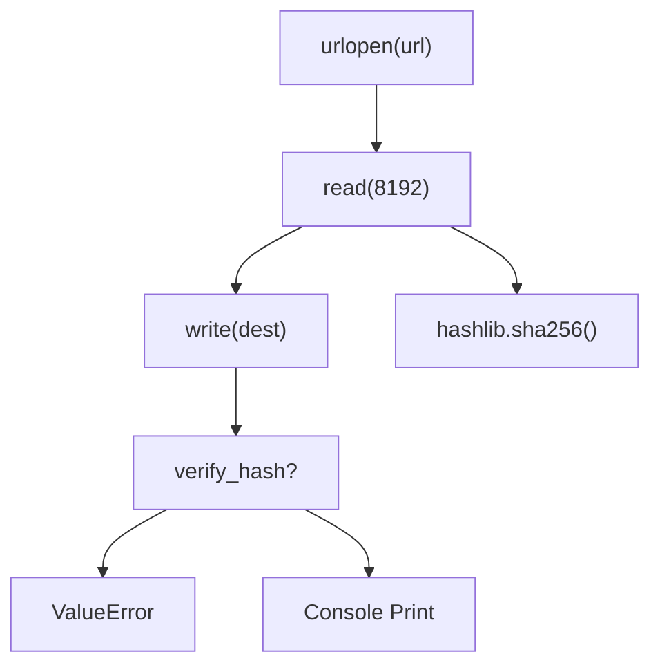

# Checkpoint Management

> **Relevant source files**
> * [.env](https://github.com/RosettaCommons/foundry/blob/cee116dc/.env)
> * [README.md](https://github.com/RosettaCommons/foundry/blob/cee116dc/README.md?plain=1)
> * [models/rfd3/README.md](https://github.com/RosettaCommons/foundry/blob/cee116dc/models/rfd3/README.md?plain=1)
> * [src/foundry/inference_engines/base.py](https://github.com/RosettaCommons/foundry/blob/cee116dc/src/foundry/inference_engines/base.py)
> * [src/foundry/inference_engines/checkpoint_registry.py](https://github.com/RosettaCommons/foundry/blob/cee116dc/src/foundry/inference_engines/checkpoint_registry.py)
> * [src/foundry_cli/__init__.py](https://github.com/RosettaCommons/foundry/blob/cee116dc/src/foundry_cli/__init__.py)
> * [src/foundry_cli/download_checkpoints.py](https://github.com/RosettaCommons/foundry/blob/cee116dc/src/foundry_cli/download_checkpoints.py)
> * [tests/test_weight_loading.py](https://github.com/RosettaCommons/foundry/blob/cee116dc/tests/test_weight_loading.py)

This page documents the checkpoint management infrastructure in Foundry, including the registry of available model checkpoints, download utilities, and how inference engines resolve checkpoint paths.

**Scope:** This page covers the `foundry` CLI commands for managing model weights, the checkpoint registry system, and checkpoint resolution logic. For information about training checkpoints and checkpoint callbacks during training, see [Training Infrastructure](/RosettaCommons/foundry/8.4-training-infrastructure). For information about using specific models with their checkpoints, see [RFD3 Inference Pipeline](/RosettaCommons/foundry/4.5-rfd3-inference-pipeline), [RF3 Inference](/RosettaCommons/foundry/5.2-rf3-inference), and [MPNN Inference](/RosettaCommons/foundry/6.3-mpnn-inference).

---

## Overview

Foundry provides a centralized checkpoint management system that handles:

* Registration of official model checkpoints with metadata (URLs, filenames, hashes).
* Download and verification of model weights via the `foundry` CLI.
* Automatic checkpoint path resolution in inference engines.
* Environment-based configuration of checkpoint storage locations.

The system allows users to reference models by name (e.g., `"rfd3"`, `"rf3"`) rather than absolute paths, with automatic resolution to the correct checkpoint file.

**Sources:** [src/foundry/inference_engines/checkpoint_registry.py L1-L71](https://github.com/RosettaCommons/foundry/blob/cee116dc/src/foundry/inference_engines/checkpoint_registry.py#L1-L71)

 [src/foundry_cli/download_checkpoints.py L1-L186](https://github.com/RosettaCommons/foundry/blob/cee116dc/src/foundry_cli/download_checkpoints.py#L1-L186)

---

## Architecture

The checkpoint management system consists of three main components: the checkpoint registry, the CLI management layer, and the inference engine integration.

**System Architecture and Code Entities**



**Sources:** [src/foundry/inference_engines/checkpoint_registry.py L1-L71](https://github.com/RosettaCommons/foundry/blob/cee116dc/src/foundry/inference_engines/checkpoint_registry.py#L1-L71)

 [src/foundry_cli/download_checkpoints.py L1-L186](https://github.com/RosettaCommons/foundry/blob/cee116dc/src/foundry_cli/download_checkpoints.py#L1-L186)

 [src/foundry/inference_engines/base.py L72-L91](https://github.com/RosettaCommons/foundry/blob/cee116dc/src/foundry/inference_engines/base.py#L72-L91)

---

## Checkpoint Registry

The `REGISTERED_CHECKPOINTS` dictionary in [src/foundry/inference_engines/checkpoint_registry.py L80-L122](https://github.com/RosettaCommons/foundry/blob/cee116dc/src/foundry/inference_engines/checkpoint_registry.py#L80-L122)

 serves as the single source of truth for available model checkpoints. Each entry is a `RegisteredCheckpoint` dataclass containing:

| Field | Type | Description |
| --- | --- | --- |
| `url` | `str` | Download URL for the checkpoint file |
| `filename` | `str` | Local filename for the checkpoint |
| `description` | `str` | Human-readable description of the model |
| `sha256` | `str` (optional) | SHA256 hash for verification |

### Available Checkpoints

The following checkpoints are currently registered:

| Model Name | Filename | Description |
| --- | --- | --- |
| `rfd3` | `rfd3_latest.ckpt` | RFdiffusion3 checkpoint [src/foundry/inference_engines/checkpoint_registry.py L86-L90](https://github.com/RosettaCommons/foundry/blob/cee116dc/src/foundry/inference_engines/checkpoint_registry.py#L86-L90) |
| `rfd3na` | `rfd3na_1190.ckpt` | RFdiffusion3NA checkpoint [src/foundry/inference_engines/checkpoint_registry.py L81-L85](https://github.com/RosettaCommons/foundry/blob/cee116dc/src/foundry/inference_engines/checkpoint_registry.py#L81-L85) |
| `rf3` | `rf3_foundry_01_24_latest_remapped.ckpt` | Latest RF3 checkpoint [src/foundry/inference_engines/checkpoint_registry.py L91-L95](https://github.com/RosettaCommons/foundry/blob/cee116dc/src/foundry/inference_engines/checkpoint_registry.py#L91-L95) |
| `proteinmpnn` | `proteinmpnn_v_48_020.pt` | ProteinMPNN checkpoint [src/foundry/inference_engines/checkpoint_registry.py L96-L100](https://github.com/RosettaCommons/foundry/blob/cee116dc/src/foundry/inference_engines/checkpoint_registry.py#L96-L100) |
| `ligandmpnn` | `ligandmpnn_v_32_010_25.pt` | LigandMPNN checkpoint [src/foundry/inference_engines/checkpoint_registry.py L101-L105](https://github.com/RosettaCommons/foundry/blob/cee116dc/src/foundry/inference_engines/checkpoint_registry.py#L101-L105) |
| `solublempnn` | `solublempnn_v_48_020.pt` | SolubleMPNN checkpoint [src/foundry/inference_engines/checkpoint_registry.py L117-L121](https://github.com/RosettaCommons/foundry/blob/cee116dc/src/foundry/inference_engines/checkpoint_registry.py#L117-L121) |

**Sources:** [src/foundry/inference_engines/checkpoint_registry.py L80-L122](https://github.com/RosettaCommons/foundry/blob/cee116dc/src/foundry/inference_engines/checkpoint_registry.py#L80-L122)

### RegisteredCheckpoint Path Resolution

The `RegisteredCheckpoint` dataclass provides a `get_default_path()` method that searches for the checkpoint across all directories in the search path [src/foundry/inference_engines/checkpoint_registry.py L71-L77](https://github.com/RosettaCommons/foundry/blob/cee116dc/src/foundry/inference_engines/checkpoint_registry.py#L71-L77)

**Behavior:**

1. Iterates through all checkpoint directories from `get_default_checkpoint_dirs()`.
2. Returns the first existing file with a matching filename.
3. If no existing file is found, it returns the target path in the primary directory (first in the list).

---

## Checkpoint Search Paths

Foundry supports multiple checkpoint directories, searched in order. The `get_default_checkpoint_dirs()` function [src/foundry/inference_engines/checkpoint_registry.py L25-L41](https://github.com/RosettaCommons/foundry/blob/cee116dc/src/foundry/inference_engines/checkpoint_registry.py#L25-L41)

 returns the prioritized list.

### Search Priority

1. **`FOUNDRY_CHECKPOINT_DIRS`** environment variable: A colon-separated list (e.g., `/path/to/dir1:/path/to/dir2`) [src/foundry/inference_engines/checkpoint_registry.py L32-L40](https://github.com/RosettaCommons/foundry/blob/cee116dc/src/foundry/inference_engines/checkpoint_registry.py#L32-L40)
2. **`FOUNDRY_CHECKPOINTS_DIR`**: A legacy singular environment variable checked if the plural version is missing [src/foundry/inference_engines/checkpoint_registry.py L35-L36](https://github.com/RosettaCommons/foundry/blob/cee116dc/src/foundry/inference_engines/checkpoint_registry.py#L35-L36)
3. **`~/.foundry/checkpoints`**: The default fallback location [src/foundry/inference_engines/checkpoint_registry.py L10](https://github.com/RosettaCommons/foundry/blob/cee116dc/src/foundry/inference_engines/checkpoint_registry.py#L10-L10)

The function normalizes paths (expanding `~`, resolving absolute paths) and deduplicates entries using `_normalize_paths` [src/foundry/inference_engines/checkpoint_registry.py L13-L22](https://github.com/RosettaCommons/foundry/blob/cee116dc/src/foundry/inference_engines/checkpoint_registry.py#L13-L22)

**Sources:** [src/foundry/inference_engines/checkpoint_registry.py L10-L41](https://github.com/RosettaCommons/foundry/blob/cee116dc/src/foundry/inference_engines/checkpoint_registry.py#L10-L41)

 [.env L61-L63](https://github.com/RosettaCommons/foundry/blob/cee116dc/.env#L61-L63)

---

## CLI Commands

The `foundry` CLI provides commands for checkpoint management, implemented in `src/foundry_cli/download_checkpoints.py`.

### foundry install

Downloads and optionally verifies model checkpoints.

**Syntax:**

```
foundry install <models> [--checkpoint-dir DIR] [--force]
```

**Arguments:**

* `<models>`: List of model names, `"all"`, or `"base-models"`.
* `--checkpoint-dir, -d`: Custom directory to save checkpoints [src/foundry_cli/download_checkpoints.py L150-L155](https://github.com/RosettaCommons/foundry/blob/cee116dc/src/foundry_cli/download_checkpoints.py#L150-L155)
* `--force, -f`: Overwrite existing files [src/foundry_cli/download_checkpoints.py L156-L158](https://github.com/RosettaCommons/foundry/blob/cee116dc/src/foundry_cli/download_checkpoints.py#L156-L158)

**Behavior:**

1. Resolves the target directory via `_resolve_checkpoint_dirs()`. If a new directory is provided via CLI, it is moved to the front of the search path [src/foundry_cli/download_checkpoints.py L33-L43](https://github.com/RosettaCommons/foundry/blob/cee116dc/src/foundry_cli/download_checkpoints.py#L33-L43)
2. Persists the updated directory list to the `.env` file using `append_checkpoint_to_env()` [src/foundry_cli/download_checkpoints.py L46-L49](https://github.com/RosettaCommons/foundry/blob/cee116dc/src/foundry_cli/download_checkpoints.py#L46-L49)
3. Iterates through requested models and calls `install_model()`, which performs the download and hash verification [src/foundry_cli/download_checkpoints.py L106-L142](https://github.com/RosettaCommons/foundry/blob/cee116dc/src/foundry_cli/download_checkpoints.py#L106-L142)

**Sources:** [src/foundry_cli/download_checkpoints.py L33-L51](https://github.com/RosettaCommons/foundry/blob/cee116dc/src/foundry_cli/download_checkpoints.py#L33-L51)

 [src/foundry_cli/download_checkpoints.py L106-L186](https://github.com/RosettaCommons/foundry/blob/cee116dc/src/foundry_cli/download_checkpoints.py#L106-L186)

### foundry list-available & list-installed

* **`list-available`**: Lists all models defined in the `REGISTERED_CHECKPOINTS` dictionary [src/foundry_cli/download_checkpoints.py L188-L194](https://github.com/RosettaCommons/foundry/blob/cee116dc/src/foundry_cli/download_checkpoints.py#L188-L194)
* **`list-installed`**: Scans all directories in the search path for `.ckpt` and `.pt` files, displaying their locations and sizes in GB [src/foundry_cli/download_checkpoints.py L196-L223](https://github.com/RosettaCommons/foundry/blob/cee116dc/src/foundry_cli/download_checkpoints.py#L196-L223)

---

## Download and Verification Logic

The `download_file()` function manages the network transfer and data integrity [src/foundry_cli/download_checkpoints.py L54-L104](https://github.com/RosettaCommons/foundry/blob/cee116dc/src/foundry_cli/download_checkpoints.py#L54-L104)

**Data Flow: Download to Verification**



**Implementation Details:**

* **Progress Tracking**: Uses `rich.progress` to show a bar, download speed, and time remaining [src/foundry_cli/download_checkpoints.py L67-L74](https://github.com/RosettaCommons/foundry/blob/cee116dc/src/foundry_cli/download_checkpoints.py#L67-L74)
* **Integrity**: If `verify_hash` is provided, it compares the computed SHA256 against the registry value. On mismatch, the file is unlinked (deleted) [src/foundry_cli/download_checkpoints.py L96-L103](https://github.com/RosettaCommons/foundry/blob/cee116dc/src/foundry_cli/download_checkpoints.py#L96-L103)

**Sources:** [src/foundry_cli/download_checkpoints.py L54-L104](https://github.com/RosettaCommons/foundry/blob/cee116dc/src/foundry_cli/download_checkpoints.py#L54-L104)

---

## Checkpoint Resolution in Inference Engines

Inference engines resolve checkpoint names to absolute file paths during initialization.

### BaseInferenceEngine Resolution

The `BaseInferenceEngine.__init__` method handles path resolution [src/foundry/inference_engines/base.py L72-L91](https://github.com/RosettaCommons/foundry/blob/cee116dc/src/foundry/inference_engines/base.py#L72-L91)

:

1. **Input Check**: If `ckpt_path` does not contain a dot (`.`), it is treated as a registered model name [src/foundry/inference_engines/base.py L72-L74](https://github.com/RosettaCommons/foundry/blob/cee116dc/src/foundry/inference_engines/base.py#L72-L74)
2. **Registry Lookup**: It retrieves the `RegisteredCheckpoint` object from `REGISTERED_CHECKPOINTS` [src/foundry/inference_engines/base.py L78](https://github.com/RosettaCommons/foundry/blob/cee116dc/src/foundry/inference_engines/base.py#L78-L78)
3. **Search Path Traversal**: It calls `ckpt.get_default_path()`, which checks all configured search directories [src/foundry/inference_engines/base.py L80](https://github.com/RosettaCommons/foundry/blob/cee116dc/src/foundry/inference_engines/base.py#L80-L80)
4. **Validation**: It asserts that the file exists at the resolved location before proceeding [src/foundry/inference_engines/base.py L86-L90](https://github.com/RosettaCommons/foundry/blob/cee116dc/src/foundry/inference_engines/base.py#L86-L90)

**Sources:** [src/foundry/inference_engines/base.py L72-L91](https://github.com/RosettaCommons/foundry/blob/cee116dc/src/foundry/inference_engines/base.py#L72-L91)

 [src/foundry/inference_engines/checkpoint_registry.py L71-L77](https://github.com/RosettaCommons/foundry/blob/cee116dc/src/foundry/inference_engines/checkpoint_registry.py#L71-L77)

---

## Environment Configuration

The checkpoint system is highly dependent on the `.env` file and environment variables for pathing.

| Variable | File | Description |
| --- | --- | --- |
| `FOUNDRY_CHECKPOINT_DIRS` | `.env` | Colon-separated list of search paths [.env L61-L63](https://github.com/RosettaCommons/foundry/blob/cee116dc/.env#L61-L63) |
| `HBPLUS_PATH` | `.env` | Path to `hbplus` executable for H-bond metrics [models/rfd3/README.md L38](https://github.com/RosettaCommons/foundry/blob/cee116dc/models/rfd3/README.md?plain=1#L38-L38) |
| `PDB_MIRROR_PATH` | `.env` | Path to local PDB mirror [.env L13](https://github.com/RosettaCommons/foundry/blob/cee116dc/.env#L13-L13) |

The function `append_checkpoint_to_env` [src/foundry/inference_engines/checkpoint_registry.py L49-L61](https://github.com/RosettaCommons/foundry/blob/cee116dc/src/foundry/inference_engines/checkpoint_registry.py#L49-L61)

 uses the `python-dotenv` library to programmatically update the `.env` file whenever a user specifies a new directory via the CLI.

**Sources:** [src/foundry/inference_engines/checkpoint_registry.py L49-L61](https://github.com/RosettaCommons/foundry/blob/cee116dc/src/foundry/inference_engines/checkpoint_registry.py#L49-L61)

 [.env L61-L63](https://github.com/RosettaCommons/foundry/blob/cee116dc/.env#L61-L63)