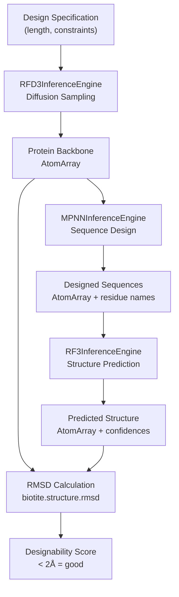
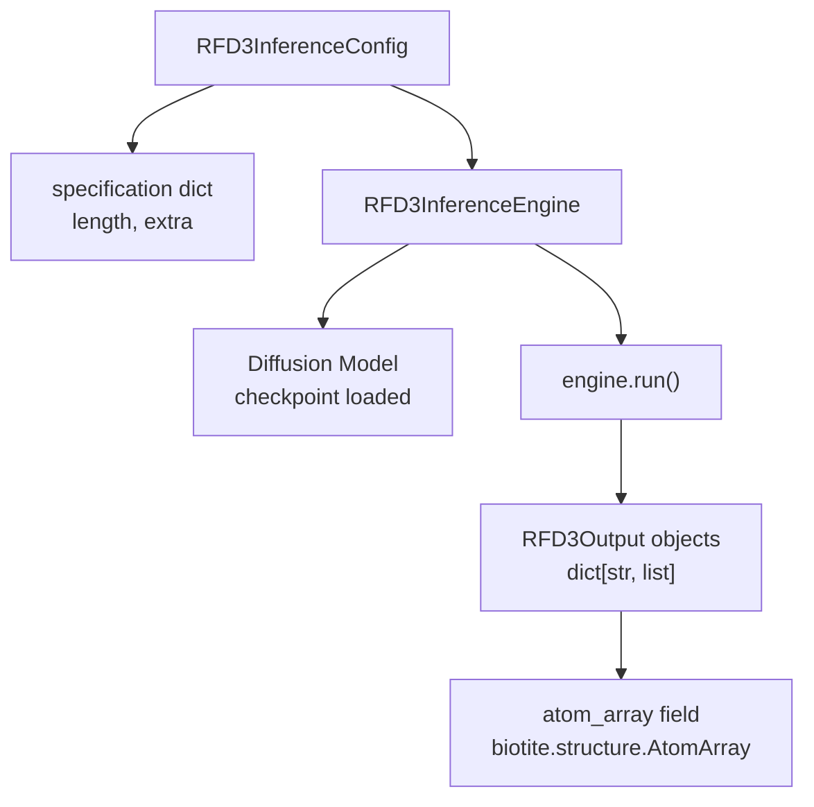
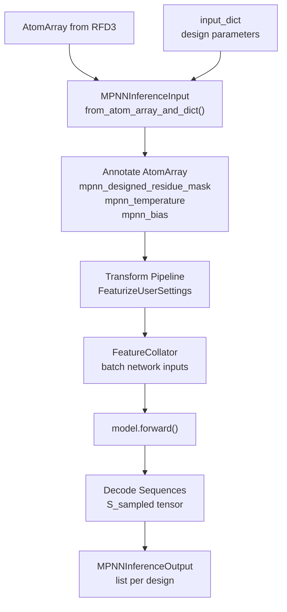
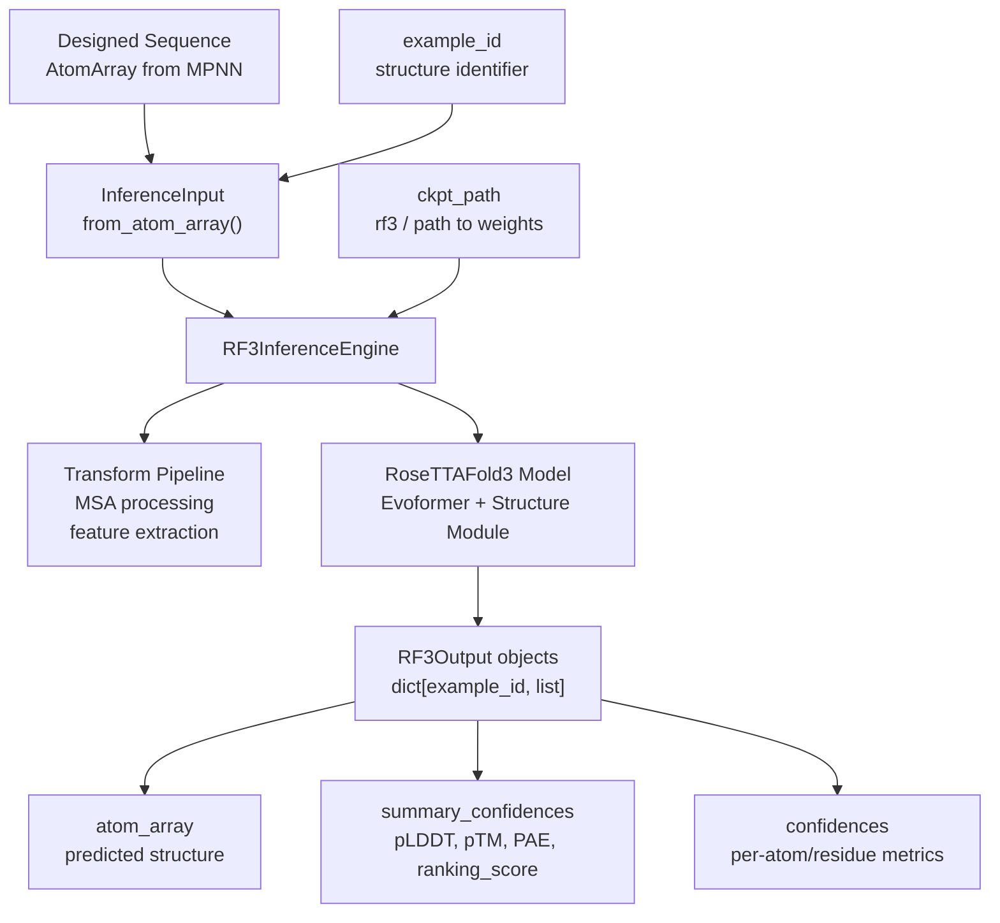
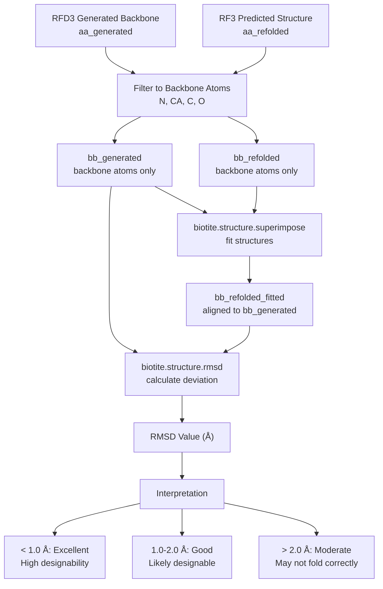
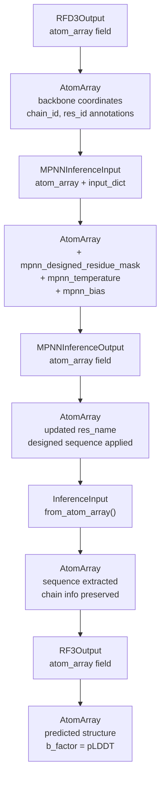

# Complete Design Pipeline

> **Relevant source files**
> * [docs/_static/superimposed_80_residue_protein.png](https://github.com/RosettaCommons/foundry/blob/cee116dc/docs/_static/superimposed_80_residue_protein.png)
> * [examples/all.ipynb](https://github.com/RosettaCommons/foundry/blob/cee116dc/examples/all.ipynb)
> * [examples/ipd_design_pipeline_collab.ipynb](https://github.com/RosettaCommons/foundry/blob/cee116dc/examples/ipd_design_pipeline_collab.ipynb)
> * [models/mpnn/README.md](https://github.com/RosettaCommons/foundry/blob/cee116dc/models/mpnn/README.md?plain=1)
> * [models/mpnn/src/mpnn/__init__.py](https://github.com/RosettaCommons/foundry/blob/cee116dc/models/mpnn/src/mpnn/__init__.py)
> * [models/mpnn/src/mpnn/loss/nll_loss.py](https://github.com/RosettaCommons/foundry/blob/cee116dc/models/mpnn/src/mpnn/loss/nll_loss.py)
> * [models/mpnn/src/mpnn/utils/inference.py](https://github.com/RosettaCommons/foundry/blob/cee116dc/models/mpnn/src/mpnn/utils/inference.py)
> * [models/rfd3/src/rfd3/engine.py](https://github.com/RosettaCommons/foundry/blob/cee116dc/models/rfd3/src/rfd3/engine.py)
> * [models/rfd3/src/rfd3/inference/datasets.py](https://github.com/RosettaCommons/foundry/blob/cee116dc/models/rfd3/src/rfd3/inference/datasets.py)
> * [models/rfd3/src/rfd3/utils/inference.py](https://github.com/RosettaCommons/foundry/blob/cee116dc/models/rfd3/src/rfd3/utils/inference.py)
> * [models/rfd3na/src/rfd3na/utils/inference.py](https://github.com/RosettaCommons/foundry/blob/cee116dc/models/rfd3na/src/rfd3na/utils/inference.py)

## Purpose and Scope

This page documents the end-to-end protein design workflow that combines three deep learning models in sequence: **RFdiffusion3 (RFD3)** for backbone generation, **ProteinMPNN/LigandMPNN** for sequence design, and **RosettaFold3 (RF3)** for structure validation. The pipeline produces novel protein designs and assesses their designability through RMSD comparison between the generated backbone and the predicted structure from the designed sequence.

For detailed documentation on individual models, see **RFD3 Overview**, **MPNN Overview**, and **RF3 Overview**. For model-specific inference parameters, see **RFD3 Inference Pipeline**, **MPNN Inference**, and **RF3 Inference**.

**Sources:** [examples/all.ipynb L8-L21](https://github.com/RosettaCommons/foundry/blob/cee116dc/examples/all.ipynb#L8-L21)

---

## Pipeline Overview

The complete design pipeline follows a linear three-step process where each model's output serves as input to the next:

### Pipeline Logic and Data Flow

**Sources:** [examples/all.ipynb L24-L27](https://github.com/RosettaCommons/foundry/blob/cee116dc/examples/all.ipynb#L24-L27)

---

## Step 1: Backbone Generation with RFD3

The first step generates novel protein backbone structures using RFdiffusion3's conditional diffusion process.

### Configuration and Execution

The `RFD3InferenceConfig` accepts a `specification` dictionary defining the design parameters:

| Parameter | Type | Description |
| --- | --- | --- |
| `length` | int | Target protein length in residues |
| `diffusion_batch_size` | int | Number of structures to generate per batch |
| `extra` | dict | Additional conditioning specifications |

**Key Classes:**

* `RFD3InferenceEngine` [models/rfd3/src/rfd3/engine.py L139-L140](https://github.com/RosettaCommons/foundry/blob/cee116dc/models/rfd3/src/rfd3/engine.py#L139-L140) : Manages model loading and inference execution.
* `RFD3InferenceConfig` [models/rfd3/src/rfd3/engine.py L43-L44](https://github.com/RosettaCommons/foundry/blob/cee116dc/models/rfd3/src/rfd3/engine.py#L43-L44) : Configuration dataclass for RFD3 inference.
* `RFD3Output` [models/rfd3/src/rfd3/engine.py L90-L91](https://github.com/RosettaCommons/foundry/blob/cee116dc/models/rfd3/src/rfd3/engine.py#L90-L91) : Contains `atom_array` field with generated backbone.

**Example Usage:**
The engine initializes from a checkpoint path (or registered model name), loads the diffusion model, and executes sampling:
[examples/all.ipynb L84-L106](https://github.com/RosettaCommons/foundry/blob/cee116dc/examples/all.ipynb#L84-L106)

**Output Structure:**
The `run()` method returns a dictionary mapping batch identifiers to lists of `RFD3Output` objects. Each output contains an `atom_array` (Biotite `AtomArray`) and generation `metadata` [models/rfd3/src/rfd3/engine.py L91-L94](https://github.com/RosettaCommons/foundry/blob/cee116dc/models/rfd3/src/rfd3/engine.py#L91-L94)

**Sources:** [examples/all.ipynb L63-L140](https://github.com/RosettaCommons/foundry/blob/cee116dc/examples/all.ipynb#L63-L140)

 [models/rfd3/src/rfd3/engine.py L139-L205](https://github.com/RosettaCommons/foundry/blob/cee116dc/models/rfd3/src/rfd3/engine.py#L139-L205)

---

## Step 2: Sequence Design with MPNN

The second step designs amino acid sequences that will fold into the generated backbone structure.

### Engine Configuration

The `MPNNInferenceEngine` constructor accepts global parameters that apply to all inputs:

| Parameter | Type | Description |
| --- | --- | --- |
| `model_type` | str | `"protein_mpnn"` or `"ligand_mpnn"` |
| `checkpoint_path` | str | Path to model weights |
| `is_legacy_weights` | bool | Whether checkpoint uses legacy weight format |
| `out_directory` | str \| None | Directory for output files |

**Per-Input Configuration:**
Each structure accepts independent design parameters via `input_dicts`:

| Parameter | Type | Description |
| --- | --- | --- |
| `batch_size` | int | Number of sequences to generate |
| `temperature` | float | Sampling temperature |
| `designed_residues` | list[str] | Residue IDs to design |
| `remove_waters` | bool | Remove water molecules from context |

**Sources:** [models/mpnn/src/mpnn/utils/inference.py L35-L90](https://github.com/RosettaCommons/foundry/blob/cee116dc/models/mpnn/src/mpnn/utils/inference.py#L35-L90)

 [examples/all.ipynb L169-L192](https://github.com/RosettaCommons/foundry/blob/cee116dc/examples/all.ipynb#L169-L192)

### Data Flow Through MPNN

**Model Execution:**
The engine executes the model through its `run` method, which handles featurization, model forward pass, and sequence sampling [examples/all.ipynb L191-L192](https://github.com/RosettaCommons/foundry/blob/cee116dc/examples/all.ipynb#L191-L192)

**Sources:** [examples/all.ipynb L149-L216](https://github.com/RosettaCommons/foundry/blob/cee116dc/examples/all.ipynb#L149-L216)

 [models/mpnn/src/mpnn/utils/inference.py L35-L90](https://github.com/RosettaCommons/foundry/blob/cee116dc/models/mpnn/src/mpnn/utils/inference.py#L35-L90)

---

## Step 3: Structure Validation with RF3

The third step predicts the 3D structure from the designed sequence to validate that it folds into the intended backbone.

### RF3 Inference Configuration

**Input Construction:**
The `InferenceInput.from_atom_array()` method creates RF3 inputs from MPNN outputs [examples/all.ipynb L252-L260](https://github.com/RosettaCommons/foundry/blob/cee116dc/examples/all.ipynb#L252-L260)

**Confidence Metrics:**
RF3 produces comprehensive confidence scores including `overall_plddt`, `ptm`, `iptm`, and `ranking_score` [examples/all.ipynb L294-L305](https://github.com/RosettaCommons/foundry/blob/cee116dc/examples/all.ipynb#L294-L305)

**Sources:** [examples/all.ipynb L225-L327](https://github.com/RosettaCommons/foundry/blob/cee116dc/examples/all.ipynb#L225-L327)

---

## Step 4: Designability Assessment via RMSD

The final step quantifies design success by comparing the RFD3-generated backbone against the RF3-predicted structure.

### RMSD Calculation Workflow

**Implementation:**
The RMSD calculation uses Biotite's structure comparison functions [examples/all.ipynb L343-L366](https://github.com/RosettaCommons/foundry/blob/cee116dc/examples/all.ipynb#L343-L366)

**RMSD Thresholds:**

| RMSD Range | Designability | Interpretation |
| --- | --- | --- |
| < 1.0 Å | Excellent | Designed sequence very likely folds to target |
| 1.0 - 2.0 Å | Good | Designed sequence likely folds to target |
| > 2.0 Å | Moderate/Poor | Redesign or further validation recommended |

**Sources:** [examples/all.ipynb L334-L366](https://github.com/RosettaCommons/foundry/blob/cee116dc/examples/all.ipynb#L334-L366)

---

## Data Format Conversions

The pipeline relies on `biotite.structure.AtomArray` as the universal data structure for passing molecular information between models.

### AtomArray as Common Currency

**Sources:** [examples/all.ipynb L128-L140](https://github.com/RosettaCommons/foundry/blob/cee116dc/examples/all.ipynb#L128-L140)

 [models/rfd3/src/rfd3/engine.py L90-L94](https://github.com/RosettaCommons/foundry/blob/cee116dc/models/rfd3/src/rfd3/engine.py#L90-L94)

 [models/mpnn/src/mpnn/utils/inference.py L24-L30](https://github.com/RosettaCommons/foundry/blob/cee116dc/models/mpnn/src/mpnn/utils/inference.py#L24-L30)

---

## Sources

* [examples/all.ipynb L1-L426](https://github.com/RosettaCommons/foundry/blob/cee116dc/examples/all.ipynb#L1-L426)  - Complete pipeline walkthrough.
* [models/rfd3/src/rfd3/engine.py L1-L205](https://github.com/RosettaCommons/foundry/blob/cee116dc/models/rfd3/src/rfd3/engine.py#L1-L205)  - RFD3 Inference Engine and configuration.
* [models/mpnn/src/mpnn/utils/inference.py L1-L90](https://github.com/RosettaCommons/foundry/blob/cee116dc/models/mpnn/src/mpnn/utils/inference.py#L1-L90)  - MPNN inference defaults and parameter specifications.
* [models/rfd3/src/rfd3/utils/inference.py L53-L84](https://github.com/RosettaCommons/foundry/blob/cee116dc/models/rfd3/src/rfd3/utils/inference.py#L53-L84)  - Annotation utilities for structure arrays.
* [models/mpnn/src/mpnn/loss/nll_loss.py L1-L123](https://github.com/RosettaCommons/foundry/blob/cee116dc/models/mpnn/src/mpnn/loss/nll_loss.py#L1-L123)  - Model loss and sequence evaluation logic.