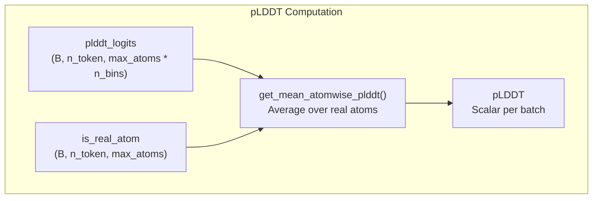
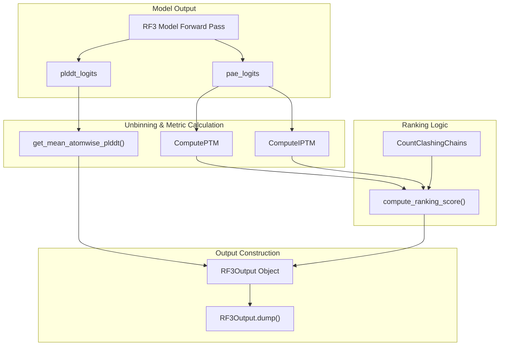

# Confidence Metrics

> **Relevant source files**
> * [models/rf3/configs/inference_engine/base.yaml](https://github.com/RosettaCommons/foundry/blob/cee116dc/models/rf3/configs/inference_engine/base.yaml)
> * [models/rf3/configs/inference_engine/rf3.yaml](https://github.com/RosettaCommons/foundry/blob/cee116dc/models/rf3/configs/inference_engine/rf3.yaml)
> * [models/rf3/src/rf3/data/extra_xforms.py](https://github.com/RosettaCommons/foundry/blob/cee116dc/models/rf3/src/rf3/data/extra_xforms.py)
> * [models/rf3/src/rf3/data/pipelines.py](https://github.com/RosettaCommons/foundry/blob/cee116dc/models/rf3/src/rf3/data/pipelines.py)
> * [models/rf3/src/rf3/inference.py](https://github.com/RosettaCommons/foundry/blob/cee116dc/models/rf3/src/rf3/inference.py)
> * [models/rf3/src/rf3/inference_engines/rf3.py](https://github.com/RosettaCommons/foundry/blob/cee116dc/models/rf3/src/rf3/inference_engines/rf3.py)
> * [models/rf3/src/rf3/metrics/clashing_chains.py](https://github.com/RosettaCommons/foundry/blob/cee116dc/models/rf3/src/rf3/metrics/clashing_chains.py)
> * [models/rf3/src/rf3/metrics/distogram.py](https://github.com/RosettaCommons/foundry/blob/cee116dc/models/rf3/src/rf3/metrics/distogram.py)
> * [models/rf3/src/rf3/metrics/lddt.py](https://github.com/RosettaCommons/foundry/blob/cee116dc/models/rf3/src/rf3/metrics/lddt.py)
> * [models/rf3/src/rf3/metrics/metadata.py](https://github.com/RosettaCommons/foundry/blob/cee116dc/models/rf3/src/rf3/metrics/metadata.py)
> * [models/rf3/src/rf3/metrics/predicted_error.py](https://github.com/RosettaCommons/foundry/blob/cee116dc/models/rf3/src/rf3/metrics/predicted_error.py)
> * [models/rf3/src/rf3/metrics/rasa.py](https://github.com/RosettaCommons/foundry/blob/cee116dc/models/rf3/src/rf3/metrics/rasa.py)
> * [models/rf3/src/rf3/symmetry/resolve.py](https://github.com/RosettaCommons/foundry/blob/cee116dc/models/rf3/src/rf3/symmetry/resolve.py)
> * [models/rf3/src/rf3/trainers/rf3.py](https://github.com/RosettaCommons/foundry/blob/cee116dc/models/rf3/src/rf3/trainers/rf3.py)
> * [models/rf3/src/rf3/utils/inference.py](https://github.com/RosettaCommons/foundry/blob/cee116dc/models/rf3/src/rf3/utils/inference.py)
> * [models/rf3/src/rf3/utils/predict_and_score.py](https://github.com/RosettaCommons/foundry/blob/cee116dc/models/rf3/src/rf3/utils/predict_and_score.py)

Confidence metrics in RosettaFold3 (RF3) assess the quality and reliability of structure predictions. These metrics help users evaluate predictions, rank multiple samples, and identify high-confidence regions within predicted structures. RF3 outputs AlphaFold3-compatible confidence metrics including pLDDT, pTM, ipTM, PAE, and PDE, along with additional metrics like clash detection.

For information about RF3 inference and output management, see [RF3 Inference](/RosettaCommons/foundry/5.2-rf3-inference) and [Output Management](/RosettaCommons/foundry/5.5-output-management).

## Overview

RF3 produces confidence metrics during structure prediction to quantify:

* **Per-atom confidence**: How accurate each atom's position is likely to be.
* **Overall structure quality**: Global confidence in the prediction.
* **Interface quality**: Confidence in protein-protein or protein-ligand interactions.
* **Geometric validity**: Whether the structure contains steric clashes.

These metrics are computed from neural network outputs (logits) that are converted to interpretable confidence scores. The metrics system is configured via `MetricManager` [models/rf3/src/rf3/inference_engines/rf3.py L49-L56](https://github.com/RosettaCommons/foundry/blob/cee116dc/models/rf3/src/rf3/inference_engines/rf3.py#L49-L56)

 and can be customized or disabled.

**Sources**: [models/rf3/src/rf3/inference_engines/rf3.py L49-L56](https://github.com/RosettaCommons/foundry/blob/cee116dc/models/rf3/src/rf3/inference_engines/rf3.py#L49-L56)

 [models/rf3/src/rf3/utils/predicted_error.py L36-L40](https://github.com/RosettaCommons/foundry/blob/cee116dc/models/rf3/src/rf3/utils/predicted_error.py#L36-L40)

## Core Confidence Metrics

### pLDDT (Predicted Local Distance Difference Test)

**pLDDT** measures per-atom confidence on a scale from 0 to 100, where higher values indicate greater confidence in the predicted atom position. It is analogous to the B-factor (temperature factor) in experimental structures.



The `get_mean_atomwise_plddt` [models/rf3/src/rf3/inference_engines/rf3.py L39-L40](https://github.com/RosettaCommons/foundry/blob/cee116dc/models/rf3/src/rf3/inference_engines/rf3.py#L39-L40)

 function computes mean pLDDT by unbinning logits and masking to real atoms only (excluding padding).

**Interpretation**:

* **> 90**: Very high confidence
* **70-90**: Confident
* **50-70**: Low confidence
* **< 50**: Very low confidence (unreliable)

**Sources**: [models/rf3/src/rf3/inference_engines/rf3.py L39-L40](https://github.com/RosettaCommons/foundry/blob/cee116dc/models/rf3/src/rf3/inference_engines/rf3.py#L39-L40)

 [models/rf3/src/rf3/inference_engines/rf3.py L203-L219](https://github.com/RosettaCommons/foundry/blob/cee116dc/models/rf3/src/rf3/inference_engines/rf3.py#L203-L219)

### pTM (Predicted TM-score)

**pTM** (predicted Template Modeling score) is a global confidence metric ranging from 0 to 1, measuring overall structural accuracy. It estimates the expected TM-score between the prediction and the true structure.

The pTM metric is computed by the `ComputePTM` class [models/rf3/src/rf3/metrics/predicted_error.py L43-L67](https://github.com/RosettaCommons/foundry/blob/cee116dc/models/rf3/src/rf3/metrics/predicted_error.py#L43-L67)

 which uses the `compute_ptm` function [models/rf3/src/rf3/metrics/predicted_error.py L9-L40](https://github.com/RosettaCommons/foundry/blob/cee116dc/models/rf3/src/rf3/metrics/predicted_error.py#L9-L40)

 It converts PAE logits to a probability distribution and normalizes by structure length.

**Sources**: [models/rf3/src/rf3/metrics/predicted_error.py L9-L67](https://github.com/RosettaCommons/foundry/blob/cee116dc/models/rf3/src/rf3/metrics/predicted_error.py#L9-L67)

 [models/rf3/src/rf3/inference_engines/rf3.py L51](https://github.com/RosettaCommons/foundry/blob/cee116dc/models/rf3/src/rf3/inference_engines/rf3.py#L51-L51)

### ipTM (Interface Predicted TM-score)

**ipTM** measures confidence in inter-chain interfaces. For multi-chain predictions, ipTM is critical for assessing binding poses and complex assembly. For single-chain predictions, ipTM is undefined.

The `ComputeIPTM` class [models/rf3/src/rf3/metrics/predicted_error.py L70-L134](https://github.com/RosettaCommons/foundry/blob/cee116dc/models/rf3/src/rf3/metrics/predicted_error.py#L70-L134)

 calculates ipTM by applying a mask `asym_id[None, :] != asym_id[:, None]` to focus on residue pairs across different chains. It also provides specific interface scores:

* `iptm_protein_protein`
* `iptm_protein_ligand`
* `iptm_ligand_ligand`

**Sources**: [models/rf3/src/rf3/metrics/predicted_error.py L70-L134](https://github.com/RosettaCommons/foundry/blob/cee116dc/models/rf3/src/rf3/metrics/predicted_error.py#L70-L134)

 [models/rf3/src/rf3/inference_engines/rf3.py L52](https://github.com/RosettaCommons/foundry/blob/cee116dc/models/rf3/src/rf3/inference_engines/rf3.py#L52-L52)

### PAE (Predicted Aligned Error)

**PAE** is a 2D matrix (token × token) representing the expected position error (in Ångströms) between every pair of residues after optimal superposition. Lower PAE values indicate higher confidence in the relative positioning.

The PAE matrix is compiled into AF3-style outputs via `compile_af3_style_confidence_outputs` [models/rf3/src/rf3/inference_engines/rf3.py L38](https://github.com/RosettaCommons/foundry/blob/cee116dc/models/rf3/src/rf3/inference_engines/rf3.py#L38-L38)

**Sources**: [models/rf3/src/rf3/inference_engines/rf3.py L38](https://github.com/RosettaCommons/foundry/blob/cee116dc/models/rf3/src/rf3/inference_engines/rf3.py#L38-L38)

 [models/rf3/src/rf3/metrics/predicted_error.py L31-L37](https://github.com/RosettaCommons/foundry/blob/cee116dc/models/rf3/src/rf3/metrics/predicted_error.py#L31-L37)

### Clash Detection (has_clash)

**has_clash** is a binary metric indicating whether the predicted structure contains severe steric clashes between chains. It is computed by the `CountClashingChains` metric [models/rf3/src/rf3/inference_engines/rf3.py L53-L55](https://github.com/RosettaCommons/foundry/blob/cee116dc/models/rf3/src/rf3/inference_engines/rf3.py#L53-L55)

Clash detection penalizes structures with physically invalid geometry, ensuring they rank lower during sample selection. The ranking score formula applies a large penalty (-100) for clashes [models/rf3/src/rf3/inference_engines/rf3.py L95](https://github.com/RosettaCommons/foundry/blob/cee116dc/models/rf3/src/rf3/inference_engines/rf3.py#L95-L95)

**Sources**: [models/rf3/src/rf3/inference_engines/rf3.py L53-L55](https://github.com/RosettaCommons/foundry/blob/cee116dc/models/rf3/src/rf3/inference_engines/rf3.py#L53-L55)

 [models/rf3/src/rf3/inference_engines/rf3.py L95](https://github.com/RosettaCommons/foundry/blob/cee116dc/models/rf3/src/rf3/inference_engines/rf3.py#L95-L95)

## Ranking Score

RF3 computes a **ranking score** to select the best prediction among multiple samples. The formula weights different metrics:

```
ranking_score = 0.8 * ipTM + 0.2 * pTM - 100 * has_clash
```

The `compute_ranking_score` function [models/rf3/src/rf3/inference_engines/rf3.py L79-L95](https://github.com/RosettaCommons/foundry/blob/cee116dc/models/rf3/src/rf3/inference_engines/rf3.py#L79-L95)

 implements this logic. For single-chain predictions where `iptm` is `None`, it uses `pTM` only.

**Sources**: [models/rf3/src/rf3/inference_engines/rf3.py L79-L95](https://github.com/RosettaCommons/foundry/blob/cee116dc/models/rf3/src/rf3/inference_engines/rf3.py#L79-L95)

## Confidence Metrics Flow



**Sources**: [models/rf3/src/rf3/inference_engines/rf3.py L79-L147](https://github.com/RosettaCommons/foundry/blob/cee116dc/models/rf3/src/rf3/inference_engines/rf3.py#L79-L147)

 [models/rf3/src/rf3/metrics/predicted_error.py L9-L134](https://github.com/RosettaCommons/foundry/blob/cee116dc/models/rf3/src/rf3/metrics/predicted_error.py#L9-L134)

## Output Files and Data Structures

RF3 saves confidence metrics in AlphaFold3-compatible formats via the `RF3Output` class [models/rf3/src/rf3/inference_engines/rf3.py L98-L111](https://github.com/RosettaCommons/foundry/blob/cee116dc/models/rf3/src/rf3/inference_engines/rf3.py#L98-L111)

### summary_confidences.json

Contains high-level aggregate metrics. It is written using `dump_json_compact_arrays` [models/rf3/src/rf3/inference_engines/rf3.py L59-L76](https://github.com/RosettaCommons/foundry/blob/cee116dc/models/rf3/src/rf3/inference_engines/rf3.py#L59-L76)

 to ensure AF3-style formatting (compact arrays).

### confidences.json

Contains full per-atom and per-token data, including the full PAE matrix and per-atom pLDDTs.

### ranking_scores.csv

For multi-sample predictions, `dump_ranking_scores` [models/rf3/src/rf3/inference_engines/rf3.py L149-L164](https://github.com/RosettaCommons/foundry/blob/cee116dc/models/rf3/src/rf3/inference_engines/rf3.py#L149-L164)

 writes a CSV ranking all samples by their `ranking_score`.

**Sources**: [models/rf3/src/rf3/inference_engines/rf3.py L59-L164](https://github.com/RosettaCommons/foundry/blob/cee116dc/models/rf3/src/rf3/inference_engines/rf3.py#L59-L164)

## Configuration

### Default Metrics

The default metrics configuration is defined in `DEFAULT_RF3_METRICS_CFG` [models/rf3/src/rf3/inference_engines/rf3.py L49-L56](https://github.com/RosettaCommons/foundry/blob/cee116dc/models/rf3/src/rf3/inference_engines/rf3.py#L49-L56)

:

* `ptm`: `rf3.metrics.predicted_error.ComputePTM`
* `iptm`: `rf3.metrics.predicted_error.ComputeIPTM`
* `count_clashing_chains`: `rf3.metrics.clashing_chains.CountClashingChains`

### Hydra Configuration

Metrics are configured via the `metrics_cfg` block in the inference YAML [models/rf3/configs/inference_engine/rf3.yaml L26-L33](https://github.com/RosettaCommons/foundry/blob/cee116dc/models/rf3/configs/inference_engine/rf3.yaml#L26-L33)

**Sources**: [models/rf3/src/rf3/inference_engines/rf3.py L49-L56](https://github.com/RosettaCommons/foundry/blob/cee116dc/models/rf3/src/rf3/inference_engines/rf3.py#L49-L56)

 [models/rf3/configs/inference_engine/rf3.yaml L26-L33](https://github.com/RosettaCommons/foundry/blob/cee116dc/models/rf3/configs/inference_engine/rf3.yaml#L26-L33)

## Annotating Structures with pLDDT

RF3 can annotate predicted structures by writing pLDDT values to the B-factor field of output CIF files. This is controlled by the `annotate_b_factor_with_plddt` flag [models/rf3/src/rf3/inference.py L45](https://github.com/RosettaCommons/foundry/blob/cee116dc/models/rf3/src/rf3/inference.py#L45-L45)

The function `annotate_atom_array_b_factor_with_plddt` [models/rf3/src/rf3/inference_engines/rf3.py L36-L37](https://github.com/RosettaCommons/foundry/blob/cee116dc/models/rf3/src/rf3/inference_engines/rf3.py#L36-L37)

 (imported from `rf3.utils.predicted_error`) performs this mapping.

**Sources**: [models/rf3/src/rf3/inference.py L45](https://github.com/RosettaCommons/foundry/blob/cee116dc/models/rf3/src/rf3/inference.py#L45-L45)

 [models/rf3/src/rf3/inference_engines/rf3.py L36-L37](https://github.com/RosettaCommons/foundry/blob/cee116dc/models/rf3/src/rf3/inference_engines/rf3.py#L36-L37)

## Early Stopping by Mean pLDDT

RF3 supports early stopping during sampling if the mean pLDDT falls below a threshold, configured by `early_stopping_plddt_threshold` [models/rf3/configs/inference_engine/rf3.yaml L20](https://github.com/RosettaCommons/foundry/blob/cee116dc/models/rf3/configs/inference_engine/rf3.yaml#L20-L20)

The `should_early_stop_by_mean_plddt` closure [models/rf3/src/rf3/inference_engines/rf3.py L203-L219](https://github.com/RosettaCommons/foundry/blob/cee116dc/models/rf3/src/rf3/inference_engines/rf3.py#L203-L219)

 triggers this behavior by calculating the mean atomwise pLDDT at a given step and comparing it to the threshold.

**Sources**: [models/rf3/configs/inference_engine/rf3.yaml L20](https://github.com/RosettaCommons/foundry/blob/cee116dc/models/rf3/configs/inference_engine/rf3.yaml#L20-L20)

 [models/rf3/src/rf3/inference_engines/rf3.py L203-L219](https://github.com/RosettaCommons/foundry/blob/cee116dc/models/rf3/src/rf3/inference_engines/rf3.py#L203-L219)

## Key Functions Reference

| Function | Location | Purpose |
| --- | --- | --- |
| `compute_ranking_score` | [models/rf3/src/rf3/inference_engines/rf3.py L79-L95](https://github.com/RosettaCommons/foundry/blob/cee116dc/models/rf3/src/rf3/inference_engines/rf3.py#L79-L95) | Implements the 0.8*ipTM + 0.2*pTM formula |
| `dump_top_ranked_outputs` | [models/rf3/src/rf3/inference_engines/rf3.py L167-L202](https://github.com/RosettaCommons/foundry/blob/cee116dc/models/rf3/src/rf3/inference_engines/rf3.py#L167-L202) | Copies the best sample to the top-level directory |
| `compute_ptm` | [models/rf3/src/rf3/metrics/predicted_error.py L9-L40](https://github.com/RosettaCommons/foundry/blob/cee116dc/models/rf3/src/rf3/metrics/predicted_error.py#L9-L40) | Low-level tensor calculation for TM-score |
| `calc_lddt` | [models/rf3/src/rf3/metrics/lddt.py L18-L113](https://github.com/RosettaCommons/foundry/blob/cee116dc/models/rf3/src/rf3/metrics/lddt.py#L18-L113) | Calculates standard LDDT scores against ground truth |
| `resolve_symmetries` | [models/rf3/src/rf3/symmetry/resolve.py L23-L112](https://github.com/RosettaCommons/foundry/blob/cee116dc/models/rf3/src/rf3/symmetry/resolve.py#L23-L112) | Resolves symmetry for ground truth comparison |

**Sources**: [models/rf3/src/rf3/inference_engines/rf3.py](https://github.com/RosettaCommons/foundry/blob/cee116dc/models/rf3/src/rf3/inference_engines/rf3.py)

 [models/rf3/src/rf3/metrics/predicted_error.py](https://github.com/RosettaCommons/foundry/blob/cee116dc/models/rf3/src/rf3/metrics/predicted_error.py)

 [models/rf3/src/rf3/metrics/lddt.py](https://github.com/RosettaCommons/foundry/blob/cee116dc/models/rf3/src/rf3/metrics/lddt.py)

 [models/rf3/src/rf3/symmetry/resolve.py](https://github.com/RosettaCommons/foundry/blob/cee116dc/models/rf3/src/rf3/symmetry/resolve.py)