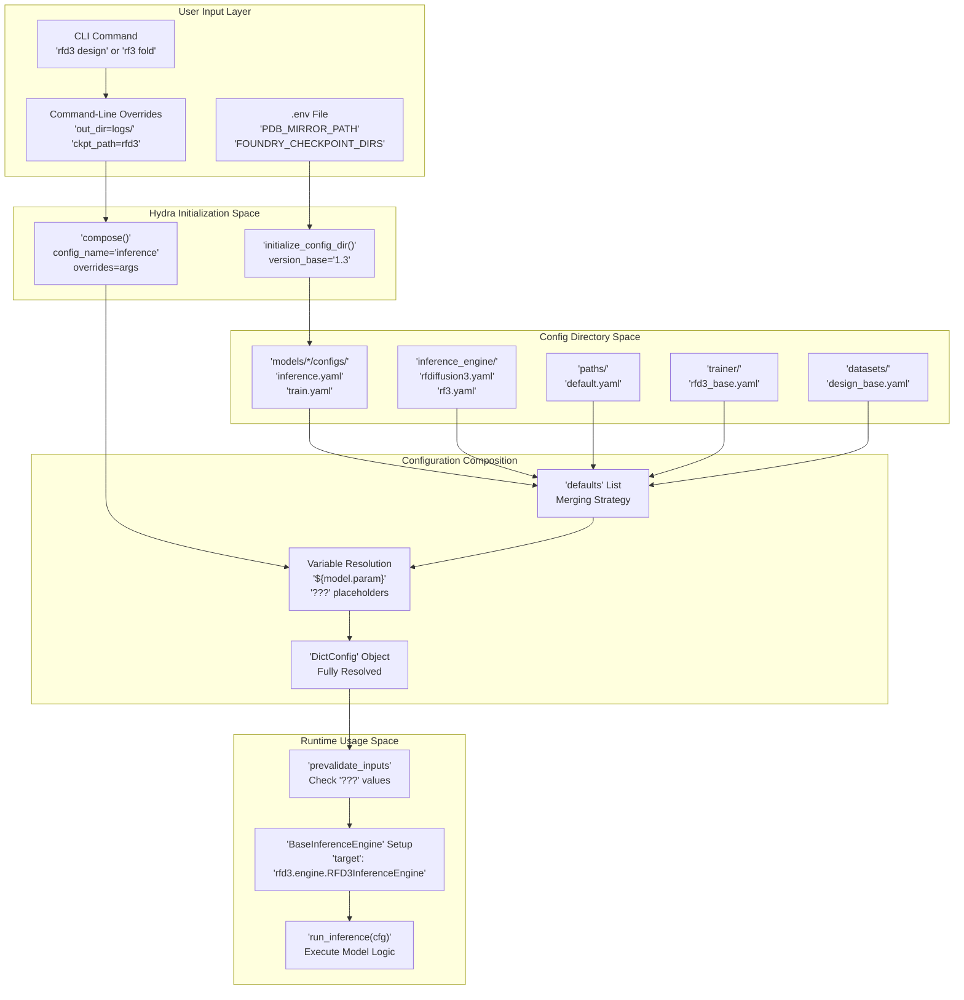
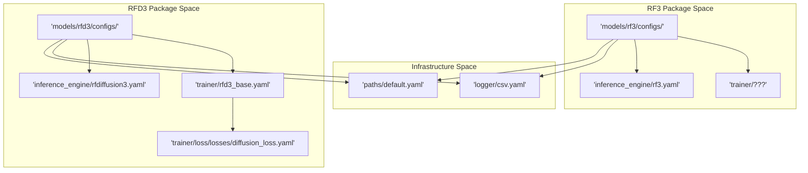

# Configuration System

> **Relevant source files**
> * [.env](https://github.com/RosettaCommons/foundry/blob/cee116dc/.env)
> * [README.md](https://github.com/RosettaCommons/foundry/blob/cee116dc/README.md?plain=1)
> * [models/rf3/configs/experiment/pretrained/rf3.yaml](https://github.com/RosettaCommons/foundry/blob/cee116dc/models/rf3/configs/experiment/pretrained/rf3.yaml)
> * [models/rf3/configs/inference.yaml](https://github.com/RosettaCommons/foundry/blob/cee116dc/models/rf3/configs/inference.yaml)
> * [models/rf3/configs/train.yaml](https://github.com/RosettaCommons/foundry/blob/cee116dc/models/rf3/configs/train.yaml)
> * [models/rf3/configs/validate.yaml](https://github.com/RosettaCommons/foundry/blob/cee116dc/models/rf3/configs/validate.yaml)
> * [models/rf3/src/rf3/callbacks/dump_validation_structures.py](https://github.com/RosettaCommons/foundry/blob/cee116dc/models/rf3/src/rf3/callbacks/dump_validation_structures.py)
> * [models/rf3/src/rf3/cli.py](https://github.com/RosettaCommons/foundry/blob/cee116dc/models/rf3/src/rf3/cli.py)
> * [models/rf3/src/rf3/utils/io.py](https://github.com/RosettaCommons/foundry/blob/cee116dc/models/rf3/src/rf3/utils/io.py)
> * [models/rfd3/README.md](https://github.com/RosettaCommons/foundry/blob/cee116dc/models/rfd3/README.md?plain=1)
> * [models/rfd3/configs/dev.yaml](https://github.com/RosettaCommons/foundry/blob/cee116dc/models/rfd3/configs/dev.yaml)
> * [models/rfd3/configs/inference.yaml](https://github.com/RosettaCommons/foundry/blob/cee116dc/models/rfd3/configs/inference.yaml)
> * [models/rfd3/configs/train.yaml](https://github.com/RosettaCommons/foundry/blob/cee116dc/models/rfd3/configs/train.yaml)
> * [models/rfd3/configs/validate.yaml](https://github.com/RosettaCommons/foundry/blob/cee116dc/models/rfd3/configs/validate.yaml)
> * [models/rfd3/src/rfd3/cli.py](https://github.com/RosettaCommons/foundry/blob/cee116dc/models/rfd3/src/rfd3/cli.py)
> * [pyproject.toml](https://github.com/RosettaCommons/foundry/blob/cee116dc/pyproject.toml)
> * [src/foundry/inference_engines/base.py](https://github.com/RosettaCommons/foundry/blob/cee116dc/src/foundry/inference_engines/base.py)
> * [src/foundry/inference_engines/checkpoint_registry.py](https://github.com/RosettaCommons/foundry/blob/cee116dc/src/foundry/inference_engines/checkpoint_registry.py)
> * [src/foundry_cli/__init__.py](https://github.com/RosettaCommons/foundry/blob/cee116dc/src/foundry_cli/__init__.py)
> * [src/foundry_cli/download_checkpoints.py](https://github.com/RosettaCommons/foundry/blob/cee116dc/src/foundry_cli/download_checkpoints.py)

## Purpose and Scope

This document describes the Hydra-based configuration system used throughout Foundry for managing inference and training parameters. The configuration system provides compositional YAML configurations with command-line override support, enabling flexible parameter management for all models including RFdiffusion3 (RFD3), RosettaFold3 (RF3), and ProteinMPNN.

For checkpoint-related path configuration, see **8.1 Checkpoint Management**. For environment variables and external paths, see **8.3 Environment Configuration**. For training-specific configuration details, see **8.4 Training Infrastructure**.

---

## System Architecture

Foundry's configuration system is built on [Hydra](https://hydra.cc/), which provides hierarchical configuration composition with command-line overrides. Each model package maintains its own configuration directory structure, allowing independent management while sharing common patterns.

### Configuration Flow Diagram

This diagram bridges the Natural Language space of user commands to the Code Entity space of Hydra functions and config files.



**Sources:** [models/rfd3/src/rfd3/cli.py L9-L43](https://github.com/RosettaCommons/foundry/blob/cee116dc/models/rfd3/src/rfd3/cli.py#L9-L43)

 [models/rf3/src/rf3/cli.py L9-L70](https://github.com/RosettaCommons/foundry/blob/cee116dc/models/rf3/src/rf3/cli.py#L9-L70)

 [pyproject.toml L26-L28](https://github.com/RosettaCommons/foundry/blob/cee116dc/pyproject.toml#L26-L28)

---

## Configuration Directory Structure

Each model maintains a hierarchical configuration directory following Hydra conventions. These are typically located in `models/<model_name>/configs/`.

| Directory | Purpose | Example Files |
| --- | --- | --- |
| `configs/` | Root config directory | `inference.yaml`, `train.yaml`, `validate.yaml` |
| `inference_engine/` | Engine-specific parameters | `rfdiffusion3.yaml`, `rf3.yaml` |
| `paths/` | Data and output paths | `default.yaml` |
| `trainer/` | Training infrastructure settings | `rfd3_base.yaml` |
| `datasets/` | Dataset definitions | `design_base.yaml` |
| `experiment/` | Named hyperparameter sets | `pretrain.yaml` |

### Configuration File Locations



**Sources:** [models/rfd3/configs/train.yaml L1-L19](https://github.com/RosettaCommons/foundry/blob/cee116dc/models/rfd3/configs/train.yaml#L1-L19)

 [models/rf3/configs/train.yaml L1-L28](https://github.com/RosettaCommons/foundry/blob/cee116dc/models/rf3/configs/train.yaml#L1-L28)

 [models/rfd3/configs/validate.yaml L1-L19](https://github.com/RosettaCommons/foundry/blob/cee116dc/models/rfd3/configs/validate.yaml#L1-L19)

---

## Hydra Configuration Composition

### Defaults System

Foundry configurations use a `defaults` list to compose multiple config files. The composition follows a merge strategy where later entries override earlier ones.

**Example from `models/rfd3/configs/train.yaml`:**

[models/rfd3/configs/train.yaml L7-L19](https://github.com/RosettaCommons/foundry/blob/cee116dc/models/rfd3/configs/train.yaml#L7-L19)

```yaml
defaults:  - model: rfd3_base  - trainer: rfd3_base  - datasets: design_base  - callbacks: design_callbacks  - dataloader: fast  - paths: default  - hydra: default  - logger: default  - _self_  - experiment: ???  - debug: null
```

The `_self_` keyword allows the current file to override values from the preceding items in the list. The `???` indicates a mandatory override required from the user or an experiment file.

### Variable Interpolation

Hydra supports variable interpolation using `${path.to.value}` syntax, allowing values to be shared across different config modules.

| Syntax | Meaning | Usage |
| --- | --- | --- |
| `${key}` | Reference within same config | `${seed}` |
| `${model.param}` | Reference nested key | Cross-module sharing |
| `???` | Required placeholder | Forces user override |
| `null` | Explicit empty value | Disables features |

**Sources:** [models/rfd3/configs/train.yaml L1-L30](https://github.com/RosettaCommons/foundry/blob/cee116dc/models/rfd3/configs/train.yaml#L1-L30)

 [models/rf3/configs/train.yaml L1-L48](https://github.com/RosettaCommons/foundry/blob/cee116dc/models/rf3/configs/train.yaml#L1-L48)

---

## CLI Integration and Overrides

### Command-Line Override Mechanism

The `rfd3` and `rf3` CLI tools use `typer` to handle initial commands and then pass extra arguments directly to Hydra's `compose` function.

#### RFD3 CLI Logic

[models/rfd3/src/rfd3/cli.py L12-L43](https://github.com/RosettaCommons/foundry/blob/cee116dc/models/rfd3/src/rfd3/cli.py#L12-L43)

The `design` command identifies the config directory, appends a default `inference_engine=rfdiffusion3` if missing, and initializes Hydra with `initialize_config_dir`.

#### RF3 CLI Logic

[models/rf3/src/rf3/cli.py L40-L69](https://github.com/RosettaCommons/foundry/blob/cee116dc/models/rf3/src/rf3/cli.py#L40-L69)

The `fold` command supports "old style" positional arguments (mapped to `inputs=`) and "new style" Hydra overrides. It defaults to `inference_engine=rf3`.

### Common Override Patterns

| Override Type | Syntax Example | Description |
| --- | --- | --- |
| Simple value | `out_dir=logs/test` | Set output path |
| Nested value | `inference_sampler.num_timesteps=50` | Change sampling depth |
| Config group | `experiment=pretrain` | Switch entire config set |
| Boolean | `dump_trajectories=True` | Enable trajectory saving |

**Sources:** [models/rfd3/src/rfd3/cli.py L9-L43](https://github.com/RosettaCommons/foundry/blob/cee116dc/models/rfd3/src/rfd3/cli.py#L9-L43)

 [models/rf3/src/rf3/cli.py L9-L70](https://github.com/RosettaCommons/foundry/blob/cee116dc/models/rf3/src/rf3/cli.py#L9-L70)

 [models/rfd3/README.md L45-L54](https://github.com/RosettaCommons/foundry/blob/cee116dc/models/rfd3/README.md?plain=1#L45-L54)

---

## BaseInferenceEngine Integration

The `BaseInferenceEngine` class is responsible for resolving overrides and merging them with the configuration stored inside model checkpoints.

### Config Merging Flow

[src/foundry/inference_engines/base.py L129-L142](https://github.com/RosettaCommons/foundry/blob/cee116dc/src/foundry/inference_engines/base.py#L129-L142)

1. The engine loads the checkpoint using `torch.load`.
2. It extracts `train_cfg` from the checkpoint.
3. It calls `_override_checkpoint_config`, which uses `OmegaConf.merge` to apply user-provided `self.overrides`.

### Programmatic Overrides

[src/foundry/inference_engines/base.py L102-L120](https://github.com/RosettaCommons/foundry/blob/cee116dc/src/foundry/inference_engines/base.py#L102-L120)

The engine constructor accepts several override dictionaries:

* `transform_overrides`
* `inference_sampler_overrides`
* `trainer_overrides`

These are converted to dotted-path keys (e.g., `model.net.inference_sampler.num_timesteps`) via `_assign_override` and merged into the final configuration.

**Sources:** [src/foundry/inference_engines/base.py L28-L30](https://github.com/RosettaCommons/foundry/blob/cee116dc/src/foundry/inference_engines/base.py#L28-L30)

 [src/foundry/inference_engines/base.py L102-L120](https://github.com/RosettaCommons/foundry/blob/cee116dc/src/foundry/inference_engines/base.py#L102-L120)

 [src/foundry/inference_engines/base.py L160-L163](https://github.com/RosettaCommons/foundry/blob/cee116dc/src/foundry/inference_engines/base.py#L160-L163)

---

## Environment Variable Integration

The configuration system interacts with the environment via the `.env` file and `os.environ`.

### .env File Loading

Foundry uses `dotenv.load_dotenv(override=True)` to load variables from a `.env` file into the environment.

### Key Environment Variables

[.env L1-L63](https://github.com/RosettaCommons/foundry/blob/cee116dc/.env#L1-L63)

* `FOUNDRY_CHECKPOINT_DIRS`: Search paths for model weights.
* `PDB_MIRROR_PATH`: Path to local PDB structures.
* `CCD_MIRROR_PATH`: Path to local Chemical Component Dictionary.
* `HBPLUS_PATH`: Path to the `hbplus` tool for hydrogen bond analysis.

### Variable Resolution in Code

[src/foundry/inference_engines/checkpoint_registry.py L25-L41](https://github.com/RosettaCommons/foundry/blob/cee116dc/src/foundry/inference_engines/checkpoint_registry.py#L25-L41)

Functions like `get_default_checkpoint_dirs` explicitly check `os.environ.get("FOUNDRY_CHECKPOINT_DIRS")` to build search paths, which are then used by the `RegisteredCheckpoint` class to find model files.

**Sources:** [.env L1-L63](https://github.com/RosettaCommons/foundry/blob/cee116dc/.env#L1-L63)

 [src/foundry/inference_engines/checkpoint_registry.py L25-L41](https://github.com/RosettaCommons/foundry/blob/cee116dc/src/foundry/inference_engines/checkpoint_registry.py#L25-L41)

 [src/foundry_cli/download_checkpoints.py L27](https://github.com/RosettaCommons/foundry/blob/cee116dc/src/foundry_cli/download_checkpoints.py#L27-L27)

---

## Config Discovery and Path Resolution

Foundry models implement logic to find their configuration files regardless of whether they are installed as packages or running in a development clone.

### Path Resolution Logic

[models/rfd3/src/rfd3/cli.py L19-L24](https://github.com/RosettaCommons/foundry/blob/cee116dc/models/rfd3/src/rfd3/cli.py#L19-L24)

The CLI checks for a `configs` directory relative to the file location. If `../../../../configs` exists, it assumes development mode; otherwise, it falls back to the package location.

### Hydra Search Path

[models/rfd3/configs/train.yaml L2-L5](https://github.com/RosettaCommons/foundry/blob/cee116dc/models/rfd3/configs/train.yaml#L2-L5)

Configurations often specify a `hydra.searchpath` to include package-specific configurations:

```yaml
hydra:  searchpath:    - pkg://rfd3.configs    - pkg://configs
```

**Sources:** [models/rfd3/src/rfd3/cli.py L14-L24](https://github.com/RosettaCommons/foundry/blob/cee116dc/models/rfd3/src/rfd3/cli.py#L14-L24)

 [models/rf3/src/rf3/cli.py L25-L38](https://github.com/RosettaCommons/foundry/blob/cee116dc/models/rf3/src/rf3/cli.py#L25-L38)

 [models/rfd3/configs/train.yaml L2-L5](https://github.com/RosettaCommons/foundry/blob/cee116dc/models/rfd3/configs/train.yaml#L2-L5)