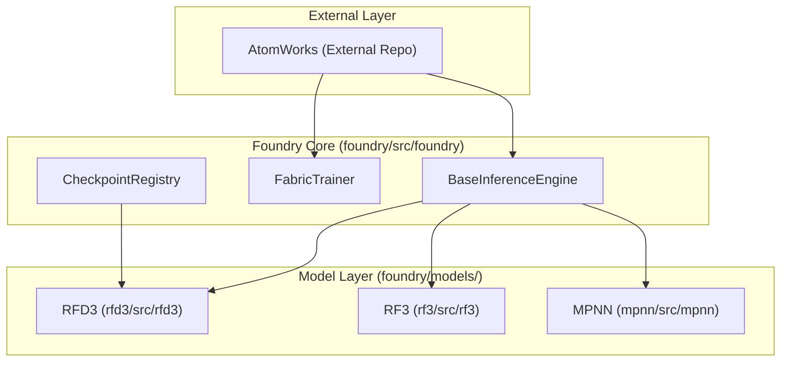
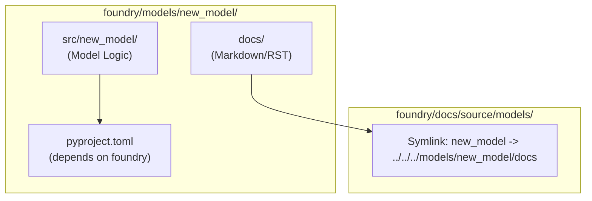

# Contributing

> **Relevant source files**
> * [.github/ISSUE_TEMPLATE/bug_report.md](https://github.com/RosettaCommons/foundry/blob/cee116dc/.github/ISSUE_TEMPLATE/bug_report.md?plain=1)
> * [.github/ISSUE_TEMPLATE/feature_request.md](https://github.com/RosettaCommons/foundry/blob/cee116dc/.github/ISSUE_TEMPLATE/feature_request.md?plain=1)
> * [.github/ISSUE_TEMPLATE/question-or-unexpected-outputs.md](https://github.com/RosettaCommons/foundry/blob/cee116dc/.github/ISSUE_TEMPLATE/question-or-unexpected-outputs.md?plain=1)
> * [.github/workflows/documentation.yml](https://github.com/RosettaCommons/foundry/blob/cee116dc/.github/workflows/documentation.yml)
> * [CONTRIBUTING.md](https://github.com/RosettaCommons/foundry/blob/cee116dc/CONTRIBUTING.md?plain=1)
> * [docs/Makefile](https://github.com/RosettaCommons/foundry/blob/cee116dc/docs/Makefile)
> * [docs/docs_requirements.txt](https://github.com/RosettaCommons/foundry/blob/cee116dc/docs/docs_requirements.txt)
> * [docs/make.bat](https://github.com/RosettaCommons/foundry/blob/cee116dc/docs/make.bat)
> * [docs/source/_static/ga.js](https://github.com/RosettaCommons/foundry/blob/cee116dc/docs/source/_static/ga.js)
> * [docs/source/conf.py](https://github.com/RosettaCommons/foundry/blob/cee116dc/docs/source/conf.py)
> * [docs/source/contributing_link.rst](https://github.com/RosettaCommons/foundry/blob/cee116dc/docs/source/contributing_link.rst)
> * [docs/source/index.rst](https://github.com/RosettaCommons/foundry/blob/cee116dc/docs/source/index.rst)
> * [docs/source/license_link.rst](https://github.com/RosettaCommons/foundry/blob/cee116dc/docs/source/license_link.rst)
> * [docs/source/readme_link.rst](https://github.com/RosettaCommons/foundry/blob/cee116dc/docs/source/readme_link.rst)

This page provides guidelines for contributing code, documentation, and improvements to the Foundry repository. It covers code style conventions, development workflow, and the process for adding new models.

---

## Code Contributions

### Code Organization and Dependencies

The Foundry ecosystem follows a strict dependency hierarchy to ensure modularity and maintainability. All models within Foundry utilize [AtomWorks](https://github.com/RosettaCommons/foundry/blob/cee116dc/AtomWorks)

 for structural manipulation.

* **AtomWorks**: Handles I/O, preprocessing structures, and data featurization [CONTRIBUTING.md L16](https://github.com/RosettaCommons/foundry/blob/cee116dc/CONTRIBUTING.md?plain=1#L16-L16)
* **Foundry Core**: Contains shared model architectures, training infrastructure (`FabricTrainer`), and inference abstractions (`BaseInferenceEngine`) [CONTRIBUTING.md L17](https://github.com/RosettaCommons/foundry/blob/cee116dc/CONTRIBUTING.md?plain=1#L17-L17)
* **Models**: Released models (e.g., `rfd3`, `rf3`) reside in the `models/` directory and use the structure provided by Foundry and AtomWorks [CONTRIBUTING.md L18](https://github.com/RosettaCommons/foundry/blob/cee116dc/CONTRIBUTING.md?plain=1#L18-L18)

### Diagram: System Dependency Flow



**Sources:** [CONTRIBUTING.md L12-L19](https://github.com/RosettaCommons/foundry/blob/cee116dc/CONTRIBUTING.md?plain=1#L12-L19)

---

## Development Setup

### Installing in Editable Mode

For development, install both the core foundry package and all models in editable mode using `uv`. This allows immediate visibility of changes in shared utilities or specific models [CONTRIBUTING.md L20-L29](https://github.com/RosettaCommons/foundry/blob/cee116dc/CONTRIBUTING.md?plain=1#L20-L29)

```
uv pip install -e '.[all,dev]'
```

### Coding Standards

1. **Variable Naming**: Use meaningful, descriptive names [CONTRIBUTING.md L33](https://github.com/RosettaCommons/foundry/blob/cee116dc/CONTRIBUTING.md?plain=1#L33-L33)
2. **Docstrings**: Use the **Google-format** for all docstrings to ensure compatibility with the Sphinx documentation builder [CONTRIBUTING.md L34](https://github.com/RosettaCommons/foundry/blob/cee116dc/CONTRIBUTING.md?plain=1#L34-L34)
3. **Style Guides**: Adhere to **PEP8** (Style) and **PEP20** (Zen of Python) [CONTRIBUTING.md L35-L37](https://github.com/RosettaCommons/foundry/blob/cee116dc/CONTRIBUTING.md?plain=1#L35-L37)
4. **Formatting**: Foundry uses `ruff format` via pre-commit hooks. Enable them after cloning: ``` pip install pre-commitpre-commit install ``` This will automatically format your code during `git commit` [CONTRIBUTING.md L44-L49](https://github.com/RosettaCommons/foundry/blob/cee116dc/CONTRIBUTING.md?plain=1#L44-L49)

### Testing

Tests for the Foundry source code are located in `foundry/tests`, while model-specific tests reside in their respective directories (e.g., `models/<model>/tests`) [CONTRIBUTING.md L38](https://github.com/RosettaCommons/foundry/blob/cee116dc/CONTRIBUTING.md?plain=1#L38-L38)

*Note: Running tests is currently undergoing updates; some test files may be missing [CONTRIBUTING.md L39-L41](https://github.com/RosettaCommons/foundry/blob/cee116dc/CONTRIBUTING.md?plain=1#L39-L41)*

**Sources:** [CONTRIBUTING.md L20-L41](https://github.com/RosettaCommons/foundry/blob/cee116dc/CONTRIBUTING.md?plain=1#L20-L41)

 [CONTRIBUTING.md L44-L49](https://github.com/RosettaCommons/foundry/blob/cee116dc/CONTRIBUTING.md?plain=1#L44-L49)

---

## Pull Request Process

### Committing Changes

* **Logical Units**: Keep each commit focused on a single task or feature [CONTRIBUTING.md L52](https://github.com/RosettaCommons/foundry/blob/cee116dc/CONTRIBUTING.md?plain=1#L52-L52)
* **Semantic Commits**: Adhere to [conventional commits](https://www.conventionalcommits.org/) [CONTRIBUTING.md L53](https://github.com/RosettaCommons/foundry/blob/cee116dc/CONTRIBUTING.md?plain=1#L53-L53)
* **Draft PRs**: Submit a draft PR early to solicit feedback from maintainers [CONTRIBUTING.md L54](https://github.com/RosettaCommons/foundry/blob/cee116dc/CONTRIBUTING.md?plain=1#L54-L54)

### Finalizing the PR

* **Target**: Merge your branch into the `production` branch [CONTRIBUTING.md L57](https://github.com/RosettaCommons/foundry/blob/cee116dc/CONTRIBUTING.md?plain=1#L57-L57)
* **Size Limit**: Keep PRs under **400 Lines of Code (LOC)** to ensure they can be reviewed within a reasonable timeframe (approx. 1 hour) [CONTRIBUTING.md L58](https://github.com/RosettaCommons/foundry/blob/cee116dc/CONTRIBUTING.md?plain=1#L58-L58)

**Sources:** [CONTRIBUTING.md L51-L58](https://github.com/RosettaCommons/foundry/blob/cee116dc/CONTRIBUTING.md?plain=1#L51-L58)

---

## Adding a Model

To incorporate a new model as an independent package within the Foundry ecosystem, follow these steps:

1. **Directory Structure**: Create `models/<model_name>` with a `pyproject.toml` [CONTRIBUTING.md L67](https://github.com/RosettaCommons/foundry/blob/cee116dc/CONTRIBUTING.md?plain=1#L67-L67)
2. **Dependencies**: Add `foundry` as a dependency in the model's `pyproject.toml` [CONTRIBUTING.md L68](https://github.com/RosettaCommons/foundry/blob/cee116dc/CONTRIBUTING.md?plain=1#L68-L68)
3. **Implementation**: Place model-specific logic in `models/<model_name>/src/` [CONTRIBUTING.md L69](https://github.com/RosettaCommons/foundry/blob/cee116dc/CONTRIBUTING.md?plain=1#L69-L69)
4. **Installation**: Users can then install the model via `uv pip install -e ./models/<model_name>` [CONTRIBUTING.md L70](https://github.com/RosettaCommons/foundry/blob/cee116dc/CONTRIBUTING.md?plain=1#L70-L70)

### Diagram: Model Integration Logic



**Sources:** [CONTRIBUTING.md L61-L70](https://github.com/RosettaCommons/foundry/blob/cee116dc/CONTRIBUTING.md?plain=1#L61-L70)

 [CONTRIBUTING.md L89-L94](https://github.com/RosettaCommons/foundry/blob/cee116dc/CONTRIBUTING.md?plain=1#L89-L94)

---

## Documentation Contributions

External documentation is built using **Sphinx** and hosted via **GitHub Pages** [CONTRIBUTING.md L73](https://github.com/RosettaCommons/foundry/blob/cee116dc/CONTRIBUTING.md?plain=1#L73-L73)

### Building Documentation

Install documentation-specific dependencies and build the HTML:

```
uv pip install -r docs/docs_requirements.txtcd docsmake html
```

**Sources:** [CONTRIBUTING.md L75-L82](https://github.com/RosettaCommons/foundry/blob/cee116dc/CONTRIBUTING.md?plain=1#L75-L82)

 [docs/docs_requirements.txt L1-L4](https://github.com/RosettaCommons/foundry/blob/cee116dc/docs/docs_requirements.txt#L1-L4)

### Documentation Organization

* **Foundry Core Docs**: Located in `docs/source/`. The `index.rst` acts as the landing page [CONTRIBUTING.md L87](https://github.com/RosettaCommons/foundry/blob/cee116dc/CONTRIBUTING.md?plain=1#L87-L87)
* **Model Docs**: Each model maintains its own `docs/` folder. To make these visible to the main Sphinx build, a symlink must be created in `docs/source/models/` pointing to the model's internal documentation directory [CONTRIBUTING.md L89-L94](https://github.com/RosettaCommons/foundry/blob/cee116dc/CONTRIBUTING.md?plain=1#L89-L94)
* **Format**: Supports both **Markdown** (via `myst_parser`) and **ReStructured Text** [CONTRIBUTING.md L84](https://github.com/RosettaCommons/foundry/blob/cee116dc/CONTRIBUTING.md?plain=1#L84-L84)  [docs/source/conf.py L17-L19](https://github.com/RosettaCommons/foundry/blob/cee116dc/docs/source/conf.py#L17-L19)

### CI/CD for Docs

Documentation is automatically built and deployed to the `gh-pages` branch upon pushing to the `production` branch via GitHub Actions [.github/workflows/documentation.yml L22-L30](https://github.com/RosettaCommons/foundry/blob/cee116dc/ .github/workflows/documentation.yml#L22-L30)

**Sources:** [CONTRIBUTING.md L72-L96](https://github.com/RosettaCommons/foundry/blob/cee116dc/CONTRIBUTING.md?plain=1#L72-L96)

 [docs/source/conf.py L1-L64](https://github.com/RosettaCommons/foundry/blob/cee116dc/docs/source/conf.py#L1-L64)

 [.github/workflows/documentation.yml L1-L30](https://github.com/RosettaCommons/foundry/blob/cee116dc/.github/workflows/documentation.yml#L1-L30)