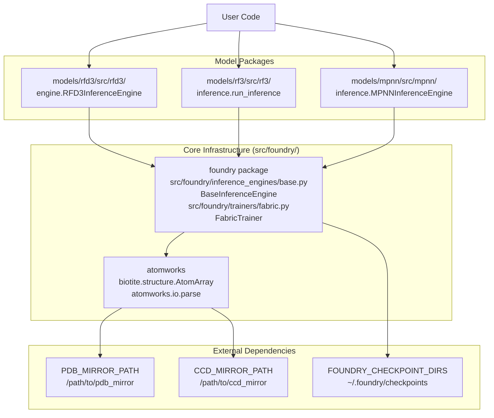
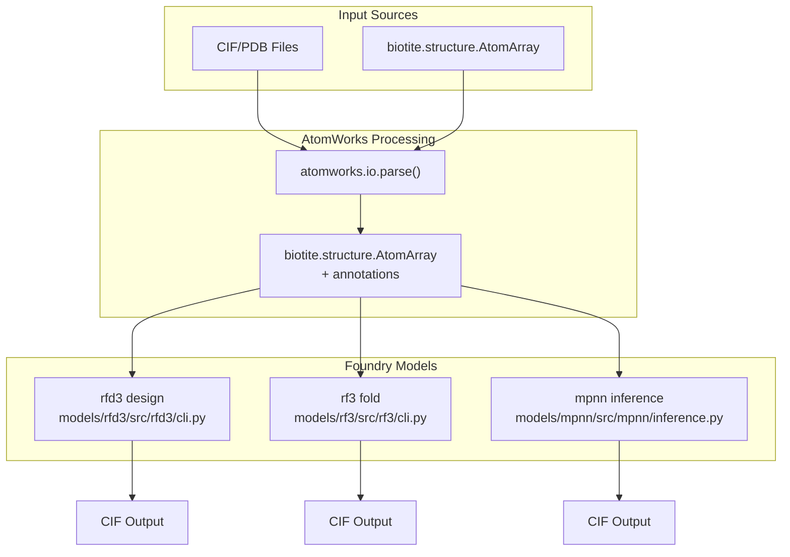
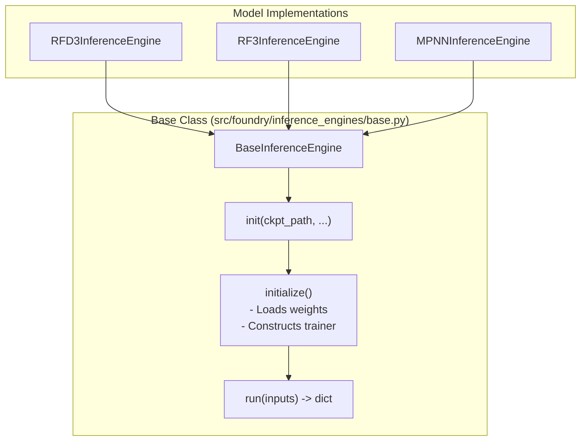
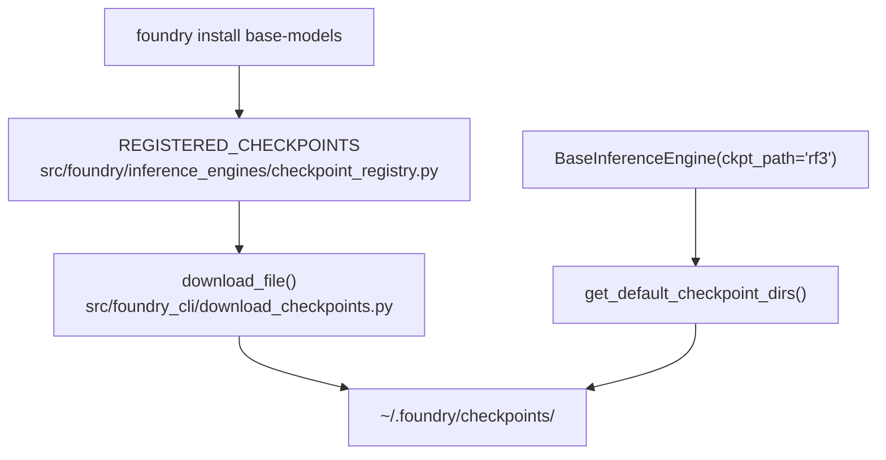

# Core Concepts

> **Relevant source files**
> * [.env](https://github.com/RosettaCommons/foundry/blob/cee116dc/.env)
> * [README.md](https://github.com/RosettaCommons/foundry/blob/cee116dc/README.md?plain=1)
> * [models/rf3/configs/experiment/pretrained/rf3.yaml](https://github.com/RosettaCommons/foundry/blob/cee116dc/models/rf3/configs/experiment/pretrained/rf3.yaml)
> * [models/rf3/src/rf3/callbacks/dump_validation_structures.py](https://github.com/RosettaCommons/foundry/blob/cee116dc/models/rf3/src/rf3/callbacks/dump_validation_structures.py)
> * [models/rf3/src/rf3/cli.py](https://github.com/RosettaCommons/foundry/blob/cee116dc/models/rf3/src/rf3/cli.py)
> * [models/rf3/src/rf3/utils/io.py](https://github.com/RosettaCommons/foundry/blob/cee116dc/models/rf3/src/rf3/utils/io.py)
> * [models/rfd3/README.md](https://github.com/RosettaCommons/foundry/blob/cee116dc/models/rfd3/README.md?plain=1)
> * [models/rfd3/src/rfd3/cli.py](https://github.com/RosettaCommons/foundry/blob/cee116dc/models/rfd3/src/rfd3/cli.py)
> * [pyproject.toml](https://github.com/RosettaCommons/foundry/blob/cee116dc/pyproject.toml)
> * [src/foundry/inference_engines/base.py](https://github.com/RosettaCommons/foundry/blob/cee116dc/src/foundry/inference_engines/base.py)
> * [src/foundry/inference_engines/checkpoint_registry.py](https://github.com/RosettaCommons/foundry/blob/cee116dc/src/foundry/inference_engines/checkpoint_registry.py)
> * [src/foundry_cli/__init__.py](https://github.com/RosettaCommons/foundry/blob/cee116dc/src/foundry_cli/__init__.py)
> * [src/foundry_cli/download_checkpoints.py](https://github.com/RosettaCommons/foundry/blob/cee116dc/src/foundry_cli/download_checkpoints.py)

This document introduces the fundamental concepts and architectural patterns that underpin the Foundry ecosystem. These concepts apply across all models (RFD3, RF3, MPNN) and provide the foundation for understanding how to use and extend the platform.

For detailed information on specific topics:

* AtomWorks data structures and utilities: see [AtomWorks Foundation](/RosettaCommons/foundry/3.1-atomworks-foundation)
* How foundry core, models, and atomworks interact: see [Model Architecture](/RosettaCommons/foundry/3.2-model-architecture)
* The inference engine interface pattern: see [Inference Engines](/RosettaCommons/foundry/3.3-inference-engines)
* Model-specific design workflows: see [RFdiffusion3 (RFD3)](/RosettaCommons/foundry/4-rfdiffusion3-(rfd3)), [RosettaFold3 (RF3)](/RosettaCommons/foundry/5-rosettafold3-(rf3)), and [ProteinMPNN and LigandMPNN](/RosettaCommons/foundry/6-proteinmpnn-and-ligandmpnn)

---

## The Foundry Ecosystem

Foundry is built on a strict dependency hierarchy that ensures consistency and modularity across all models.

**Foundry Dependency Architecture**

**Sources:** [README.md L112-L117](https://github.com/RosettaCommons/foundry/blob/cee116dc/README.md?plain=1#L112-L117)

 [pyproject.toml L24-L51](https://github.com/RosettaCommons/foundry/blob/cee116dc/pyproject.toml#L24-L51)

 [src/foundry/inference_engines/base.py L32-L50](https://github.com/RosettaCommons/foundry/blob/cee116dc/src/foundry/inference_engines/base.py#L32-L50)

### Dependency Flow

The architecture enforces a strict unidirectional dependency flow:

| Layer | Key Classes/Modules | File Locations |
| --- | --- | --- |
| **atomworks** | `biotite.structure.AtomArray``atomworks.io.utils.io_utils.to_cif_file` | External dependency |
| **foundry** | `foundry.inference_engines.base.BaseInferenceEngine``foundry.inference_engines.checkpoint_registry.RegisteredCheckpoint` | `src/foundry/` |
| **models/** | `rfd3.cli.design``rf3.cli.fold``mpnn.inference.main` | `models/*/src/` |

This separation allows:

* Independent installation of models via extras: `pip install "rc-foundry[rfd3]"` [pyproject.toml L58-L60](https://github.com/RosettaCommons/foundry/blob/cee116dc/pyproject.toml#L58-L60)
* Shared utilities for checkpoint management and distributed inference [src/foundry/inference_engines/checkpoint_registry.py L1-L122](https://github.com/RosettaCommons/foundry/blob/cee116dc/src/foundry/inference_engines/checkpoint_registry.py#L1-L122)
* Easy addition of new models as independent packages in `models/` [README.md L134-L142](https://github.com/RosettaCommons/foundry/blob/cee116dc/README.md?plain=1#L134-L142)

**Sources:** [README.md L112-L117](https://github.com/RosettaCommons/foundry/blob/cee116dc/README.md?plain=1#L112-L117)

 [pyproject.toml L54-L70](https://github.com/RosettaCommons/foundry/blob/cee116dc/pyproject.toml#L54-L70)

 [src/foundry/inference_engines/base.py L32-L50](https://github.com/RosettaCommons/foundry/blob/cee116dc/src/foundry/inference_engines/base.py#L32-L50)

---

## Central Data Structure: biotite.structure.AtomArray

All models in Foundry operate on `biotite.structure.AtomArray` objects. This is the unified framework for manipulating and processing biomolecular structures [README.md L5](https://github.com/RosettaCommons/foundry/blob/cee116dc/README.md?plain=1#L5-L5)

**AtomArray Processing Flow**

**Sources:** [README.md L1-L5](https://github.com/RosettaCommons/foundry/blob/cee116dc/README.md?plain=1#L1-L5)

 [models/rf3/src/rf3/utils/io.py L61-L94](https://github.com/RosettaCommons/foundry/blob/cee116dc/models/rf3/src/rf3/utils/io.py#L61-L94)

 [models/rf3/src/rf3/callbacks/dump_validation_structures.py L78-L87](https://github.com/RosettaCommons/foundry/blob/cee116dc/models/rf3/src/rf3/callbacks/dump_validation_structures.py#L78-L87)

### Handling Multi-Model Stacks

During diffusion or ensemble prediction, Foundry uses `AtomArrayStack` to manage multiple conformations of the same structure. The utility `build_stack_from_atom_array_and_batched_coords` is used to convert model coordinate outputs (tensors) back into structured `AtomArrayStack` objects [models/rf3/src/rf3/utils/io.py L61-L94](https://github.com/RosettaCommons/foundry/blob/cee116dc/models/rf3/src/rf3/utils/io.py#L61-L94)

**Sources:** [models/rf3/src/rf3/utils/io.py L61-L94](https://github.com/RosettaCommons/foundry/blob/cee116dc/models/rf3/src/rf3/utils/io.py#L61-L94)

 [models/rf3/src/rf3/callbacks/dump_validation_structures.py L78-L87](https://github.com/RosettaCommons/foundry/blob/cee116dc/models/rf3/src/rf3/callbacks/dump_validation_structures.py#L78-L87)

---

## The Inference Engine Pattern

All models implement a common interface via `foundry.inference_engines.base.BaseInferenceEngine`, which separates expensive model setup from the actual inference execution [src/foundry/inference_engines/base.py L32-L36](https://github.com/RosettaCommons/foundry/blob/cee116dc/src/foundry/inference_engines/base.py#L32-L36)

**BaseInferenceEngine Class Hierarchy**

**Sources:** [src/foundry/inference_engines/base.py L32-L155](https://github.com/RosettaCommons/foundry/blob/cee116dc/src/foundry/inference_engines/base.py#L32-L155)

### Inference Engine Lifecycle

1. **Initialization** (`__init__`): Stores overrides and resolves the checkpoint path [src/foundry/inference_engines/base.py L38-L120](https://github.com/RosettaCommons/foundry/blob/cee116dc/src/foundry/inference_engines/base.py#L38-L120)
2. **Setup** (`initialize()`): Loads the model weights from the checkpoint and instantiates the `FabricTrainer` for hardware-agnostic execution [src/foundry/inference_engines/base.py L125-L142](https://github.com/RosettaCommons/foundry/blob/cee116dc/src/foundry/inference_engines/base.py#L125-L142)
3. **Execution** (`run()`): Subclasses implement the specific logic to process inputs and return structural predictions or designs [src/foundry/inference_engines/base.py L144-L154](https://github.com/RosettaCommons/foundry/blob/cee116dc/src/foundry/inference_engines/base.py#L144-L154)

**Sources:** [src/foundry/inference_engines/base.py L32-L246](https://github.com/RosettaCommons/foundry/blob/cee116dc/src/foundry/inference_engines/base.py#L32-L246)

### Checkpoint Resolution System

Foundry uses a centralized registry to manage model weights. The `foundry install` command downloads these weights to a searchable directory [README.md L44-L56](https://github.com/RosettaCommons/foundry/blob/cee116dc/README.md?plain=1#L44-L56)

**Checkpoint Resolution Flow**

**Sources:** [src/foundry/inference_engines/checkpoint_registry.py L80-L122](https://github.com/RosettaCommons/foundry/blob/cee116dc/src/foundry/inference_engines/checkpoint_registry.py#L80-L122)

 [src/foundry_cli/download_checkpoints.py L144-L185](https://github.com/RosettaCommons/foundry/blob/cee116dc/src/foundry_cli/download_checkpoints.py#L144-L185)

---

## Configuration Management with Hydra

Foundry uses **Hydra** for hierarchical configuration. This allows users to override any part of the model or inference engine behavior via the CLI [models/rf3/src/rf3/cli.py L44-L59](https://github.com/RosettaCommons/foundry/blob/cee116dc/models/rf3/src/rf3/cli.py#L44-L59)

| Override Level | Example Syntax | Purpose |
| --- | --- | --- |
| **Inference Engine** | `inference_engine=rf3` | Selects the engine implementation |
| **Model Parameters** | `model.net.inference_sampler.num_timesteps=50` | Modifies diffusion sampling steps |
| **Input Selection** | `inputs=path/to/input.json` | Specifies the design task |
| **Hardware** | `trainer.devices_per_node=2` | Configures multi-GPU execution |

**Sources:** [models/rf3/src/rf3/cli.py L44-L69](https://github.com/RosettaCommons/foundry/blob/cee116dc/models/rf3/src/rf3/cli.py#L44-L69)

 [models/rfd3/src/rfd3/cli.py L30-L43](https://github.com/RosettaCommons/foundry/blob/cee116dc/models/rfd3/src/rfd3/cli.py#L30-L43)

 [src/foundry/inference_engines/base.py L118-L119](https://github.com/RosettaCommons/foundry/blob/cee116dc/src/foundry/inference_engines/base.py#L118-L119)

---

## Environment Configuration

The system relies on a `.env` file to locate external tools and data mirrors.

| Variable | Description |
| --- | --- |
| `PDB_MIRROR_PATH` | Path to local PDB mirror (RCSB convention) [.env L9-L13](https://github.com/RosettaCommons/foundry/blob/cee116dc/.env#L9-L13) |
| `CCD_MIRROR_PATH` | Path to local Chemical Component Dictionary mirror [.env L15-L22](https://github.com/RosettaCommons/foundry/blob/cee116dc/.env#L15-L22) |
| `HBPLUS_PATH` | Path to `hbplus` executable for hydrogen bond calculation [.env L29-L32](https://github.com/RosettaCommons/foundry/blob/cee116dc/.env#L29-L32) |
| `FOUNDRY_CHECKPOINT_DIRS` | Colon-separated list of directories to search for weights [.env L61-L63](https://github.com/RosettaCommons/foundry/blob/cee116dc/.env#L61-L63) |

**Sources:** [.env L1-L63](https://github.com/RosettaCommons/foundry/blob/cee116dc/.env#L1-L63)

 [src/foundry/inference_engines/checkpoint_registry.py L25-L41](https://github.com/RosettaCommons/foundry/blob/cee116dc/src/foundry/inference_engines/checkpoint_registry.py#L25-L41)

---

## Summary

The Foundry ecosystem is built on four core concepts:

1. **AtomWorks Foundation**: `AtomArray` as the universal data structure for biomolecular structures.
2. **Inference Engine Pattern**: `BaseInferenceEngine` providing consistent interfaces across models.
3. **Configuration System**: Hydra-based hierarchical configuration with flexible CLI overrides.
4. **Data Flow**: Structures flow between models (RFD3 → MPNN → RF3) as standardized `AtomArray` objects.

For implementation details, see the subsections on [AtomWorks Foundation](/RosettaCommons/foundry/3.1-atomworks-foundation), [Model Architecture](/RosettaCommons/foundry/3.2-model-architecture), and [Inference Engines](/RosettaCommons/foundry/3.3-inference-engines).

**Sources:** [README.md L1-L106](https://github.com/RosettaCommons/foundry/blob/cee116dc/README.md?plain=1#L1-L106)

 [src/foundry/inference_engines/base.py L32-L50](https://github.com/RosettaCommons/foundry/blob/cee116dc/src/foundry/inference_engines/base.py#L32-L50)