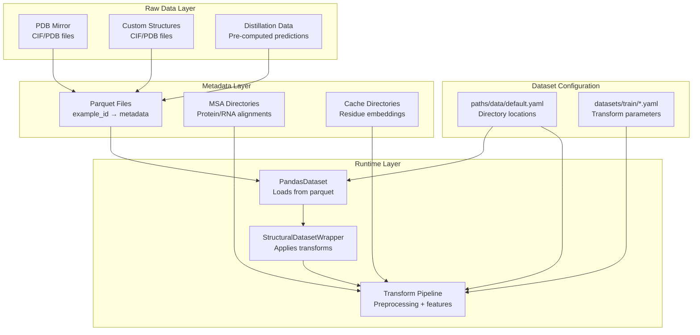
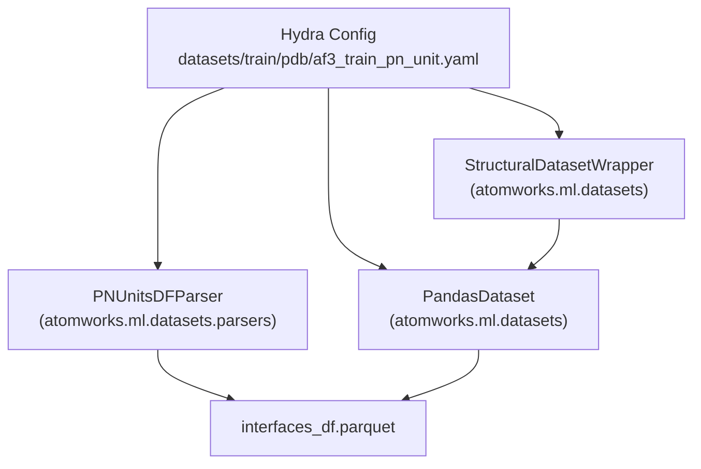

# Custom Datasets

> **Relevant source files**
> * [models/rf3/configs/datasets/train/disorder_distillation.yaml](https://github.com/RosettaCommons/foundry/blob/cee116dc/models/rf3/configs/datasets/train/disorder_distillation.yaml)
> * [models/rf3/configs/datasets/train/domain_distillation.yaml](https://github.com/RosettaCommons/foundry/blob/cee116dc/models/rf3/configs/datasets/train/domain_distillation.yaml)
> * [models/rf3/configs/datasets/train/monomer_distillation.yaml](https://github.com/RosettaCommons/foundry/blob/cee116dc/models/rf3/configs/datasets/train/monomer_distillation.yaml)
> * [models/rf3/configs/datasets/train/na_complex_distillation.yaml](https://github.com/RosettaCommons/foundry/blob/cee116dc/models/rf3/configs/datasets/train/na_complex_distillation.yaml)
> * [models/rf3/configs/datasets/train/rna_monomer_distillation.yaml](https://github.com/RosettaCommons/foundry/blob/cee116dc/models/rf3/configs/datasets/train/rna_monomer_distillation.yaml)
> * [models/rf3/configs/datasets/val/af3_ab_set.yaml](https://github.com/RosettaCommons/foundry/blob/cee116dc/models/rf3/configs/datasets/val/af3_ab_set.yaml)
> * [models/rf3/configs/datasets/val/af3_validation.yaml](https://github.com/RosettaCommons/foundry/blob/cee116dc/models/rf3/configs/datasets/val/af3_validation.yaml)
> * [models/rf3/configs/datasets/val/base.yaml](https://github.com/RosettaCommons/foundry/blob/cee116dc/models/rf3/configs/datasets/val/base.yaml)
> * [models/rf3/configs/datasets/val/runs_and_poses.yaml](https://github.com/RosettaCommons/foundry/blob/cee116dc/models/rf3/configs/datasets/val/runs_and_poses.yaml)
> * [models/rfd3/configs/datasets/train/pdb/af3_train_interface.yaml](https://github.com/RosettaCommons/foundry/blob/cee116dc/models/rfd3/configs/datasets/train/pdb/af3_train_interface.yaml)
> * [models/rfd3/configs/datasets/train/pdb/af3_train_pn_unit.yaml](https://github.com/RosettaCommons/foundry/blob/cee116dc/models/rfd3/configs/datasets/train/pdb/af3_train_pn_unit.yaml)
> * [models/rfd3/configs/logger/default.yaml](https://github.com/RosettaCommons/foundry/blob/cee116dc/models/rfd3/configs/logger/default.yaml)
> * [models/rfd3/configs/paths/data/default.yaml](https://github.com/RosettaCommons/foundry/blob/cee116dc/models/rfd3/configs/paths/data/default.yaml)

This page describes how to create and configure custom datasets for training and fine-tuning models in the Foundry ecosystem. All Foundry models (RFD3, RF3, MPNN) can be trained on arbitrary datasets of biomolecular structures through the AtomWorks interface.

**Scope**: This page covers dataset creation for **training and fine-tuning**. For information about preparing inputs for **inference**, see [RF3 Inference](https://github.com/RosettaCommons/foundry/blob/cee116dc/RF3 Inference)

 and [RFD3 Inference Pipeline](https://github.com/RosettaCommons/foundry/blob/cee116dc/RFD3 Inference Pipeline)

 For general data pipeline architecture, see [Data Pipeline and Transforms](https://github.com/RosettaCommons/foundry/blob/cee116dc/Data Pipeline and Transforms)

---

## Dataset Architecture Overview

Foundry's training infrastructure uses a three-layer dataset architecture: structural data, metadata indices, and transform pipelines.



**Sources**: [models/rfd3/configs/paths/data/default.yaml L1-L18](https://github.com/RosettaCommons/foundry/blob/cee116dc/models/rfd3/configs/paths/data/default.yaml#L1-L18)

 [models/rf3/configs/datasets/train/monomer_distillation.yaml L1-L50](https://github.com/RosettaCommons/foundry/blob/cee116dc/models/rf3/configs/datasets/train/monomer_distillation.yaml#L1-L50)

 [models/rf3/configs/datasets/val/base.yaml L1-L32](https://github.com/RosettaCommons/foundry/blob/cee116dc/models/rf3/configs/datasets/val/base.yaml#L1-L32)

---

## AtomWorks-Compatible Datasets

All Foundry datasets must be AtomWorks-compatible. This means they consist of structure files (CIF, PDB, mmCIF) that can be parsed by AtomWorks' underlying utilities.

### Core Requirements

| Requirement | Description |
| --- | --- |
| **File Format** | `.cif`, `.pdb`, `.mmcif` (optionally `.gz` compressed) |
| **Parsing** | Must be parsable by `atomworks.ml.datasets.StructuralDatasetWrapper` [models/rf3/configs/datasets/train/monomer_distillation.yaml L5-L6](https://github.com/RosettaCommons/foundry/blob/cee116dc/models/rf3/configs/datasets/train/monomer_distillation.yaml#L5-L6) |
| **Metadata** | Parquet or CSV file with `example_id` column mapping to metadata [models/rf3/configs/datasets/train/na_complex_distillation.yaml L22-L28](https://github.com/RosettaCommons/foundry/blob/cee116dc/models/rf3/configs/datasets/train/na_complex_distillation.yaml#L22-L28) |
| **Chain Info** | Valid chain IDs and residue information for parsing [models/rfd3/configs/datasets/train/pdb/af3_train_interface.yaml L36-L41](https://github.com/RosettaCommons/foundry/blob/cee116dc/models/rfd3/configs/datasets/train/pdb/af3_train_interface.yaml#L36-L41) |

### Data Flow and Code Entity Association

The following diagram maps system concepts to specific classes and configuration keys used in the codebase.



**Sources**: [models/rfd3/configs/datasets/train/pdb/af3_train_interface.yaml L4-L10](https://github.com/RosettaCommons/foundry/blob/cee116dc/models/rfd3/configs/datasets/train/pdb/af3_train_interface.yaml#L4-L10)

 [models/rfd3/configs/datasets/train/pdb/af3_train_pn_unit.yaml L4-L10](https://github.com/RosettaCommons/foundry/blob/cee116dc/models/rfd3/configs/datasets/train/pdb/af3_train_pn_unit.yaml#L4-L10)

---

## Dataset Types

### PDB-Based Datasets

PDB-based datasets use structures from the Protein Data Bank organized with parquet metadata files. These often involve specific parsers like `InterfacesDFParser` or `PNUnitsDFParser`.

**Configuration Example (Interfaces)**:

```
dataset:  dataset_parser:    _target_: atomworks.ml.datasets.parsers.InterfacesDFParser    base_dir: ${paths.data.pdb_data_dir}  dataset:    name: interface    data: ${paths.data.pdb_parquet_dir}/interfaces_df.parquet    filters:      - "resolution < 9.0"      - "num_polymer_pn_units <= 300"
```

**Sources**: [models/rfd3/configs/datasets/train/pdb/af3_train_interface.yaml L4-L15](https://github.com/RosettaCommons/foundry/blob/cee116dc/models/rfd3/configs/datasets/train/pdb/af3_train_interface.yaml#L4-L15)

### Distillation Datasets

Distillation datasets contain pre-computed predictions (e.g., from AF2 or RF3) used for training.

| Dataset Name | Source Parquet/CSV | Parser Target |
| --- | --- | --- |
| `af2fb_distillation` | `af2_distillation_facebook.parquet` | `GenericDFParser` |
| `tf_distillation` | `transcriptionFactor_distillation_rf3.newDL.csv` | `GenericDFParser` |
| `multidomain_distillation` | `domain_domain_dataset.DIGS.parquet` | `MultidomainDFParser` |

**Sources**: [models/rf3/configs/datasets/train/monomer_distillation.yaml L16-L24](https://github.com/RosettaCommons/foundry/blob/cee116dc/models/rf3/configs/datasets/train/monomer_distillation.yaml#L16-L24)

 [models/rf3/configs/datasets/train/na_complex_distillation.yaml L17-L25](https://github.com/RosettaCommons/foundry/blob/cee116dc/models/rf3/configs/datasets/train/na_complex_distillation.yaml#L17-L25)

 [models/rf3/configs/datasets/train/domain_distillation.yaml L17-L24](https://github.com/RosettaCommons/foundry/blob/cee116dc/models/rf3/configs/datasets/train/domain_distillation.yaml#L17-L24)

---

## Creating Custom Datasets

### Step 1: Prepare Metadata

Foundry uses `PandasDataset` to manage metadata. You must provide a file (Parquet or CSV) containing at least an `example_id` and a `path` to the structure file.

```javascript
# Example Parquet creationimport pandas as pddf = pd.DataFrame({    'example_id': ['prot1', 'prot2'],    'path': ['/data/prot1.cif', '/data/prot2.cif'],    'cluster': [1, 2] # Useful for filtering})df.to_parquet('my_custom_data.parquet')
```

**Sources**: [models/rf3/configs/datasets/train/monomer_distillation.yaml L20-L27](https://github.com/RosettaCommons/foundry/blob/cee116dc/models/rf3/configs/datasets/train/monomer_distillation.yaml#L20-L27)

### Step 2: Configure Dataset and Transforms

Define a YAML configuration for your dataset. This includes the `dataset_parser` and the `transform` pipeline.

```css
# models/rf3/configs/datasets/train/custom_dataset.yamldataset:  _target_: atomworks.ml.datasets.StructuralDatasetWrapper  dataset_parser:    _target_: atomworks.ml.datasets.parsers.GenericDFParser  dataset:    _target_: atomworks.ml.datasets.PandasDataset    name: my_custom_data    id_column: example_id    data: /path/to/my_custom_data.parquet  transform:    _target_: ${datasets.pipeline_target}    crop_contiguous_probability: 0.5    crop_spatial_probability: 0.5
```

**Sources**: [models/rf3/configs/datasets/train/monomer_distillation.yaml L4-L30](https://github.com/RosettaCommons/foundry/blob/cee116dc/models/rf3/configs/datasets/train/monomer_distillation.yaml#L4-L30)

 [models/rf3/configs/datasets/val/base.yaml L8-L16](https://github.com/RosettaCommons/foundry/blob/cee116dc/models/rf3/configs/datasets/val/base.yaml#L8-L16)

---

## Transform Pipeline Configuration

The transform pipeline defines how raw structures are processed into model inputs. Key parameters control cropping, MSA processing, and augmentation.

### Key Transform Parameters

| Parameter | Purpose | Typical Values |
| --- | --- | --- |
| `crop_size` | Maximum tokens per crop | 256-384 [models/rf3/configs/datasets/train/monomer_distillation.yaml L34](https://github.com/RosettaCommons/foundry/blob/cee116dc/models/rf3/configs/datasets/train/monomer_distillation.yaml#L34-L34) |
| `crop_contiguous_probability` | Probability of selecting a contiguous sequence crop | 0.25 - 1.0 [models/rfd3/configs/datasets/train/pdb/af3_train_pn_unit.yaml L41](https://github.com/RosettaCommons/foundry/blob/cee116dc/models/rfd3/configs/datasets/train/pdb/af3_train_pn_unit.yaml#L41-L41) |
| `crop_spatial_probability` | Probability of selecting a spatially-clustered crop | 0.66 - 0.75 [models/rfd3/configs/datasets/train/pdb/af3_train_interface.yaml L46](https://github.com/RosettaCommons/foundry/blob/cee116dc/models/rfd3/configs/datasets/train/pdb/af3_train_interface.yaml#L46-L46) |
| `n_recycles` | Number of recycles during training | `${datasets.n_recycles_train}` [models/rf3/configs/datasets/train/monomer_distillation.yaml L33](https://github.com/RosettaCommons/foundry/blob/cee116dc/models/rf3/configs/datasets/train/monomer_distillation.yaml#L33-L33) |
| `atomization_prob` | Probability of representing residues at atom-level | `${datasets.atomization_prob}` [models/rf3/configs/datasets/train/na_complex_distillation.yaml L46](https://github.com/RosettaCommons/foundry/blob/cee116dc/models/rf3/configs/datasets/train/na_complex_distillation.yaml#L46-L46) |

**Sources**: [models/rfd3/configs/datasets/train/pdb/af3_train_interface.yaml L45-L46](https://github.com/RosettaCommons/foundry/blob/cee116dc/models/rfd3/configs/datasets/train/pdb/af3_train_interface.yaml#L45-L46)

 [models/rf3/configs/datasets/train/monomer_distillation.yaml L33-L47](https://github.com/RosettaCommons/foundry/blob/cee116dc/models/rf3/configs/datasets/train/monomer_distillation.yaml#L33-L47)

---

## Validation and Debugging

### Filtering Examples

You can use the `filters` key in the configuration to subset your dataset based on metadata columns.

```yaml
dataset:  dataset:    filters:      - "resolution < 9.0"      - "deposition_date < '2021-09-30'"      - "num_polymer_pn_units <= 300"
```

**Sources**: [models/rfd3/configs/datasets/train/pdb/af3_train_interface.yaml L11-L15](https://github.com/RosettaCommons/foundry/blob/cee116dc/models/rfd3/configs/datasets/train/pdb/af3_train_interface.yaml#L11-L15)

### Handling Failed Examples

If a structure fails to pass through the transform pipeline (e.g., due to parsing errors or size constraints), it can be saved to a directory for debugging.

```css
# models/rfd3/configs/paths/data/default.yamlfailed_examples_dir: /path/to/failed_logs # models/rf3/configs/datasets/train/monomer_distillation.yamlsave_failed_examples_to_dir: ${paths.data.failed_examples_dir}
```

**Sources**: [models/rfd3/configs/paths/data/default.yaml L9-L10](https://github.com/RosettaCommons/foundry/blob/cee116dc/models/rfd3/configs/paths/data/default.yaml#L9-L10)

 [models/rf3/configs/datasets/train/monomer_distillation.yaml L6](https://github.com/RosettaCommons/foundry/blob/cee116dc/models/rf3/configs/datasets/train/monomer_distillation.yaml#L6-L6)

### MSA Path Resolution

For datasets requiring MSAs (like RF3 training), specify the directories and extensions in the transform:

```
transform:  protein_msa_dirs:     - {"dir": "/path/to/msa", "extension": ".a3m", "directory_depth": 2}  rna_msa_dirs: []
```

**Sources**: [models/rf3/configs/datasets/train/monomer_distillation.yaml L31-L32](https://github.com/RosettaCommons/foundry/blob/cee116dc/models/rf3/configs/datasets/train/monomer_distillation.yaml#L31-L32)

 [models/rf3/configs/datasets/train/rna_monomer_distillation.yaml L38](https://github.com/RosettaCommons/foundry/blob/cee116dc/models/rf3/configs/datasets/train/rna_monomer_distillation.yaml#L38-L38)

---

## Advanced Topics

### Custom Parsers

If your data is not in a standard PDB/CIF format or requires complex joining logic, you may need a custom parser.

* `PNUnitsDFParser`: Used for datasets focused on individual protein/nucleic acid units [models/rfd3/configs/datasets/train/pdb/af3_train_pn_unit.yaml L6](https://github.com/RosettaCommons/foundry/blob/cee116dc/models/rfd3/configs/datasets/train/pdb/af3_train_pn_unit.yaml#L6-L6)
* `InterfacesDFParser`: Used for protein-protein or protein-ligand interface training [models/rfd3/configs/datasets/train/pdb/af3_train_interface.yaml L6](https://github.com/RosettaCommons/foundry/blob/cee116dc/models/rfd3/configs/datasets/train/pdb/af3_train_interface.yaml#L6-L6)
* `MultidomainDFParser`: Used for multi-domain distillation [models/rf3/configs/datasets/train/domain_distillation.yaml L17](https://github.com/RosettaCommons/foundry/blob/cee116dc/models/rf3/configs/datasets/train/domain_distillation.yaml#L17-L17)

### Load Balancing

In validation sets, the `key_to_balance` parameter is used to ensure representative sampling across different types of examples.

```css
# models/rf3/configs/datasets/val/base.yamlkey_to_balance: ${datasets.key_to_balance}
```

**Sources**: [models/rf3/configs/datasets/val/base.yaml L32](https://github.com/RosettaCommons/foundry/blob/cee116dc/models/rf3/configs/datasets/val/base.yaml#L32-L32)