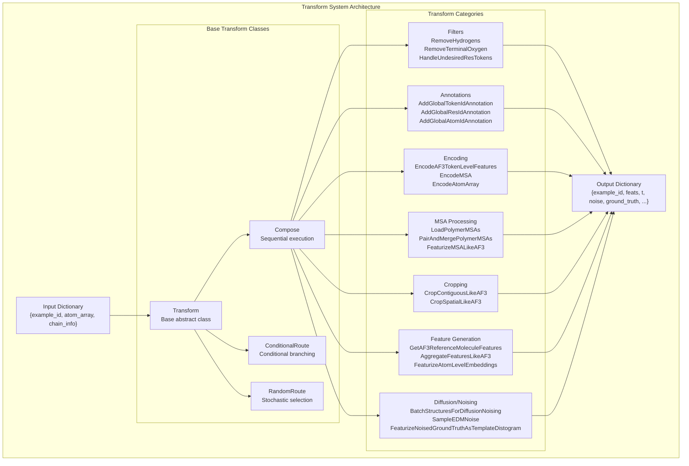
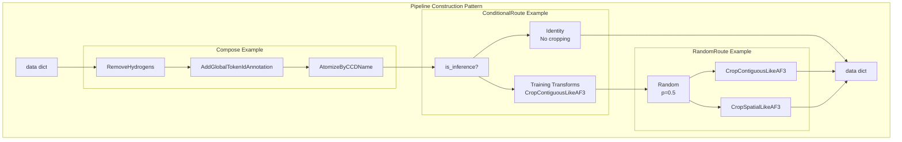
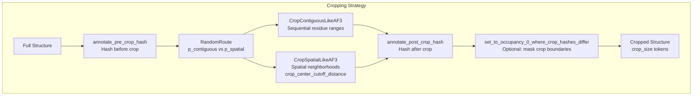
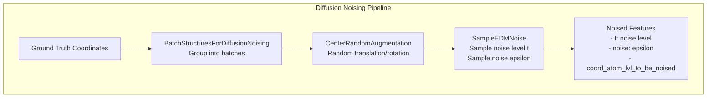
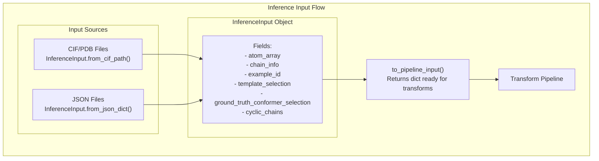
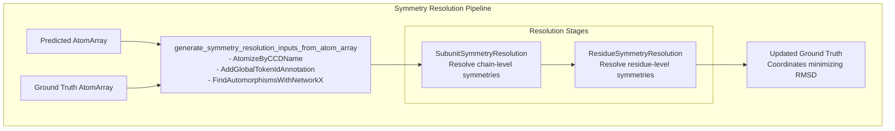

# Data Pipeline and Transforms

> **Relevant source files**
> * [models/mpnn/tests/conftest.py](https://github.com/RosettaCommons/foundry/blob/cee116dc/models/mpnn/tests/conftest.py)
> * [models/rf3/configs/inference_engine/base.yaml](https://github.com/RosettaCommons/foundry/blob/cee116dc/models/rf3/configs/inference_engine/base.yaml)
> * [models/rf3/configs/inference_engine/rf3.yaml](https://github.com/RosettaCommons/foundry/blob/cee116dc/models/rf3/configs/inference_engine/rf3.yaml)
> * [models/rf3/src/rf3/data/extra_xforms.py](https://github.com/RosettaCommons/foundry/blob/cee116dc/models/rf3/src/rf3/data/extra_xforms.py)
> * [models/rf3/src/rf3/data/pipelines.py](https://github.com/RosettaCommons/foundry/blob/cee116dc/models/rf3/src/rf3/data/pipelines.py)
> * [models/rf3/src/rf3/inference.py](https://github.com/RosettaCommons/foundry/blob/cee116dc/models/rf3/src/rf3/inference.py)
> * [models/rf3/src/rf3/inference_engines/rf3.py](https://github.com/RosettaCommons/foundry/blob/cee116dc/models/rf3/src/rf3/inference_engines/rf3.py)
> * [models/rf3/src/rf3/symmetry/resolve.py](https://github.com/RosettaCommons/foundry/blob/cee116dc/models/rf3/src/rf3/symmetry/resolve.py)
> * [models/rf3/src/rf3/utils/inference.py](https://github.com/RosettaCommons/foundry/blob/cee116dc/models/rf3/src/rf3/utils/inference.py)
> * [models/rfd3/configs/experiment/pretrain.yaml](https://github.com/RosettaCommons/foundry/blob/cee116dc/models/rfd3/configs/experiment/pretrain.yaml)
> * [models/rfd3/src/rfd3/model/layers/blocks.py](https://github.com/RosettaCommons/foundry/blob/cee116dc/models/rfd3/src/rfd3/model/layers/blocks.py)
> * [models/rfd3/src/rfd3/model/layers/pairformer_layers.py](https://github.com/RosettaCommons/foundry/blob/cee116dc/models/rfd3/src/rfd3/model/layers/pairformer_layers.py)
> * [models/rfd3/src/rfd3/testing/debug.py](https://github.com/RosettaCommons/foundry/blob/cee116dc/models/rfd3/src/rfd3/testing/debug.py)
> * [models/rfd3/src/rfd3/trainer/dump_validation_structures.py](https://github.com/RosettaCommons/foundry/blob/cee116dc/models/rfd3/src/rfd3/trainer/dump_validation_structures.py)
> * [models/rfd3/src/rfd3/transforms/conditioning_base.py](https://github.com/RosettaCommons/foundry/blob/cee116dc/models/rfd3/src/rfd3/transforms/conditioning_base.py)
> * [models/rfd3/src/rfd3/transforms/hbonds_hbplus.py](https://github.com/RosettaCommons/foundry/blob/cee116dc/models/rfd3/src/rfd3/transforms/hbonds_hbplus.py)
> * [models/rfd3/src/rfd3/transforms/pipelines.py](https://github.com/RosettaCommons/foundry/blob/cee116dc/models/rfd3/src/rfd3/transforms/pipelines.py)

This page documents the Transform system used throughout Foundry for data preprocessing, augmentation, and feature generation. The Transform system provides a composable, modular approach to building complex data processing pipelines for both training and inference.

For model-specific transform pipelines, see [RF3 Data Pipeline](/RosettaCommons/foundry/5.6-rf3-data-pipeline). For training infrastructure that uses these pipelines, see [Training Infrastructure](#7.4).

## Purpose and Architecture

The Transform system in Foundry is built on AtomWorks' transform framework, which provides a composable pipeline architecture for processing biomolecular structures. Transforms take a dictionary as input (typically containing an `atom_array` and metadata), perform operations on it, and return a modified dictionary. This functional approach enables:

* **Composability**: Transforms can be chained together into complex pipelines [models/rf3/src/rf3/data/pipelines.py L41-L47](https://github.com/RosettaCommons/foundry/blob/cee116dc/models/rf3/src/rf3/data/pipelines.py#L41-L47)
* **Reusability**: Individual transforms can be shared across different models and tasks [models/rfd3/src/rfd3/transforms/pipelines.py L27-L65](https://github.com/RosettaCommons/foundry/blob/cee116dc/models/rfd3/src/rfd3/transforms/pipelines.py#L27-L65)
* **Flexibility**: Conditional and random routing enables training-time augmentation [models/rf3/src/rf3/data/pipelines.py L114-L125](https://github.com/RosettaCommons/foundry/blob/cee116dc/models/rf3/src/rf3/data/pipelines.py#L114-L125)
* **Type Safety**: Transforms validate their inputs and declare dependencies on previous transforms [models/rfd3/src/rfd3/transforms/hbonds_hbplus.py L188-L192](https://github.com/RosettaCommons/foundry/blob/cee116dc/models/rfd3/src/rfd3/transforms/hbonds_hbplus.py#L188-L192)



**Diagram: Transform System Architecture showing base classes and major transform categories**

Sources: [models/rf3/src/rf3/data/pipelines.py L1-L112](https://github.com/RosettaCommons/foundry/blob/cee116dc/models/rf3/src/rf3/data/pipelines.py#L1-L112)

 [models/rfd3/src/rfd3/transforms/pipelines.py L1-L103](https://github.com/RosettaCommons/foundry/blob/cee116dc/models/rfd3/src/rfd3/transforms/pipelines.py#L1-L103)

## Transform Base Classes

### Core Transform Types

The transform system provides several fundamental building blocks for constructing pipelines:

| Transform Class | Purpose | Example Usage |
| --- | --- | --- |
| `Transform` | Base abstract class | All transforms inherit from this [models/rfd3/src/rfd3/transforms/hbonds_hbplus.py L177](https://github.com/RosettaCommons/foundry/blob/cee116dc/models/rfd3/src/rfd3/transforms/hbonds_hbplus.py#L177-L177) |
| `Compose` | Sequential execution | Chain multiple transforms together [models/rf3/src/rf3/data/pipelines.py L41](https://github.com/RosettaCommons/foundry/blob/cee116dc/models/rf3/src/rf3/data/pipelines.py#L41-L41) |
| `ConditionalRoute` | Conditional branching | Apply different transforms based on conditions [models/rf3/src/rf3/data/pipelines.py L42](https://github.com/RosettaCommons/foundry/blob/cee116dc/models/rf3/src/rf3/data/pipelines.py#L42-L42) |
| `RandomRoute` | Stochastic selection | Randomly choose between transform options [models/rf3/src/rf3/data/pipelines.py L45](https://github.com/RosettaCommons/foundry/blob/cee116dc/models/rf3/src/rf3/data/pipelines.py#L45-L45) |
| `Identity` | No-op transform | Used in conditional branches as a pass-through [models/rf3/src/rf3/data/pipelines.py L44](https://github.com/RosettaCommons/foundry/blob/cee116dc/models/rf3/src/rf3/data/pipelines.py#L44-L44) |
| `AddData` | Add key-value pairs | Inject metadata into the pipeline [models/rf3/src/rf3/data/pipelines.py L39](https://github.com/RosettaCommons/foundry/blob/cee116dc/models/rf3/src/rf3/data/pipelines.py#L39-L39) |
| `SubsetToKeys` | Filter dictionary keys | Remove unnecessary keys before output [models/rf3/src/rf3/data/pipelines.py L46](https://github.com/RosettaCommons/foundry/blob/cee116dc/models/rf3/src/rf3/data/pipelines.py#L46-L46) |
| `ConvertToTorch` | Type conversion | Convert numpy arrays to PyTorch tensors [models/rf3/src/rf3/data/pipelines.py L43](https://github.com/RosettaCommons/foundry/blob/cee116dc/models/rf3/src/rf3/data/pipelines.py#L43-L43) |



**Diagram: Common pipeline construction patterns using Compose, ConditionalRoute, and RandomRoute**

Sources: [models/rf3/src/rf3/data/pipelines.py L114-L125](https://github.com/RosettaCommons/foundry/blob/cee116dc/models/rf3/src/rf3/data/pipelines.py#L114-L125)

 [models/rfd3/src/rfd3/transforms/pipelines.py L117-L141](https://github.com/RosettaCommons/foundry/blob/cee116dc/models/rfd3/src/rfd3/transforms/pipelines.py#L117-L141)

### Training vs Inference Routing

Foundry uses helper functions to create conditional transforms that behave differently during training vs inference:

```python
# Helper functions for conditional routingdef TrainingRoute(transform):    return ConditionalRoute(        condition_func=lambda data: data["is_inference"],        transform_map={True: Identity(), False: transform}    ) def InferenceRoute(transform):    return ConditionalRoute(        condition_func=lambda data: data["is_inference"],        transform_map={False: Identity(), True: transform}    )
```

These helpers enable clean separation of training-specific augmentations (cropping, mirroring, noise sampling) from inference behavior [models/rf3/src/rf3/data/pipelines.py L114-L125](https://github.com/RosettaCommons/foundry/blob/cee116dc/models/rf3/src/rf3/data/pipelines.py#L114-L125)

Sources: [models/rf3/src/rf3/data/pipelines.py L114-L125](https://github.com/RosettaCommons/foundry/blob/cee116dc/models/rf3/src/rf3/data/pipelines.py#L114-L125)

 [models/rfd3/src/rfd3/transforms/pipelines.py L117-L128](https://github.com/RosettaCommons/foundry/blob/cee116dc/models/rfd3/src/rfd3/transforms/pipelines.py#L117-L128)

## Transform Categories

### Structure Filtering and Preprocessing

These transforms remove unwanted atoms or structures and prepare the input for further processing:

| Transform | Purpose | Configuration |
| --- | --- | --- |
| `RemoveHydrogens` | Remove hydrogen atoms | Always applied [models/rfd3/src/rfd3/transforms/pipelines.py L150](https://github.com/RosettaCommons/foundry/blob/cee116dc/models/rfd3/src/rfd3/transforms/pipelines.py#L150-L150) |
| `RemoveTerminalOxygen` | Remove terminal oxygen atoms | Always applied [models/rfd3/src/rfd3/transforms/pipelines.py L154](https://github.com/RosettaCommons/foundry/blob/cee116dc/models/rfd3/src/rfd3/transforms/pipelines.py#L154-L154) |
| `RemoveUnresolvedPNUnits` | Remove unresolved polymer/non-polymer units | Training only [models/rfd3/src/rfd3/transforms/pipelines.py L157](https://github.com/RosettaCommons/foundry/blob/cee116dc/models/rfd3/src/rfd3/transforms/pipelines.py#L157-L157) |
| `HandleUndesiredResTokens` | Remove or flag undesired residue types | Configurable list (e.g., AF3_EXCLUDED_LIGANDS) [models/rfd3/src/rfd3/transforms/pipelines.py L162](https://github.com/RosettaCommons/foundry/blob/cee116dc/models/rfd3/src/rfd3/transforms/pipelines.py#L162-L162) |
| `RemovePolymersWithTooFewResolvedResidues` | Filter chains with insufficient resolved residues | min_residues parameter [models/rfd3/src/rfd3/transforms/pipelines.py L159](https://github.com/RosettaCommons/foundry/blob/cee116dc/models/rfd3/src/rfd3/transforms/pipelines.py#L159-L159) |
| `RandomlyRemoveLigands` | Stochastically drop ligands during training | ligand_dropout_prob parameter [models/rf3/src/rf3/data/pipelines.py L82](https://github.com/RosettaCommons/foundry/blob/cee116dc/models/rf3/src/rf3/data/pipelines.py#L82-L82) |

Sources: [models/rf3/src/rf3/data/pipelines.py L79-L88](https://github.com/RosettaCommons/foundry/blob/cee116dc/models/rf3/src/rf3/data/pipelines.py#L79-L88)

 [models/rfd3/src/rfd3/transforms/pipelines.py L144-L184](https://github.com/RosettaCommons/foundry/blob/cee116dc/models/rfd3/src/rfd3/transforms/pipelines.py#L144-L184)

### Annotation Transforms

These transforms add essential annotations to the `AtomArray` that are used by downstream transforms:

```mermaid
flowchart TD

AA["AtomArray<br>Raw structure"]
GlobalAtom["AddGlobalAtomIdAnnotation<br>Adds: atom_id"]
GlobalToken["AddGlobalTokenIdAnnotation<br>Adds: token_id"]
GlobalRes["AddGlobalResIdAnnotation<br>Adds: res_id"]
WithinChain["AddWithinChainInstanceResIdx<br>Adds: within_chain_res_idx"]
WithinPoly["AddWithinPolyResIdxAnnotation<br>Adds: within_poly_res_idx"]
AtomToToken["ComputeAtomToTokenMap<br>Creates mapping structure"]
Output["Annotated AtomArray<br>Ready for encoding"]

subgraph subGraph0 ["Annotation Pipeline Flow"]
    AA
    GlobalAtom
    GlobalToken
    GlobalRes
    WithinChain
    WithinPoly
    AtomToToken
    Output
    AA --> GlobalAtom
    GlobalAtom --> GlobalToken
    GlobalToken --> GlobalRes
    GlobalRes --> WithinChain
    WithinChain --> WithinPoly
    WithinPoly --> AtomToToken
    AtomToToken --> Output
end
```



**Diagram: Annotation transform sequence showing dependencies**

Sources: [models/rf3/src/rf3/data/pipelines.py L19-L27](https://github.com/RosettaCommons/foundry/blob/cee116dc/models/rf3/src/rf3/data/pipelines.py#L19-L27)

 [models/rfd3/src/rfd3/transforms/pipelines.py L18-L26](https://github.com/RosettaCommons/foundry/blob/cee116dc/models/rfd3/src/rfd3/transforms/pipelines.py#L18-L26)

### MSA Processing Pipeline

The MSA processing pipeline loads, pairs, and featurizes multiple sequence alignments for RF3:

| Transform | Purpose | Key Parameters |
| --- | --- | --- |
| `LoadPolymerMSAs` | Load protein and RNA MSAs from disk | protein_msa_dirs, rna_msa_dirs [models/rf3/src/rf3/data/pipelines.py L94](https://github.com/RosettaCommons/foundry/blob/cee116dc/models/rf3/src/rf3/data/pipelines.py#L94-L94) |
| `PairAndMergePolymerMSAs` | Pair MSAs across chains | dense [models/rf3/src/rf3/data/pipelines.py L95](https://github.com/RosettaCommons/foundry/blob/cee116dc/models/rf3/src/rf3/data/pipelines.py#L95-L95) |
| `EncodeMSA` | Encode MSAs using sequence encoding | encoding [models/rf3/src/rf3/data/pipelines.py L91](https://github.com/RosettaCommons/foundry/blob/cee116dc/models/rf3/src/rf3/data/pipelines.py#L91-L91) |
| `FillFullMSAFromEncoded` | Fill MSA for cropped structures | pad_token [models/rf3/src/rf3/data/pipelines.py L93](https://github.com/RosettaCommons/foundry/blob/cee116dc/models/rf3/src/rf3/data/pipelines.py#L93-L93) |
| `FeaturizeMSALikeAF3` | Generate MSA features | n_recycles, n_msa [models/rf3/src/rf3/data/pipelines.py L92](https://github.com/RosettaCommons/foundry/blob/cee116dc/models/rf3/src/rf3/data/pipelines.py#L92-L92) |

Sources: [models/rf3/src/rf3/data/pipelines.py L90-L96](https://github.com/RosettaCommons/foundry/blob/cee116dc/models/rf3/src/rf3/data/pipelines.py#L90-L96)

### Cropping Transforms

Cropping reduces structure size for training efficiency while maintaining biological context. Foundry supports contiguous and spatial cropping [models/rf3/src/rf3/data/pipelines.py L61](https://github.com/RosettaCommons/foundry/blob/cee116dc/models/rf3/src/rf3/data/pipelines.py#L61-L61)



**Diagram: Cropping pipeline with pre/post-hash tracking and optional edge masking**

Sources: [models/rf3/src/rf3/data/pipeline_utils.py L106-L111](https://github.com/RosettaCommons/foundry/blob/cee116dc/models/rf3/src/rf3/data/pipeline_utils.py#L106-L111)

 [models/rfd3/src/rfd3/transforms/pipelines.py L187-L214](https://github.com/RosettaCommons/foundry/blob/cee116dc/models/rfd3/src/rfd3/transforms/pipelines.py#L187-L214)

### Ground Truth Template Conditioning

Foundry generative models (RFD3) use conditioning transforms to leak ground truth information during training:

| Transform | Purpose | Key Parameters |
| --- | --- | --- |
| `SampleConditioningType` | Choose conditioning mode (motif, island, etc.) | p_unconditional [models/rfd3/src/rfd3/transforms/conditioning_base.py L69](https://github.com/RosettaCommons/foundry/blob/cee116dc/models/rfd3/src/rfd3/transforms/conditioning_base.py#L69-L69) |
| `SampleConditioningFlags` | Flag tokens for conditioning | island_frequency [models/rfd3/src/rfd3/transforms/conditioning_base.py L68](https://github.com/RosettaCommons/foundry/blob/cee116dc/models/rfd3/src/rfd3/transforms/conditioning_base.py#L68-L68) |
| `UnindexFlaggedTokens` | Mask flagged tokens from model input | p_unindex_motif_tokens [models/rfd3/src/rfd3/transforms/conditioning_base.py L71](https://github.com/RosettaCommons/foundry/blob/cee116dc/models/rfd3/src/rfd3/transforms/conditioning_base.py#L71-L71) |
| `CalculateHbondsPlus` | Calculate hydrogen bonds for motif conditioning | cutoff_HA_dist [models/rfd3/src/rfd3/transforms/hbonds_hbplus.py L177](https://github.com/RosettaCommons/foundry/blob/cee116dc/models/rfd3/src/rfd3/transforms/hbonds_hbplus.py#L177-L177) |

Sources: [models/rfd3/src/rfd3/transforms/conditioning_base.py L67-L72](https://github.com/RosettaCommons/foundry/blob/cee116dc/models/rfd3/src/rfd3/transforms/conditioning_base.py#L67-L72)

 [models/rfd3/src/rfd3/transforms/hbonds_hbplus.py L177-L200](https://github.com/RosettaCommons/foundry/blob/cee116dc/models/rfd3/src/rfd3/transforms/hbonds_hbplus.py#L177-L200)

### Feature Aggregation and Encoding

These transforms prepare the final model inputs:

| Transform | Purpose | Output Keys |
| --- | --- | --- |
| `EncodeAF3TokenLevelFeatures` | Encode token-level features | feats["encoded"] [models/rf3/src/rf3/data/pipelines.py L67](https://github.com/RosettaCommons/foundry/blob/cee116dc/models/rf3/src/rf3/data/pipelines.py#L67-L67) |
| `GetAF3ReferenceMoleculeFeatures` | Generate reference conformer features | feats["ref_pos"] [models/rf3/src/rf3/data/pipelines.py L15](https://github.com/RosettaCommons/foundry/blob/cee116dc/models/rf3/src/rf3/data/pipelines.py#L15-L15) |
| `FeaturizeAtomLevelEmbeddings` | Create atom-level embeddings (e.g., MACE) | feats["atom_level_embeddings"] [models/rf3/src/rf3/data/pipelines.py L33](https://github.com/RosettaCommons/foundry/blob/cee116dc/models/rf3/src/rf3/data/pipelines.py#L33-L33) |
| `AggregateFeaturesLikeAF3` | Aggregate all features into model-ready format | feats[...] [models/rf3/src/rf3/data/pipelines.py L70](https://github.com/RosettaCommons/foundry/blob/cee116dc/models/rf3/src/rf3/data/pipelines.py#L70-L70) |

Sources: [models/rf3/src/rf3/data/pipelines.py L14-L73](https://github.com/RosettaCommons/foundry/blob/cee116dc/models/rf3/src/rf3/data/pipelines.py#L14-L73)

 [models/rfd3/src/rfd3/transforms/pipelines.py L98-L103](https://github.com/RosettaCommons/foundry/blob/cee116dc/models/rfd3/src/rfd3/transforms/pipelines.py#L98-L103)

### Diffusion Noising

For generative models like RFD3, diffusion transforms prepare noised coordinates:



**Diagram: Diffusion noising pipeline for generative models**

Sources: [models/rf3/src/rf3/data/pipelines.py L62-L65](https://github.com/RosettaCommons/foundry/blob/cee116dc/models/rf3/src/rf3/data/pipelines.py#L62-L65)

 [models/rfd3/src/rfd3/transforms/pipelines.py L47-L50](https://github.com/RosettaCommons/foundry/blob/cee116dc/models/rfd3/src/rfd3/transforms/pipelines.py#L47-L50)

## Dataset Integration

### InferenceInput Preparation

For inference, the `InferenceInput` class handles input preparation before applying transforms:



**Diagram: InferenceInput preparation flow showing multiple input sources**

Key methods:

* `InferenceInput.from_cif_path()`: Load from structure files [models/rf3/src/rf3/utils/inference.py L72-L142](https://github.com/RosettaCommons/foundry/blob/cee116dc/models/rf3/src/rf3/utils/inference.py#L72-L142)
* `InferenceInput.from_json_dict()`: Load from JSON specification [models/rf3/src/rf3/utils/inference.py L145-L205](https://github.com/RosettaCommons/foundry/blob/cee116dc/models/rf3/src/rf3/utils/inference.py#L145-L205)

Sources: [models/rf3/src/rf3/utils/inference.py L61-L205](https://github.com/RosettaCommons/foundry/blob/cee116dc/models/rf3/src/rf3/utils/inference.py#L61-L205)

### InferenceInputDataset

For batch inference, `InferenceInputDataset` wraps multiple inputs and provides token counts for load balancing [models/rf3/src/rf3/inference_engines/rf3.py L28](https://github.com/RosettaCommons/foundry/blob/cee116dc/models/rf3/src/rf3/inference_engines/rf3.py#L28-L28)

Sources: [models/rf3/src/rf3/inference_engines/rf3.py L28](https://github.com/RosettaCommons/foundry/blob/cee116dc/models/rf3/src/rf3/inference_engines/rf3.py#L28-L28)

 [models/rf3/src/rf3/utils/inference.py L29](https://github.com/RosettaCommons/foundry/blob/cee116dc/models/rf3/src/rf3/utils/inference.py#L29-L29)

## Symmetry Resolution

Symmetry resolution is applied post-prediction to align ground truth with predicted structures:



**Diagram: Symmetry resolution pipeline for post-prediction alignment**

The `resolve_symmetries()` function provides a high-level interface [models/rf3/src/rf3/symmetry/resolve.py L23-L42](https://github.com/RosettaCommons/foundry/blob/cee116dc/models/rf3/src/rf3/symmetry/resolve.py#L23-L42)

Sources: [models/rf3/src/rf3/symmetry/resolve.py L1-L112](https://github.com/RosettaCommons/foundry/blob/cee116dc/models/rf3/src/rf3/symmetry/resolve.py#L1-L112)

---

**Summary**: The Transform system provides a flexible, composable framework for building complex data processing pipelines. By combining base transforms (Compose, ConditionalRoute, RandomRoute) with domain-specific transforms (filtering, encoding, MSA processing, cropping, noising), Foundry enables sophisticated training and inference workflows that can be easily configured and extended.