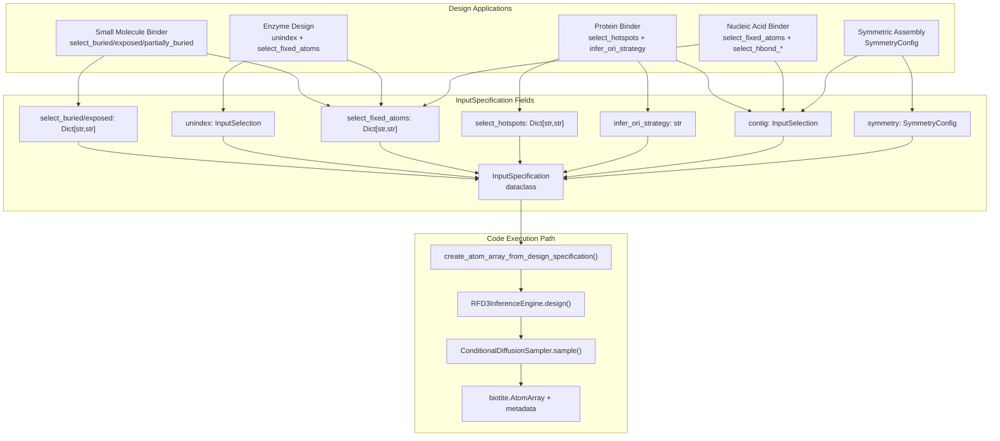
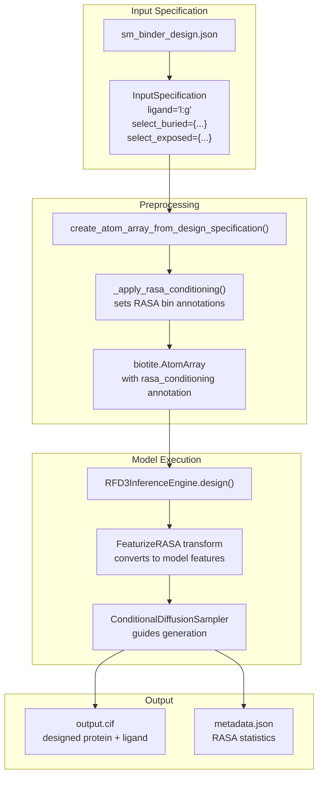
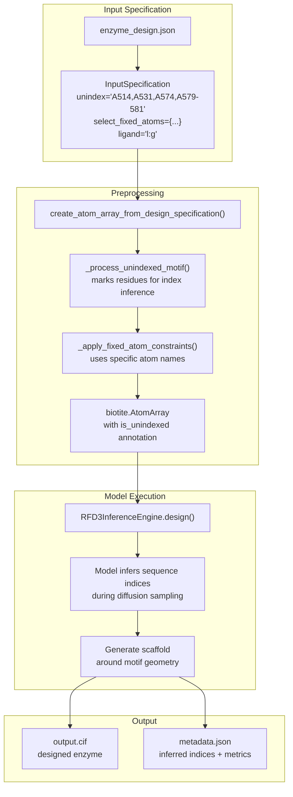

# Design Applications

> **Relevant source files**
> * [models/rfd3/docs/.assets/intermediate_enzyme_tutorial/1mg5_final.png](https://github.com/RosettaCommons/foundry/blob/cee116dc/models/rfd3/docs/.assets/intermediate_enzyme_tutorial/1mg5_final.png)
> * [models/rfd3/docs/.assets/intermediate_enzyme_tutorial/1mg5_redesign_final.png](https://github.com/RosettaCommons/foundry/blob/cee116dc/models/rfd3/docs/.assets/intermediate_enzyme_tutorial/1mg5_redesign_final.png)
> * [models/rfd3/docs/.assets/intermediate_enzyme_tutorial/1mg5_theozyme_final.png](https://github.com/RosettaCommons/foundry/blob/cee116dc/models/rfd3/docs/.assets/intermediate_enzyme_tutorial/1mg5_theozyme_final.png)
> * [models/rfd3/docs/tutorials/enzyme_design_tutorial.md](https://github.com/RosettaCommons/foundry/blob/cee116dc/models/rfd3/docs/tutorials/enzyme_design_tutorial.md?plain=1)
> * [models/rfd3/docs/tutorials/enzyme_tutorial_files/outputs.zip](https://github.com/RosettaCommons/foundry/blob/cee116dc/models/rfd3/docs/tutorials/enzyme_tutorial_files/outputs.zip)
> * [models/rfd3/docs/tutorials/enzyme_tutorial_files/rfd3_enzyme_tutorial.json](https://github.com/RosettaCommons/foundry/blob/cee116dc/models/rfd3/docs/tutorials/enzyme_tutorial_files/rfd3_enzyme_tutorial.json)
> * [models/rfd3/docs/tutorials/intermediate_enzyme_design_tutorial.md](https://github.com/RosettaCommons/foundry/blob/cee116dc/models/rfd3/docs/tutorials/intermediate_enzyme_design_tutorial.md?plain=1)
> * [models/rfd3/docs/tutorials/intermediate_enzyme_tutorial_files/1MG5.pdb](https://github.com/RosettaCommons/foundry/blob/cee116dc/models/rfd3/docs/tutorials/intermediate_enzyme_tutorial_files/1MG5.pdb)
> * [models/rfd3/docs/tutorials/intermediate_enzyme_tutorial_files/1mg5_motif.pdb](https://github.com/RosettaCommons/foundry/blob/cee116dc/models/rfd3/docs/tutorials/intermediate_enzyme_tutorial_files/1mg5_motif.pdb)
> * [models/rfd3/docs/tutorials/intermediate_enzyme_tutorial_files/outputs.zip](https://github.com/RosettaCommons/foundry/blob/cee116dc/models/rfd3/docs/tutorials/intermediate_enzyme_tutorial_files/outputs.zip)
> * [models/rfd3/docs/tutorials/na_binder_tutorial.md](https://github.com/RosettaCommons/foundry/blob/cee116dc/models/rfd3/docs/tutorials/na_binder_tutorial.md?plain=1)
> * [models/rfd3/docs/tutorials/ppi_design_tutorial.md](https://github.com/RosettaCommons/foundry/blob/cee116dc/models/rfd3/docs/tutorials/ppi_design_tutorial.md?plain=1)

This page provides an overview of common protein design tasks supported by RFdiffusion3 (RFD3). Each design application uses different combinations of fields in the `InputSpecification` system to express design constraints. Detailed step-by-step guides for each application are available in the sub-pages:

* [Protein Binder Design](/RosettaCommons/foundry/4.4.1-protein-binder-design) — Guide for designing proteins that bind to target proteins using hotspot conditioning
* [Small Molecule Binder Design](/RosettaCommons/foundry/4.4.2-small-molecule-binder-design) — Guide for designing proteins that bind small molecule ligands with exposed/buried atom conditioning
* [Enzyme Design](/RosettaCommons/foundry/4.4.3-enzyme-design) — Guide for enzyme-ligand complex design
* [Nucleic Acid Binder Design](/RosettaCommons/foundry/4.4.4-nucleic-acid-binder-design) — Guide for designing proteins that bind DNA/RNA using hydrogen bond conditioning

For details on the `InputSpecification` schema and field definitions, see [InputSpecification System](/RosettaCommons/foundry/4.2-inputspecification-system). For technical details of the RFD3 inference pipeline, see [RFD3 Inference Pipeline](/RosettaCommons/foundry/4.5-rfd3-inference-pipeline). For training RFD3 models, see [RFD3 Training](/RosettaCommons/foundry/4.6-rfd3-training).

## Overview of Design Applications

RFD3 is an all-atom generative model capable of designing protein structures under complex constraints. The model supports multiple design modalities through a unified configuration interface based on `InputSpecification`. Different design applications leverage specific combinations of selection fields to express their constraints.

**Diagram: Design Application Field Usage**

**Sources:** [models/rfd3/docs/tutorials/enzyme_design_tutorial.md L36-L94](https://github.com/RosettaCommons/foundry/blob/cee116dc/models/rfd3/docs/tutorials/enzyme_design_tutorial.md?plain=1#L36-L94)

 [models/rfd3/docs/tutorials/ppi_design_tutorial.md L58-L96](https://github.com/RosettaCommons/foundry/blob/cee116dc/models/rfd3/docs/tutorials/ppi_design_tutorial.md?plain=1#L58-L96)

 [models/rfd3/docs/tutorials/na_binder_tutorial.md L48-L104](https://github.com/RosettaCommons/foundry/blob/cee116dc/models/rfd3/docs/tutorials/na_binder_tutorial.md?plain=1#L48-L104)

## Design Application Field Usage

Different design applications use different subsets of `InputSpecification` fields. The following table summarizes the key fields and their code-level purpose:

| Application | Primary Fields | Code Processing | Purpose |
| --- | --- | --- | --- |
| Small Molecule Binder | `select_buried`, `select_exposed`, `select_fixed_atoms`, `ligand` | `_apply_rasa_conditioning()` | Control burial state (RASA bins) of ligand atoms |
| Enzyme Design | `unindex`, `select_fixed_atoms`, `ligand` | `_process_unindexed_motif()` | Scaffold active site residues with unknown sequence placement |
| Protein Binder | `contig`, `select_hotspots`, `infer_ori_strategy` | `_calculate_hotspot_com()` | Target specific interaction sites on protein surface |
| Nucleic Acid Binder | `contig`, `select_fixed_atoms`, `select_hbond_donor`, `select_hbond_acceptor` | `calculate_hbonds()` | Design proteins that bind DNA/RNA with H-bond constraints |
| Symmetric Assembly | `symmetry`, `contig` | `apply_symmetry_operators()` | Generate symmetric oligomers with defined point groups |

**Sources:** [models/rfd3/docs/tutorials/enzyme_design_tutorial.md L60-L108](https://github.com/RosettaCommons/foundry/blob/cee116dc/models/rfd3/docs/tutorials/enzyme_design_tutorial.md?plain=1#L60-L108)

 [models/rfd3/docs/tutorials/ppi_design_tutorial.md L71-L92](https://github.com/RosettaCommons/foundry/blob/cee116dc/models/rfd3/docs/tutorials/ppi_design_tutorial.md?plain=1#L71-L92)

 [models/rfd3/docs/tutorials/na_binder_tutorial.md L112-L115](https://github.com/RosettaCommons/foundry/blob/cee116dc/models/rfd3/docs/tutorials/na_binder_tutorial.md?plain=1#L112-L115)

## Small Molecule Binder Design

Small molecule binder design uses RASA (Relative Accessible Surface Area) conditioning to control which atoms of a ligand should be buried or exposed in the designed protein. This is crucial for creating functional pockets that encapsulate ligands effectively.

For complete configuration examples and detailed usage instructions, see [Small Molecule Binder Design](/RosettaCommons/foundry/4.4.2-small-molecule-binder-design).

**Diagram: Small Molecule Binder Code Flow**

**Sources:** [models/rfd3/docs/tutorials/enzyme_design_tutorial.md L53-L59](https://github.com/RosettaCommons/foundry/blob/cee116dc/models/rfd3/docs/tutorials/enzyme_design_tutorial.md?plain=1#L53-L59)

 [models/rfd3/docs/tutorials/enzyme_design_tutorial.md L101-L109](https://github.com/RosettaCommons/foundry/blob/cee116dc/models/rfd3/docs/tutorials/enzyme_design_tutorial.md?plain=1#L101-L109)

### Key Configuration Fields

* **`ligand`**: Identifier representing the ligand (e.g., `"l:g"`). Use a colon to avoid matching the Chemical Component Database if the ligand is custom [models/rfd3/docs/tutorials/enzyme_design_tutorial.md L53-L59](https://github.com/RosettaCommons/foundry/blob/cee116dc/models/rfd3/docs/tutorials/enzyme_design_tutorial.md?plain=1#L53-L59)
* **`select_buried`**: Dict mapping residues to comma-separated atom names to be buried within the protein [models/rfd3/docs/tutorials/enzyme_design_tutorial.md L103-L105](https://github.com/RosettaCommons/foundry/blob/cee116dc/models/rfd3/docs/tutorials/enzyme_design_tutorial.md?plain=1#L103-L105)
* **`select_exposed`**: Dict mapping residues to atom names that should remain solvent-exposed [models/rfd3/docs/tutorials/enzyme_design_tutorial.md L106-L108](https://github.com/RosettaCommons/foundry/blob/cee116dc/models/rfd3/docs/tutorials/enzyme_design_tutorial.md?plain=1#L106-L108)

## Enzyme Design

Enzyme design focuses on scaffolding a catalytic site. It leverages **unindexed motifs** (`unindex`) to include functional residues without pre-specifying their position in the protein sequence.

For complete configuration examples and detailed usage instructions, see [Enzyme Design](/RosettaCommons/foundry/4.4.3-enzyme-design).

**Diagram: Enzyme Design Code Flow**

**Sources:** [models/rfd3/docs/tutorials/enzyme_design_tutorial.md L60-L66](https://github.com/RosettaCommons/foundry/blob/cee116dc/models/rfd3/docs/tutorials/enzyme_design_tutorial.md?plain=1#L60-L66)

 [models/rfd3/docs/tutorials/enzyme_design_tutorial.md L83-L94](https://github.com/RosettaCommons/foundry/blob/cee116dc/models/rfd3/docs/tutorials/enzyme_design_tutorial.md?plain=1#L83-L94)

### Key Configuration Fields

* **`unindex`**: Residues important for activity whose sequence position is unknown [models/rfd3/docs/tutorials/enzyme_design_tutorial.md L60-L66](https://github.com/RosettaCommons/foundry/blob/cee116dc/models/rfd3/docs/tutorials/enzyme_design_tutorial.md?plain=1#L60-L66)
* **`select_fixed_atoms`**: Dict mapping residues to specific atoms (e.g., side chain atoms like `"NE2,CE1,ND1"`) to maintain spatial relationships to the ligand [models/rfd3/docs/tutorials/enzyme_design_tutorial.md L83-L94](https://github.com/RosettaCommons/foundry/blob/cee116dc/models/rfd3/docs/tutorials/enzyme_design_tutorial.md?plain=1#L83-L94)
* **`ori_token`**: Specifies the center of mass for the designed portion [models/rfd3/docs/tutorials/enzyme_design_tutorial.md L71-L82](https://github.com/RosettaCommons/foundry/blob/cee116dc/models/rfd3/docs/tutorials/enzyme_design_tutorial.md?plain=1#L71-L82)

## Protein Binder Design

Protein binder design utilizes **hotspot targeting** to create binders for a specific target protein interface.

For complete configuration examples and detailed usage instructions, see [Protein Binder Design](/RosettaCommons/foundry/4.4.1-protein-binder-design).

### Key Configuration Fields

* **`contig`**: Specifies designed vs. preserved sections (e.g., `"40-120,/0,E6-155"`) [models/rfd3/docs/tutorials/ppi_design_tutorial.md L58-L66](https://github.com/RosettaCommons/foundry/blob/cee116dc/models/rfd3/docs/tutorials/ppi_design_tutorial.md?plain=1#L58-L66)
* **`select_hotspots`**: Target residues and atoms that the designed binder should be close to (typically < 4.5 Å) [models/rfd3/docs/tutorials/ppi_design_tutorial.md L71-L87](https://github.com/RosettaCommons/foundry/blob/cee116dc/models/rfd3/docs/tutorials/ppi_design_tutorial.md?plain=1#L71-L87)
* **`infer_ori_strategy`**: Automatically places the origin (center of mass) based on hotspots, typically 10Å outward [models/rfd3/docs/tutorials/ppi_design_tutorial.md L88-L92](https://github.com/RosettaCommons/foundry/blob/cee116dc/models/rfd3/docs/tutorials/ppi_design_tutorial.md?plain=1#L88-L92)
* **`is_non_loopy`**: Reduces loop content in the designed binder [models/rfd3/docs/tutorials/ppi_design_tutorial.md L93-L96](https://github.com/RosettaCommons/foundry/blob/cee116dc/models/rfd3/docs/tutorials/ppi_design_tutorial.md?plain=1#L93-L96)

## Nucleic Acid Binder Design

Nucleic acid binder design enables the generation of proteins that interact with DNA or RNA. It often utilizes hydrogen bond conditioning to ensure specific interactions.

For complete configuration examples and detailed usage instructions, see [Nucleic Acid Binder Design](/RosettaCommons/foundry/4.4.4-nucleic-acid-binder-design).

### Key Configuration Fields

* **`contig`**: Defines the complex, including NA chains and protein segments (e.g., `"C5-18,/0,D24-37,/0,40-50"`) [models/rfd3/docs/tutorials/na_binder_tutorial.md L48-L58](https://github.com/RosettaCommons/foundry/blob/cee116dc/models/rfd3/docs/tutorials/na_binder_tutorial.md?plain=1#L48-L58)
* **`select_fixed_atoms`**: Can fix specific NA residues while allowing others (e.g., at helix ends) to relax [models/rfd3/docs/tutorials/na_binder_tutorial.md L68-L76](https://github.com/RosettaCommons/foundry/blob/cee116dc/models/rfd3/docs/tutorials/na_binder_tutorial.md?plain=1#L68-L76)
* **`select_hbond_donor` / `select_hbond_acceptor`**: (Optional) Constraints to enforce specific hydrogen bonding patterns with the nucleic acid [models/rfd3/docs/tutorials/na_binder_tutorial.md L112-L115](https://github.com/RosettaCommons/foundry/blob/cee116dc/models/rfd3/docs/tutorials/na_binder_tutorial.md?plain=1#L112-L115)

## Best Practices

1. **Origin Placement**: For binders and enzymes, the `ori_token` or `infer_ori_strategy` significantly impacts success. Try multiple placements [models/rfd3/docs/tutorials/enzyme_design_tutorial.md L80-L82](https://github.com/RosettaCommons/foundry/blob/cee116dc/models/rfd3/docs/tutorials/enzyme_design_tutorial.md?plain=1#L80-L82)
2. **Fixed Atoms**: When using `select_fixed_atoms`, fixing only necessary functional atoms (e.g., catalytic side chains) provides more flexibility for the model to build a stable scaffold [models/rfd3/docs/tutorials/enzyme_design_tutorial.md L64-L66](https://github.com/RosettaCommons/foundry/blob/cee116dc/models/rfd3/docs/tutorials/enzyme_design_tutorial.md?plain=1#L64-L66)
3. **Sequence Flexibility**: Use `select_unfixed_sequence` if you want the model to redesign the sequence of input residues while keeping their coordinates [models/rfd3/docs/tutorials/enzyme_design_tutorial.md L111-L114](https://github.com/RosettaCommons/foundry/blob/cee116dc/models/rfd3/docs/tutorials/enzyme_design_tutorial.md?plain=1#L111-L114)

**Sources:** [models/rfd3/docs/tutorials/enzyme_design_tutorial.md L1-L120](https://github.com/RosettaCommons/foundry/blob/cee116dc/models/rfd3/docs/tutorials/enzyme_design_tutorial.md?plain=1#L1-L120)

 [models/rfd3/docs/tutorials/ppi_design_tutorial.md L1-L100](https://github.com/RosettaCommons/foundry/blob/cee116dc/models/rfd3/docs/tutorials/ppi_design_tutorial.md?plain=1#L1-L100)

 [models/rfd3/docs/tutorials/na_binder_tutorial.md L1-L120](https://github.com/RosettaCommons/foundry/blob/cee116dc/models/rfd3/docs/tutorials/na_binder_tutorial.md?plain=1#L1-L120)